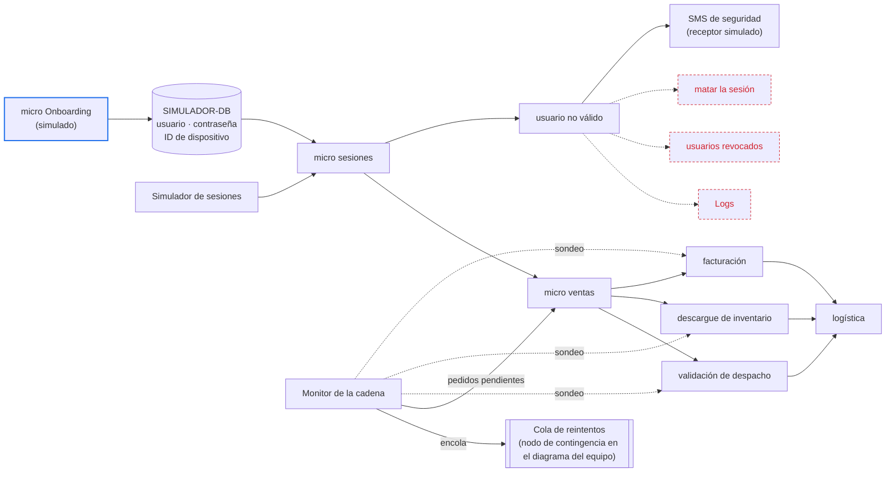

# Experimentos — E01, detección del dispositivo no registrado, y E02, detección y reacción ante el pedido detenido

Dos experimentos ponen a prueba dos ideas de diseño independientes, cada una
con su escenario de calidad y su decisión de arquitectura. Comparten el
prototipo, el stack, la carga y la forma de medir, que se describen una vez en
la primera sección.

| Experimento | Hipótesis | Escenario | Decisión que valida | Alcance |
|---|---|---|---|---|
| E01 — Seguridad | H1: el micro de sesiones compara la huella del dispositivo al abrir la sesión | ASR-1 | ADR-007 | La detección y el aviso a seguridad, que son toda la respuesta del escenario |
| E02 — Disponibilidad | H2: el Monitor de la cadena sondea las etapas y encola el pedido detenido | ASR-3 | ADR-004 | La detección y la reacción, que consiste solo en enviar el pedido a la cola de reintentos |

Los escenarios están en [ASRs de disponibilidad y seguridad](quality-attributes.md),
y las decisiones, en el [registro de ADR](modelos/adrs-ccp-reto2.md). Cada
experimento se carga en Helix por separado, con su propia conclusión y su propia
decisión: una hipótesis puede caer sin arrastrar a la otra.

## El montaje común

### El prototipo

El alcance sale del diagrama del equipo. Lo verde entra a los experimentos, lo
azul se simula y lo rojo queda fuera. La parte de arriba es de E01; la de
abajo, de E02.

### El stack

Todo corre en local, en una sola máquina:

| Pieza | Qué se usa | Para qué | Experimento |
|---|---|---|---|
| Micros | Java 21 y Spring Boot 3, un proceso por micro, con Spring Web para las llamadas entre ellos | Que el inyector pueda detener cada etapa por separado | Los dos |
| SIMULADOR-DB | PostgreSQL en Docker Compose | Usuarios, ID de dispositivo registrado y estado de cada pedido por etapa | Los dos |
| Carga | k6, con arribo aleatorio, como en el reto 1 | Reproducir el Ambiente A | Los dos |
| Observabilidad en vivo | Micrometer en cada micro, con Prometheus y Grafana en Docker Compose | Ver la corrida mientras pasa y parar a tiempo una corrida dañada | Los dos |
| Registro de eventos | Cada componente escribe una fila con el identificador, el evento y el instante en una tabla de PostgreSQL. Un script cruza las filas al final de cada corrida | Probar uno a uno que cada salida corresponde a su falla. Prometheus no sirve para esto porque agrega los datos y pierde el identificador | Los dos |
| Monitor de la cadena | Un micro aparte con una tarea programada (`@Scheduled`) que sondea un punto de salud de cada etapa cada T segundos y cuenta los sondeos sin respuesta | Variar T y N en D4 sin tocar código | E02 |
| Cola de reintentos | RabbitMQ en Docker Compose, con una cola durable, confirmación de publicación y Spring AMQP | Medir cero pedidos perdidos y cero duplicados | E02 |
| Inyección | Un inyector que detiene procesos y congela pedidos marcados | Las fases D2 y D3 | E02 |

Grafana sirve para mirar la corrida; el veredicto de cada criterio sale del
registro de eventos, que conserva el identificador de cada operación y de cada
pedido.

[PREGUNTA] ¿Dónde vive el código del prototipo: en este repositorio o en uno
aparte, como en el reto 1?

### La carga

Toda la carga es la del Ambiente A, fijada en el supuesto S-4 de los
[ASR](quality-attributes.md): 1 pedido y 10 consultas por segundo, con arribo
aleatorio. Cada pedido recorre las tres etapas, y cada etapa tarda un tiempo
aleatorio, para que la detección conviva con la variación normal de la
operación.

Cada corrida empieza con un calentamiento de 5 minutos que no entra en ningún
criterio. Las cifras de repeticiones y duraciones de las fases son una
propuesta del equipo; no salen del enunciado.

### Cómo se cruzan entradas y salidas

Cada operación y cada pedido llevan un identificador desde el simulador hasta el
final del recorrido. Un aviso o un mensaje en la cola cuenta solo cuando se
cruza, uno a uno, con la falla inyectada que lo causó. Contar avisos no basta:
hay que mostrar a qué entrada corresponde cada salida.

Todos los componentes corren en la misma máquina y leen el mismo reloj, así que
medir las diferencias de tiempo no exige sincronizar relojes.

### Las limitaciones comunes

- Una sola máquina y una red local: los experimentos validan las ideas de
  diseño, no el tamaño de la infraestructura.
- Solo se inyectan fallas de software, por el supuesto S-3. Las caídas de
  máquina, red o base quedan fuera.

### El esfuerzo y el calendario

Los dos experimentos suman unas 72 horas-persona, repartidas entre las cuatro
personas del equipo en una semana de calendario. Es una estimación del diseño,
no una cifra medida. El reparto por experimento está en cada uno.

Del día 1 al 3, cada persona construye su frente en paralelo. El día 4 se
integra todo, se corre E01 completo y se corren las fases D1 a D3 de E02; D4
corre esa noche sin supervisión. El día 5, el equipo completo analiza los
resultados y toma las dos decisiones.

---

## E01 — Seguridad: detección del dispositivo no registrado

### El título del experimento

**E01 — Validar la detección del dispositivo no registrado con el micro de
sesiones.**

### La hipótesis de diseño

#### H1 — El micro de sesiones detecta la huella de un dispositivo no registrado

**Si el micro de sesiones compara la huella del dispositivo —el ID que la base
guarda para cada vendedor— apenas se abre la sesión, entonces seguridad recibirá
el aviso en ≤ 2 s, porque la comparación es una sola lectura en la base y no
bloquea el inicio de sesión.**

- **Variable independiente:** dónde y cuándo se compara la huella. Se compara
  en el micro de sesiones, en cada apertura y contra el registro de la base, sin
  caché.
- **Variables dependientes:** la demora entre la apertura de la sesión y el
  aviso; los avisos falsos por cada 100 cambios legítimos de dispositivo, que
  ASR-1 limita a uno; y las aperturas desde un dispositivo no registrado que
  quedan sin aviso.

Fundamento: CCP le entrega el dispositivo a cada vendedor, de modo que el
sistema tiene contra qué comparar aunque las credenciales sean correctas. La
comparación corre después de abrir la sesión, así que no frena al vendedor
legítimo.

El cambio legítimo de dispositivo no dispara el aviso porque se registra antes
del primer uso: en el prototipo, el micro Onboarding registra el dispositivo
nuevo. [PREGUNTA] ¿Quién lo registra en la operación real? ADR-007 lo dejó
abierto.

Lo que la refutaría, cualquiera de tres casos:

- Una sesión abierta desde un dispositivo no registrado que no produce aviso, o
  que lo produce fuera de plazo.
- Avisos disparados por dispositivos nuevos ya registrados en más de uno de cada
  100 cambios legítimos.
- Un aviso que llega sin el vendedor, el dispositivo o la hora, que es lo que
  seguridad necesita para actuar.

El número que no conocemos: la tasa de aperturas de sesión por segundo a partir
de la cual el aviso empieza a atrasarse. Los 2 000 vendedores abren sesión
sobre todo al arrancar la jornada, y no sabemos cuánto margen queda por encima
de esa ráfaga.

### El escenario enlazado

| ASR | Nombre en Helix | Historia | Cobertura |
|---|---|---|---|
| ASR-1 | Security — Inicio de sesión desde el dispositivo suministrado | [HU-01](requirements.md) | Completa: la detección y el aviso a seguridad, que son toda la respuesta del escenario |

### Las tácticas y los patrones

La táctica es *detectar intrusiones*, con la huella del dispositivo como parte
de la identidad del vendedor. Es la decisión de
[ADR-007](modelos/adrs-ccp-reto2.md), con la comparación dentro del micro de
sesiones, como la dibuja el diagrama del equipo. El micro lee la huella
registrada de la base en cada apertura, sin caché, y entrega la sesión que no
coincide al componente de usuario no válido.

Ese componente avisa a seguridad, que es la táctica *informar a los actores*.
Matar la sesión y revocar al usuario son reacciones del área de seguridad,
fuera del sistema y fuera del escenario.

Las alternativas, las dos que ADR-007 descartó:

| Alternativa | Por qué no entra al prototipo |
|---|---|
| Verificar la huella dentro del inicio de sesión, antes de dejar entrar | El inicio de sesión espera la comparación, y un cambio legítimo sin registrar deja al vendedor por fuera |
| Revisar por lotes las aperturas de sesión | Cada segundo del periodo se suma a la demora, y los 2 s no dejan margen |

### El diseño del experimento

Tres decisiones de montaje que el diagrama no dice:

- **El inicio de sesión se simula.** El micro Onboarding carga los usuarios y sus
  dispositivos en la base, y el simulador abre las sesiones con esas
  credenciales sin un desafío de autenticación real. El experimento mide lo que
  pasa después del inicio de sesión, no el inicio mismo.
- **La huella es el ID de dispositivo que ya guarda la base.** El simulador
  envía el ID del dispositivo al abrir la sesión. Un dispositivo no registrado
  es uno cuyo ID no coincide con el registrado para ese vendedor. Un cambio
  legítimo de dispositivo se simula registrando el ID nuevo con el micro
  Onboarding.
- **El SMS de seguridad lo recibe un receptor simulado** que anota la hora de
  llegada de cada aviso. Un proveedor real sumaría su propia demora, que ningún
  componente del diseño controla.

| Fase | Qué se hace | Duración o repeticiones | Tipo |
|---|---|---|---|
| S1 — Sesión desde un dispositivo no registrado | Se abre una sesión con las credenciales correctas de un vendedor y un ID de dispositivo distinto al registrado, y la sesión opera | 50 aperturas en momentos aleatorios dentro de 30 min de carga normal | Con criterio |
| S2 — Cambio legítimo de dispositivo | Se registra el dispositivo nuevo de un vendedor, y ese vendedor abre sesión desde él | 100 cambios, para medir la tasa por cada 100 que fija el escenario | Con criterio |
| S3 — Registro y apertura casi simultáneos | El vendedor abre sesión desde el dispositivo nuevo menos de 1 s después de registrarlo | 20 repeticiones | Con criterio |
| S4 — Rampa de aperturas | Se sube la tasa de aperturas de sesión a 1, 3 y 5 veces la del Ambiente A, con aperturas desde dispositivos no registrados en cada nivel | 10 min por nivel | Exploratoria |

**Qué se mide.** El reloj arranca cuando el micro de sesiones registra la
apertura de la sesión y para cuando el receptor recibe el aviso. El cruce es por
identificador de la sesión. El tablero de Grafana muestra la demora del aviso
durante la corrida.

**H1 se sostiene si se cumplen las cuatro condiciones:**

- En S1, las 50 aperturas desde un dispositivo no registrado producen su aviso
  en ≤ 2 s, cada uno con el vendedor, el dispositivo y la hora.
- En S2, hay ≤ 1 aviso en los 100 cambios legítimos.
- En S3, ninguna de las 20 aperturas produce aviso.
- En ninguna fase aparece un aviso por una sesión desde el dispositivo
  registrado.

**Limitaciones propias**, además de las comunes:

- La reacción ante la sesión sospechosa queda fuera: no se corta la sesión, no
  se revoca al usuario y no se escriben registros (logs). ASR-1 deja esa
  reacción en manos del área de seguridad.
- La huella es un ID que el simulador envía. Quien copie el ID de un dispositivo
  registrado pasa la comparación, el mismo riesgo que el equipo anotó en ADR-007
  (R-007b).

### Recursos, elementos y esfuerzo

**Required resources.** Las piezas comunes del stack: micros en Spring Boot,
SIMULADOR-DB en PostgreSQL, k6, Prometheus y Grafana, y el registro de eventos.

**Architecture elements involved.**

- Incluidos: simulador de sesiones, micro de sesiones, SIMULADOR-DB, usuario no
  válido y receptor del SMS de seguridad.
- Simulado: micro Onboarding.
- Fuera: matar la sesión, usuarios revocados y Logs.

**Estimated effort.** Unas 31 horas-persona y 2 horas de máquina.

| Frente | Horas-persona |
|---|---|
| Micros de seguridad: sesiones, usuario no válido, receptor del SMS, Onboarding y la base simulada | 12 |
| Simulador de sesiones y guiones de k6 para las aperturas | 4 |
| Mitad de la observabilidad y del registro de eventos, que comparte con E02 | 5 |
| Atención de las corridas | 2 |
| Análisis, resultados y decisión | 8 |

### Resultados y análisis

Los campos `Results`, `Analysis of results` y `Links & evidence` se llenan con
las corridas. Los resultados deben traer:

- **Fallas inyectadas:** aperturas desde dispositivos no registrados, cambios
  legítimos y aperturas pegadas al registro.
- **Detectadas:** avisos cruzados con su sesión.
- **Escapes:** aperturas desde dispositivos no registrados sin aviso, o con
  aviso fuera de los 2 s.
- **Falsas detecciones:** avisos por dispositivos registrados, contados por
  cada 100 cambios legítimos.
- **Demora:** mediana, percentil 95 y máximo.
- **Número desconocido:** la tasa de aperturas en la que el aviso se atrasa
  (S4).

### La decisión que sigue a cada resultado

El equipo fija antes de correr qué decisión toma con cada resultado. Así el
resultado no se acomoda después a la decisión.

| Resultado | Decisión de arquitectura |
|---|---|
| H1 se sostiene en S1, S2 y S3 | Aceptar ADR-007, con la comparación dentro del micro de sesiones |
| H1 falla en S1: hay aperturas sin aviso o con aviso fuera de los 2 s | Sacar la comparación del micro de sesiones a un verificador que consume cada apertura como evento, como lo plantea ADR-007 |
| H1 falla en S2: más de 1 aviso por cada 100 cambios legítimos | Revisar el camino de registro previo del dispositivo nuevo, que ADR-007 dejó sin dueño |
| H1 falla en S3: avisa por dispositivos recién registrados | Revisar primero cuándo ve el micro de sesiones el registro nuevo, antes de tocar otra pieza |
| H1 se atrasa en S4 por debajo de 3 veces la tasa del Ambiente A | Declarar la tasa medida como límite del diseño y llevarla a la decisión sobre cuántas instancias del micro de sesiones correr |

---

## E02 — Disponibilidad: detección y reacción ante el pedido detenido

### El título del experimento

**E02 — Validar la detección y el encolado del pedido detenido con el Monitor
de la cadena.**

### La hipótesis de diseño

#### H2 — El Monitor de la cadena detecta el pedido detenido y lo encola

**Si el Monitor de la cadena sondea cada etapa y encola los pedidos de la que no
responde N sondeos seguidos, entonces todo pedido detenido llegará a la cola de
reintentos en ≤ 30 s, porque N sondeos fallidos caben en ese plazo.**

«Pedido detenido» incluye el que se congela dentro de una etapa que sigue
respondiendo al sondeo. Es el caso que el sondeo quizá no vea, y la fase D3 lo
pone a prueba.

- **Variable independiente:** el sondeo del Monitor y el envío a la cola. El
  Monitor sondea cada T segundos, declara detenida la etapa que no responde N
  sondeos seguidos y envía a la cola cada pedido pendiente en ella.
- **Variables dependientes:** la demora entre la falla y la confirmación del
  pedido en la cola; las falsas alarmas por hora, que ASR-3 limita a una; y los
  pedidos detenidos que no llegan a la cola o que llegan dos veces.

Fundamento: el Monitor nota que una etapa no responde sin depender de ella. El
micro de ventas sabe qué pedidos le entregó a esa etapa y cuáles no han vuelto,
y se lo dice al Monitor cuando este pregunta. Con eso el Monitor arma, por cada
pedido, un mensaje con el pedido, la etapa y el tiempo transcurrido.

Publicar en una cola durable cuesta milisegundos: la reacción no se come el
plazo de la detección, y el mensaje sobrevive aunque nadie lo atienda todavía.

Lo que la refutaría, cualquiera de dos casos:

- Una etapa que sigue viva y responde al sondeo mientras un pedido se queda
  congelado dentro de ella. ASR-3 describe justo esa falla, sin señal de error.
  En [ADR-004](modelos/adrs-ccp-reto2.md) el equipo predijo que el sondeo no
  la ve, y por eso eligió un plazo por pedido y etapa. El experimento contrasta
  esa predicción con datos.
- Un pedido detectado que no llega a la cola, o que llega dos veces. Un
  duplicado haría que la reanudación de ASR-4 repita una etapa.

El número que no conocemos: el menor N de sondeos sin respuesta que no dispara
falsas alarmas con la variación normal de las etapas. Con un sondeo cada T
segundos, el pedido llega a la cola cerca de N × T segundos después de la
falla. Ese producto tiene que caber en los 30 s que da ASR-3.

### El escenario enlazado

| ASR | Nombre en Helix | Historia | Cobertura |
|---|---|---|---|
| ASR-3 | Availability — Creación del pedido en la tienda | [HU-03](requirements.md) | Completa: la detección y la reacción, que es encolar el pedido |

### Las tácticas y los patrones

La táctica es *monitor*, la misma que nombra
[ADR-004](modelos/adrs-ccp-reto2.md). El Monitor de la cadena (EL-17 en el
registro de ADR) sondea la salud de cada etapa cada T segundos. ADR-004 usa ese
sondeo solo como apoyo del plazo por pedido; aquí es el único mecanismo.

La reacción también la hace el Monitor, como en el registro de ADR (CN-36).
Cuando una etapa no responde N sondeos seguidos, el Monitor le pregunta al
micro de ventas qué pedidos tiene pendientes en ella. En el prototipo, el micro
de ventas cumple el papel del Coordinador de la cadena (EL-16), que es quien
guarda el estado de cada pedido por etapa.

El Monitor envía cada uno de esos pedidos a la cola de reintentos (EL-24), que
es el nodo de contingencia del diagrama del equipo. Cada mensaje lleva como
clave el pedido, la etapa y el intento, para que el mismo pedido no entre dos
veces. La cola separa la detección de quien atiende el pedido: reanudarlo o
entregarlo a una persona le toca a ASR-4, y en este prototipo nadie consume la
cola.

Las alternativas, las dos que estudió ADR-004:

| Alternativa | Por qué no entra al prototipo |
|---|---|
| Plazo vencido por pedido y etapa, con una revisión periódica de los plazos | Es la decisión que el equipo tomó en ADR-004. Si la fase D3, la del pedido congelado en una etapa viva, refuta H2, el diseño vuelve a ella |
| Temporizador en memoria, uno por pedido | Los temporizadores mueren si cae el proceso que los guarda |

### El diseño del experimento

Tres decisiones de montaje que el diagrama no dice:

- **La cola de reintentos es una cola durable** de RabbitMQ, y el Monitor
  espera la confirmación del bróker antes de dar el pedido por encolado. Un
  registrador lee la cola sin consumirla y anota la hora de llegada de cada
  mensaje.
- **El Monitor encola, no el micro de ventas.** En el diagrama del equipo la
  flecha hacia el nodo de contingencia sale de micro ventas. El prototipo la
  saca del Monitor para seguir CN-36 del registro de ADR; el micro de ventas
  solo le dice al Monitor qué pedidos tiene pendientes.
- **Las tres etapas corren en paralelo**, como en el diagrama. ADR-003 las ordena
  en serie, pero el orden no cambia lo que H2 evalúa, que es si la parada se
  detecta y el pedido llega a la cola.

| Fase | Qué se hace | Duración o repeticiones | Tipo |
|---|---|---|---|
| D1 — Sin fallas | Carga normal sin ninguna falla inyectada | 1 h | Con criterio |
| D2 — Etapa caída | Se detiene el proceso de una etapa con pedidos en curso | 10 veces por etapa, 30 en total | Con criterio |
| D3 — Etapa viva, pedido congelado | La etapa sigue respondiendo al sondeo, pero un pedido se queda congelado dentro de ella, sin respuesta | 10 veces por etapa, 30 en total | Con criterio: es la fase que puede refutar H2 |
| D4 — Combinaciones de T y N | Se combina un sondeo cada 1, 2 y 5 s con 1, 2, 3 y 5 sondeos sin respuesta | 12 combinaciones, con D1 y D2 en cada una | Exploratoria |

**Qué se mide.** El reloj arranca cuando el inyector detiene la etapa (D2) o
congela el pedido (D3), y para cuando el bróker confirma el mensaje del pedido
en la cola. El cruce es por identificador del pedido y nombre de la etapa. El
tablero de Grafana muestra los sondeos sin respuesta y los mensajes en la cola.

Un mensaje en la cola es **falsa alarma** cuando nombra un pedido que llegó a
logística o una etapa que nunca se detuvo.

**H2 se sostiene si se cumplen las cuatro condiciones:**

- En D2, los 30 pedidos llegan a la cola en ≤ 30 s, cada uno con el pedido, la
  etapa y el tiempo transcurrido.
- En D1, hay ≤ 1 falsa alarma por hora.
- En D3, los 30 pedidos también llegan a la cola en ≤ 30 s.
- En todas las fases, cada pedido detenido entra a la cola una sola vez: cero
  pedidos perdidos y cero duplicados.

Si D2 y D1 pasan y D3 falla, H2 queda refutada para la falla que describe ASR-3,
aunque el Monitor detecte bien las caídas.

**Limitaciones propias**, además de las comunes:

- Nadie consume la cola de reintentos: reanudar el pedido o entregarlo a una
  persona es de ASR-4. La caída del bróker es una falla de infraestructura y
  queda fuera por el supuesto S-3.
- El Monitor de la cadena es un solo proceso. Si cae, nadie detecta nada: es el
  mismo riesgo que el equipo anotó en ADR-004 (R-004a).
- Una hora de D1 solo distingue entre cero, una y varias falsas alarmas.
  Afirmar «una o menos por hora» con confianza pide más horas de corrida.

### Recursos, elementos y esfuerzo

**Required resources.** Las piezas comunes del stack, más el Monitor de la
cadena, la cola de reintentos en RabbitMQ y el inyector de fallas.

**Architecture elements involved.**

- Incluidos: micro de ventas, en el papel del Coordinador de la cadena (EL-16);
  facturación, descargue de inventario y validación de despacho; Monitor de la
  cadena (EL-17); logística; y cola de reintentos (EL-24).
- Fuera: el consumo de la cola, que es de ASR-4.

**Estimated effort.** Unas 41 horas-persona y 20 horas de máquina, casi todas de
D4, que corre de noche sin supervisión.

| Frente | Horas-persona |
|---|---|
| Micros de la cadena: ventas, las tres etapas, el Monitor de la cadena y la cola de reintentos | 16 |
| Guiones de k6 para los pedidos e inyector de fallas | 8 |
| Mitad de la observabilidad y del registro de eventos, que comparte con E01 | 5 |
| Atención de las corridas | 4 |
| Análisis, resultados y decisión | 8 |

### Resultados y análisis

Los campos `Results`, `Analysis of results` y `Links & evidence` se llenan con
las corridas. Los resultados deben traer:

- **Fallas inyectadas:** etapas detenidas y pedidos congelados.
- **Detectadas:** mensajes en la cola cruzados con su pedido y su etapa.
- **Escapes:** pedidos detenidos o congelados que no llegaron a la cola.
- **Duplicados:** pedidos que entraron a la cola más de una vez.
- **Falsas detecciones:** mensajes sobre pedidos que llegaron a logística o
  sobre etapas que nunca se detuvieron.
- **Demora:** mediana, percentil 95 y máximo.
- **Número desconocido:** el menor N sin falsas alarmas, y su N × T (D4).

### La decisión que sigue a cada resultado

El equipo fija antes de correr qué decisión toma con cada resultado. Así el
resultado no se acomoda después a la decisión.

| Resultado | Decisión de arquitectura |
|---|---|
| H2 se sostiene en D1, D2 y D3 | Adoptar el sondeo del Monitor de la cadena como mecanismo de detección de ASR-3, con la cola de reintentos como reacción, y reabrir ADR-004 |
| H2 pasa D1 y D2 pero falla D3 | Confirmar ADR-004: el plazo por pedido y etapa es el mecanismo, y el sondeo del Monitor queda como apoyo para las caídas de etapas enteras |
| H2 falla D2: no detecta ni la etapa caída en ≤ 30 s | Buscar en D4 una combinación de T y N que quepa; si ninguna cabe sin falsas alarmas, adoptar ADR-004 sin el sondeo de apoyo |
| H2 detecta a tiempo pero pierde o duplica pedidos en la cola | Hacer la publicación idempotente con la clave de pedido, etapa e intento (NR-004a), y repetir D2 |
| H2 falla D1: más falsas alarmas de las admitidas | Subir N con el resultado de D4, y verificar que N × T siga cabiendo en los 30 s |
