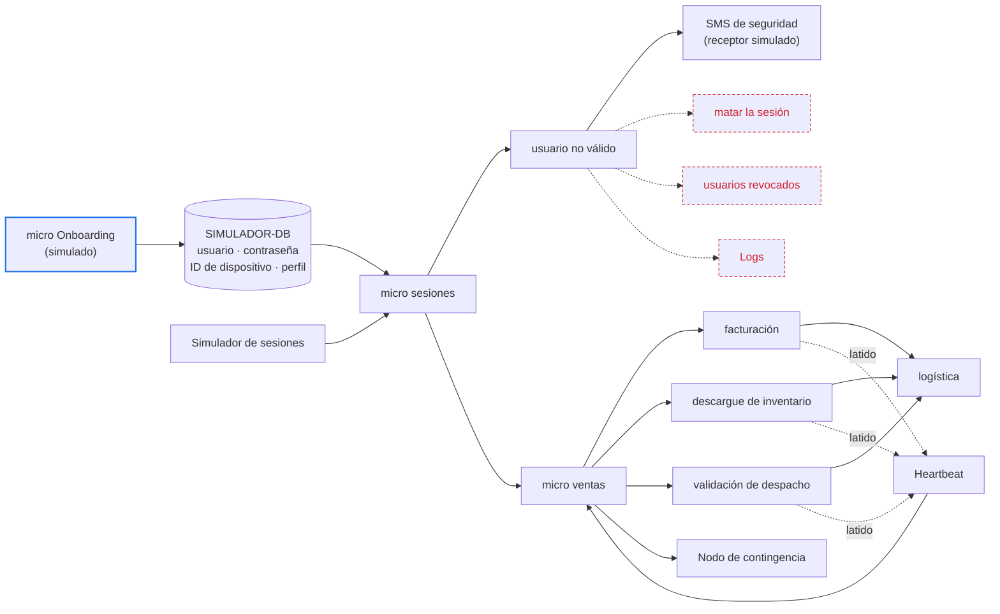

# Experimento E01 — detección de la escritura indebida y del pedido detenido

Este experimento pone a prueba dos ideas de diseño con un solo prototipo. La
primera es de seguridad: un micro de sesiones que compara cada operación con el
perfil vigente del actor. La segunda es de disponibilidad: un heartbeat, es
decir, un latido periódico de cada una de las tres etapas que siguen al pedido.

Los escenarios de calidad que cada idea debe cumplir son ASR-2 y ASR-3, y están
en [ASRs de disponibilidad y seguridad](quality-attributes.md). Las decisiones con las que se comparan los
resultados están en el [registro de ADR](modelos/adrs-ccp-reto2.md).

La página sigue el formulario `Experiments` de Helix, campo por campo, para que
cargarla sea copiar cada sección en su casilla.

| Pestaña de Helix | Campo de Helix | Sección de esta página |
|---|---|---|
| — | Experiment title | El título del experimento |
| `Planning` | Design Hypothesis | Las hipótesis de diseño |
| `Planning` | Linked Quality Scenarios | Los escenarios enlazados |
| `Planning` | Tactics and Patterns | Las tácticas y los patrones |
| `Planning` | Experiment Design | El diseño del experimento |
| `Planning` | Required resources · Architecture elements involved · Estimated effort | Recursos, elementos y esfuerzo |
| `Results & analysis` | Results · Analysis of results · Links & evidence | Resultados y análisis |
| `Results & analysis` | Conclusion · Architectural Decision | La decisión que sigue a cada resultado |

## El título del experimento

**E01 — Validar la detección de la escritura indebida con el micro de sesiones y
la del pedido detenido con el heartbeat de las etapas.**

## Las hipótesis de diseño

Una hipótesis es la idea de diseño que el equipo quiere validar, no el
requisito. Cada una se escribe en una frase con la forma *si [decisión de
diseño], entonces se cumple el escenario enlazado*. Debajo va por qué el equipo
la cree, qué resultado la refutaría y qué número desconocido debe entregar el
experimento.

### H1 — Seguridad: el micro de sesiones detecta la escritura indebida

**Si el micro de sesiones compara cada operación con el perfil vigente del actor
guardado en la base, entonces toda escritura indebida ejecutada llega a seguridad
como aviso, que es la detección de la que parte ASR-2.**

Por qué la creemos: todas las operaciones de la aplicación pasan por el micro de
sesiones, así que ninguna escritura puede llegar a ventas sin pasar antes por
él. La comparación usa el perfil guardado en la base y no lo que dice la sesión,
así que un permiso quitado con la sesión abierta se nota en la operación
siguiente.

Lo que la refutaría, cualquiera de tres casos:

- Una escritura indebida que ventas registró y que nunca produjo aviso.
- Un aviso por una escritura legítima, o por un intento que ventas rechazó y que
  por eso no llegó a ejecutarse.
- Un actor al que se le quitó el permiso de escritura con la sesión abierta y
  cuya escritura siguiente pasó sin aviso.

El número que no conocemos: la tasa de operaciones por segundo a partir de la
cual la detección empieza a atrasarse. En el Ambiente A llegan 11 operaciones
por segundo, pero no sabemos cuánto margen queda por encima.

{: .importante }
> H1 cubre ASR-2 solo en parte. El escenario empieza a contar sus 5 s desde la
> detección, y su respuesta es bloquear al actor, cerrar la sesión y revertir la
> escritura. El experimento llega hasta la detección y el aviso; el bloqueo, el
> cierre y la reversión quedan fuera de este prototipo.

### H2 — Disponibilidad: el heartbeat detecta el pedido detenido

**Si cada etapa de la cadena emite un latido periódico, y el micro de ventas
declara detenida la etapa que pierde N latidos seguidos, entonces se cumple
ASR-3.**

Por qué la creemos: una etapa que se cae deja de latir, y el micro de ventas
sabe qué pedidos le entregó a esa etapa y cuáles no han vuelto. Con eso puede
señalar cada pedido, la etapa y el tiempo transcurrido.

Lo que la refutaría: una etapa que sigue viva y late con normalidad mientras
un pedido se queda congelado dentro de ella. ASR-3 describe justo esa falla, sin
señal de error. En [ADR-004](modelos/adrs-ccp-reto2.md) el equipo predijo que el
heartbeat no la ve, y por eso eligió un plazo por pedido y etapa. El experimento
contrasta esa predicción con datos.

El número que no conocemos: el menor N de latidos perdidos que no dispara
falsas alarmas con la variación normal de las etapas. Con un latido cada T
segundos, la señal tarda cerca de N × T, y ese producto tiene que caber en los
30 s que da ASR-3.

## Los escenarios enlazados

En Helix el escenario se enlaza con el botón `Link scenario`. Helix lo nombra con
el atributo y la historia de usuario a la que está atado.

| ASR | Nombre en Helix | Historia | Hipótesis | Cobertura |
|---|---|---|---|---|
| ASR-2 | Security — Reacción ante la escritura indebida | [HU-13](requirements.md) | H1 | Parcial: la detección y el aviso, no la reacción |
| ASR-3 | Availability — Creación del pedido en la tienda | [HU-03](requirements.md) | H2 | Completa |

## Las tácticas y los patrones

**Para H1.** La táctica es *detectar intrusiones*: cada operación se compara con
el perfil vigente del actor, leído de la base en cada operación y sin caché. El
aviso a seguridad aplica la táctica *informar a los actores*. La escritura
indebida no se bloquea antes de ejecutarse, porque ASR-2 parte del caso en que
el control preventivo ya falló.

**Para H2.** La táctica es *heartbeat*: cada etapa emite un latido al componente
Heartbeat, y este avisa al micro de ventas cuando faltan N latidos seguidos. El
micro de ventas toma los pedidos que tiene pendientes en esa etapa y los entrega
como señalados al nodo de contingencia. Ese nodo recibe los pedidos señalados y,
en este prototipo, solo los registra: qué hace con ellos es materia de ASR-4.

**Las alternativas contra las que se compara cada hipótesis:**

| Hipótesis | Alternativa | Dónde está | Por qué no entra al prototipo |
|---|---|---|---|
| H1 | Bitácora y bandeja de eventos de salida (outbox) en la misma transacción de la escritura, con un detector que consume cada evento | ADR-008 | Detecta sobre la escritura ya confirmada, pero agrega dos filas a cada escritura de ventas e inventario. El prototipo prueba primero la detección en el micro de sesiones, que es la del diagrama del equipo; con S1 y S3 el equipo sabrá si ese costo hace falta |
| H1 | Revisar el registro de escrituras cada cierto tiempo | ADR-008, opción B | Cada segundo del periodo se suma a la demora |
| H2 | Plazo vencido por pedido y etapa, con una revisión periódica de los plazos | ADR-004 | Es la decisión que el equipo tomó en ADR-004. Si la fase D3, la del pedido congelado en una etapa viva, refuta H2, el diseño vuelve a ella |
| H2 | Temporizador en memoria, uno por pedido | ADR-004, opción C | Los temporizadores mueren si cae el proceso que los guarda |

## El diseño del experimento

### El prototipo

El alcance sale del diagrama del equipo. Lo verde entra al experimento, lo azul
se simula y lo rojo queda fuera.

Cuatro decisiones de montaje que el diagrama no dice:

- **El inicio de sesión se simula.** El micro Onboarding carga los usuarios en la
  base, y el simulador abre las sesiones con esas credenciales sin un desafío de
  autenticación real. El experimento mide lo que pasa después del inicio de
  sesión, no el inicio mismo.
- **La base simulada necesita el perfil de cada usuario.** El diagrama muestra
  usuario, contraseña e ID de dispositivo. H1 compara contra el perfil (consulta
  o vendedor), así que hay que agregarlo. El ID de dispositivo se conserva, pero
  H1 no lo usa.
- **El SMS de seguridad lo recibe un receptor simulado** que anota la hora de
  llegada de cada aviso. Un proveedor real sumaría su propia demora, que ningún
  componente del diseño controla.
- **Las tres etapas corren en paralelo**, como en el diagrama. ADR-003 las ordena
  en serie, pero el orden no cambia lo que H2 evalúa, que es si la parada se
  detecta.

### La carga

Toda la carga es la del Ambiente A, fijada en el supuesto S-4 de los
[ASR](quality-attributes.md): 1 pedido y 10 consultas por segundo, con arribo
aleatorio y no equiespaciado. Cada pedido recorre las tres etapas. Cada etapa
tarda un tiempo aleatorio, para que el latido y la señal convivan con la
variación normal de la operación.

Cada corrida empieza con un calentamiento de 5 minutos que no entra en ningún
criterio.

### Las fases

| Fase | Hipótesis | Qué se hace | Duración o repeticiones | Tipo |
|---|---|---|---|---|
| S1 — Escritura indebida | H1 | Un actor de perfil de consulta registra un pedido o descarga inventario, y ventas lo acepta | 50 escrituras en momentos aleatorios dentro de 30 min de carga normal | Con criterio |
| S2 — Perfil cambiado con la sesión abierta | H1 | Se le quita el permiso de escritura a un vendedor con la sesión viva, y su escritura siguiente se ejecuta | 20 repeticiones | Con criterio |
| S3 — Intento rechazado | H1 | Un actor de perfil de consulta intenta escribir y ventas rechaza la operación | 20 repeticiones | Con criterio |
| S4 — Rampa de carga | H1 | Se sube la carga a 1, 3 y 5 veces la del Ambiente A, con escrituras indebidas en cada nivel | 10 min por nivel | Exploratoria |
| D1 — Sin fallas | H2 | Carga normal sin ninguna falla inyectada | 1 h | Con criterio |
| D2 — Etapa caída | H2 | Se detiene el proceso de una etapa con pedidos en curso | 10 veces por etapa, 30 en total | Con criterio |
| D3 — Etapa viva, pedido congelado | H2 | La etapa sigue latiendo, pero un pedido se queda congelado dentro de ella, sin respuesta | 10 veces por etapa, 30 en total | Con criterio: es la fase que puede refutar H2 |
| D4 — Combinaciones de T y N | H2 | Se combina un latido cada 1, 2 y 5 s con 1, 2, 3 y 5 latidos perdidos | 12 combinaciones, D1 y D2 en cada una | Exploratoria |

Las cifras de repeticiones y duraciones son propuesta del diseño, no salen del
enunciado.

### Qué se mide y cómo se cruzan entradas y salidas

Cada operación y cada pedido llevan un identificador desde el simulador hasta el
final del recorrido. Un aviso o una señal cuenta solo cuando se cruza, uno a
uno, con la falla inyectada que lo causó. Contar avisos no basta: hay que
mostrar a qué entrada corresponde cada salida.

| Hipótesis | Reloj de inicio | Reloj de fin | Cruce por identificador |
|---|---|---|---|
| H1 | Ventas confirma la escritura indebida | El receptor recibe el aviso | Identificador de la operación |
| H2 | El inyector detiene la etapa (D2) o congela el pedido (D3) | El nodo de contingencia recibe la señal | Identificador del pedido y nombre de la etapa |

Para H2, una señal es **falsa alarma** cuando nombra un pedido que llegó a
logística o una etapa que nunca se detuvo.

Todos los componentes corren en la misma máquina y leen el mismo reloj, así que
medir las diferencias de tiempo no exige sincronizar relojes.

### Los criterios de éxito

**H1 se sostiene si se cumplen las cuatro condiciones:**

- En S1, cada una de las 50 escrituras indebidas produce su aviso.
- En S2, las 20 escrituras posteriores al cambio de perfil producen aviso.
- En S3, ninguno de los 20 intentos rechazados produce aviso, porque ninguno se
  ejecutó.
- En ninguna fase aparece un aviso por una escritura legítima.

La demora entre la escritura y el aviso se informa con su mediana, su percentil
95 y su máximo. ASR-2 no fija un límite para esa demora, porque su reloj arranca
en la detección. [PREGUNTA] ¿Qué demora de detección acepta el equipo antes de
dar H1 por cumplida?

**H2 se sostiene si se cumplen las tres condiciones:**

- En D2, las 30 señales llegan en ≤ 30 s, cada una con el pedido, la etapa y el
  tiempo transcurrido.
- En D1, hay ≤ 1 falsa alarma por hora.
- En D3, las 30 señales también llegan en ≤ 30 s.

Si D2 y D1 pasan y D3 falla, H2 queda refutada para la falla que describe ASR-3,
aunque el heartbeat detecte bien las caídas.

### Limitaciones declaradas

- Una sola máquina y una red local: el experimento valida las ideas de diseño,
  no el tamaño de la infraestructura.
- La reacción de ASR-2 queda fuera: no se corta la sesión, no se revoca al
  usuario, no se revierte la escritura y no se escriben registros (logs).
- Solo se inyectan fallas de software, por el supuesto S-3. Las caídas de
  máquina, red o base quedan fuera.
- El componente Heartbeat es un solo proceso. Si cae, nadie detecta nada: es el
  mismo riesgo que el equipo anotó en ADR-004 para su monitor (R-004a).
- Una hora de D1 solo distingue entre cero, una y varias falsas alarmas.
  Afirmar «una o menos por hora» con confianza pide más horas de corrida.

## Recursos, elementos y esfuerzo

**Required resources.** La pila del supuesto SUP-01 del registro de ADR: Java 21,
Spring Boot 3, PostgreSQL y RabbitMQ, en contenedores con Docker Compose. Un
generador de carga con arribo aleatorio, como k6, que ya se usó en el reto 1. Un
inyector de fallas que detiene procesos y congela pedidos marcados. El receptor
simulado del SMS. Un registro de tiempos por identificador para el cruce de
entradas y salidas.

**Architecture elements involved.** Incluidos: simulador de sesiones, micro de
sesiones, SIMULADOR-DB, usuario no válido, receptor del SMS de seguridad, micro
de ventas, facturación, descargue de inventario, validación de despacho,
Heartbeat, logística y nodo de contingencia. Simulado: micro Onboarding. Fuera:
matar la sesión, usuarios revocados y Logs.

**Estimated effort.** [PREGUNTA] ¿Cuántas personas y cuántos días? El trabajo se
divide en cinco frentes:

1. Construir los micros y la base simulada.
2. Construir el generador de carga y el inyector de fallas.
3. Instrumentar los relojes y el cruce por identificador.
4. Correr las ocho fases.
5. Analizar los resultados.

## Resultados y análisis

Los campos `Results`, `Analysis of results` y `Links & evidence` se llenan con
las corridas. Para cada fase, los resultados deben traer:

| Dato | H1 | H2 |
|---|---|---|
| Fallas inyectadas | Escrituras indebidas, cambios de perfil e intentos rechazados | Etapas detenidas y pedidos congelados |
| Detectadas | Avisos cruzados con su operación | Señales cruzadas con su pedido y su etapa |
| Escapes | Escrituras indebidas sin aviso | Pedidos detenidos o congelados sin señal |
| Falsas detecciones | Avisos sin escritura indebida ejecutada | Señales sobre pedidos que llegaron a logística o sobre etapas que nunca se detuvieron |
| Demora | Mediana, percentil 95 y máximo | Mediana, percentil 95 y máximo |
| Número desconocido | Tasa en la que la detección se atrasa (S4) | Menor N sin falsas alarmas, y N × T (D4) |

En `Links & evidence` van el repositorio del prototipo, el reporte de las
corridas y las salidas crudas de cada fase.

## La decisión que sigue a cada resultado

El equipo fija antes de correr qué decisión toma con cada resultado. Así el
resultado no se acomoda después a la decisión.

| Resultado | Decisión de arquitectura |
|---|---|
| H1 se sostiene en S1, S2 y S3 | Adoptar la detección en el micro de sesiones como la entrada de la reacción de ASR-2, y diseñar el siguiente experimento con el corte de la sesión y la reversión |
| H1 falla en S1: hay escrituras indebidas sin aviso | Mover la detección a la escritura confirmada, como propone ADR-008, porque el camino por el micro de sesiones deja escapes |
| H1 falla en S3: avisa por intentos que no se ejecutaron | Mover la detección a la escritura confirmada, como propone ADR-008 |
| H1 falla en S2: no ve el permiso quitado | Revisar de dónde lee el perfil el micro de sesiones antes de cualquier otro cambio |
| H1 se atrasa en S4 por debajo de 3 veces la carga del Ambiente A | Declarar la tasa medida como límite del diseño y llevarla a la decisión sobre cuántas instancias del micro de sesiones correr |
| H2 se sostiene en D1, D2 y D3 | Adoptar el heartbeat como mecanismo de detección de ASR-3 y reabrir ADR-004 |
| H2 pasa D1 y D2 pero falla D3 | Confirmar ADR-004: el plazo por pedido y etapa es el mecanismo, y el heartbeat queda como apoyo para las caídas de etapas enteras |
| H2 falla D2: no detecta ni la etapa caída en ≤ 30 s | Buscar en D4 una combinación de T y N que quepa; si ninguna cabe sin falsas alarmas, adoptar ADR-004 sin el heartbeat de apoyo |
| H2 falla D1: más falsas alarmas de las admitidas | Subir N con el resultado de D4, y verificar que N × T siga cabiendo en los 30 s |
