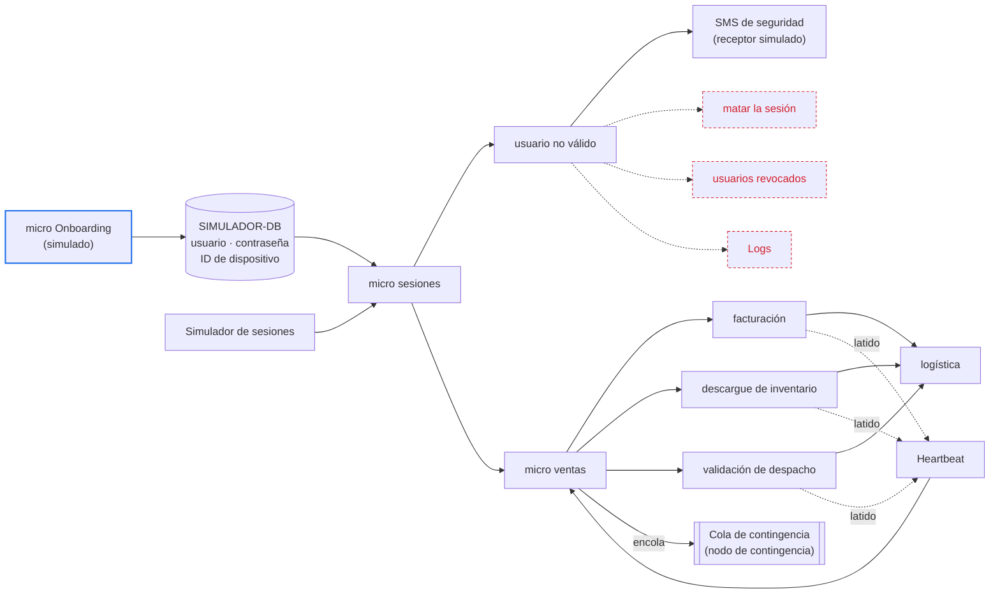

# Experimento E01 — detección del dispositivo no registrado, y detección y reacción ante el pedido detenido

Este experimento pone a prueba dos ideas de diseño con un solo prototipo, y cada
una tiene su propio alcance:

- **H1, de seguridad, llega solo hasta la detección.** El micro de sesiones
  compara la huella del dispositivo de cada operación con la registrada, y avisa
  a seguridad cuando una sesión desde un dispositivo no registrado escribe.
- **H2, de disponibilidad, cubre la detección y la reacción.** Un heartbeat, es
  decir, un latido periódico de cada etapa que sigue al pedido, detecta la etapa
  detenida. La reacción consiste solo en enviar el pedido detenido a una cola de
  contingencia.

Los escenarios de calidad que cada idea debe cumplir son ASR-2 y ASR-3, y están
en [ASRs de disponibilidad y seguridad](quality-attributes.md). Las decisiones
con las que se comparan los resultados están en el
[registro de ADR](modelos/adrs-ccp-reto2.md).

La página sigue el formulario `Experiments` de Helix, campo por campo, para que
cargarla sea copiar cada sección en su casilla.

| Pestaña de Helix | Campo de Helix | Sección de esta página |
|---|---|---|
| — | Experiment title | El título del experimento |
| `Planning` | Design Hypothesis | Las hipótesis de diseño |
| `Planning` | Linked Quality Scenarios | Los escenarios enlazados |
| `Planning` | Tactics and Patterns | Las tácticas y los patrones |
| `Planning` | Experiment Design | El diseño del experimento |
| `Planning` | Required resources · Architecture elements involved · Estimated effort | Recursos, elementos y esfuerzo |
| `Results & analysis` | Results · Analysis of results · Links & evidence | Resultados y análisis |
| `Results & analysis` | Conclusion · Architectural Decision | La decisión que sigue a cada resultado |

## El título del experimento

**E01 — Validar la detección del dispositivo no registrado con el micro de
sesiones, y la detección y el encolado del pedido detenido con el heartbeat de
las etapas.**

## Las hipótesis de diseño

Una hipótesis es la idea de diseño que el equipo quiere validar, no el
requisito. Cada una se escribe en una frase con la forma *si [decisión de
diseño], entonces se cumple el escenario enlazado*. Debajo va por qué el equipo
la cree, qué resultado la refutaría y qué número desconocido debe entregar el
experimento.

### H1 — Seguridad: el micro de sesiones detecta la huella de un dispositivo no registrado

**Si el micro de sesiones compara en cada operación la huella del dispositivo
con la registrada para el usuario, y trata como de solo consulta a la sesión que
no coincide, entonces toda escritura de esa sesión llega a seguridad como aviso,
que es la detección de la que parte ASR-2.**

Por qué la creemos: CCP le entrega el dispositivo a cada vendedor, así que el
sistema tiene contra qué comparar. Quien opera con credenciales correctas desde
otro equipo no tiene permiso para escribir. Como todas las operaciones pasan por
el micro de sesiones, ninguna escritura llega a ventas sin que su huella se haya
comparado antes.

Lo que la refutaría, cualquiera de tres casos:

- Una escritura desde un dispositivo no registrado que ventas registró y que
  nunca produjo aviso.
- Un aviso por un dispositivo que sí estaba registrado, incluido el equipo nuevo
  de un cambio legítimo ya registrado.
- Un aviso por un intento que ventas rechazó y que por eso no llegó a
  ejecutarse.

El número que no conocemos: la tasa de operaciones por segundo a partir de la
cual la detección empieza a atrasarse. En el Ambiente A llegan 11 operaciones
por segundo, pero no sabemos cuánto margen queda por encima.

{: .importante }
> H1 cubre ASR-2 solo en parte, y lo cubre con una decisión del equipo. ASR-2
> parte de una escritura ejecutada por un actor de solo consulta. H1 trata como
> de solo consulta a la sesión abierta desde un dispositivo no registrado. El
> experimento llega hasta la detección y el aviso. El bloqueo, el cierre de la
> sesión y la reversión quedan fuera de este prototipo.

### H2 — Disponibilidad: el heartbeat detecta el pedido detenido y lo encola

**Si cada etapa emite un latido periódico, y el micro de ventas declara detenida
la etapa que pierde N latidos seguidos y envía a la cola de contingencia cada
pedido pendiente en ella, entonces se cumple ASR-3.**

Por qué la creemos: una etapa que se cae deja de latir, y el micro de ventas
sabe qué pedidos le entregó a esa etapa y cuáles no han vuelto. Con eso arma,
por cada pedido, un mensaje con el pedido, la etapa y el tiempo transcurrido, y
lo envía a la cola. Publicar en una cola durable cuesta milisegundos, así que la
reacción no se come el plazo de la detección. Además, el mensaje sobrevive
aunque nadie lo atienda todavía.

Lo que la refutaría, cualquiera de dos casos:

- Una etapa que sigue viva y late con normalidad mientras un pedido se queda
  congelado dentro de ella. ASR-3 describe justo esa falla, sin señal de error.
  En [ADR-004](modelos/adrs-ccp-reto2.md) el equipo predijo que el heartbeat no
  la ve, y por eso eligió un plazo por pedido y etapa. El experimento contrasta
  esa predicción con datos.
- Un pedido detectado que no llega a la cola, o que llega dos veces. Un
  duplicado haría que la reanudación de ASR-4 repita una etapa.

El número que no conocemos: el menor N de latidos perdidos que no dispara
falsas alarmas con la variación normal de las etapas. Con un latido cada T
segundos, el pedido llega a la cola cerca de N × T segundos después de la
falla, y ese producto tiene que caber en los 30 s que da ASR-3.

## Los escenarios enlazados

En Helix el escenario se enlaza con el botón `Link scenario`. Helix lo nombra con
el atributo y la historia de usuario a la que está atado.

| ASR | Nombre en Helix | Historia | Hipótesis | Cobertura |
|---|---|---|---|---|
| ASR-2 | Security — Reacción ante la escritura indebida | [HU-13](requirements.md) | H1 | Parcial: la detección y el aviso, no la reacción |
| ASR-3 | Availability — Creación del pedido en la tienda | [HU-03](requirements.md) | H2 | Completa: la detección y la reacción, que es encolar el pedido |

## Las tácticas y los patrones

**Para H1.** La táctica es *detectar intrusiones* con la huella del dispositivo
como parte de la identidad del usuario. Es la idea de
[ADR-007](modelos/adrs-ccp-reto2.md), llevada de la apertura de sesión a cada
operación. El micro de sesiones lee la huella registrada de la base en cada
operación, sin caché. El aviso a seguridad aplica la táctica *informar a los
actores*. La escritura no se bloquea antes de ejecutarse, porque ASR-2 parte del
caso en que el control preventivo ya falló.

**Para H2.** La táctica es *heartbeat*: cada etapa emite un latido al componente
Heartbeat, y este avisa al micro de ventas cuando faltan N latidos seguidos. El
micro de ventas toma los pedidos que tiene pendientes en esa etapa y reacciona
enviando cada uno a la cola de contingencia, que es el nodo de contingencia del
diagrama. La cola desacopla la detección de quien atiende el pedido: reanudarlo
o entregarlo a una persona es materia de ASR-4, y en este prototipo nadie
consume la cola. Cada mensaje lleva como clave el pedido, la etapa y el intento,
para que el mismo pedido no entre dos veces.

**Las alternativas contra las que se compara cada hipótesis:**

| Hipótesis | Alternativa | Dónde está | Por qué no entra al prototipo |
|---|---|---|---|
| H1 | Verificar la huella una sola vez, al abrir la sesión | ADR-007 | Avisa por la sesión y no por la escritura. Es la respuesta de ASR-1, no la detección de la que parte ASR-2 |
| H1 | Bitácora y bandeja de eventos de salida (outbox) en la misma transacción de la escritura, con un detector que consume cada evento | ADR-008 | Detecta sobre la escritura ya confirmada, pero agrega dos filas a cada escritura de ventas e inventario. Con S1 y S3 el equipo sabrá si ese costo hace falta |
| H2 | Plazo vencido por pedido y etapa, con una revisión periódica de los plazos | ADR-004 | Es la decisión que el equipo tomó en ADR-004. Si la fase D3, la del pedido congelado en una etapa viva, refuta H2, el diseño vuelve a ella |
| H2 | Temporizador en memoria, uno por pedido | ADR-004, opción C | Los temporizadores mueren si cae el proceso que los guarda |

## El diseño del experimento

### El prototipo

El alcance sale del diagrama del equipo. Lo verde entra al experimento, lo azul
se simula y lo rojo queda fuera.

Cinco decisiones de montaje que el diagrama no dice:

- **El inicio de sesión se simula.** El micro Onboarding carga los usuarios y sus
  dispositivos en la base, y el simulador abre las sesiones con esas
  credenciales sin un desafío de autenticación real. El experimento mide lo que
  pasa después del inicio de sesión, no el inicio mismo.
- **La huella es el ID de dispositivo que ya guarda la base.** El simulador
  envía el ID del dispositivo en cada operación. Un dispositivo no registrado es
  uno cuyo ID no coincide con el registrado para ese usuario. Un cambio legítimo
  de equipo se simula registrando el ID nuevo con el micro Onboarding.
- **El SMS de seguridad lo recibe un receptor simulado** que anota la hora de
  llegada de cada aviso. Un proveedor real sumaría su propia demora, que ningún
  componente del diseño controla.
- **El nodo de contingencia es una cola durable** de RabbitMQ, y el micro de
  ventas espera la confirmación del bróker antes de dar el pedido por encolado.
  Un registrador lee la cola sin consumirla y anota la hora de llegada de cada
  mensaje.
- **Las tres etapas corren en paralelo**, como en el diagrama. ADR-003 las ordena
  en serie, pero el orden no cambia lo que H2 evalúa, que es si la parada se
  detecta y el pedido llega a la cola.

### La carga

Toda la carga es la del Ambiente A, fijada en el supuesto S-4 de los
[ASR](quality-attributes.md): 1 pedido y 10 consultas por segundo, con arribo
aleatorio y no equiespaciado. Cada pedido recorre las tres etapas. Cada etapa
tarda un tiempo aleatorio, para que el latido y la detección convivan con la
variación normal de la operación.

Cada corrida empieza con un calentamiento de 5 minutos que no entra en ningún
criterio.

### Las fases

| Fase | Hipótesis | Qué se hace | Duración o repeticiones | Tipo |
|---|---|---|---|---|
| S1 — Escritura desde un dispositivo no registrado | H1 | Una sesión con credenciales correctas y un ID de dispositivo distinto al registrado registra un pedido o descarga inventario, y ventas lo acepta | 50 escrituras en momentos aleatorios dentro de 30 min de carga normal | Con criterio |
| S2 — Cambio legítimo de dispositivo | H1 | Se registra el equipo nuevo de un vendedor, y ese vendedor escribe desde él | 20 repeticiones | Con criterio |
| S3 — Intento rechazado | H1 | Una sesión desde un dispositivo no registrado intenta escribir y ventas rechaza la operación | 20 repeticiones | Con criterio |
| S4 — Rampa de carga | H1 | Se sube la carga a 1, 3 y 5 veces la del Ambiente A, con escrituras desde dispositivos no registrados en cada nivel | 10 min por nivel | Exploratoria |
| D1 — Sin fallas | H2 | Carga normal sin ninguna falla inyectada | 1 h | Con criterio |
| D2 — Etapa caída | H2 | Se detiene el proceso de una etapa con pedidos en curso | 10 veces por etapa, 30 en total | Con criterio |
| D3 — Etapa viva, pedido congelado | H2 | La etapa sigue latiendo, pero un pedido se queda congelado dentro de ella, sin respuesta | 10 veces por etapa, 30 en total | Con criterio: es la fase que puede refutar H2 |
| D4 — Combinaciones de T y N | H2 | Se combina un latido cada 1, 2 y 5 s con 1, 2, 3 y 5 latidos perdidos | 12 combinaciones, D1 y D2 en cada una | Exploratoria |

Las cifras de repeticiones y duraciones son propuesta del diseño, no salen del
enunciado.

### Qué se mide y cómo se cruzan entradas y salidas

Cada operación y cada pedido llevan un identificador desde el simulador hasta el
final del recorrido. Un aviso o un mensaje en la cola cuenta solo cuando se
cruza, uno a uno, con la falla inyectada que lo causó. Contar avisos no basta:
hay que mostrar a qué entrada corresponde cada salida.

| Hipótesis | Reloj de inicio | Reloj de fin | Cruce por identificador |
|---|---|---|---|
| H1 | Ventas confirma la escritura desde el dispositivo no registrado | El receptor recibe el aviso | Identificador de la operación |
| H2 | El inyector detiene la etapa (D2) o congela el pedido (D3) | El bróker confirma el mensaje del pedido en la cola | Identificador del pedido y nombre de la etapa |

Para H2, un mensaje en la cola es **falsa alarma** cuando nombra un pedido que
llegó a logística o una etapa que nunca se detuvo.

Todos los componentes corren en la misma máquina y leen el mismo reloj, así que
medir las diferencias de tiempo no exige sincronizar relojes.

### Los criterios de éxito

**H1 se sostiene si se cumplen las cuatro condiciones:**

- En S1, cada una de las 50 escrituras desde un dispositivo no registrado
  produce su aviso.
- En S2, ninguna de las 20 escrituras desde un equipo nuevo ya registrado
  produce aviso.
- En S3, ninguno de los 20 intentos rechazados produce aviso, porque ninguno se
  ejecutó.
- En ninguna fase aparece un aviso por una escritura desde un dispositivo
  registrado.

La demora entre la escritura y el aviso se informa con su mediana, su percentil
95 y su máximo. ASR-2 no fija un límite para esa demora, porque su reloj arranca
en la detección. [PREGUNTA] ¿Qué demora de detección acepta el equipo antes de
dar H1 por cumplida?

**H2 se sostiene si se cumplen las cuatro condiciones:**

- En D2, los 30 pedidos llegan a la cola en ≤ 30 s, cada uno con el pedido, la
  etapa y el tiempo transcurrido.
- En D1, hay ≤ 1 falsa alarma por hora.
- En D3, los 30 pedidos también llegan a la cola en ≤ 30 s.
- En todas las fases, cada pedido detenido entra a la cola una sola vez: cero
  pedidos perdidos y cero duplicados.

Si D2 y D1 pasan y D3 falla, H2 queda refutada para la falla que describe ASR-3,
aunque el heartbeat detecte bien las caídas.

### Limitaciones declaradas

- Una sola máquina y una red local: el experimento valida las ideas de diseño,
  no el tamaño de la infraestructura.
- La reacción de ASR-2 queda fuera: no se corta la sesión, no se revoca al
  usuario, no se revierte la escritura y no se escriben registros (logs).
- La huella es un ID que el simulador envía. Quien copie el ID de un dispositivo
  registrado pasa la comparación, el mismo riesgo que el equipo anotó en ADR-007
  (R-007b).
- Nadie consume la cola de contingencia: reanudar el pedido o entregarlo a una
  persona es de ASR-4. La caída del bróker es una falla de infraestructura y
  queda fuera por S-3.
- Solo se inyectan fallas de software, por el supuesto S-3. Las caídas de
  máquina, red o base quedan fuera.
- El componente Heartbeat es un solo proceso. Si cae, nadie detecta nada: es el
  mismo riesgo que el equipo anotó en ADR-004 para su monitor (R-004a).
- Una hora de D1 solo distingue entre cero, una y varias falsas alarmas.
  Afirmar «una o menos por hora» con confianza pide más horas de corrida.

## Recursos, elementos y esfuerzo

**Required resources.** Todo corre en local, en una sola máquina:

| Pieza | Qué se usa | Para qué |
|---|---|---|
| Micros | Java 21 y Spring Boot 3, un proceso por micro, con Spring Web para las llamadas entre ellos | Que el inyector pueda detener cada etapa por separado |
| Latido | Una tarea programada (`@Scheduled`) en cada etapa que publica su latido cada T segundos | Variar T y N en D4 sin tocar código |
| SIMULADOR-DB | PostgreSQL en Docker Compose | Usuarios, ID de dispositivo registrado y estado de cada pedido por etapa |
| Cola de contingencia | RabbitMQ en Docker Compose, con una cola durable, confirmación de publicación y Spring AMQP | Medir cero pedidos perdidos y cero duplicados |
| Carga | k6, con arribo aleatorio, como en el reto 1 | Reproducir el Ambiente A |
| Inyección | Un inyector que detiene procesos y congela pedidos marcados | Las fases D2 y D3 |
| Medición | Una tabla de tiempos por identificador en PostgreSQL | El cruce de entradas y salidas |

[PREGUNTA] ¿Dónde vive el código del prototipo: en este repositorio o en uno
aparte, como en el reto 1?

**Architecture elements involved.** Incluidos: simulador de sesiones, micro de
sesiones, SIMULADOR-DB, usuario no válido, receptor del SMS de seguridad, micro
de ventas, facturación, descargue de inventario, validación de despacho,
Heartbeat, logística y cola de contingencia (nodo de contingencia). Simulado:
micro Onboarding. Fuera: matar la sesión, usuarios revocados y Logs.

**Estimated effort.** [PREGUNTA] ¿Cuántas personas y cuántos días? El trabajo se
divide en cinco frentes:

1. Construir los micros y la base simulada.
2. Construir el generador de carga y el inyector de fallas.
3. Instrumentar los relojes y el cruce por identificador.
4. Correr las ocho fases.
5. Analizar los resultados.

## Resultados y análisis

Los campos `Results`, `Analysis of results` y `Links & evidence` se llenan con
las corridas. Para cada fase, los resultados deben traer:

| Dato | H1 | H2 |
|---|---|---|
| Fallas inyectadas | Escrituras desde dispositivos no registrados, cambios legítimos e intentos rechazados | Etapas detenidas y pedidos congelados |
| Detectadas | Avisos cruzados con su operación | Mensajes en la cola cruzados con su pedido y su etapa |
| Escapes | Escrituras desde dispositivos no registrados sin aviso | Pedidos detenidos o congelados que no llegaron a la cola |
| Duplicados | No aplica | Pedidos que entraron a la cola más de una vez |
| Falsas detecciones | Avisos por dispositivos registrados o por intentos no ejecutados | Mensajes sobre pedidos que llegaron a logística o sobre etapas que nunca se detuvieron |
| Demora | Mediana, percentil 95 y máximo | Mediana, percentil 95 y máximo |
| Número desconocido | Tasa en la que la detección se atrasa (S4) | Menor N sin falsas alarmas, y N × T (D4) |

En `Links & evidence` van el repositorio del prototipo, el reporte de las
corridas y las salidas crudas de cada fase.

## La decisión que sigue a cada resultado

El equipo fija antes de correr qué decisión toma con cada resultado. Así el
resultado no se acomoda después a la decisión.

| Resultado | Decisión de arquitectura |
|---|---|
| H1 se sostiene en S1, S2 y S3 | Adoptar la huella comparada en cada operación como la entrada de la reacción de ASR-2, y diseñar el siguiente experimento con el corte de la sesión y la reversión |
| H1 falla en S1: hay escrituras sin aviso | Mover la detección a la escritura confirmada, como propone ADR-008, porque el camino por el micro de sesiones deja escapes |
| H1 falla en S2: avisa por equipos nuevos ya registrados | Revisar cuándo ve el micro de sesiones el registro del equipo nuevo, antes de cualquier otro cambio |
| H1 falla en S3: avisa por intentos que no se ejecutaron | Mover la detección a la escritura confirmada, como propone ADR-008 |
| H1 se atrasa en S4 por debajo de 3 veces la carga del Ambiente A | Declarar la tasa medida como límite del diseño y llevarla a la decisión sobre cuántas instancias del micro de sesiones correr |
| H2 se sostiene en D1, D2 y D3 | Adoptar el heartbeat como mecanismo de detección de ASR-3, con la cola de contingencia como reacción, y reabrir ADR-004 |
| H2 pasa D1 y D2 pero falla D3 | Confirmar ADR-004: el plazo por pedido y etapa es el mecanismo, y el heartbeat queda como apoyo para las caídas de etapas enteras |
| H2 falla D2: no detecta ni la etapa caída en ≤ 30 s | Buscar en D4 una combinación de T y N que quepa; si ninguna cabe sin falsas alarmas, adoptar ADR-004 sin el heartbeat de apoyo |
| H2 detecta a tiempo pero pierde o duplica pedidos en la cola | Hacer la publicación idempotente con la clave de pedido, etapa e intento (NR-004a), y repetir D2 |
| H2 falla D1: más falsas alarmas de las admitidas | Subir N con el resultado de D4, y verificar que N × T siga cabiendo en los 30 s |
