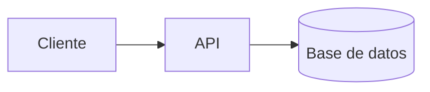

# Guía de publicación

Esta wiki es un sitio [Jekyll](https://jekyllrb.com/) con el tema
[Just the Docs](https://just-the-docs.com/), construido y desplegado por
GitHub Actions desde la carpeta `docs/`.

## Flujo normal

1. Crea o edita un `.md` dentro de `docs/`.
2. Haz commit y push a la rama `main`.
3. El workflow `Deploy wiki (GitHub Pages)` construye el sitio y lo publica en
   <https://mati-mbit.github.io/arqsoft-reto-2/>.

El despliegue tarda entre uno y dos minutos. Su estado se ve en la pestaña
**Actions** del repositorio.

## Front matter

El front matter es un bloque YAML opcional al inicio del archivo. Las claves
más útiles:

| Clave | Para qué sirve |
|---|---|
| `title` | Nombre de la página en el menú y en la pestaña del navegador |
| `nav_order` | Posición en el menú lateral (número; menor aparece primero) |
| `parent` | Anida la página bajo otra, usando el `title` de la página padre |
| `has_children` | `true` en la página padre de una sección |
| `nav_exclude` | `true` para publicar la página sin mostrarla en el menú |

### Secciones con subpáginas

Página padre — `docs/vistas.md`:

```markdown
---
title: Vistas de arquitectura
nav_order: 3
has_children: true
---
```

Página hija — `docs/vistas-contenedores.md`:

```markdown
---
title: Contenedores
parent: Vistas de arquitectura
nav_order: 1
---
```

## Enlaces entre páginas

Enlaza con la ruta relativa al archivo `.md`; el plugin
`jekyll-relative-links` la convierte en una URL válida del sitio.

```markdown
Ver la [guía de publicación](guia-de-publicacion.md).
```

## Imágenes y adjuntos

Guárdalos en `docs/assets/` y referencíalos de forma relativa:

```markdown

```

## Bloques destacados

El tema tiene *callouts* configurados en `_config.yml`:

```markdown
{: .nota }
> Los ADR se numeran de forma consecutiva y no se borran.

{: .advertencia }
> Este endpoint queda deprecado en la siguiente iteración.
```

Disponibles: `nota`, `importante`, `advertencia`, `tip`.

## Diagramas Mermaid

Están habilitados por el tema. Usa un bloque de código con lenguaje `mermaid`:

````markdown

````

## Vista previa local

Requiere Ruby y Bundler:

```bash
cd docs
bundle install
bundle exec jekyll serve --livereload
```

El sitio queda en <http://127.0.0.1:4000/arqsoft-reto-2/>.
