# Diagramas de arquitectura — Reto 2 CCP (v5)

Versión 5 del 26 de septiembre de 2026. Dibuja las diez decisiones de `adrs-ccp-reto2.md` en tres vistas: funcional, de información y de despliegue. Reemplaza la v4, que tenía 40 diagramas cargados de estereotipos y notas largas. Esta versión tiene 14, y cada uno cabe en una pantalla: máximo 12 elementos, dos estereotipos por caja y ninguna tecnología fuera del despliegue. Los PNG están en `png-v5/`.

**Estado: propuesta.** Los diez ADR están en estado Propuesta, así que cada diagrama también lo está.

## Cómo está organizado

| Vista | Qué responde | Diagramas |
|---|---|---|
| **Funcional · componentes** | Qué componentes resuelven cada ASR y por qué interfaz o evento se hablan | DG-CMP-001 a 003 |
| **Funcional · por dentro** | Cómo funciona por dentro el componente que satisface cada ASR, y cómo recorre la operación crítica | DG-CST-001 a 004 · DG-SEQ-001 a 004 |
| **Información** | Qué datos sostienen las tácticas | DG-CLS-001 y 002 |
| **Despliegue** | Dónde corre cada pieza, con qué tecnología y qué queda como instancia única | DG-DEP-001 |

Cada diagrama de componentes lleva debajo una tabla de tácticas. La caja solo muestra la marca (T1, T2…); la tabla dice qué táctica es, qué ADR la decide y cuál es su precio.

## Leyenda del documento

| Notación | Significado |
|---|---|
| «component» | Unidad propia reemplazable, con interfaces |
| «external» | Sistema o persona fuera del alcance |
| ○ `IAlgo` | Interfaz. Línea sin punta: la provee. Flecha hacia ella: la requiere |
| ○ «event» `tema` | Tema de eventos. Flecha hacia el tema: publica. Flecha desde el tema: entrega a un suscriptor |
| «queue» | Cola con destino de mensajes fallidos |
| «datastore» | Almacén de datos que no es un componente propio |
| «port» | Punto de interacción en el borde de una caja blanca |
| «delegate» | El puerto entrega la llamada a la parte interna que la atiende, o la parte sale por el puerto |
| «boundary» · «control» · «entity» · «adapter» | Rol de la parte interna: recibe, decide, guarda, traduce hacia afuera |
| «T1», «T2»… | Marca de táctica; ver la tabla bajo el diagrama |
| Amarillo | Componente o parte que aloja una táctica de un ADR |
| Nota con banderín | ADR y precio de la decisión anclada |
| Línea discontinua | Dependencia «use» o vínculo de una nota |

## Piezas técnicas

Solo el despliegue nombra productos. Los términos que aparecen en las secuencias y en la vista de información se explican aquí.

| Término | Qué es |
|---|---|
| **JWT · jti** | Token firmado que el Gestor de sesión entrega al abrir la sesión; jti es su identificador único. Revocar una sesión es anotar su jti en la Lista de revocación |
| **Huella del dispositivo** | Resumen SHA-256 de identificadores del equipo que la App móvil calcula al abrir sesión |
| **Outbox transaccional** | Tabla donde el servicio guarda el evento en la misma transacción que la escritura; un relevo lo publica después. Ninguna escritura queda sin evento |
| **Idempotencia** | Repetir la operación no produce un segundo efecto. Aquí la da una fila con clave única por (idPedido, etapa) |
| **Compensación** | Operación inversa que deshace el efecto de una escritura sin tocar lo que vino después |
| **Dead-letter** | Destino al que la cola manda un mensaje que no se pudo procesar, en vez de perderlo |
| **t0 · t_det** | Instante en que se abre la sesión (ASR-1) e instante en que se detecta la escritura indebida (ASR-2). Desde ahí corren las medidas |
| **p99,9** | La duración que solo el 0,1 % de las ejecuciones supera |

---

# Vista funcional · componentes

## DG-CMP-001 · ASR-1: la sesión abierta desde un dispositivo no suministrado

| Tipo | ASR | ADR | Estado | Componente clave |
|---|---|---|---|---|
| Componentes | ASR-1 | ADR-001 · ADR-007 | propuesta | Verificador de dispositivo |

```mermaid
---
title: "DG-CMP-001 · ¿Qué componentes detectan la sesión abierta desde otro dispositivo?"
config:
  layout: elk
  theme: default
  look: classic
  htmlLabels: false
---
%% id: DG-CMP-001 | tipo: componentes | asr: [ASR-1] | adr: [ADR-001, ADR-007] | estado: propuesta | eclosionar: [Verificador de dispositivo]
%% leyenda: documento
flowchart LR
    APP["«component» «T1»<br/>App móvil"]
    GW["«component»<br/>Puerta de entrada de la API"]
    ISES(("ISesion"))
    SES["«component» «T1»<br/>Gestor de sesión"]
    EVS(("«event»<br/>sesion.abierta"))
    VDI["«component» «T2»<br/>Verificador de dispositivo"]
    EVA(("«event»<br/>alerta.seguridad"))
    NOT["«component» «T3»<br/>Notificador a seguridad"]
    SEG["«external»<br/>Área de seguridad"]

    APP -- "abrirSesion con huella" --> GW
    GW -- "requiere" --> ISES
    ISES --- SES
    SES -- "publica" --> EVS
    EVS -- "entrega" --> VDI
    VDI -- "publica si no coincide" --> EVA
    EVA -- "entrega" --> NOT
    NOT -- "aviso" --> SEG

    N1>"ADR-007 · aviso ≤ 2 s sin frenar el login"]
    N1 -.- VDI
    classDef tactica fill:#fff4d6,stroke:#b8860b
    class APP,SES,VDI,NOT tactica
```

| Marca | Táctica | Dónde | ADR | Precio |
|---|---|---|---|---|
| T1 | Autenticar al actor incluyendo el dispositivo | App móvil (calcula la huella) · Gestor de sesión (la guarda en la sesión) | ADR-007 | Cada cambio legítimo de equipo necesita registro previo, o dispara el aviso |
| T2 | Detectar intrusiones | Verificador de dispositivo | ADR-007 | El tercero opera mientras llega el aviso y hasta que seguridad actúa |
| T3 | Informar | Notificador a seguridad | ADR-007 | La entrega del aviso consume parte de los 2 s |
| — | Intermediario de mensajes (los temas «event») | Entre Gestor, Verificador y Notificador | ADR-001 | Un salto más por evento |

**Qué muestra:** el inicio de sesión no espera la comparación del dispositivo; el Gestor publica el evento y el Verificador decide después. · **Decisión que refleja:** ADR-007 sobre el estilo por eventos de ADR-001. · **Qué no muestra:** el tendero, que no tiene dispositivo suministrado (R-007a), ni cómo se registra un cambio legítimo, que está en DG-CST-001.

---

## DG-CMP-002 · ASR-2: la escritura indebida, detectada y revertida

| Tipo | ASR | ADR | Estado | Componente clave |
|---|---|---|---|---|
| Componentes | ASR-2 | ADR-001 · ADR-008 · ADR-009 · ADR-010 | propuesta | Reacción ante acceso indebido |

```mermaid
---
title: "DG-CMP-002 · ¿Qué componentes detectan y revierten la escritura indebida?"
config:
  layout: elk
  theme: default
  look: classic
  htmlLabels: false
---
%% id: DG-CMP-002 | tipo: componentes | asr: [ASR-2] | adr: [ADR-001, ADR-008, ADR-009, ADR-010] | estado: propuesta | eclosionar: [Reacción ante acceso indebido]
%% leyenda: documento
flowchart LR
    GW["«component» «T1»<br/>Puerta de entrada de la API"]
    LRV[("«datastore» «T1»<br/>Lista de revocación")]
    subgraph ESC["Funciones que escriben"]
        PED["«component» «T2»<br/>Pedidos"]
        INV["«component» «T2»<br/>Inventario"]
        ICOM(("ICompensacion"))
    end
    EVE(("«event»<br/>escritura.realizada"))
    DET["«component» «T3»<br/>Detector de escrituras indebidas"]
    IPER(("IPermisos"))
    SES["«component»<br/>Gestor de sesión"]
    REA["«component» «T4»<br/>Reacción ante acceso indebido"]

    GW -- "consulta en cada petición" --> LRV
    GW -- "reenvía escrituras" --> PED
    GW -- "reenvía descargues" --> INV
    PED -- "publica tras el commit" --> EVE
    INV -- "publica tras el commit" --> EVE
    EVE -- "entrega" --> DET
    DET -- "requiere" --> IPER
    IPER --- SES
    DET -. "«use» reaccionar" .-> REA
    REA -. "«use» revocar sesión y actor" .-> LRV
    REA -- "bloquear(actor)" --> SES
    REA -- "requiere" --> ICOM
    ICOM --- PED
    ICOM --- INV

    N1>"ADR-008 · bitácora y outbox en la misma transacción"]
    N1 -.- EVE
    N2>"ADR-010 · revocar, bloquear y compensar ≤ 5 s"]
    N2 -.- REA
    classDef tactica fill:#fff4d6,stroke:#b8860b
    class GW,LRV,PED,INV,DET,REA tactica
```

| Marca | Táctica | Dónde | ADR | Precio |
|---|---|---|---|---|
| T1 | Autorizar en el borde y revocar acceso | Puerta de entrada · Lista de revocación | ADR-009 | Una consulta a la Lista por cada petición; si la Lista no responde, hay que elegir entre rechazar todo o dejar pasar |
| T2 | Bitácora de escrituras y compensación | Pedidos · Inventario | ADR-008 · ADR-010 | Dos filas más por escritura y una operación inversa por tipo de escritura |
| T3 | Detectar la escritura contra el permiso vigente | Detector de escrituras indebidas | ADR-008 | Una consulta de permisos por escritura |
| T4 | Revocar, bloquear y compensar, en ese orden | Reacción ante acceso indebido | ADR-009 · ADR-010 | La compensación depende de que Pedidos e Inventario respondan |

**Qué muestra:** la escritura ya ocurrió cuando empieza el camino. El evento sale en la misma transacción, el Detector lo contrasta con los permisos vigentes y la Reacción corta la sesión en la Puerta de entrada antes de compensar. · **Decisión que refleja:** ADR-008, ADR-009 y ADR-010. · **Qué no muestra:** el aviso a seguridad, que sale por el mismo tema `alerta.seguridad` de DG-CMP-001 y aparece en DG-CST-002.

---

## DG-CMP-003 · ASR-3 y ASR-4: la cadena del pedido detenida y su reanudación

| Tipo | ASR | ADR | Estado | Componentes clave |
|---|---|---|---|---|
| Componentes | ASR-3 · ASR-4 | ADR-001 a ADR-006 | propuesta | Monitor de la cadena (ASR-3) · Coordinador de la cadena (ASR-4) |

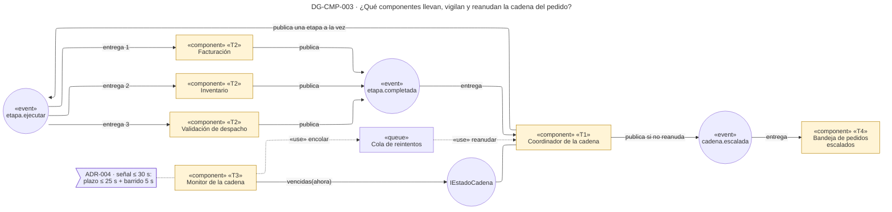

| Marca | Táctica | Dónde | ADR | Precio |
|---|---|---|---|---|
| T1 | Orquestación con estado por etapa, etapas consecutivas y un solo reintento | Coordinador de la cadena | ADR-002 · ADR-003 · ADR-006 | Punto central (R-002a); la cadena dura la suma de las tres etapas (R-003a); los transitorios llegan a una persona (R-006a) |
| T2 | Idempotencia por (idPedido, etapa) | Facturación · Inventario · Validación de despacho | ADR-005 | Una fila más por pedido y etapa, y una disciplina que cada etapa nueva debe cumplir |
| T3 | Monitor con plazo vencido y sondeo de salud de apoyo | Monitor de la cadena | ADR-004 | Plazo por calibrar contra la duración real (TO-004a); punto único de falla (R-004a) |
| T4 | Escalamiento a una persona | Bandeja de pedidos escalados | ADR-006 | Carga manual sin cifra |

**Qué muestra:** la cadena corre por eventos y en orden; el Coordinador guarda el estado y el Monitor lo lee desde afuera. Lo que el reintento no resuelve termina en la Bandeja. · **Decisión que refleja:** ADR-001 a ADR-006. · **Qué no muestra:** Pedidos, que arranca la cadena llamando a `IEstadoCadena`; Logística, que recibe `pedido.listo`; y el sondeo de salud, que está en DG-CST-003.

---

# Vista funcional · por dentro

Se abren los cuatro componentes que satisfacen cada ASR. Los demás quedan como caja negra: no alojan la táctica que demuestra la medida.

| ASR | Componente clave | Por qué ese |
|---|---|---|
| ASR-1 | Verificador de dispositivo | Es donde se compara la huella y se decide el aviso; de él dependen los 2 s |
| ASR-2 | Reacción ante acceso indebido | Ejecuta la respuesta completa: revocar, bloquear, compensar y avisar dentro de 5 s |
| ASR-3 | Monitor de la cadena | Es el único que nota la cadena detenida; de su barrido salen los 30 s |
| ASR-4 | Coordinador de la cadena | Reanuda la etapa pendiente o escala; de él dependen los 5 s y los cero duplicados |

## DG-CST-001 · Verificador de dispositivo — caja blanca

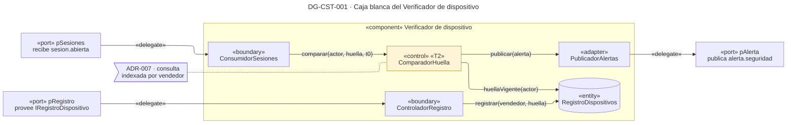

| Campo | Contenido |
|---|---|
| Componente | Verificador de dispositivo · `refina: Verificador de dispositivo` |
| Responsabilidad | Comparar la huella de cada sesión de vendedor contra la registrada y avisar cuando no coincide |
| Interfaces | Recibe `sesion.abierta`. Publica `alerta.seguridad`. Provee `IRegistroDispositivo`, que no aparece en DG-CMP-001: es el camino de HU-01 para registrar un cambio legítimo de equipo |
| Partes | ConsumidorSesiones «boundary» · ComparadorHuella «control» · RegistroDispositivos «entity» · ControladorRegistro «boundary» · PublicadorAlertas «adapter» |
| Operación crítica | `comparar`: es la respuesta de ASR-1 |
| Táctica interna | Detectar intrusiones (T2) → ComparadorHuella. Precio: un registro previo por cada cambio de equipo |
| Datos | `dispositivo_registrado(vendedor, huella, vigente_desde, vigente_hasta)`, con índice único por vendedor vigente |
| Fallos | Si el Verificador cae, los eventos esperan en el bróker: el aviso llega tarde, pero ninguna sesión se pierde |

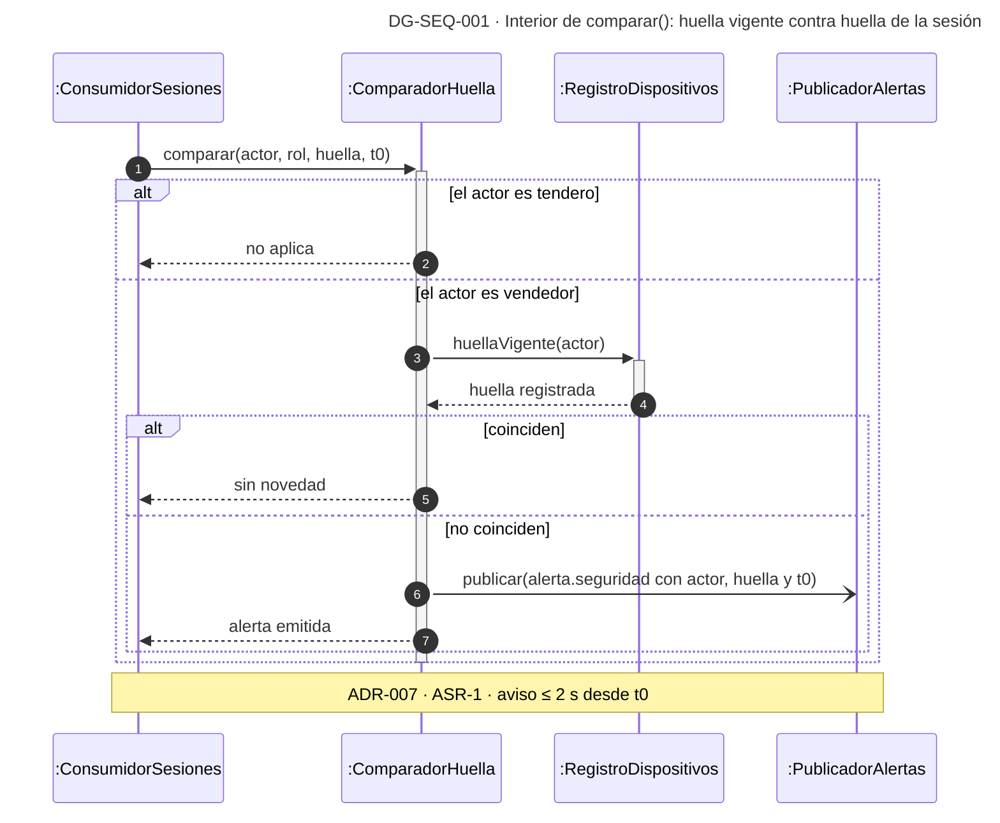

**Qué muestra:** la regla completa de ASR-1 y el caso que no cubre, el tendero. · **Decisión que refleja:** ADR-007. · **Qué no muestra:** la entrega del aviso, que hace el Notificador a seguridad.

---

## DG-CST-002 · Reacción ante acceso indebido — caja blanca

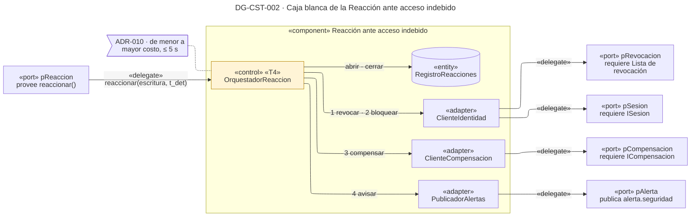

| Campo | Contenido |
|---|---|
| Componente | Reacción ante acceso indebido · `refina: Reacción ante acceso indebido` |
| Responsabilidad | Revocar la sesión, bloquear al actor, compensar la escritura y avisar a seguridad, en ese orden y dentro de 5 s |
| Interfaces | Provee `reaccionar`. Requiere la Lista de revocación, `ISesion` e `ICompensacion`. Publica `alerta.seguridad`, que no aparece en DG-CMP-002 para no repetir el camino de DG-CMP-001 |
| Partes | OrquestadorReaccion «control», que atiende el puerto directamente · RegistroReacciones «entity» · ClienteIdentidad, ClienteCompensacion y PublicadorAlertas «adapter» |
| Operación crítica | `reaccionar`: es la respuesta completa de ASR-2 |
| Táctica interna | Revocar, bloquear y compensar (T4) → OrquestadorReaccion. Revocar primero corta las escrituras siguientes en milisegundos; compensar es lo más lento y va al final |
| Datos | `reaccion(id_escritura, actor, t_det, revocada_en, bloqueada_en, compensada_en, estado)`; la clave `id_escritura` impide reaccionar dos veces a la misma escritura |
| Fallos | Si la compensación falla, la sesión ya está revocada y el actor bloqueado; el aviso sale con la reversión pendiente |

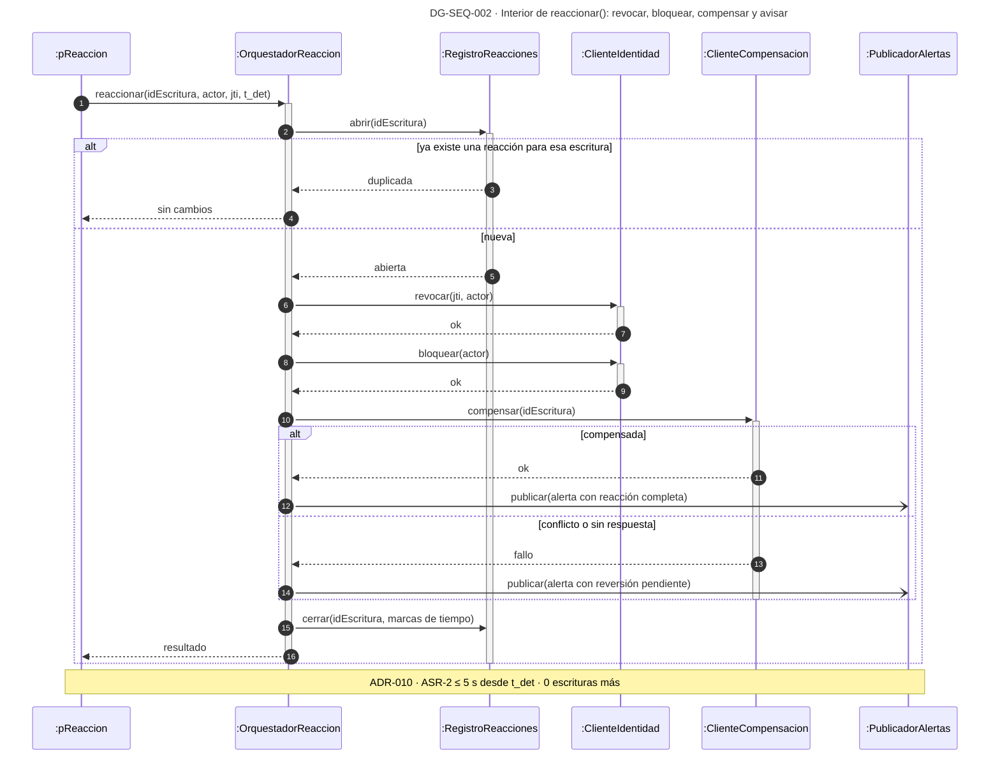

**Qué muestra:** cómo se reparten los 5 s y qué queda garantizado aunque la compensación falle. · **Decisión que refleja:** ADR-009 y ADR-010. · **Qué no muestra:** cómo compensa cada servicio; Inventario suma lo descontado en vez de restaurar la cifra, por R-4.

---

## DG-CST-003 · Monitor de la cadena — caja blanca

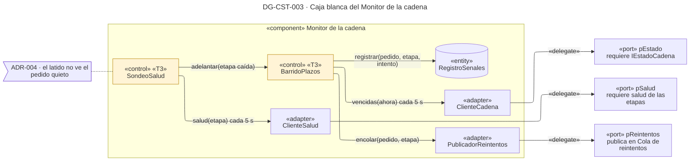

| Campo | Contenido |
|---|---|
| Componente | Monitor de la cadena · `refina: Monitor de la cadena` |
| Responsabilidad | Encontrar las etapas que pasaron su plazo sin avanzar, señalar cada pedido una sola vez y encolarlo para reanudar |
| Interfaces | Requiere `IEstadoCadena` y la salud de las tres etapas. Publica en la Cola de reintentos |
| Partes | BarridoPlazos y SondeoSalud «control», ambos programados cada 5 s · RegistroSenales «entity» · ClienteCadena, ClienteSalud y PublicadorReintentos «adapter». No tiene boundary: nadie lo llama, se despierta solo |
| Operación crítica | El barrido: es la respuesta de ASR-3 |
| Tácticas internas | Timeout y monitor (T3) → BarridoPlazos · Heartbeat de apoyo (T3) → SondeoSalud. El latido prueba que la etapa vive, no que el pedido avanza; tres fallos seguidos solo adelantan la señal |
| Datos | `senal(id_pedido, etapa, intento, detectada_en)`, con clave única en los tres primeros campos |
| Fallos | Si el Monitor cae, nadie detecta nada (R-004a) |

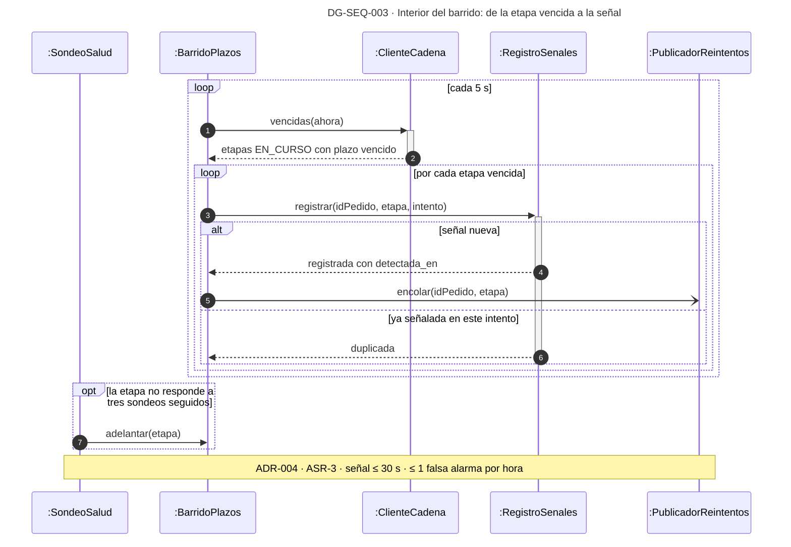

**Qué muestra:** de dónde salen los 30 s: el plazo de la etapa, de hasta 25 s, más un barrido de 5 s. · **Decisión que refleja:** ADR-004. · **Qué no muestra:** el valor del plazo de cada etapa, que depende de su p99,9 sin medir.

---

## DG-CST-004 · Coordinador de la cadena — caja blanca

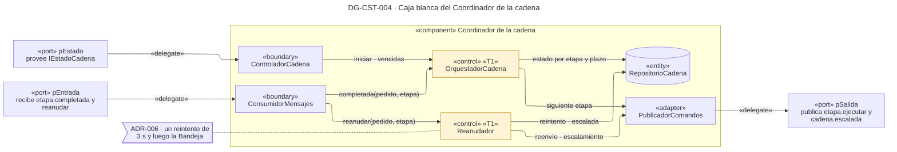

| Campo | Contenido |
|---|---|
| Componente | Coordinador de la cadena · `refina: Coordinador de la cadena` |
| Responsabilidad | Llevar cada pedido pagado por sus tres etapas en orden, saber en cuál está y reanudarla una vez si se detuvo |
| Interfaces | Provee `IEstadoCadena` (`iniciar`, `vencidas`, `terminar`, `cancelar`). Recibe `etapa.completada` y los reintentos de la Cola. Publica `etapa.ejecutar` y `cadena.escalada` |
| Partes | ControladorCadena y ConsumidorMensajes «boundary» · OrquestadorCadena y Reanudador «control» · RepositorioCadena «entity» · PublicadorComandos «adapter» |
| Operación crítica | `reanudar`: es la respuesta de ASR-4 |
| Tácticas internas | Orquestación, estado por etapa y etapas consecutivas (T1) → OrquestadorCadena · Reintento único y escalamiento (T1) → Reanudador |
| Datos | `cadena_etapa(id_pedido, etapa, estado, intento, iniciada_en, plazo_en)`; su esquema está en DG-CLS-001 |
| Fallos | Si el Coordinador cae con un reintento programado, el Monitor encuentra la etapa vencida con `intento = 1` en su siguiente barrido y el Reanudador la escala (R-002a) |

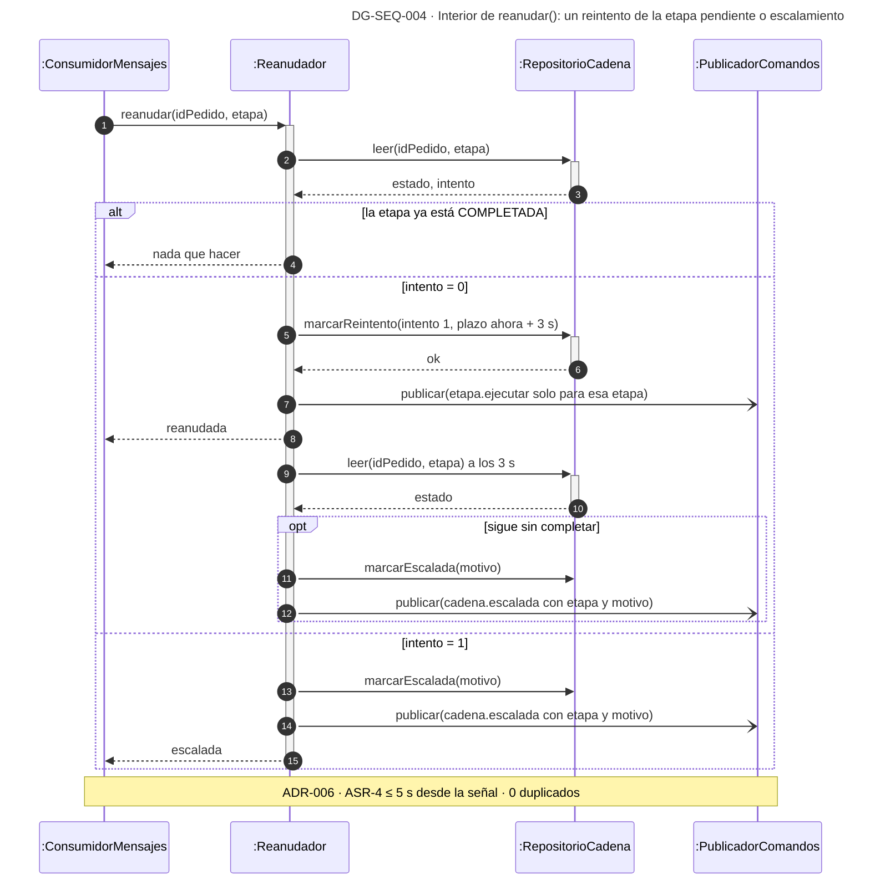

**Qué muestra:** por qué cabe un solo reintento en 5 s y cómo termina todo pedido en logística o en una persona. · **Decisión que refleja:** ADR-006, apoyado en la idempotencia de ADR-005. · **Qué no muestra:** el camino normal en orden de las tres etapas.

---

# Vista de información

## DG-CLS-001 · Los datos de la cadena, las señales y las etapas procesadas

| Tipo | ASR | ADR | Estado |
|---|---|---|---|
| Clases (información) | ASR-3 · ASR-4 | ADR-002 · ADR-004 · ADR-005 | propuesta |

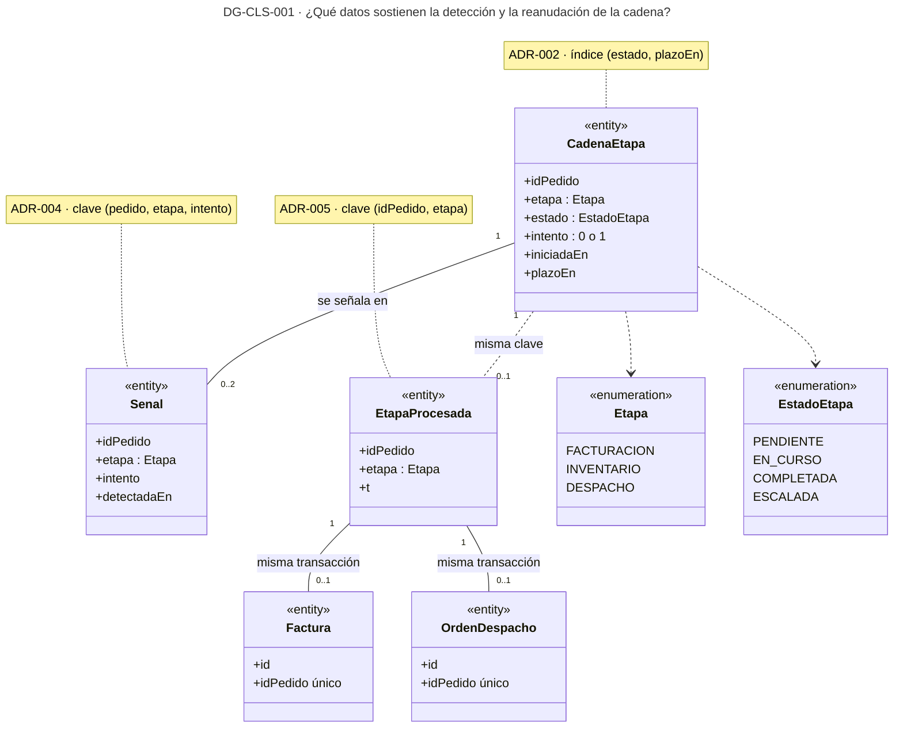

**Qué muestra:** qué fila sostiene cada táctica. `CadenaEtapa` vive en la base del Coordinador; `EtapaProcesada`, en la de cada etapa, junto a su efecto; `Senal`, en la del Monitor. La relación entre bases es por clave lógica, no por llave foránea. · **Decisión que refleja:** ADR-002, ADR-004 y ADR-005. · **Qué no muestra:** las columnas de negocio del pedido, la factura y la orden.

---

## DG-CLS-002 · Lo que la bitácora guarda para compensar

| Tipo | ASR | ADR | Estado |
|---|---|---|---|
| Clases (información y diseño) | ASR-2 | ADR-008 · ADR-010 | propuesta |

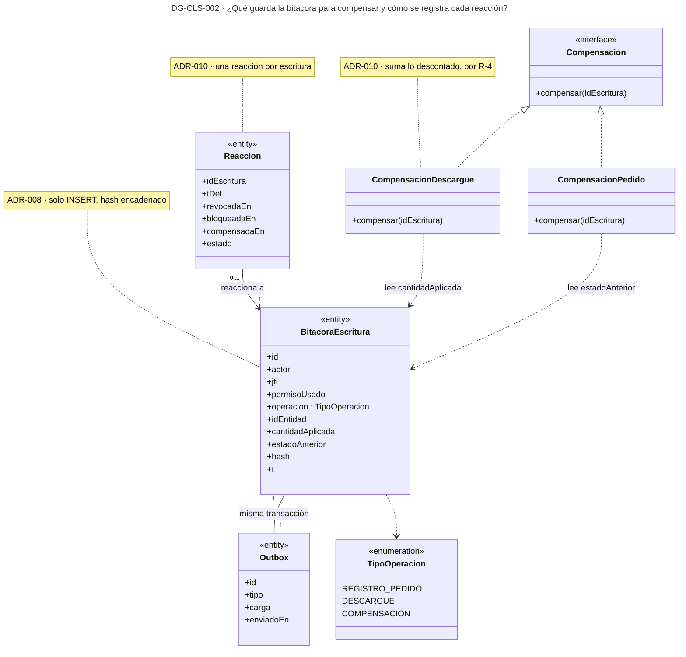

**Qué muestra:** por qué la bitácora guarda la cantidad descontada y no solo la cifra final, y dónde queda la evidencia de los 5 s. · **Decisión que refleja:** ADR-008 y ADR-010. · **Qué no muestra:** el pedido y la existencia, que esta decisión no cambia.

---

# Vista de despliegue

## DG-DEP-001 · Dónde corre cada pieza y cuáles quedan como instancia única

| Tipo | ASR | ADR | Estado |
|---|---|---|---|
| Despliegue | ASR-1 a ASR-4 | ADR-001 · ADR-002 · ADR-004 · ADR-006 · ADR-009 · ADR-010 | propuesta |

Este es el único diagrama que nombra productos. La pila (Java 21 y Spring Boot 3, PostgreSQL, RabbitMQ, Redis) es el supuesto SUP-01 del documento de ADR.

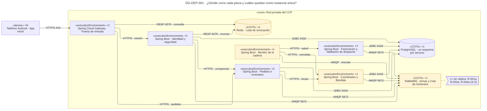

**Qué muestra:** los servicios sin estado en memoria corren con dos réplicas. El Coordinador, el Monitor, el bróker, la Lista de revocación y la base quedan como instancia única, con el riesgo que cada ADR ya declaró. · **Decisión que refleja:** ADR-001 (bróker y base), ADR-002 (Coordinador ×1), ADR-004 (Monitor ×1), ADR-006 (Cola de reintentos), ADR-009 (Lista de revocación consultada en el borde) y ADR-010 (la Reacción revoca y compensa). · **Qué no muestra:** la nube, el orquestador de contenedores y la redundancia de infraestructura, que S-3 deja fuera. Tampoco muestra los actores externos: el Área de seguridad, el Responsable del pedido escalado y Logística.

Cada componente del catálogo de elementos corre en un nodo:

| Nodo | Componentes | De dónde sale |
|---|---|---|
| Puerta de entrada ×2 | Puerta de entrada de la API | ADR-009 |
| Identidad y seguridad ×2 | Gestor de sesión, Verificador de dispositivo, Detector de escrituras indebidas, Reacción ante acceso indebido, Notificador a seguridad | propuesta: agrupa lo que ve la sesión y la escritura |
| Pedidos e Inventario ×2 | Pedidos, Inventario | propuesta: son las dos funciones que escriben (ADR-008) |
| Etapas ×2 | Facturación, Validación de despacho | propuesta: las dos etapas que sondea el Monitor (CN-34, CN-35) |
| Coordinador ×1 | Coordinador de la cadena, Bandeja de pedidos escalados | ADR-002; la Bandeja es propuesta |
| Monitor ×1 | Monitor de la cadena | ADR-004 |
| RabbitMQ ×1 | Bróker de mensajes, Cola de reintentos | ADR-001, ADR-006 |
| Redis ×1 | Lista de revocación | ADR-009 |
| PostgreSQL ×1 | Base transaccional, con la Bitácora de escrituras dentro | ADR-001, ADR-008 |

---

# Cierre

## Validación

Los 14 diagramas compilan con mmdc 12.0 y el lint no da ningún error. Queda un aviso, justificado abajo. La rúbrica va sobre 22 puntos en los diagramas de componentes y sus cajas blancas, y sobre 20 en los demás.

| Diagrama | Sintaxis | Lint | Rúbrica | Lo que le resta puntos |
|---|---|---|---|---|
| DG-CMP-001 | OK | 0 avisos | 21/22 | Una sola fila muy ancha: en pantalla chica hay que desplazarse |
| DG-CMP-002 | OK | 1 aviso justificado | 20/22 | Dos aristas largas por el borde inferior: «consulta en cada petición» y «requiere» |
| DG-CMP-003 | OK | 0 avisos | 22/22 | — |
| DG-CST-001 a 004 | OK | 0 avisos | 21/22 cada una | Los nombres largos en camelCase se parten dentro de la caja |
| DG-SEQ-001 a 004 | OK | 0 avisos | 20/20 | — |
| DG-CLS-001 y 002 | OK | 0 avisos | 20/20 | — |
| DG-DEP-001 | OK | 0 avisos | 18/20 | Las nueve rutas AMQP y JDBC convergen en el bróker y la base, y se cruzan antes de llegar |

Aviso justificado: **AP-09 en DG-CMP-002 (13 elementos).** El lint cuenta como elemento el subgrafo «Funciones que escriben», que solo agrupa a Pedidos, Inventario e `ICompensacion`. Sin él, ELK los separaba y las aristas daban la vuelta al diagrama.

## Matriz ASR × ADR × diagrama

| ASR | ADR | Componentes | Por dentro | Información y despliegue | Hueco |
|---|---|---|---|---|---|
| ASR-1 suplantación del vendedor | ADR-001, ADR-007 | DG-CMP-001 | DG-CST-001 · DG-SEQ-001 | DG-DEP-001 | Tendero sin señal equivalente (R-007a); identificadores del equipo; canal del aviso |
| ASR-2 escritura indebida | ADR-001, ADR-008, ADR-009, ADR-010 | DG-CMP-002 | DG-CST-002 · DG-SEQ-002 | DG-CLS-002 · DG-DEP-001 | Qué hacer si la Lista de revocación no responde (TO-009a); pedido indebido con la cadena en curso (R-010a); rol del actor de solo consulta |
| ASR-3 cadena detenida | ADR-001 a ADR-004 | DG-CMP-003 | DG-CST-003 · DG-SEQ-003 | DG-CLS-001 · DG-DEP-001 | p99,9 de cada etapa sin medir (TO-004a); Monitor como punto único (R-004a) |
| ASR-4 reanudación sin duplicar | ADR-001 a ADR-006 | DG-CMP-003 | DG-CST-004 · DG-SEQ-004 | DG-CLS-001 · DG-DEP-001 | Carga manual por transitorios (R-006a); factura en sistema externo (NR-005a) |

## Huecos

Las preguntas abiertas no van dentro de los diagramas; están aquí.

- ¿Qué hace la Puerta de entrada si la Lista de revocación no responde: rechazar o dejar pasar (TO-009a)?
- ¿Cuál es la duración p99,9 de cada etapa? Sin ella no se fija el plazo de ADR-004.
- ¿Se corren dos instancias del Monitor con un candado en la base (R-004a)?
- ¿Qué identificadores expone el dispositivo suministrado, y quién registra un cambio legítimo de equipo?
- ¿Por qué canal llega el aviso al área de seguridad?
- ¿Cómo se compensa un pedido indebido cuya cadena ya emitió factura o descargue (R-010a)?

Cuatro cosas aparecen dibujadas sin un ADR que las respalde: las dos réplicas de los servicios sin estado, la agrupación de componentes por nodo y la Bandeja junto al Coordinador (las tres en DG-DEP-001), y la interfaz `IRegistroDispositivo` (DG-CST-001).

El Monitor guarda sus señales (`RegistroSenales`, DG-CST-003), pero el catálogo de conectores no le da ruta a la base. DG-DEP-001 no la dibuja hasta que un ADR diga dónde vive ese estado.

## Líneas «Diagramas afectados» para las Consecuencias de cada ADR

- ADR-001 — `Diagramas afectados: DG-CMP-001, DG-CMP-002, DG-CMP-003, DG-DEP-001`
- ADR-002 — `Diagramas afectados: DG-CMP-003, DG-CST-004, DG-CLS-001, DG-DEP-001`
- ADR-003 — `Diagramas afectados: DG-CMP-003, DG-CST-004`
- ADR-004 — `Diagramas afectados: DG-CMP-003, DG-CST-003, DG-SEQ-003, DG-CLS-001, DG-DEP-001`
- ADR-005 — `Diagramas afectados: DG-CMP-003, DG-SEQ-004, DG-CLS-001`
- ADR-006 — `Diagramas afectados: DG-CMP-003, DG-CST-003, DG-CST-004, DG-SEQ-004, DG-DEP-001`
- ADR-007 — `Diagramas afectados: DG-CMP-001, DG-CST-001, DG-SEQ-001`
- ADR-008 — `Diagramas afectados: DG-CMP-002, DG-CLS-002`
- ADR-009 — `Diagramas afectados: DG-CMP-002, DG-CST-002, DG-SEQ-002, DG-DEP-001`
- ADR-010 — `Diagramas afectados: DG-CMP-002, DG-CST-002, DG-SEQ-002, DG-CLS-002, DG-DEP-001`

## Lucid

Los catorce diagramas tienen copia en un solo documento de Lucid, [Reto 2 CCP v5 · Diagramas](https://lucid.app/lucidchart/2dcd45cd-d887-4194-a7a5-7648fdefc9fe/edit), con una pestaña por diagrama y en el mismo orden de este archivo. La copia se deriva de aquí: si un diagrama cambia, primero se corrige en este archivo y después se regenera Lucid.

Los componentes y los nodos de despliegue usan las formas UML nativas de Lucid (componente y nodo 3D). Las secuencias están armadas con formas básicas (participantes, líneas de vida, activaciones y marcos `alt`, `loop` y `opt`), porque el importador de PlantUML solo crea documentos nuevos. Lucid vuelve a trazar los conectores en codo, así que las posiciones no coinciden exactamente con el render de Mermaid.
