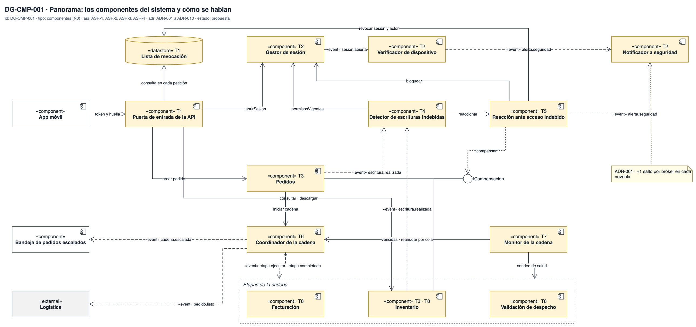
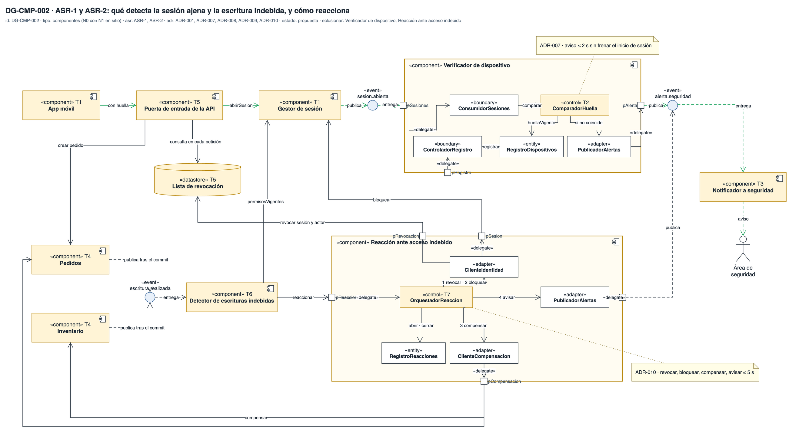
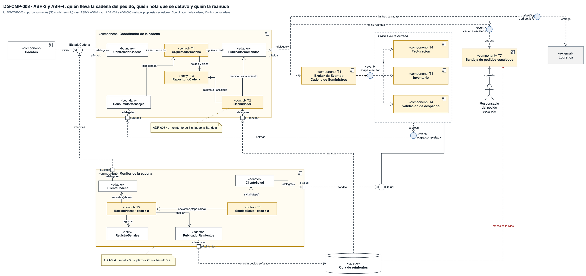

# Vista de componentes — Reto 2 CCP (v7)

Esta página dibuja qué componentes tiene el sistema, por dónde se hablan y cómo funcionan por dentro los que sostienen cada ASR. Son tres diagramas: el panorama de toda la arquitectura y un diagrama por cada camino del reto, el de seguridad y el de la cadena del pedido. En los dos últimos, los componentes clave se abren en el mismo dibujo para mostrar la parte donde vive cada táctica.

**Estado: propuesta.** Los diez ADR de [adrs-ccp-reto2.md](adrs-ccp-reto2.md) están en estado Propuesta, así que cada diagrama también lo está. La portada de los diagramas, con la matriz de trazabilidad y los huecos, está en [diagramas-ccp-reto2.md](diagramas-ccp-reto2.md).

**Fuente: draw.io.** Los diagramas viven en [vista-componentes.drawio](https://app.diagrams.net/#Uhttps%3A%2F%2Fraw.githubusercontent.com%2FMATI-MBIT%2Farqsoft-reto-2%2Fmain%2Fdocs%2Fmodelos%2Fdrawio%2Fvista-componentes.drawio), que se abre en draw.io web ([descargar](drawio/vista-componentes.drawio)), con una pestaña por diagrama. Cada imagen de esta página se exporta de ese archivo; un cambio se hace en el draw.io y después se vuelve a exportar.

## Cómo leer esta página

| Diagrama | Qué responde | ASR · ADR |
|---|---|---|
| DG-CMP-001 | Qué componentes hay en todo el sistema y qué decisión vive en cada uno | ASR-1 a ASR-4 · ADR-001 a ADR-010 |
| DG-CMP-002 | Qué componentes detectan la sesión ajena y la escritura indebida, y cómo están hechos por dentro el Verificador y la Reacción | ASR-1, ASR-2 · ADR-001, ADR-007 a ADR-010 |
| DG-CMP-003 | Qué componentes llevan, vigilan y reanudan la cadena, y cómo están hechos por dentro el Coordinador y el Monitor | ASR-3, ASR-4 · ADR-001 a ADR-006 |

## Leyenda

| Notación | Significado |
|---|---|
| «component» con el ícono de componente | Unidad propia y reemplazable, con interfaces. Si se dibuja grande y con partes dentro, es su caja blanca |
| «external» · gris | Sistema fuera del alcance |
| Cilindro «datastore» · «queue» | Almacén o cola que no es un componente propio |
| ○ blanco `IAlgo` | Interfaz. Línea sin punta: el componente la provee. Flecha discontinua hacia ella: la requiere |
| ○ azul «event» `tema` | Tema de eventos. Flecha discontinua hacia el tema: publica. Desde el tema: entrega a un suscriptor |
| Flecha continua | Llamada síncrona |
| Flecha discontinua con «event» (solo en el panorama) | Tema plegado en la arista: va del que publica al que se suscribe |
| Cuadro pequeño en el borde | Puerto «port» de una caja blanca |
| «delegate» | El puerto entrega la llamada a la parte que la atiende, o la parte sale por el puerto |
| «boundary» · «control» · «entity» · «adapter» | Rol de la parte interna: recibe, decide, guarda estado, traduce hacia afuera |
| T1, T2… | Marca de táctica. La tabla bajo el diagrama dice cuál es, con su ID del catálogo del curso, su ADR y su precio |
| Amarillo | Componente o parte que aloja una táctica de un ADR |
| Línea punteada roja | Mensaje que no se pudo procesar y va a otro destino |
| Figura de palo | Actor: una persona que usa el sistema, como el soporte de CCP (rótulo «CCP Support»), el Responsable del pedido escalado o el Área de seguridad |
| Marco punteado | Agrupación sin semántica de componente: las etapas de la cadena |
| Línea azul (solo en el panorama) | Flujo agregado por el equipo que no sale de ningún ADR; ver «Diferencias por resolver» |
| Nota | ADR y precio de la decisión anclada |

Los ID de táctica (DIS-17, SEG-13…) son los del catálogo del curso. La portada tiene la tabla que traduce las tácticas de cada ADR a esos ID.

---

## DG-CMP-001 · Panorama: toda la arquitectura

| Tipo | ASR | ADR | Estado |
|---|---|---|---|
| Componentes (N0) | ASR-1 a ASR-4 | ADR-001 a ADR-010 | propuesta |

| Marca | ID | Táctica (curso) | Componente | ADR | Precio → cobra a |
|---|---|---|---|---|---|
| — | EST-03 · MOD-04 · DIS-17 | Estilo dirigido por eventos: intermediario durable entre componentes y transacción local en cada servicio | Todo el diagrama: las aristas «event» de seguridad pasan por el bróker, y las de la cadena, por el bróker de la cadena (T8) | ADR-001 | Un salto más por evento → latencia de ASR-1 y ASR-2 (TO-001a). El bróker es pieza común de los cuatro caminos (R-001a) |
| T1 | SEG-02 · SEG-13 | Autenticar en el borde y revocar el acceso | Puerta de entrada · Lista de revocación | ADR-009 | Una consulta a la Lista por cada petición → disponibilidad del borde (R-1) |
| T2 | SEG-02 · SEG-09 · SEG-15 | Dispositivo como parte de la identidad, detectar la intrusión e informar | Gestor de sesión · Verificador · Notificador | ADR-007 | Cada cambio legítimo de equipo exige registro previo, o es falsa alarma → ASR-1 |
| T3 | SEG-18 · DIS-17 | Bitácora de escrituras y evento en la misma transacción | Pedidos · Inventario | ADR-008 | Dos filas más por escritura → desempeño de la escritura |
| T4 | SEG-09 | Detectar la escritura contra el permiso vigente | Detector | ADR-008 | Una consulta de permisos por escritura → ASR-2 si el Gestor tarda (R-008a) |
| T5 | SEG-13 · SEG-14 · DIS-13 · SEG-15 | Reacción ordenada: revocar, bloquear, compensar y avisar | Reacción | ADR-009 · ADR-010 | Una operación inversa por tipo de escritura → modificabilidad |
| T6 | INT-08 · DIS-15 · INT-10 · DIS-12 · DIS-14 | Orquestar la cadena con estado por etapa, en orden, con un reintento y escalamiento | Coordinador | ADR-002 · ADR-003 · ADR-006 | Punto central (R-002a) → ASR-4. La cadena dura la suma de las tres etapas (R-003a) |
| T7 | DIS-04 · DIS-03 · DIS-01 | Plazo vencido por pedido, monitor que barre y sondeo de salud (ping/echo) de apoyo | Monitor: avisa al Coordinador la falla de estado de los servicios y verifica las etapas por ping/echo | ADR-004 | Plazo por calibrar → falsas alarmas de ASR-3 (TO-004a). Punto único (R-004a) |
| T8 | [PREGUNTA] | Bróker de la cadena: recibe `etapa.ejecutar` y `etapa.completada` del Coordinador, los enruta a las etapas y manda lo que falla a la cola de mensajes fallidos | Bróker de la cadena (rótulo «Broker de Eventos Cadena de suministros») | ADR-001 · ADR-006 | [PREGUNTA] |
| T9 · T10 | DIS-17 | Idempotencia por pedido y etapa con clave única en la transacción del efecto | Facturación (T9) · Inventario y Validación de despacho (T10) | ADR-005 | Una fila más por pedido y etapa → almacenamiento |
| T11 | [PREGUNTA] | Cola de mensajes fallidos de la cadena, que atiende el soporte de CCP | Cola de mensajes fallidos (rótulo «Dead-Letter-Queue») | ADR-006 | [PREGUNTA] |

**Qué muestra:** los componentes del sistema y el camino de cada ASR. Los de seguridad observan la sesión y la escritura por eventos, sin frenarlas. Los de disponibilidad llevan la cadena del pedido por un Coordinador que habla con las etapas a través del bróker de la cadena. Es el grupo de temas de la cadena dentro del mismo bróker de mensajes, que la vista de despliegue separa en su propio espacio aislado del bróker (vhost `/cadena`). El Monitor vigila desde afuera: avisa al Coordinador las fallas y verifica las etapas por ping/echo. Lo que el bróker de la cadena no logra entregar va a la cola de mensajes fallidos, que atiende el soporte de CCP. · **Decisión que refleja:** los diez ADR, cada uno con su marca. · **Qué no muestra:** las partes internas, ni los temas de seguridad como nodos; esos detalles están en DG-CMP-002 y DG-CMP-003.

**Tamaño.** El panorama tiene 22 elementos, sobre el tope de legibilidad de 20. Para que se lea, los temas de seguridad van plegados en la arista discontinua y las etapas se agrupan en un marco.

---

## DG-CMP-002 · ASR-1 y ASR-2: la sesión ajena y la escritura indebida

| Tipo | ASR | ADR | Estado | Componentes abiertos |
|---|---|---|---|---|
| Componentes (N0 con N1 en sitio) | ASR-1 · ASR-2 | ADR-001 · ADR-007 · ADR-008 · ADR-009 · ADR-010 | propuesta | Verificador de dispositivo · Reacción ante acceso indebido |

| Marca | ID | Táctica (curso) | Elemento | ADR | Precio → cobra a |
|---|---|---|---|---|---|
| T1 | SEG-02 | Autenticar al actor con el dispositivo como parte de su identidad | App móvil (calcula la huella) · Gestor de sesión (la guarda en la sesión) | ADR-007 | Cada cambio legítimo de equipo necesita registro previo → falsas alarmas de ASR-1 |
| T2 | SEG-09 | Detectar intrusiones: comparar la huella de la sesión con la registrada | ComparadorHuella, dentro del Verificador | ADR-007 | Un cambio de equipo sin registro previo dispara el aviso → ASR-1 (≤ 1 falsa alarma por 100 cambios) |
| T3 | SEG-15 | Informar al área de seguridad | Notificador a seguridad | ADR-007 | Ruido de alertas → costo operativo |
| T4 | SEG-18 · DIS-17 · DIS-13 | Bitácora con el estado anterior y evento en la misma transacción; compensación de la escritura | Pedidos · Inventario | ADR-008 · ADR-010 | Dos filas más por escritura → desempeño de la escritura. Una operación inversa por tipo → modificabilidad |
| T5 | SEG-02 · SEG-13 | Autenticar en el borde y revocar el acceso de la sesión viva | Puerta de entrada · Lista de revocación | ADR-009 | Una consulta por petición y una pieza más en el camino crítico → disponibilidad del borde (R-1) |
| T6 | SEG-09 | Detectar la escritura contra el permiso vigente, no el del token | Detector de escrituras indebidas | ADR-008 | Una consulta de permisos por escritura → ASR-2 si el Gestor tarda (R-008a) |
| T7 | SEG-13 · SEG-14 · DIS-13 · SEG-15 | Reacción ordenada: revocar, bloquear, compensar y avisar, en ese orden | OrquestadorReaccion, dentro de la Reacción | ADR-009 · ADR-010 | Si la compensación falla, el efecto residual puede pasar de 60 s → ASR-2 |
| — | MOD-04 | Intermediario de mensajes (los temas «event») | Entre todos los componentes de los dos caminos | ADR-001 | Un salto más por evento → latencia de ASR-1 y ASR-2 |

| STRIDE | Elemento que la mitiga | ID |
|---|---|---|
| S · Suplantación del vendedor | Gestor de sesión (la huella entra en la sesión) · ComparadorHuella (la compara) · Notificador (avisa) | SEG-02 · SEG-09 · SEG-15 |
| E · Elevación de privilegios | Bitácora en Pedidos e Inventario (evidencia) · Detector (detecta) · OrquestadorReaccion (revoca, bloquea, compensa) · Puerta de entrada (hace efectiva la revocación) | SEG-18 · SEG-09 · SEG-13 · SEG-14 · DIS-13 |

### Por qué se abren estos dos componentes

| ASR | Componente abierto | Por qué ese |
|---|---|---|
| ASR-1 | Verificador de dispositivo | Compara la huella y decide el aviso. De él dependen la medida de 2 s y las falsas alarmas, y su ControladorRegistro es el camino del cambio legítimo de equipo |
| ASR-2 | Reacción ante acceso indebido | Ejecuta la respuesta completa de ASR-2. El orden de sus cuatro pasos es lo que hace que la revocación llegue antes que la compensación |

Los demás quedan como caja negra. El Gestor de sesión fija t0 y el Detector fija t_det, y ninguno tiene una decisión interna propia: los hilos que hacen ese trabajo están en DG-CON-002, en la vista de concurrencia.

| Parte | Componente | Rol | Responsabilidad |
|---|---|---|---|
| ConsumidorSesiones | Verificador | «boundary» | Recibe `sesion.abierta` por el puerto pSesiones |
| ComparadorHuella | Verificador | «control» | Compara la huella de la sesión con la vigente del vendedor |
| RegistroDispositivos | Verificador | «entity» | Guarda la huella vigente de cada vendedor |
| ControladorRegistro | Verificador | «boundary» | Atiende `IRegistroDispositivo`: registra el cambio legítimo antes de usarlo |
| PublicadorAlertas | Verificador | «adapter» | Publica `alerta.seguridad` si la huella no coincide |
| OrquestadorReaccion | Reacción | «control» | Ordena los cuatro pasos y fija sus marcas de tiempo |
| RegistroReacciones | Reacción | «entity» | Una reacción por `idEscritura`, para no reaccionar dos veces |
| ClienteIdentidad | Reacción | «adapter» | Revoca en la Lista y bloquea en el Gestor |
| ClienteCompensacion | Reacción | «adapter» | Pide la compensación a Pedidos o a Inventario |
| PublicadorAlertas | Reacción | «adapter» | Publica el aviso con la reacción completa o con la reversión pendiente |

**Qué muestra:** que ni el inicio de sesión ni la escritura esperan el control de seguridad. El Gestor y las dos funciones que escriben publican su evento, y el Verificador y el Detector deciden después. Dentro de la Reacción, la revocación sale primero por ClienteIdentidad y la compensación va al final. · **Decisión que refleja:** ADR-007 a ADR-010 sobre el estilo por eventos de ADR-001. · **Qué no muestra:** el tendero, que no tiene dispositivo suministrado (R-007a), ni quién usa `IRegistroDispositivo` para registrar un cambio legítimo de equipo, que el ADR deja abierto.

**Tamaño.** El diagrama tiene 34 elementos. El diagrama pasa el tope de 20 porque junta dos caminos y abre dos componentes en el mismo dibujo. Es el precio de dejar la vista en tres diagramas. Se lee por franjas: la de arriba es ASR-1 y la de abajo es ASR-2.

---

## DG-CMP-003 · ASR-3 y ASR-4: la cadena del pedido detenida y su reanudación

| Tipo | ASR | ADR | Estado | Componentes abiertos |
|---|---|---|---|---|
| Componentes (N0 con N1 en sitio) | ASR-3 · ASR-4 | ADR-001 a ADR-006 | propuesta | Coordinador de la cadena · Monitor de la cadena |

| Marca | ID | Táctica (curso) | Elemento | ADR | Precio → cobra a |
|---|---|---|---|---|---|
| T1 | INT-08 · INT-10 | Orquestación con un protocolo de comportamiento: facturación, descargue y despacho, cada una al confirmarse la anterior | OrquestadorCadena | ADR-002 · ADR-003 | Punto central → ASR-4 (R-002a). La cadena dura la suma de las etapas → los 25 s que deja S-7 (R-003a) |
| T2 | DIS-12 · DIS-14 | Un solo reintento de la etapa pendiente, sin espera creciente, y escalamiento a una persona | Reanudador | ADR-006 | Las detenciones transitorias llegan a una persona → usabilidad del responsable (R-006a) |
| T3 | DIS-15 | Log de transacciones: una fila por pedido y etapa con su estado, su intento y su plazo | RepositorioCadena | ADR-002 | Dos escrituras más por etapa → desempeño |
| T4 | DIS-17 | Idempotencia por (idPedido, etapa) | Facturación · Inventario · Validación de despacho | ADR-005 | Una fila más por pedido y etapa, y una disciplina que toda etapa nueva debe cumplir (R-005a) |
| T5 | DIS-04 · DIS-03 | Plazo vencido por pedido y etapa, encontrado por un monitor que barre cada 5 s | BarridoPlazos | ADR-004 | Plazo corto da falsas alarmas y plazo largo incumple → ASR-3 (TO-004a). El Monitor también cae → ASR-3 (R-004a) |
| T6 | DIS-01 | Sondeo de salud de las etapas, solo como apoyo | SondeoSalud | ADR-004 | Tráfico de sondeo, y no detecta la omisión que describe ASR-3 → desempeño |
| T7 | DIS-14 | Degradación con gracia: lo que no se reanuda llega a una persona | Bandeja de pedidos escalados | ADR-006 | Carga manual sin cifra → usabilidad del responsable (R-006a) |
| — | MOD-04 | Intermediario durable: el comando pendiente sobrevive a la caída de la etapa | Bróker de la cadena (marcado T4 en el diagrama) · temas y Cola de reintentos | ADR-001 | Pieza común de los cuatro caminos (R-001a) |

### Por qué se abren estos dos componentes

| ASR | Componente abierto | Por qué ese |
|---|---|---|
| ASR-3 | Monitor de la cadena | Es el único que nota la cadena detenida. De su barrido salen los 30 s, y el sondeo muestra por qué la salud de la etapa no basta |
| ASR-3, ASR-4 | Coordinador de la cadena | Guarda el plazo que el Monitor revisa, reanuda la etapa pendiente una vez o la escala. De él dependen los 5 s |

Las etapas quedan como caja negra. Las tres siguen la misma receta de ADR-005: la fila `EtapaProcesada` y el efecto se escriben en la misma transacción, y eso está en DG-CLS-001 y en DG-CON-003.

| Parte | Componente | Rol | Responsabilidad |
|---|---|---|---|
| ControladorCadena | Coordinador | «boundary» | Atiende `IEstadoCadena`: `iniciar`, `vencidas`, `terminar`, `cancelar` |
| ConsumidorMensajes | Coordinador | «boundary» | Recibe `etapa.completada` por el puerto pEntrada |
| OrquestadorCadena | Coordinador | «control» | Envía la etapa siguiente cuando la anterior confirma |
| Reanudador | Coordinador | «control» | Recibe de la Cola por pReanudar, reenvía la etapa una vez y escala si no confirma en 3 s |
| RepositorioCadena | Coordinador | «entity» | Una fila `CadenaEtapa` por pedido y etapa |
| PublicadorComandos | Coordinador | «adapter» | Publica `etapa.ejecutar`, `cadena.escalada` y `pedido.listo` |
| BarridoPlazos | Monitor | «control» | Cada 5 s pide las etapas vencidas y encola cada una |
| SondeoSalud | Monitor | «control» | Cada 5 s pregunta la salud de las etapas y adelanta la señal si una no responde |
| RegistroSenales | Monitor | «entity» | Una señal por pedido, etapa e intento |
| ClienteCadena · ClienteSalud · PublicadorReintentos | Monitor | «adapter» | Salen por pEstado, pSalud y pReintentos |

**Qué muestra:** la cadena corre por eventos y en orden. El Coordinador publica por su puerto pSalida en el bróker de la cadena, que entrega `etapa.ejecutar` a cada etapa. El Coordinador guarda el estado y el Monitor lo lee desde afuera. Lo que el reintento no resuelve termina en la Bandeja, por el tema `cadena.escalada` o por la cola de mensajes fallidos. · **Decisión que refleja:** ADR-001 a ADR-006. · **Qué no muestra:** la sincronización de la fila `CadenaEtapa` entre los hilos, que está en DG-CON-003, ni dónde guarda el Monitor sus señales, que ningún ADR decide.

**Tamaño.** El diagrama tiene unos 39 elementos. Pasa el tope de 20 por la misma razón que DG-CMP-002. Se lee por franjas: arriba el Coordinador y las etapas, abajo el Monitor y la Cola.

---

## Diferencias por resolver

El texto de esta página describe los diagramas tal como están dibujados. Estas diferencias quedan abiertas hasta que el equipo decida en el draw.io o en el ADR que corresponda.

| Dónde | Qué dibuja el diagrama | Con qué choca |
|---|---|---|
| DG-CMP-001 | Una línea azul del Notificador a la Lista de revocación: «Registrar en lista de Revocación · ASR 5» | ASR-5 no existe; los ASR van de ASR-1 a ASR-4. ADR-009 deja a la Reacción como el único que escribe en la Lista |
| DG-CMP-001 | La flecha de Pedidos a `escritura.realizada` lleva el rótulo «ASR 2» | Las aristas no llevan ASR en el resto de la vista; la trazabilidad va en la tabla |
| DG-CMP-001 y DG-CMP-003 | El bróker de la cadena es T8 en el panorama y T4 en DG-CMP-003 | En DG-CMP-003, T4 ya es la idempotencia de las etapas. Falta el ID del catálogo del bróker de la cadena (T8) y de la cola de mensajes fallidos (T11) |
| DG-CMP-001 | El soporte de CCP atiende la cola de mensajes fallidos | [PREGUNTA] ¿Es el mismo actor que el Responsable del pedido escalado, que atiende la Bandeja? |
| DG-CMP-001 | Facturación es T9 e Inventario y Validación de despacho son T10 | Las tres etapas aplican la misma táctica, DIS-17 de ADR-005, que antes era una sola marca |
| DG-CMP-001 | El Monitor se llama «Monitor» | En las demás vistas se llama «Monitor de la cadena» |
| DG-CMP-001 | El Monitor avisa al Coordinador «Notificación Falla status Servicios» | ADR-004 y DG-CMP-003 dicen que el Monitor pide las etapas vencidas al Coordinador (`vencidas(ahora)`) y encola la señal en la Cola de reintentos |
| DG-CMP-003 | El Monitor tiene dos celdas `ClienteSalud` superpuestas | Es la misma parte dibujada dos veces; al mover una, aparece la otra |
| Rótulos | «Verificación Cadena Sumistro {PinEco}» | Erratas: «Suministro» y «ping/echo» |

