# Vista de componentes — Reto 2 CCP (v6)

Esta página dibuja qué componentes tiene el sistema, por dónde se hablan y cómo funcionan por dentro los que sostienen cada ASR. Abre con el panorama de toda la arquitectura. Siguen tres diagramas de caja negra, uno por cada camino del reto, y después se abre cada componente clave: su caja blanca, su ficha y la secuencia de su operación crítica.

**Estado: propuesta.** Los diez ADR de [adrs-ccp-reto2.md](adrs-ccp-reto2.md) están en estado Propuesta, así que cada diagrama también lo está. La portada de los diagramas, con la matriz de trazabilidad y los huecos, está en [diagramas-ccp-reto2.md](diagramas-ccp-reto2.md).

## Cómo leer esta página

| Nivel | Qué responde | Diagramas |
|---|---|---|
| Panorama | Qué componentes hay en todo el sistema y qué decisión vive en cada uno | DG-CMP-001 |
| N0 · caja negra | Qué componentes resuelven cada ASR y por qué interfaz o tema se hablan | DG-CMP-002 a 004 |
| N1 · caja blanca | Cómo está hecho por dentro el componente clave y en qué parte vive cada táctica | DG-CST-001 a 010 |
| N2 · comportamiento interno | Cómo recorre la operación crítica las partes del componente, con su camino de fallo y su medida | DG-SEQ-001 a 012 |

## Leyenda

| Notación | Significado |
|---|---|
| «component» | Unidad propia y reemplazable, con interfaces |
| «external» | Sistema o persona fuera del alcance |
| «datastore» · «queue» | Almacén o cola que no es un componente propio |
| ○ `IAlgo` | Interfaz. Línea sin punta: el componente la provee. Flecha hacia ella: la requiere |
| ○ «event» `tema` | Tema de eventos. Flecha hacia el tema: publica. Flecha desde el tema: entrega a un suscriptor |
| Arista punteada «event» (solo en el panorama) | Tema de eventos plegado en la arista para que el panorama quepa: va del que publica al que se suscribe |
| «port» | Punto de interacción en el borde de una caja blanca |
| «delegate» | El puerto entrega la llamada a la parte que la atiende, o la parte sale por el puerto |
| «boundary» · «control» · «entity» · «adapter» | Rol de la parte interna: recibe, decide, guarda estado, traduce hacia afuera |
| «T1», «T2»… | Marca de táctica. La tabla bajo el diagrama dice qué táctica es, con su ID del catálogo del curso, su ADR y su precio |
| Amarillo | Componente o parte que aloja una táctica de un ADR |
| Nota con banderín | ADR y precio de la decisión anclada |
| `:Parte` en una secuencia | Línea de vida de una parte de la caja blanca, con el mismo nombre |

Los ID de táctica (DIS-17, SEG-13…) son los del catálogo del curso. La portada tiene la tabla que traduce las tácticas de cada ADR a esos ID.

---

## DG-CMP-001 · Panorama: toda la arquitectura

| Tipo | ASR | ADR | Estado | Componentes clave |
|---|---|---|---|---|
| Componentes (panorama) | ASR-1 a ASR-4 | ADR-001 a ADR-010 | propuesta | Los diez que se abren abajo |

```mermaid
---
title: "DG-CMP-001 · Panorama: los componentes del sistema y cómo se hablan"
config:
  layout: elk
  theme: default
  look: classic
---
%% id: DG-CMP-001 | tipo: componentes | asr: [ASR-1, ASR-2, ASR-3, ASR-4] | adr: [ADR-001, ADR-002, ADR-003, ADR-004, ADR-005, ADR-006, ADR-007, ADR-008, ADR-009, ADR-010] | estado: propuesta | eclosionar: [Gestor de sesión, Verificador de dispositivo, Notificador a seguridad, Inventario, Detector de escrituras indebidas, Reacción ante acceso indebido, Puerta de entrada de la API, Coordinador de la cadena, Monitor de la cadena, Facturación]
%% leyenda: documento
flowchart LR
    APP["«component»<br/>App móvil"]
    GW["«component» «T1»<br/>Puerta de entrada de la API"]
    LRV["«datastore» «T1»<br/>Lista de revocación"]
    SES["«component» «T2»<br/>Gestor de sesión"]
    VDI["«component» «T2»<br/>Verificador de dispositivo"]
    NOT["«component» «T2»<br/>Notificador a seguridad"]
    PED["«component» «T3»<br/>Pedidos"]
    ICOM(("ICompensacion"))
    DET["«component» «T4»<br/>Detector de escrituras indebidas"]
    REA["«component» «T5»<br/>Reacción ante acceso indebido"]
    COO["«component» «T6»<br/>Coordinador de la cadena"]
    MON["«component» «T7»<br/>Monitor de la cadena"]
    subgraph ETA["Etapas de la cadena"]
        FAC["«component» «T8»<br/>Facturación"]
        INV["«component» «T3·T8»<br/>Inventario"]
        DES["«component» «T8»<br/>Validación de despacho"]
    end
    BES["«component»<br/>Bandeja de pedidos escalados"]
    LOG["«external»<br/>Logística"]

    APP -- "peticiones con token y huella" --> GW
    GW -- "consulta en cada petición" --> LRV
    GW -- "abrirSesion" --> SES
    GW -- "crear pedido" --> PED
    GW -- "consultar · descargar" --> INV
    SES -. "«event» sesion.abierta" .-> VDI
    VDI -. "«event» alerta.seguridad" .-> NOT
    PED -. "«event» escritura.realizada" .-> DET
    INV -. "«event» escritura.realizada" .-> DET
    DET -- "permisosVigentes" --> SES
    DET -- "reaccionar" --> REA
    REA -- "revocar sesión y actor" --> LRV
    REA -- "bloquear" --> SES
    REA -- "compensar" --> ICOM
    ICOM --- PED
    ICOM --- INV
    REA -. "«event» alerta.seguridad" .-> NOT
    PED -- "iniciar cadena" --> COO
    COO <-. "«event» etapa.ejecutar · etapa.completada" .-> ETA
    MON -- "vencidas · reanudar por cola" --> COO
    MON -- "sondeo de salud" --> ETA
    COO -. "«event» cadena.escalada" .-> BES
    COO -. "«event» pedido.listo" .-> LOG

    N1>"ADR-001 · +1 salto por bróker en cada «event»"]
    N1 -.- SES
    classDef tactica fill:#fff4d6,stroke:#b8860b
    class GW,LRV,SES,VDI,NOT,PED,DET,REA,COO,MON,FAC,INV,DES tactica
```

| Marca | ID | Táctica (curso) | Componente | ADR | Precio → cobra a |
|---|---|---|---|---|---|
| — | EST-03 · MOD-04 · DIS-17 | Estilo dirigido por eventos: intermediario durable entre componentes y transacción local en cada servicio | Todo el diagrama: cada arista «event» pasa por el bróker | ADR-001 | Un salto más por evento → latencia de ASR-1 y ASR-2 (TO-001a). El bróker es pieza común de los cuatro caminos (R-001a) |
| T1 | SEG-02 · SEG-13 | Autenticar en el borde y revocar el acceso | Puerta de entrada · Lista de revocación | ADR-009 | Una consulta a la Lista por cada petición → disponibilidad del borde (R-1) |
| T2 | SEG-02 · SEG-09 · SEG-15 | Dispositivo como parte de la identidad, detectar la intrusión e informar | Gestor de sesión · Verificador · Notificador | ADR-007 | Cada cambio legítimo de equipo exige registro previo, o es falsa alarma → ASR-1 |
| T3 | SEG-18 · DIS-17 | Bitácora de escrituras y evento en la misma transacción | Pedidos · Inventario | ADR-008 | Dos filas más por escritura → desempeño de la escritura |
| T4 | SEG-09 | Detectar la escritura contra el permiso vigente | Detector | ADR-008 | Una consulta de permisos por escritura → ASR-2 si el Gestor tarda (R-008a) |
| T5 | SEG-13 · SEG-14 · DIS-13 · SEG-15 | Reacción ordenada: revocar, bloquear, compensar y avisar | Reacción | ADR-009 · ADR-010 | Una operación inversa por tipo de escritura → modificabilidad |
| T6 | INT-08 · DIS-15 · INT-10 · DIS-12 · DIS-14 | Orquestar la cadena con estado por etapa, en orden, con un reintento y escalamiento | Coordinador | ADR-002 · ADR-003 · ADR-006 | Punto central (R-002a) → ASR-4. La cadena dura la suma de las tres etapas (R-003a) |
| T7 | DIS-04 · DIS-03 · DIS-01 | Plazo vencido por pedido, monitor que barre y sondeo de salud de apoyo | Monitor | ADR-004 | Plazo por calibrar → falsas alarmas de ASR-3 (TO-004a). Punto único (R-004a) |
| T8 | DIS-17 | Idempotencia por pedido y etapa con clave única en la transacción del efecto | Facturación · Inventario · Validación de despacho | ADR-005 | Una fila más por pedido y etapa → almacenamiento |

**Qué muestra:** los dieciséis componentes del sistema y el camino de cada ASR. Los de seguridad observan la sesión y la escritura por eventos, sin frenarlas. Los de disponibilidad llevan la cadena del pedido por un Coordinador que el Monitor vigila desde afuera. · **Decisión que refleja:** los diez ADR, cada uno con su marca. · **Qué no muestra:** los actores, las interfaces que no cruzan de un camino a otro y los temas como nodos; esos detalles están en los tres diagramas de caja negra que siguen.

**Aviso del lint justificado (AP-09, 19 elementos).** Es el único diagrama cuya pregunta es el sistema entero. Para que quepa bajo el tope de 20, los temas de eventos van plegados en la arista punteada y las etapas se agrupan en un marco. Los diagramas DG-CMP-002 a 004 dibujan esos mismos caminos con la notación completa y dentro de 12 elementos.

---

## DG-CMP-002 · ASR-1: la sesión abierta desde un dispositivo no suministrado

| Tipo | ASR | ADR | Estado | Componentes clave |
|---|---|---|---|---|
| Componentes (N0) | ASR-1 | ADR-001 · ADR-007 | propuesta | Gestor de sesión · Verificador de dispositivo · Notificador a seguridad |

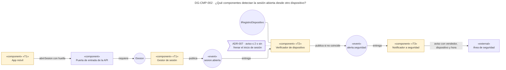

| Marca | ID | Táctica (curso) | Componente | ADR | Precio → cobra a |
|---|---|---|---|---|---|
| T1 | SEG-02 | Autenticar al actor con el dispositivo como parte de su identidad | App móvil (calcula la huella) · Gestor de sesión (la guarda en la sesión) | ADR-007 | Cada cambio legítimo de equipo necesita registro previo → falsas alarmas de ASR-1 |
| T2 | SEG-09 | Detectar intrusiones: comparar la huella de la sesión con la registrada | Verificador de dispositivo | ADR-007 | El tercero opera mientras llega el aviso y hasta que seguridad actúa → usabilidad del vendedor legítimo si hay falsa alarma |
| T3 | SEG-15 | Informar al área de seguridad | Notificador a seguridad | ADR-007 | Ruido de alertas → costo operativo |
| — | MOD-04 | Intermediario de mensajes (los temas «event») | Entre Gestor, Verificador y Notificador | ADR-001 | Un salto más por evento → latencia de ASR-1 |

| STRIDE | Elemento que la mitiga | ID |
|---|---|---|
| S · Suplantación del vendedor | Gestor de sesión (la huella entra en la sesión) · Verificador de dispositivo (la compara) · Notificador (avisa) | SEG-02 · SEG-09 · SEG-15 |

**Qué muestra:** el inicio de sesión no espera la comparación del dispositivo. El Gestor publica el evento y el Verificador decide después, dentro de los 2 s. · **Decisión que refleja:** ADR-007 sobre el estilo por eventos de ADR-001. · **Qué no muestra:** el tendero, que no tiene dispositivo suministrado (R-007a), ni quién usa `IRegistroDispositivo` para registrar un cambio legítimo de equipo, que el ADR deja abierto.

### Por qué se abren estos tres componentes

| ASR | Componente clave | Por qué ese |
|---|---|---|
| ASR-1 | Gestor de sesión | Mete la huella en la sesión y fija t0, el instante desde el que corren los 2 s |
| ASR-1 | Verificador de dispositivo | Compara la huella y decide el aviso; de él dependen la medida y las falsas alarmas |
| ASR-1 | Notificador a seguridad | Entrega el aviso; es el último tramo de los 2 s |

La App móvil queda como caja negra: calcula la huella, pero los identificadores del equipo que la forman siguen sin definir (ver Huecos en la portada).

---

## DG-CST-001 · Gestor de sesión — caja blanca

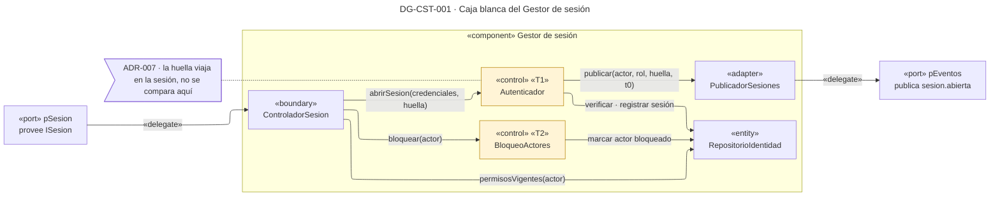

| Marca | ID | Táctica (curso) | Parte | ADR | Precio → cobra a |
|---|---|---|---|---|---|
| T1 | SEG-02 | Autenticar al actor, con la huella del dispositivo dentro de la sesión | Autenticador | ADR-007 | Fricción del cambio de equipo → usabilidad |
| T2 | SEG-14 | Bloquear al actor | BloqueoActores | ADR-010 | Un bloqueo por falsa detección deja por fuera a un usuario legítimo → usabilidad |

| Campo | Contenido |
|---|---|
| Componente | Gestor de sesión · `refina: Gestor de sesión` |
| Responsabilidad | Autenticar, emitir el token con su jti y la huella, bloquear actores y responder los permisos vigentes |
| Interfaces | Provee `ISesion`: `abrirSesion(credenciales, huella)`, `bloquear(actor)`, `permisosVigentes(actor)`. Publica `sesion.abierta` |
| Partes | ControladorSesion «boundary»: recibe las tres operaciones · Autenticador «control»: verifica credenciales y abre la sesión · BloqueoActores «control»: marca al actor · RepositorioIdentidad «entity»: usuarios, permisos, sesiones y actores bloqueados · PublicadorSesiones «adapter»: publica al bróker |
| Operación crítica | `abrirSesion`: fija t0 de ASR-1 y es el único punto donde la huella entra al sistema |
| Tácticas internas | SEG-02 → Autenticador → ADR-007 → cambio legítimo con registro previo → usabilidad · SEG-14 → BloqueoActores → ADR-010 → usuario legítimo bloqueado → usabilidad |
| Datos | RepositorioIdentidad es dueño de actores, permisos y sesiones; su esquema está en DG-CLS-003 |
| Fallos | Si el Gestor no responde, nadie abre sesión y el Detector no puede leer permisos: las escrituras esperan en la cola sin evaluar (R-008a) |
| Qué no se eclosiona | La verificación de credenciales, que no cambia por ninguna decisión del reto |

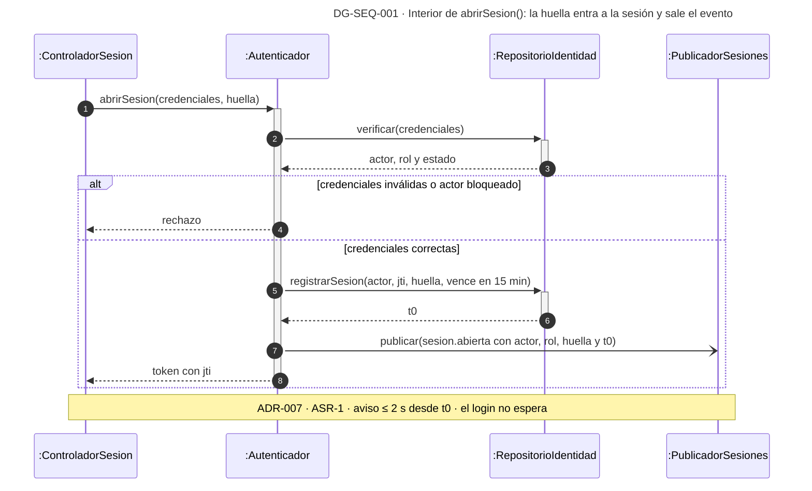

**Qué muestra:** el tercero con credenciales correctas pasa este control, y por eso ASR-1 se resuelve después. El Gestor solo publica la huella; no la compara. · **Decisión que refleja:** ADR-007, que verifica después de abrir la sesión para no bloquear al vendedor legítimo. · **Qué no muestra:** `bloquear` y `permisosVigentes`, que aparecen en DG-SEQ-007 y DG-SEQ-006, ni el ciclo de vida de la sesión, que está en DG-STM-002.

---

## DG-CST-002 · Verificador de dispositivo — caja blanca

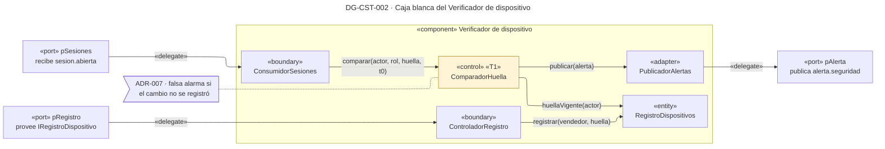

| Marca | ID | Táctica (curso) | Parte | ADR | Precio → cobra a |
|---|---|---|---|---|---|
| T1 | SEG-09 | Detectar intrusiones: huella de la sesión contra la huella vigente del vendedor | ComparadorHuella | ADR-007 | Un cambio de equipo sin registro previo dispara el aviso → ASR-1 (≤ 1 falsa alarma por 100 cambios) |

| Campo | Contenido |
|---|---|
| Componente | Verificador de dispositivo · `refina: Verificador de dispositivo` |
| Responsabilidad | Comparar la huella de cada sesión de vendedor con la registrada y avisar cuando no coincide |
| Interfaces | Recibe `sesion.abierta`. Provee `IRegistroDispositivo`: `registrar(vendedor, huella)`, el camino de registro previo que pide ADR-007. Publica `alerta.seguridad` |
| Partes | ConsumidorSesiones «boundary»: consume del bróker · ComparadorHuella «control»: aplica la regla · RegistroDispositivos «entity»: la huella vigente por vendedor · ControladorRegistro «boundary»: recibe el cambio legítimo · PublicadorAlertas «adapter»: publica al bróker |
| Operación crítica | `comparar`: es la respuesta de ASR-1 |
| Tácticas internas | SEG-09 → ComparadorHuella → ADR-007 → falsa alarma por cambio no registrado → ASR-1 |
| Datos | `DispositivoRegistrado(idVendedor, huella, vigenteDesde, vigenteHasta)`, con una sola fila vigente por vendedor (DG-CLS-003) |
| Fallos | Si el Verificador cae, los eventos esperan en el bróker: el aviso llega tarde, pero ninguna sesión queda sin revisar |
| Qué no se eclosiona | El cálculo de la huella, que hace la App móvil |

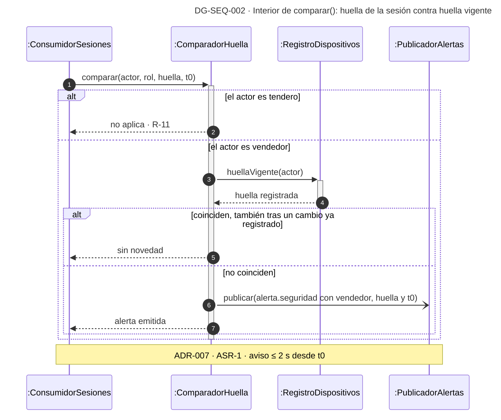

**Qué muestra:** la regla completa de ASR-1, el caso del cambio legítimo que no avisa y el caso que no cubre, el tendero. · **Decisión que refleja:** ADR-007. · **Qué no muestra:** la entrega del aviso, que hace el Notificador a seguridad en DG-SEQ-003.

---

## DG-CST-003 · Notificador a seguridad — caja blanca

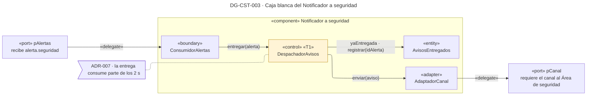

| Marca | ID | Táctica (curso) | Parte | ADR | Precio → cobra a |
|---|---|---|---|---|---|
| T1 | SEG-15 | Informar a los actores: el aviso llega al área de seguridad con vendedor, dispositivo y hora | DespachadorAvisos | ADR-007 · ADR-010 | La entrega es el último tramo de los 2 s → ASR-1. Ruido de alertas → costo operativo |

| Campo | Contenido |
|---|---|
| Componente | Notificador a seguridad · `refina: Notificador a seguridad` |
| Responsabilidad | Entregar al área de seguridad los avisos de ASR-1 y de ASR-2, una sola vez cada uno |
| Interfaces | Recibe `alerta.seguridad` del Verificador y de la Reacción. Requiere el canal hacia el Área de seguridad, que los ADR no definen |
| Partes | ConsumidorAlertas «boundary» · DespachadorAvisos «control»: arma el aviso y decide si se envía · AvisosEntregados «entity»: lo ya entregado · AdaptadorCanal «adapter»: traduce al canal |
| Operación crítica | `entregar`: es el último tramo de la respuesta de ASR-1 y el aviso final de ASR-2 |
| Tácticas internas | SEG-15 → DespachadorAvisos → ADR-007 y ADR-010 → tramo final de los 2 s → ASR-1 |
| Datos | `AvisosEntregados(idAlerta, entregadoEn)`. La clave `idAlerta` evita un aviso doble cuando el bróker reentrega la alerta. Es **propuesta**: ningún ADR decide la deduplicación |
| Fallos | Si el canal no responde, la alerta no se confirma al bróker y vuelve a entregarse |
| Qué no se eclosiona | El canal mismo (correo, mensajería o consola), que es una pregunta abierta |

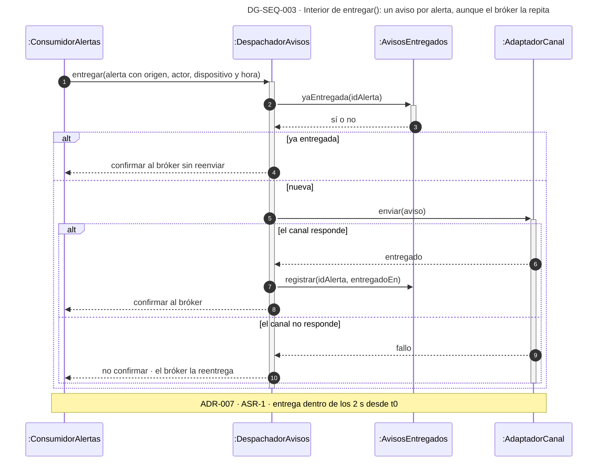

**Qué muestra:** que el aviso se registra después de entregarlo, para que un fallo del canal no lo dé por enviado. · **Decisión que refleja:** la táctica de informar de ADR-007, que ADR-010 reutiliza para el aviso de la reacción. · **Qué no muestra:** el formato del aviso ni el canal, que siguen abiertos.

---

## DG-CMP-003 · ASR-2: la escritura indebida, detectada y revertida

| Tipo | ASR | ADR | Estado | Componentes clave |
|---|---|---|---|---|
| Componentes (N0) | ASR-2 | ADR-001 · ADR-008 · ADR-009 · ADR-010 | propuesta | Inventario · Detector de escrituras indebidas · Reacción ante acceso indebido · Puerta de entrada de la API |

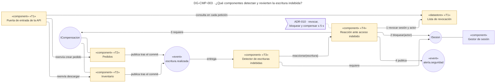

| Marca | ID | Táctica (curso) | Componente | ADR | Precio → cobra a |
|---|---|---|---|---|---|
| T1 | SEG-02 · SEG-13 | Autenticar en el borde y revocar el acceso de la sesión viva | Puerta de entrada · Lista de revocación | ADR-009 | Una consulta por petición y una pieza más en el camino crítico → disponibilidad del borde (R-1) |
| T2 | SEG-18 · DIS-17 · DIS-13 | Bitácora con el estado anterior y evento en la misma transacción; compensación de la escritura | Pedidos · Inventario | ADR-008 · ADR-010 | Dos filas más por escritura → desempeño de la escritura. Una operación inversa por tipo → modificabilidad |
| T3 | SEG-09 | Detectar la escritura contra el permiso vigente, no el del token | Detector de escrituras indebidas | ADR-008 | Una consulta de permisos por escritura → ASR-2 si el Gestor tarda (R-008a) |
| T4 | SEG-13 · SEG-14 · DIS-13 · SEG-15 | Reacción ordenada de menor a mayor costo | Reacción ante acceso indebido | ADR-009 · ADR-010 | La compensación depende de que Pedidos e Inventario respondan → efecto residual de ASR-2 |

| STRIDE | Elemento que la mitiga | ID |
|---|---|---|
| E · Elevación de privilegios | Bitácora en Pedidos e Inventario (evidencia) · Detector (detecta) · Reacción (revoca, bloquea, compensa) · Puerta de entrada (hace efectiva la revocación) | SEG-18 · SEG-09 · SEG-13 · SEG-14 · DIS-13 |

**Qué muestra:** la escritura ya ocurrió cuando empieza el camino. El evento sale en la misma transacción, el Detector lo contrasta con los permisos vigentes y la Reacción corta la sesión en la Puerta de entrada antes de compensar. · **Decisión que refleja:** ADR-008, ADR-009 y ADR-010 sobre el estilo de ADR-001. · **Qué no muestra:** la App móvil y el Notificador, que ya están en DG-CMP-002; aquí el aviso termina en el tema `alerta.seguridad`.

### Por qué se abren estos cuatro componentes

| ASR | Componente clave | Por qué ese |
|---|---|---|
| ASR-2 | Inventario | Produce la escritura, su bitácora y su evento en una transacción, y compensa con una suma. Pedidos sigue la misma receta y queda como caja negra |
| ASR-2 | Detector de escrituras indebidas | Fija t_det, el instante desde el que corren los 5 s |
| ASR-2 | Reacción ante acceso indebido | Ejecuta la respuesta completa: revocar, bloquear, compensar y avisar |
| ASR-2 | Puerta de entrada de la API | Hace efectiva la revocación: sin ella, el token sigue sirviendo 15 min |

---

## DG-CST-004 · Inventario — caja blanca

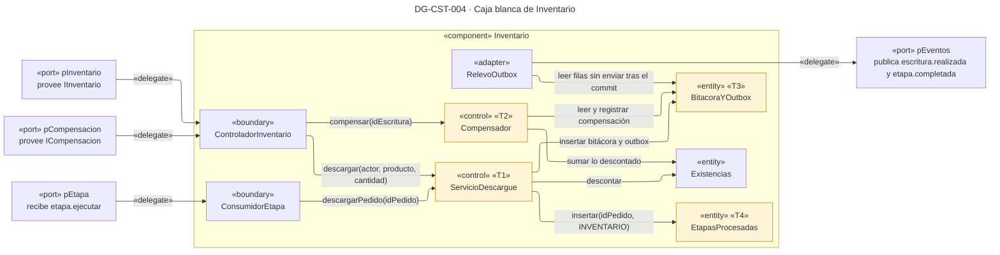

| Marca | ID | Táctica (curso) | Parte | ADR | Precio → cobra a |
|---|---|---|---|---|---|
| T1 | DIS-17 | Transacción local: existencias, bitácora, outbox y etapa procesada se escriben juntas o no se escribe nada | ServicioDescargue | ADR-001 · ADR-008 | Dos filas más en cada transacción → desempeño de la escritura |
| T2 | DIS-13 | Rollback por compensación: sumar lo descontado, sin restaurar la cifra anterior | Compensador | ADR-010 | Una operación inversa por tipo de escritura → modificabilidad |
| T3 | SEG-18 | Registro de auditoría con actor, permiso usado y cantidad aplicada | BitacoraYOutbox | ADR-008 | Escritura extra y almacenamiento → desempeño |
| T4 | DIS-17 | Idempotencia: clave única (idPedido, INVENTARIO) en la misma transacción del descargue | EtapasProcesadas | ADR-005 | Una fila más por pedido → almacenamiento |

| Campo | Contenido |
|---|---|
| Componente | Inventario · `refina: Inventario` |
| Responsabilidad | Llevar las existencias exactas, descargar una sola vez por pedido y compensar un descargue indebido sin borrar los legítimos |
| Interfaces | Provee `IInventario` (`consultar`, `descargar`) e `ICompensacion` (`compensar(idEscritura)`). Recibe `etapa.ejecutar` como segunda etapa de la cadena. Publica `escritura.realizada` y `etapa.completada` |
| Partes | ControladorInventario «boundary» · ConsumidorEtapa «boundary» · ServicioDescargue «control» · Compensador «control» · Existencias «entity» · BitacoraYOutbox «entity»: las dos tablas que se escriben con cada descargue · EtapasProcesadas «entity» · RelevoOutbox «adapter»: publica lo pendiente después del commit |
| Operación crítica | `descargar`: es la escritura que ASR-2 tiene que detectar y revertir. `compensar`: es la reversión |
| Tácticas internas | DIS-17 → ServicioDescargue → ADR-001, ADR-008 → dos filas más → desempeño · DIS-13 → Compensador → ADR-010 → una inversa por tipo → modificabilidad · SEG-18 → BitacoraYOutbox → ADR-008 → escritura extra → desempeño · DIS-17 → EtapasProcesadas → ADR-005 → una fila por pedido → almacenamiento |
| Datos | Existencias con la cifra del momento (R-4). La bitácora guarda la **cantidad aplicada**, que es lo que la compensación suma (DG-CLS-002) |
| Fallos | Si el servicio cae entre el commit y la publicación, el relevo publica al volver: ninguna escritura queda sin evento |
| Qué no se eclosiona | Pedidos, que sigue la misma receta: bitácora y outbox en la transacción, y anulación como compensación |

**Aviso del lint justificado (AP-09, 14 elementos).** Inventario aloja cuatro tácticas de tres ADR. Partir la caja blanca separaría las cuatro filas que comparten una sola transacción, que es justamente lo que la decisión garantiza. Por eso la nota del ADR pasó a la tabla.

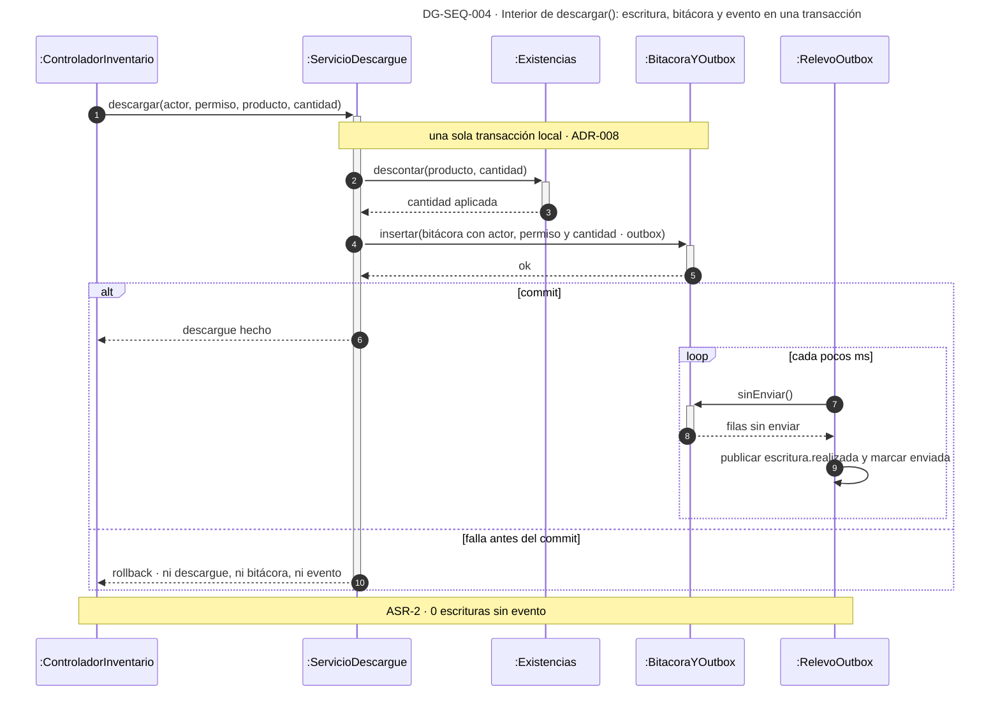

**Qué muestra:** por qué ninguna escritura se le escapa al Detector: el evento nace en la misma transacción que la escritura. · **Decisión que refleja:** ADR-008 sobre la transacción local de ADR-001. · **Qué no muestra:** el descargue que ordena la cadena, que sigue la misma forma con la clave `(idPedido, INVENTARIO)` de DG-SEQ-012.

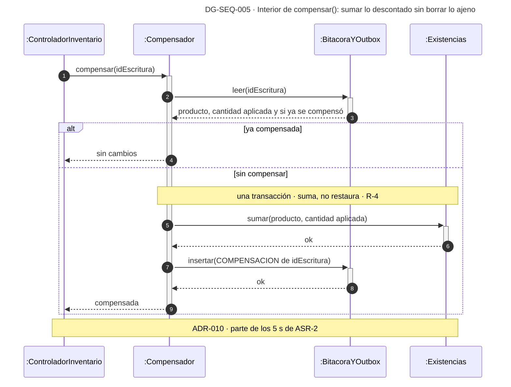

**Qué muestra:** por qué compensar conserva los descargues legítimos que llegaron después de la escritura indebida. · **Decisión que refleja:** ADR-010, que descarta restaurar la cifra anterior porque violaría R-4. · **Qué no muestra:** la compensación de un pedido cuya cadena ya emitió factura o descargue, que ningún ADR resuelve (R-010a).

---

## DG-CST-005 · Detector de escrituras indebidas — caja blanca

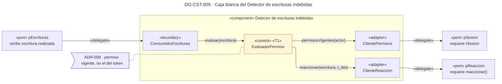

| Marca | ID | Táctica (curso) | Parte | ADR | Precio → cobra a |
|---|---|---|---|---|---|
| T1 | SEG-09 | Detectar intrusiones: cada escritura contra los permisos vigentes del actor | EvaluadorPermiso | ADR-008 | Una consulta de permisos por escritura; si el Gestor no responde, la detección se retrasa → ASR-2 (R-008a) |

| Campo | Contenido |
|---|---|
| Componente | Detector de escrituras indebidas · `refina: Detector de escrituras indebidas` |
| Responsabilidad | Contrastar cada escritura publicada con los permisos vigentes de su actor y disparar la reacción cuando no los tenía |
| Interfaces | Recibe `escritura.realizada`. Requiere `ISesion` (`permisosVigentes`) y la operación `reaccionar` de la Reacción, que en DG-CMP-003 es la dependencia directa entre los dos |
| Partes | ConsumidorEscrituras «boundary» · EvaluadorPermiso «control» · ClientePermisos y ClienteReaccion «adapter» |
| Operación crítica | `evaluar`: fija t_det, el instante desde el que corren los 5 s de ASR-2 |
| Tácticas internas | SEG-09 → EvaluadorPermiso → ADR-008 → una consulta por escritura → ASR-2 (R-008a) |
| Datos | Ninguno. No guarda caché de permisos, así que un permiso recién quitado se ve en la escritura siguiente (NR-008a) |
| Fallos | Si el Gestor de sesión no responde, el evento no se confirma y vuelve a la cola sin evaluar |
| Qué no se eclosiona | Nada: las cuatro partes son el componente entero |

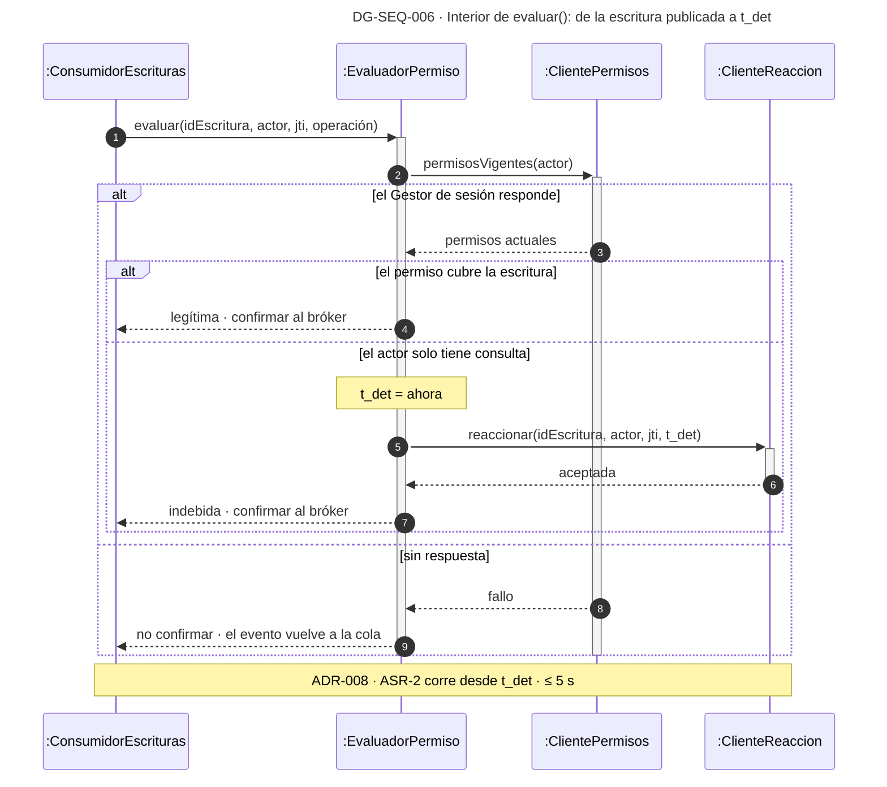

**Qué muestra:** dónde nace t_det y qué pasa con la escritura cuando el Gestor de sesión no contesta. · **Decisión que refleja:** ADR-008, que decide contra el permiso vigente y no contra el del token. · **Qué no muestra:** el control preventivo de permisos, que sigue existiendo en cada servicio y que ASR-2 supone fallido.

---

## DG-CST-006 · Reacción ante acceso indebido — caja blanca

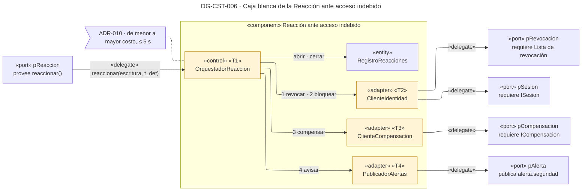

| Marca | ID | Táctica (curso) | Parte | ADR | Precio → cobra a |
|---|---|---|---|---|---|
| T1 | SEG-13 · SEG-14 · DIS-13 · SEG-15 | Reacción ordenada: revocar, bloquear, compensar y avisar, en ese orden | OrquestadorReaccion | ADR-010 | Si la compensación falla, el efecto residual puede pasar de 60 s → ASR-2 |
| T2 | SEG-13 · SEG-14 | Revocar la sesión y el actor en la Lista; bloquear al actor en el Gestor | ClienteIdentidad | ADR-009 · ADR-010 | Un usuario legítimo afectado por una falsa detección → usabilidad |
| T3 | DIS-13 | Pedir la compensación al dueño de la escritura | ClienteCompensacion | ADR-010 | Depende de que Pedidos e Inventario respondan → ASR-2 |
| T4 | SEG-15 | Informar a seguridad, con la reacción completa o con la reversión pendiente | PublicadorAlertas | ADR-010 | Ruido de alertas → costo operativo |

| Campo | Contenido |
|---|---|
| Componente | Reacción ante acceso indebido · `refina: Reacción ante acceso indebido` |
| Responsabilidad | Revocar la sesión, bloquear al actor, compensar la escritura y avisar a seguridad, en ese orden y dentro de 5 s |
| Interfaces | Provee `reaccionar`. Requiere la Lista de revocación, `ISesion` (`bloquear`) e `ICompensacion`. Publica `alerta.seguridad` |
| Partes | OrquestadorReaccion «control», que atiende el puerto directamente · RegistroReacciones «entity» · ClienteIdentidad, ClienteCompensacion y PublicadorAlertas «adapter» |
| Operación crítica | `reaccionar`: es la respuesta completa de ASR-2 |
| Tácticas internas | SEG-13, SEG-14, DIS-13 y SEG-15 → OrquestadorReaccion y sus tres adaptadores → ADR-009 y ADR-010. Revocar primero corta las escrituras siguientes en milisegundos; compensar es lo más lento y va al final |
| Datos | `Reaccion(idEscritura, tDet, revocadaEn, bloqueadaEn, compensadaEn, estado)`. La clave `idEscritura` impide reaccionar dos veces a la misma escritura (NR-010a) |
| Fallos | Si la compensación falla, la sesión ya está revocada y el actor bloqueado; el aviso sale con la reversión pendiente |
| Qué no se eclosiona | Nada: las cinco partes son el componente entero |

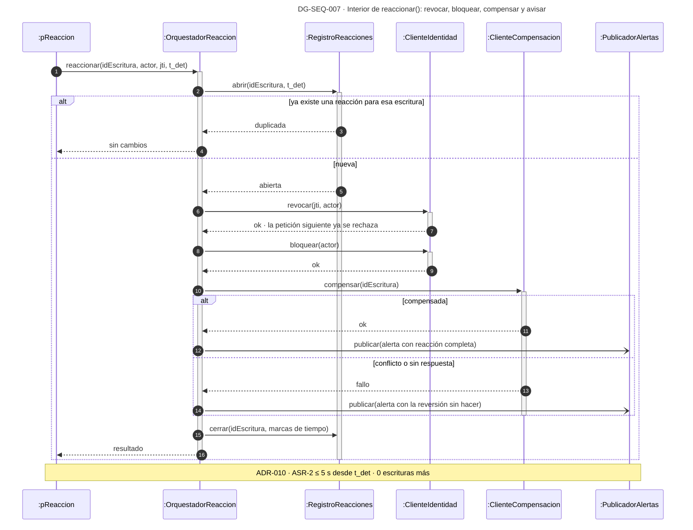

**Qué muestra:** cómo se reparten los 5 s y qué queda garantizado aunque la compensación falle. · **Decisión que refleja:** ADR-009 (revocar en la Lista) y ADR-010 (el orden de la reacción y la compensación). · **Qué no muestra:** cómo compensa cada servicio, que está en DG-SEQ-005.

---

## DG-CST-007 · Puerta de entrada de la API — caja blanca

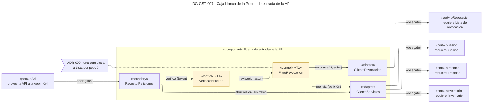

| Marca | ID | Táctica (curso) | Parte | ADR | Precio → cobra a |
|---|---|---|---|---|---|
| T1 | SEG-02 | Autenticar en el borde: firma y vencimiento del token en cada petición | VerificadorToken | ADR-009 | Latencia por petición → desempeño |
| T2 | SEG-13 | Revocar el acceso: la sesión o el actor revocados no pasan, aunque el token siga vigente | FiltroRevocacion | ADR-009 | Una consulta por petición, y la Lista queda en el camino crítico → disponibilidad del borde (R-1, TO-009a) |

| Campo | Contenido |
|---|---|
| Componente | Puerta de entrada de la API · `refina: Puerta de entrada de la API` |
| Responsabilidad | Recibir toda petición de la App, verificar el token, cortar la sesión revocada y reenviar lo demás al servicio que corresponde |
| Interfaces | Provee la API a la App móvil. Requiere la Lista de revocación, `ISesion`, `IPedidos` e `IInventario` |
| Partes | ReceptorPeticiones «boundary» · VerificadorToken «control» · FiltroRevocacion «control» · ClienteRevocacion «adapter» · ClienteServicios «adapter»: enruta al servicio destino |
| Operación crítica | `atender(petición)`: es el punto donde la revocación se vuelve cero escrituras posteriores |
| Tácticas internas | SEG-02 → VerificadorToken → ADR-009 → latencia → desempeño · SEG-13 → FiltroRevocacion → ADR-009 → Lista en el camino crítico → disponibilidad del borde |
| Datos | Ninguno propio: el estado de revocación vive en la Lista, fuera de la Puerta |
| Fallos | Si la Lista no responde, el equipo no ha decidido si la Puerta rechaza todo o deja pasar (TO-009a). El diagrama no dibuja ese camino hasta que un ADR lo decida |
| Qué no se eclosiona | El enrutamiento por servicio, que ninguna decisión del reto cambia |

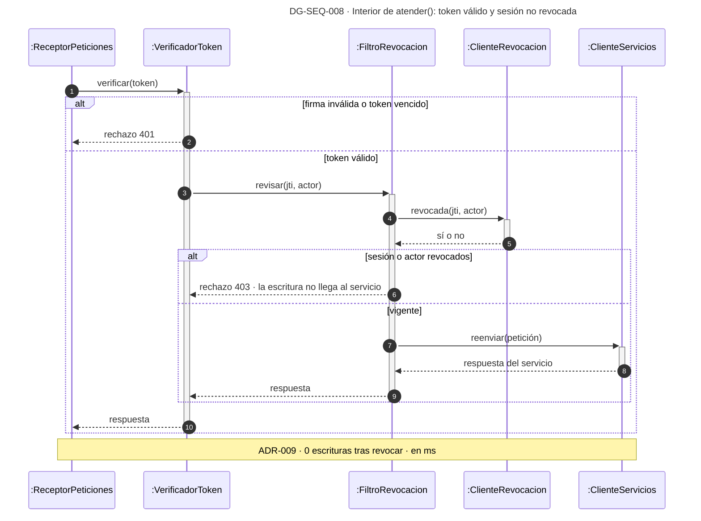

**Qué muestra:** por qué la revocación de la Reacción alcanza a todos los servicios: toda petición pasa por el filtro. · **Decisión que refleja:** ADR-009, que descarta los tokens de vida corta y la consulta al Gestor en cada petición. · **Qué no muestra:** el camino de la Lista caída, que sigue sin decidir.

---

## DG-CMP-004 · ASR-3 y ASR-4: la cadena del pedido detenida y su reanudación

| Tipo | ASR | ADR | Estado | Componentes clave |
|---|---|---|---|---|
| Componentes (N0) | ASR-3 · ASR-4 | ADR-001 a ADR-006 | propuesta | Coordinador de la cadena · Monitor de la cadena · Facturación |

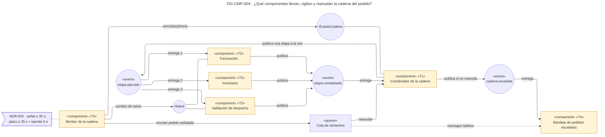

| Marca | ID | Táctica (curso) | Componente | ADR | Precio → cobra a |
|---|---|---|---|---|---|
| T1 | INT-08 · DIS-15 · INT-10 · DIS-12 | Orquestar con estado por pedido y etapa, en orden, y reintentar una sola vez la etapa pendiente | Coordinador de la cadena | ADR-002 · ADR-003 · ADR-006 | Punto central: si cae, ninguna cadena avanza → ASR-4 (R-002a). La cadena dura la suma de las tres etapas (R-003a) |
| T2 | DIS-17 | Idempotencia por (idPedido, etapa) | Facturación · Inventario · Validación de despacho | ADR-005 | Una fila más por pedido y etapa, y una disciplina que toda etapa nueva debe cumplir (R-005a) |
| T3 | DIS-04 · DIS-03 · DIS-01 | Plazo vencido por pedido, monitor que barre y sondeo de salud de apoyo | Monitor de la cadena | ADR-004 | Plazo por calibrar → falsas alarmas de ASR-3 (TO-004a). Punto único → ASR-3 (R-004a) |
| T4 | DIS-14 | Degradación con gracia: lo que no se reanuda llega a una persona | Bandeja de pedidos escalados | ADR-006 | Carga manual sin cifra → usabilidad del responsable (R-006a) |
| — | MOD-04 | Intermediario durable: el comando pendiente sobrevive a la caída de la etapa | Temas y Cola de reintentos | ADR-001 | Pieza común de los cuatro caminos (R-001a) |

**Qué muestra:** la cadena corre por eventos y en orden. El Coordinador guarda el estado y el Monitor lo lee desde afuera. Lo que el reintento no resuelve termina en la Bandeja, por el tema o por los mensajes fallidos de la Cola. · **Decisión que refleja:** ADR-001 a ADR-006. · **Qué no muestra:** Pedidos, que arranca la cadena llamando a `IEstadoCadena`, y Logística, que recibe `pedido.listo`; los dos están en el panorama.

**Aviso del lint justificado (AP-09, 13 elementos).** El diagrama cubre dos ASR que comparten la misma cadena. Partirlo duplicaría el Coordinador, los dos temas y las tres etapas.

### Por qué se abren estos tres componentes

| ASR | Componente clave | Por qué ese |
|---|---|---|
| ASR-3 | Monitor de la cadena | Es el único que nota la cadena detenida; de su barrido salen los 30 s |
| ASR-3, ASR-4 | Coordinador de la cadena | Guarda el plazo que el Monitor revisa, reanuda la etapa pendiente o escala; de él dependen los 5 s |
| ASR-4 | Facturación | Es la etapa que muestra la idempotencia de ADR-005. Inventario ya se abrió arriba, y Validación de despacho sigue la misma receta, así que queda como caja negra |

La Bandeja de pedidos escalados queda como caja negra: guarda el pedido escalado y se lo muestra a una persona, y ninguna táctica vive dentro de ella.

---

## DG-CST-008 · Coordinador de la cadena — caja blanca

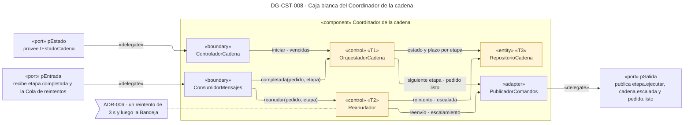

| Marca | ID | Táctica (curso) | Parte | ADR | Precio → cobra a |
|---|---|---|---|---|---|
| T1 | INT-08 · INT-10 | Orquestación con un protocolo de comportamiento: facturación, descargue y despacho, cada una al confirmarse la anterior | OrquestadorCadena | ADR-002 · ADR-003 | Punto central → ASR-4 (R-002a). La cadena dura la suma de las etapas → los 25 s que deja S-7 (R-003a) |
| T2 | DIS-12 · DIS-14 | Un solo reintento de la etapa pendiente, sin espera creciente, y escalamiento a una persona | Reanudador | ADR-006 | Las detenciones transitorias llegan a una persona → usabilidad del responsable (R-006a) |
| T3 | DIS-15 | Log de transacciones: una fila por pedido y etapa con su estado, su intento y su plazo | RepositorioCadena | ADR-002 | Dos escrituras más por etapa → desempeño |

| Campo | Contenido |
|---|---|
| Componente | Coordinador de la cadena · `refina: Coordinador de la cadena` |
| Responsabilidad | Llevar cada pedido por sus tres etapas en orden, saber en cuál está y desde cuándo, y reanudarla una vez si se detuvo |
| Interfaces | Provee `IEstadoCadena`: `iniciar(idPedido)`, `vencidas(ahora)`, `terminar(idPedido)` y `cancelar(idPedido)`. Recibe `etapa.completada` y los mensajes de la Cola de reintentos. Publica `etapa.ejecutar`, `cadena.escalada` y `pedido.listo` |
| Partes | ControladorCadena y ConsumidorMensajes «boundary» · OrquestadorCadena y Reanudador «control» · RepositorioCadena «entity» · PublicadorComandos «adapter» |
| Operación crítica | `completada` lleva la cadena en orden (DG-SEQ-009). `reanudar` es la respuesta de ASR-4 (DG-SEQ-010) |
| Tácticas internas | INT-08 e INT-10 → OrquestadorCadena → ADR-002 y ADR-003 → punto central y duración en serie · DIS-12 y DIS-14 → Reanudador → ADR-006 → carga manual · DIS-15 → RepositorioCadena → ADR-002 → dos escrituras por etapa |
| Datos | `CadenaEtapa(idPedido, etapa, estado, intento, iniciadaEn, plazoEn)`, con índice por estado y plazo (DG-CLS-001). El ciclo de vida de cada fila está en DG-STM-001 |
| Fallos | Si el Coordinador cae con un reintento programado, el Monitor encuentra la etapa EN_REINTENTO vencida en su siguiente barrido y el Reanudador la escala al volver (R-002a) |
| Qué no se eclosiona | La consulta de la bandeja y la terminación a mano de HU-14, que pasan por `terminar` y `cancelar` |

```mermaid
---
title: "DG-SEQ-009 · Interior de completada(): la siguiente etapa, en orden y con su plazo"
config:
  theme: default
  look: classic
---
%% id: DG-SEQ-009 | tipo: secuencia-interna | refina: Coordinador de la cadena | asr: [ASR-3, ASR-4] | adr: [ADR-002, ADR-003] | estado: propuesta
sequenceDiagram
    autonumber
    participant CON as :ConsumidorMensajes
    participant ORQ as :OrquestadorCadena
    participant EST as :RepositorioCadena
    participant PUB as :PublicadorComandos
    CON->>+ORQ: completada(idPedido, etapa)
    ORQ->>+EST: marcarCompletada(idPedido, etapa) si sigue en curso
    alt la fila cambió
        EST-->>ORQ: siguiente etapa del orden
        alt quedan etapas
            ORQ->>EST: marcarEnCurso(siguiente, plazoEn = ahora + plazo)
            ORQ-)PUB: publicar(etapa.ejecutar solo para la siguiente)
        else las tres completadas
            ORQ-)PUB: publicar(pedido.listo)
        end
    else la fila ya no estaba en curso
        EST-->>ORQ: sin cambio · confirmación repetida o tardía
    end
    deactivate EST
    ORQ-->>CON: confirmar al bróker
    deactivate ORQ
    Note over CON,PUB: ADR-003 · una sola etapa en curso · plazo ≤ 25 s
```

**Qué muestra:** por qué nunca hay dos etapas pendientes a la vez y dónde nace el plazo que el Monitor revisa. · **Decisión que refleja:** ADR-002 (el estado por etapa) y ADR-003 (el orden). · **Qué no muestra:** qué hacer con una confirmación que llega después de escalar el pedido; ningún ADR lo decide (ver Huecos).

```mermaid
---
title: "DG-SEQ-010 · Interior de reanudar(): un reintento de la etapa detenida o escalamiento"
config:
  theme: default
  look: classic
---
%% id: DG-SEQ-010 | tipo: secuencia-interna | refina: Coordinador de la cadena | asr: [ASR-4] | adr: [ADR-005, ADR-006] | estado: propuesta
sequenceDiagram
    autonumber
    participant CON as :ConsumidorMensajes
    participant REA as :Reanudador
    participant EST as :RepositorioCadena
    participant PUB as :PublicadorComandos
    CON->>+REA: reanudar(idPedido, etapa)
    REA->>+EST: leer(idPedido, etapa)
    EST-->>-REA: estado y plazo
    alt ya COMPLETADA
        REA-->>CON: nada que hacer
    else EN_CURSO con plazo vencido
        REA->>+EST: marcarReintento(plazoEn = ahora + 3 s)
        EST-->>-REA: ok
        REA-)PUB: publicar(etapa.ejecutar solo para esa etapa)
        REA-->>CON: confirmar al bróker
        REA->>+EST: leer(idPedido, etapa) a los 3 s
        EST-->>-REA: estado
        opt sigue EN_REINTENTO
            REA->>EST: marcarEscalada(etapa y motivo) si sigue EN_REINTENTO
            REA-)PUB: publicar(cadena.escalada)
        end
    else EN_REINTENTO vencido tras una caída
        REA->>EST: marcarEscalada(etapa y motivo)
        REA-)PUB: publicar(cadena.escalada)
        REA-->>CON: confirmar al bróker
    end
    deactivate REA
    Note over CON,PUB: ADR-006 · reanudada o escalada ≤ 5 s desde la señal
```

**Qué muestra:** por qué cabe un solo reintento en 5 s: 3 s de espera más la publicación. Reenviar la etapa no duplica nada, porque cada etapa es idempotente (ADR-005). · **Decisión que refleja:** ADR-006. · **Qué no muestra:** la carrera entre la confirmación tardía de la etapa y el escalamiento, que está en DG-CON-002.

---

## DG-CST-009 · Monitor de la cadena — caja blanca

```mermaid
---
title: "DG-CST-009 · Caja blanca del Monitor de la cadena"
config:
  layout: elk
  theme: default
  look: classic
---
%% id: DG-CST-009 | tipo: componente-interno | refina: Monitor de la cadena | asr: [ASR-3] | adr: [ADR-004, ADR-006] | estado: propuesta
%% leyenda: documento
flowchart LR
    subgraph MON["«component» Monitor de la cadena"]
        BAR["«control» «T1»<br/>BarridoPlazos"]
        SON["«control» «T2»<br/>SondeoSalud"]
        SEN["«entity»<br/>RegistroSenales"]
        CCA["«adapter»<br/>ClienteCadena"]
        CSA["«adapter»<br/>ClienteSalud"]
        PUB["«adapter»<br/>PublicadorReintentos"]
    end
    PEST["«port» pEstado<br/>requiere IEstadoCadena"]
    PSAL["«port» pSalud<br/>requiere ISalud"]
    PCOL["«port» pReintentos<br/>encola en la Cola de reintentos"]

    BAR -- "vencidas(ahora) cada 5 s" --> CCA
    BAR -- "registrar(pedido, etapa, intento)" --> SEN
    BAR -- "encolar(pedido, etapa)" --> PUB
    SON -- "salud(etapa) cada 5 s" --> CSA
    SON -- "adelantar(etapa caída)" --> BAR
    CCA -- "«delegate»" --> PEST
    CSA -- "«delegate»" --> PSAL
    PUB -- "«delegate»" --> PCOL

    N1>"ADR-004 · el sondeo no ve el pedido quieto"]
    N1 -.- SON
    classDef tactica fill:#fff4d6,stroke:#b8860b
    class BAR,SON tactica
```

| Marca | ID | Táctica (curso) | Parte | ADR | Precio → cobra a |
|---|---|---|---|---|---|
| T1 | DIS-04 · DIS-03 | Plazo vencido por pedido y etapa, encontrado por un monitor que barre cada 5 s | BarridoPlazos | ADR-004 | Plazo corto da falsas alarmas y plazo largo incumple → ASR-3 (TO-004a). El Monitor también cae → ASR-3 (R-004a) |
| T2 | DIS-01 | Sondeo de salud de las etapas, solo como apoyo | SondeoSalud | ADR-004 | Tráfico de sondeo, y no detecta la omisión que describe ASR-3 → desempeño |

| Campo | Contenido |
|---|---|
| Componente | Monitor de la cadena · `refina: Monitor de la cadena` |
| Responsabilidad | Encontrar las etapas que pasaron su plazo sin avanzar, señalar cada pedido una sola vez por intento y encolarlo para reanudar |
| Interfaces | Requiere `IEstadoCadena` (`vencidas`) e `ISalud` de Facturación y Validación de despacho. Encola en la Cola de reintentos |
| Partes | BarridoPlazos y SondeoSalud «control», los dos programados cada 5 s · RegistroSenales «entity» · ClienteCadena, ClienteSalud y PublicadorReintentos «adapter». No tiene boundary: nadie lo llama, se despierta solo |
| Operación crítica | El barrido: es la respuesta de ASR-3 |
| Tácticas internas | DIS-04 y DIS-03 → BarridoPlazos → ADR-004 → plazo por calibrar y punto único → ASR-3 · DIS-01 → SondeoSalud → ADR-004 → no ve el pedido quieto → desempeño |
| Datos | `Senal(idPedido, etapa, intento, detectadaEn)`, con clave única en los tres primeros campos (NR-004a) |
| Fallos | Si el Monitor cae, nadie detecta nada (R-004a) |
| Qué no se eclosiona | Nada: las seis partes son el componente entero |

**Sobre el nombre de la táctica de apoyo.** ADR-004 la llama *heartbeat*. En el catálogo del curso, el heartbeat (DIS-02) lo emite el vigilado. Aquí es el Monitor el que pregunta a cada etapa, y eso es ping/echo (DIS-01). El diagrama usa DIS-01; el ADR debería corregir el nombre.

```mermaid
---
title: "DG-SEQ-011 · Interior del barrido: de la etapa vencida a la señal"
config:
  theme: default
  look: classic
---
%% id: DG-SEQ-011 | tipo: secuencia-interna | refina: Monitor de la cadena | asr: [ASR-3] | adr: [ADR-004] | estado: propuesta
sequenceDiagram
    autonumber
    participant SON as :SondeoSalud
    participant BAR as :BarridoPlazos
    participant CCA as :ClienteCadena
    participant SEN as :RegistroSenales
    participant PUB as :PublicadorReintentos
    loop cada 5 s
        BAR->>+CCA: vencidas(ahora)
        CCA-->>-BAR: etapas en curso con plazo vencido
        loop por cada etapa vencida
            BAR->>+SEN: registrar(idPedido, etapa, intento)
            alt señal nueva
                SEN-->>BAR: registrada con detectadaEn
                BAR-)PUB: encolar(idPedido, etapa)
            else ya señalada en este intento
                SEN-->>BAR: duplicada
            end
            deactivate SEN
        end
    end
    opt la etapa no responde a k sondeos seguidos
        SON->>BAR: adelantar(etapa)
    end
    Note over SON,PUB: ADR-004 · ASR-3 · señal ≤ 30 s · ≤ 1 falsa alarma por hora
```

**Qué muestra:** de dónde salen los 30 s: el plazo de la etapa, de hasta 25 s, más un barrido de 5 s. · **Decisión que refleja:** ADR-004. · **Qué no muestra:** el valor del plazo de cada etapa ni el número k de sondeos, que dependen de mediciones que no existen todavía.

---

## DG-CST-010 · Facturación — caja blanca

```mermaid
---
title: "DG-CST-010 · Caja blanca de Facturación"
config:
  layout: elk
  theme: default
  look: classic
---
%% id: DG-CST-010 | tipo: componente-interno | refina: Facturación | asr: [ASR-4] | adr: [ADR-004, ADR-005] | estado: propuesta
%% leyenda: documento
flowchart LR
    PCMD["«port» pComandos<br/>recibe etapa.ejecutar"]
    PSAL["«port» pSalud<br/>provee ISalud"]
    subgraph FAC["«component» Facturación"]
        CON["«boundary»<br/>ConsumidorComandos"]
        EMI["«control» «T1»<br/>EmisorFactura"]
        ETP["«entity» «T1»<br/>EtapasProcesadas"]
        FCT["«entity»<br/>Facturas"]
        PUB["«adapter»<br/>PublicadorResultados"]
        SAL["«boundary»<br/>ControladorSalud"]
    end
    PRES["«port» pResultados<br/>publica etapa.completada"]

    PCMD -- "«delegate»" --> CON
    CON -- "ejecutar(idPedido)" --> EMI
    EMI -- "insertar(idPedido, FACTURACION)" --> ETP
    EMI -- "emitir(idPedido)" --> FCT
    EMI -- "publicar tras el commit" --> PUB
    PUB -- "«delegate»" --> PRES
    PSAL -- "«delegate»" --> SAL

    N1>"ADR-005 · clave única en la transacción de la factura"]
    N1 -.- ETP
    classDef tactica fill:#fff4d6,stroke:#b8860b
    class EMI,ETP tactica
```

| Marca | ID | Táctica (curso) | Parte | ADR | Precio → cobra a |
|---|---|---|---|---|---|
| T1 | DIS-17 | Transacción con clave única (idPedido, FACTURACION): la fila y la factura se escriben juntas | EmisorFactura · EtapasProcesadas | ADR-005 | Una fila más por pedido y una disciplina que toda etapa nueva debe cumplir → modificabilidad (R-005a) |

| Campo | Contenido |
|---|---|
| Componente | Facturación · `refina: Facturación` |
| Responsabilidad | Emitir la factura o el documento de cobro diferido, una sola vez por pedido, y confirmar la etapa |
| Interfaces | Recibe `etapa.ejecutar`. Publica `etapa.completada`. Provee `ISalud` para el sondeo del Monitor |
| Partes | ConsumidorComandos «boundary» · EmisorFactura «control» · EtapasProcesadas «entity» · Facturas «entity» · PublicadorResultados «adapter» · ControladorSalud «boundary» |
| Operación crítica | `ejecutar`: es donde ASR-4 exige cero facturas duplicadas cuando la etapa se reenvía |
| Tácticas internas | DIS-17 → EmisorFactura y EtapasProcesadas → ADR-005 → una fila más por pedido → modificabilidad |
| Datos | `EtapaProcesada(idPedido, etapa)` con clave única, en la misma base que `Factura` (DG-CLS-001) |
| Fallos | Si la instancia cae después del commit y antes de publicar, el reintento del Coordinador llega a una clave que ya existe: no se emite otra factura y se vuelve a confirmar |
| Qué no se eclosiona | El cálculo de la factura, que ninguna decisión del reto cambia. Validación de despacho tiene la misma forma, con la orden de despacho en lugar de la factura |

```mermaid
---
title: "DG-SEQ-012 · Interior de ejecutar(): una sola factura por pedido, aunque el comando se repita"
config:
  theme: default
  look: classic
---
%% id: DG-SEQ-012 | tipo: secuencia-interna | refina: Facturación | asr: [ASR-4] | adr: [ADR-005] | estado: propuesta
sequenceDiagram
    autonumber
    participant CON as :ConsumidorComandos
    participant EMI as :EmisorFactura
    participant ETP as :EtapasProcesadas
    participant FCT as :Facturas
    participant PUB as :PublicadorResultados
    CON->>+EMI: ejecutar(idPedido, FACTURACION)
    Note over EMI,FCT: una transacción local · ADR-005
    EMI->>+ETP: insertar(idPedido, FACTURACION)
    alt clave nueva
        ETP-->>EMI: insertada
        EMI->>+FCT: emitir(idPedido)
        FCT-->>-EMI: factura
    else la clave ya existe
        ETP-->>EMI: duplicada · no se emite otra factura
    end
    deactivate ETP
    EMI-)PUB: publicar(etapa.completada) tras el commit
    EMI-->>CON: confirmar al bróker
    deactivate EMI
    opt la instancia cae tras el commit y antes de publicar
        Note over CON,PUB: el reintento cae en la clave que ya existe
    end
    Note over CON,PUB: ASR-4 · 0 duplicados dentro de los 5 s del reintento
```

**Qué muestra:** el caso que ASR-4 teme: la etapa produjo su efecto y cayó antes de confirmarlo. El reenvío se encuentra con la clave y solo confirma. · **Decisión que refleja:** ADR-005, que descarta preguntar al Coordinador antes de reenviar. · **Qué no muestra:** la factura emitida en un sistema externo, que rompería la atomicidad y sigue como pregunta abierta (NR-005a).
