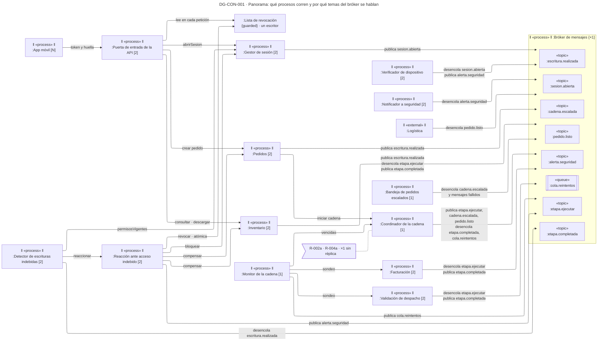
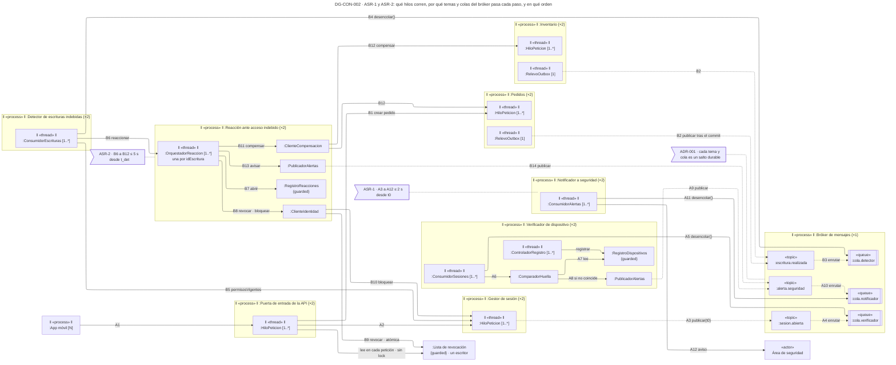

# Vista de concurrencia — Reto 2 CCP (v7)

Esta página profundiza la [vista de componentes](vista-componentes.md). Mantiene los mismos componentes, con los mismos nombres y en el mismo lugar, y agrega lo que la vista de componentes no muestra: qué proceso corre cada componente y cuántas instancias tiene, qué hilos corren dentro de él, por qué tema y por qué cola del bróker pasa cada mensaje, qué estado comparten los hilos y en qué orden avanza cada flujo.

**Estado: propuesta.** Los diez ADR de [adrs-ccp-reto2.md](adrs-ccp-reto2.md) están en estado Propuesta. La portada de los diagramas, con la matriz de trazabilidad y los huecos, está en [diagramas-ccp-reto2.md](diagramas-ccp-reto2.md). Las instancias de cada proceso salen de la [vista de despliegue](vista-despliegue.md).

**Fuente: draw.io.** El original es [vista-concurrencia.drawio](https://app.diagrams.net/#Uhttps%3A%2F%2Fraw.githubusercontent.com%2FMATI-MBIT%2Farqsoft-reto-2%2Fmain%2Fdocs%2Fmodelos%2Fdrawio%2Fvista-concurrencia.drawio), que se abre en draw.io web ([descargar](drawio/vista-concurrencia.drawio)), con una pestaña por diagrama. La imagen de cada sección se exporta de ese archivo, y el bloque Mermaid que la sigue es una copia que sale del mismo modelo.

## Cómo leer esta página

| Diagrama | Profundiza | Qué responde | ASR · ADR |
|---|---|---|---|
| DG-CON-001 | DG-CMP-001 | Qué procesos corren, cuántas instancias tiene cada uno y qué publica o desencola cada uno en el bróker | ASR-1 a ASR-4 · ADR-001 a ADR-010 |
| DG-CON-002 | DG-CMP-002 | Qué hilos corren en la sesión y en la escritura, por qué tema y cola pasa cada paso, y en qué orden | ASR-1, ASR-2 · ADR-001, ADR-007 a ADR-010 |
| DG-CON-003 | DG-CMP-003 | Qué hilos llevan, vigilan y reanudan la cadena, por qué tema y cola pasa cada paso, y en qué orden | ASR-3, ASR-4 · ADR-001 a ADR-006 |

## De la vista de componentes a la de concurrencia

| En la vista de componentes | En esta vista |
|---|---|
| «component» Gestor de sesión | ‖ «process» ‖ `:Gestor de sesión [2]`: el proceso que lo corre, con sus instancias |
| Parte con hilo propio (ConsumidorSesiones, Reanudador, BarridoPlazos…) | ‖ «thread» ‖ `:ConsumidorSesiones [1..*]` dentro de su proceso, con el tamaño del pool |
| Parte sin hilo propio (ComparadorHuella, ClienteIdentidad…) | Objeto pasivo `:ComparadorHuella`: corre en el hilo de quien lo llama |
| Parte que guarda estado (RegistroDispositivos, RepositorioCadena…) | Objeto `{guarded}` en amarillo: estado que tocan varios hilos |
| Tema «event» `sesion.abierta` | «topic» `:sesion.abierta` y una «queue» por suscriptor (`:cola.verificador`), dentro de `:Bróker de mensajes [1]` |
| Interfaz y puerto (`ICompensacion`, `pReaccion`…) | Llamada directa al hilo que la atiende: la vista de concurrencia no dibuja puertos |
| Arista sin orden | Mensaje numerado en el orden del flujo |

## Leyenda

| Notación | Significado |
|---|---|
| Rectángulo con doble barra lateral · `‖ «process» ‖` y `‖ «thread» ‖` en Mermaid | Objeto activo: tiene su propio hilo de control. «process» es un programa en ejecución; «thread», un hilo o un grupo de hilos dentro de él |
| `:Nombre` subrayado | Instancia del componente o de la parte, con el mismo nombre que en la vista de componentes. Mermaid no subraya |
| `[1]`, `[2]`, `[N]`, `[1..*]` | Cuántas instancias corren a la vez: del proceso, en el despliegue; del hilo, en el pool |
| «topic» | Tema del bróker: recibe lo que se publica y lo copia a una cola por suscriptor |
| «queue» | Cola durable del bróker. Guarda cada mensaje hasta que su consumidor lo confirma |
| `{guarded}` · amarillo | Estado compartido entre hilos; la tabla de cada diagrama dice cómo se protege |
| Flecha continua | Llamada: el hilo de origen llama y espera. `desencolar()` va del consumidor a la cola, porque es el consumidor quien la llama |
| Flecha discontinua | Publicación o enrutamiento asíncrono: quien publica no espera |
| Flecha discontinua roja | Mensaje que no se pudo procesar y va a la cola de fallidos |
| A1, B1, 1, R1… | Orden del flujo. Una flecha sin número no es un paso: ocurre en cada petición o a su propio ritmo |
| Arco en un cruce | Dos flechas que se cruzan sin tocarse |
| Nota | ADR o medida del ASR que sostiene el elemento |

**Qué significa «el bróker entrega al menos una vez».** El bróker de ADR-001 vuelve a entregar todo mensaje que su consumidor no confirmó. Eso protege contra la pérdida, pero un mismo mensaje puede llegar dos veces. Por eso cada consumidor de esta página tiene una clave que le impide actuar dos veces sobre lo mismo.

---

## DG-CON-001 · Panorama: procesos, instancias y bróker

| Tipo | Profundiza | ASR | ADR | Estado |
|---|---|---|---|---|
| Concurrencia (objetos activos) | DG-CMP-001 | ASR-1 a ASR-4 | ADR-001 a ADR-010 | propuesta |

| Tema o cola del bróker | Publica | Desencola, cada uno de su cola |
|---|---|---|
| «topic» `sesion.abierta` | Gestor de sesión | Verificador de dispositivo |
| «topic» `alerta.seguridad` | Verificador de dispositivo · Reacción ante acceso indebido | Notificador a seguridad |
| «topic» `escritura.realizada` | Pedidos · Inventario, por su relevo del outbox | Detector de escrituras indebidas |
| «topic» `etapa.ejecutar` | Coordinador de la cadena | Facturación · Inventario · Validación de despacho, una cola por etapa |
| «topic» `etapa.completada` | Facturación · Inventario · Validación de despacho | Coordinador de la cadena |
| «topic» `cadena.escalada` | Coordinador de la cadena | Bandeja de pedidos escalados |
| «topic» `pedido.listo` | Coordinador de la cadena | Logística |
| «queue» `cola.reintentos` | Monitor de la cadena | Coordinador de la cadena; lo que no procesa va a la cola de fallidos, que desencola la Bandeja |

**Qué muestra:** que cada componente corre en su propio proceso, casi todos con dos instancias, y que solo tres quedan como instancia única: el Coordinador, el Monitor y la Bandeja. Todo el trabajo asíncrono pasa por un solo bróker, que es también instancia única. · **Decisión que refleja:** ADR-001 (bróker durable), ADR-002 y ADR-004 (Coordinador y Monitor ×1), y las rutas de las demás decisiones. · **Qué no muestra:** los hilos de cada proceso ni la cola de cada suscriptor, que están en DG-CON-002 y DG-CON-003.

### Copia en Mermaid

**Fuente:** manda la página DG-CON-001 de `vista-concurrencia.drawio` · este Mermaid es una aproximación textual.

---

## DG-CON-002 · Hilos, temas y colas de los caminos de seguridad

| Tipo | Profundiza | ASR | ADR | Estado |
|---|---|---|---|---|
| Concurrencia (objetos activos) | DG-CMP-002 | ASR-1 · ASR-2 | ADR-001 · ADR-007 · ADR-008 · ADR-009 · ADR-010 | propuesta |

**El orden del flujo.**

| Paso | Hilo que lo ejecuta | Qué hace |
|---|---|---|
| A1 · A2 | HiloPeticion de la Puerta y del Gestor | El tercero abre sesión con la huella; la Puerta la pasa al Gestor |
| A3 | HiloPeticion del Gestor | Publica `sesion.abierta` con t0 y responde al usuario sin esperar |
| A4 | Bróker | Enruta el tema a `cola.verificador` |
| A5 · A6 · A7 | ConsumidorSesiones del Verificador | Desencola, compara la huella y lee la vigente en RegistroDispositivos |
| A8 · A9 | ConsumidorSesiones, con PublicadorAlertas | Si no coincide, publica `alerta.seguridad` |
| A10 · A11 · A12 | Bróker · ConsumidorAlertas del Notificador | Enruta a `cola.notificador`; el Notificador desencola y avisa al área de seguridad |
| B1 | HiloPeticion de la Puerta y de Pedidos | El usuario con perfil de consulta crea un pedido, y se escribe |
| B2 | RelevoOutbox de Pedidos o de Inventario | Publica `escritura.realizada` después del commit |
| B3 · B4 | Bróker · ConsumidorEscrituras del Detector | Enruta a `cola.detector`; el Detector desencola |
| B5 · B6 | ConsumidorEscrituras | Pide los permisos vigentes al Gestor y, si la escritura no cabía, pide la reacción (t_det) |
| B7 a B13 | OrquestadorReaccion, en un hilo de petición de la Reacción | Abre la reacción, revoca en la Lista, bloquea en el Gestor, compensa en Pedidos o Inventario y avisa |
| B14 | OrquestadorReaccion, con PublicadorAlertas | Publica `alerta.seguridad`, que sigue el camino de A10 a A12 |

**Qué se sincroniza y cómo.**

| Estado compartido | Quién escribe · quién lee | Cómo se protege | De dónde sale |
|---|---|---|---|
| :Lista de revocación | Escribe solo la Reacción · leen todos los hilos de petición de las dos instancias de la Puerta | Cada clave se escribe de forma atómica con su vencimiento; la lectura no toma lock. Un escritor y muchos lectores no necesitan exclusión mutua | ADR-009 |
| :RegistroDispositivos | Escribe ControladorRegistro · lee ConsumidorSesiones | Una sola huella vigente por vendedor; el cambio se registra antes de usarse | ADR-007 |
| :RegistroReacciones | Los consumidores del Detector pueden pedir dos veces la misma reacción si el bróker repite el evento | Clave única `idEscritura`: la segunda petición encuentra la reacción ya abierta | ADR-010 (NR-010a) |
| Avisos entregados, dentro del Notificador | Una alerta repetida llega dos veces | Clave única `idAlerta`, registrada después de entregar | **propuesta**: ningún ADR decide la deduplicación |

**Qué muestra:** que ningún control de seguridad corre en el hilo que atiende al usuario. La sesión y la escritura terminan, y su evento cruza el bróker hasta otro proceso, donde lo toma un hilo consumidor. El único estado que comparten el camino del usuario y el de la reacción es la Lista de revocación. · **Decisión que refleja:** ADR-001 (bróker), ADR-007 (huella), ADR-008 (outbox y detección), ADR-009 (la Lista) y ADR-010 (reacción ordenada). · **Qué no muestra:** el número exacto de hilos de cada pool, que depende de la prueba de carga con el Ambiente A.

**Las medidas.** ASR-1 corre de A3 a A12: ≤ 2 s desde t0, repartidos en medio segundo por el bróker, medio para la comparación y uno para la entrega. ASR-2 corre de B6 a B12: ≤ 5 s desde t_det. Revocar va primero y toma milisegundos, así que desde B9 ninguna escritura del actor pasa la Puerta.

### Copia en Mermaid

**Fuente:** manda la página DG-CON-002 de `vista-concurrencia.drawio` · este Mermaid es una aproximación textual.

---

## DG-CON-003 · Hilos, temas y colas de la cadena del pedido

| Tipo | Profundiza | ASR | ADR | Estado |
|---|---|---|---|---|
| Concurrencia (objetos activos) | DG-CMP-003 | ASR-3 · ASR-4 | ADR-001 a ADR-006 | propuesta |

**El orden del flujo.**

| Paso | Hilo que lo ejecuta | Qué hace |
|---|---|---|
| 1 · 2 · 3 · 4 | HiloPeticion de Pedidos · ControladorCadena | Pedidos inicia la cadena; el Coordinador marca la primera etapa EN_CURSO con su plazo |
| 5 · 6 | ControladorCadena, con PublicadorComandos · Bróker | Publica `etapa.ejecutar`; el bróker lo enruta a la cola de esa etapa |
| 7 · 8 | ConsumidorEtapa de la etapa | Desencola, ejecuta la etapa con su clave única y publica `etapa.completada` |
| 9 · 10 · 11 | Bróker · ConsumidorMensajes | Enruta a `cola.coordinador`; el consumidor desencola y avisa al orquestador, que marca la etapa COMPLETADA y vuelve al paso 5 con la siguiente |
| 12 · 13 · 14 | PublicadorComandos · Bróker · Logística | Con las tres etapas cerradas, publica `pedido.listo`, y Logística lo desencola |
| R1 · R2 · R3 | BarridoPlazos, cada 5 s | Pide las etapas vencidas al Coordinador, solo lectura, y registra la señal |
| R4 · R5 | BarridoPlazos, con PublicadorReintentos | Publica el pedido señalado en `cola.reintentos` (t_señal) |
| R6 · R7 · R8 | Reanudador | Desencola, pasa la fila a EN_REINTENTO y reenvía solo esa etapa |
| R9 · R10 · R11 | Reanudador · Bróker · ConsumidorBandeja | Si a los 3 s no hay confirmación, publica `cadena.escalada`; la Bandeja la desencola |
| Sin número | SondeoSalud, cada 5 s | Pregunta la salud de Facturación y de Validación de despacho, y adelanta la señal si una no responde |
| Sin número | Bróker | Lo que el Reanudador no procesa va a `cola.fallidos`, que también desencola la Bandeja |

**Qué se sincroniza y cómo.**

| Estado compartido | Quién escribe · quién lee | Cómo se protege | De dónde sale |
|---|---|---|---|
| :RepositorioCadena, fila `CadenaEtapa` | Escriben ConsumidorMensajes (paso 11, por el orquestador) y Reanudador (R7) · lee BarridoPlazos (R2) | **Actualización condicional**: la fila cambia solo si sigue en el estado que el hilo espera. Si la etapa confirma justo cuando el Reanudador va a escalar, gana el primero que escribe y el otro afecta 0 filas | **propuesta**: ADR-002 guarda el estado en la base, pero ningún ADR decide cómo se resuelve la carrera |
| `EtapaProcesada` de cada etapa | Los consumidores de una etapa, si el bróker entrega el comando dos veces | Clave única (idPedido, etapa) en la misma transacción del efecto: no se emite una segunda factura | ADR-005 |
| :RegistroSenales | BarridoPlazos | Clave única (idPedido, etapa, intento): un barrido repetido no encola dos veces | ADR-004 (NR-004a) |

**Qué muestra:** que la fila de cada etapa es el único punto donde dos hilos escriben lo mismo, y que todo lo demás pasa por colas: el Monitor no espera al Coordinador, y las etapas no esperan al consumidor de confirmaciones. El Coordinador, el Monitor y la Bandeja corren como proceso único. · **Decisión que refleja:** ADR-001 (bróker), ADR-002 (estado por etapa), ADR-003 (una etapa a la vez), ADR-004 (barrido y sondeo), ADR-005 (clave única) y ADR-006 (un reintento y la Bandeja). · **Qué no muestra:** la confirmación que llega después de escalar, que la actualización condicional hoy ignora (ver Huecos en la portada).

**Las medidas.** ASR-3 corre de la detención de la etapa a R5: plazo ≤ 25 s más un barrido de 5 s, ≤ 30 s. ASR-4 corre de R6 a R11: un intento de 3 s y el escalamiento, ≤ 5 s, sin duplicados. Sumados dan los 35 s del presupuesto conjunto.

### Copia en Mermaid

**Fuente:** manda la página DG-CON-003 de `vista-concurrencia.drawio` · este Mermaid es una aproximación textual.

```mermaid
---
title: "DG-CON-003 · ASR-3 y ASR-4: qué hilos llevan, vigilan y reanudan la cadena, por qué temas y colas pasa, y en qué orden"
config:
  layout: elk
  theme: default
  look: classic
---
%% id: DG-CON-003 | tipo: concurrencia (objetos activos) | asr: [ASR-3, ASR-4] | adr: [ADR-001, ADR-002, ADR-003, ADR-004, ADR-005, ADR-006] | estado: propuesta
%% leyenda: documento · profundiza la vista de componentes · copia de drawio/vista-concurrencia.drawio
flowchart LR
    subgraph PED["‖ «process» ‖ :Pedidos {×2}"]
        PEDH["‖ «thread» ‖<br/>:HiloPeticion [1..*]"]
    end
    subgraph COO["‖ «process» ‖ :Coordinador de la cadena {×1}"]
        CTL["‖ «thread» ‖<br/>:ControladorCadena [1..*]"]
        ORQ[":OrquestadorCadena"]
        PUBC[":PublicadorComandos"]
        REP[":RepositorioCadena<br/>{guarded} · fila CadenaEtapa"]
        CON["‖ «thread» ‖<br/>:ConsumidorMensajes [1..*]"]
        RNA["‖ «thread» ‖<br/>:Reanudador [1]<br/>espera 3 s"]
    end
    subgraph FAC["‖ «process» ‖ :Facturación {×2}"]
        FACH["‖ «thread» ‖<br/>:ConsumidorEtapa [1..*]"]
    end
    subgraph INV["‖ «process» ‖ :Inventario {×2}"]
        INVH["‖ «thread» ‖<br/>:ConsumidorEtapa [1..*]"]
    end
    subgraph DES["‖ «process» ‖ :Validación de despacho {×2}"]
        DESH["‖ «thread» ‖<br/>:ConsumidorEtapa [1..*]"]
    end
    subgraph BES["‖ «process» ‖ :Bandeja de pedidos escalados {×1}"]
        BESH["‖ «thread» ‖<br/>:ConsumidorBandeja [1]"]
    end
    LOG["«external»<br/>:Logística"]
    RESP["«actor»<br/>Responsable del pedido escalado"]
    subgraph BRK["‖ «process» ‖ :Bróker de mensajes {×1}"]
        QCOO[["«queue»<br/>:cola.coordinador"]]
        QREI[["«queue»<br/>:cola.reintentos"]]
        TEJE["«topic»<br/>:etapa.ejecutar"]
        QETA[["«queue»<br/>:cola.etapa<br/>una por etapa"]]
        QDLQ[["«queue»<br/>:cola.fallidos"]]
        TCOMP["«topic»<br/>:etapa.completada"]
        TESC["«topic»<br/>:cadena.escalada"]
        QBES[["«queue»<br/>:cola.bandeja"]]
        TLST["«topic»<br/>:pedido.listo"]
        QLOG[["«queue»<br/>:cola.logistica"]]
    end
    subgraph MON["‖ «process» ‖ :Monitor de la cadena {×1}"]
        CCA[":ClienteCadena"]
        BAR["‖ «thread» ‖<br/>:BarridoPlazos [1]<br/>cada 5 s"]
        SEN[":RegistroSenales"]
        PUBR[":PublicadorReintentos"]
        SON["‖ «thread» ‖<br/>:SondeoSalud [1]<br/>cada 5 s"]
        CSA[":ClienteSalud"]
    end

    PEDH -- "1 iniciar(idPedido)" --> CTL
    CTL -- "2" --> ORQ
    ORQ -- "3 marcar EN_CURSO" --> REP
    ORQ -- "4" --> PUBC
    PUBC -. "5 publicar" .-> TEJE
    TEJE -. "6 enrutar" .-> QETA
    FACH -- "7 desencolar()" --> QETA
    INVH -- "7" --> QETA
    DESH -- "7" --> QETA
    FACH -. "8 publicar" .-> TCOMP
    INVH -. "8" .-> TCOMP
    DESH -. "8" .-> TCOMP
    TCOMP -. "9 enrutar" .-> QCOO
    CON -- "10 desencolar()" --> QCOO
    CON -- "11 completada" --> ORQ
    PUBC -. "12 las tres cerradas" .-> TLST
    TLST -. "13" .-> QLOG
    LOG -- "14 desencolar()" --> QLOG
    BAR -- "R1 vencidas(ahora)" --> CCA
    CCA -- "R2 vencidas · solo lee" --> CTL
    BAR -- "R3 registrar" --> SEN
    BAR -- "R4 encolar" --> PUBR
    PUBR -. "R5 publicar" .-> QREI
    RNA -- "R6 desencolar()" --> QREI
    RNA -- "R7 update si EN_REINTENTO" --> REP
    RNA -- "R8 reenvío · escalamiento" --> PUBC
    PUBC -. "R9 si no reanuda" .-> TESC
    TESC -. "R10 enrutar" .-> QBES
    BESH -- "R11 desencolar()" --> QBES
    QREI -. "mensaje fallido" .-> QDLQ
    BESH -- "desencolar()" --> QDLQ
    RESP -- "consulta" --> BESH
    SON -- "salud(etapa)" --> CSA
    SON -- "adelantar(etapa caída)" --> BAR
    CSA -- "sondeo" --> FAC
    CSA -- "sondeo" --> DES

    NN1>"ASR-3 · R1 a R5 ≤ 30 s: plazo 25 s + barrido 5 s"] -.- MON
    NN2>"propuesta · update condicional por estado"] -.- REP
    NN3>"ASR-4 · R6 a R11 ≤ 5 s · 0 duplicados"] -.- COO
```

---

## Validación

Las copias Mermaid se validaron con la skill `diagramar-uml-arquitectura` 1.3.0, y la revisión visual se hizo sobre las imágenes exportadas del draw.io.

| Puerta | Resultado |
|---|---|
| Sintaxis (mmdc 12.0.0) | 3 de 3 compilan |
| Paridad entre el Mermaid y el `.drawio` | 0 diferencias en los tres diagramas: mismos elementos y mismos pares origen → destino |
| Estilos UML del `.drawio` | 0 errores contra la lista blanca de la skill: objetos activos con doble barra, objetos con nombre subrayado, notas y mensajes |
| Tamaño (AP-09) | DG-CON-001 tiene 26 elementos, DG-CON-002 tiene 39 y DG-CON-003 tiene 40; el lint bloquea desde 20 |
| Grado (AP-28) | En DG-CON-001, el bróker tiene 13 conexiones y la Reacción 6; el lint bloquea desde 5 |

**Por qué se dejan los errores de tamaño y de grado.** Esta vista profundiza la de componentes: repite sus componentes y les agrega el proceso, los hilos, los temas y las colas. Un diagrama que muestra todo eso por camino no cabe en 20 elementos sin partirse, y la vista tiene un tope de tres diagramas. El grado del bróker es su papel: todos los procesos asíncronos le publican o le desencolan. El lint pide sacar el bróker del diagrama lógico, y esta vista existe justamente para mostrarlo.
