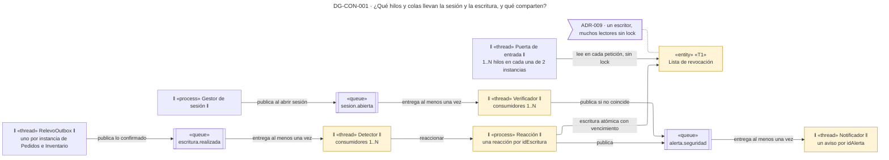
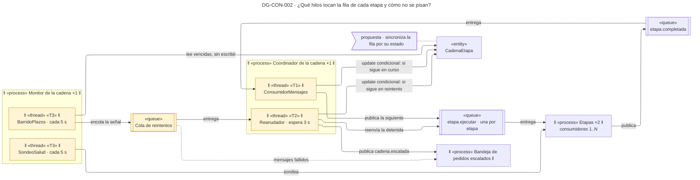
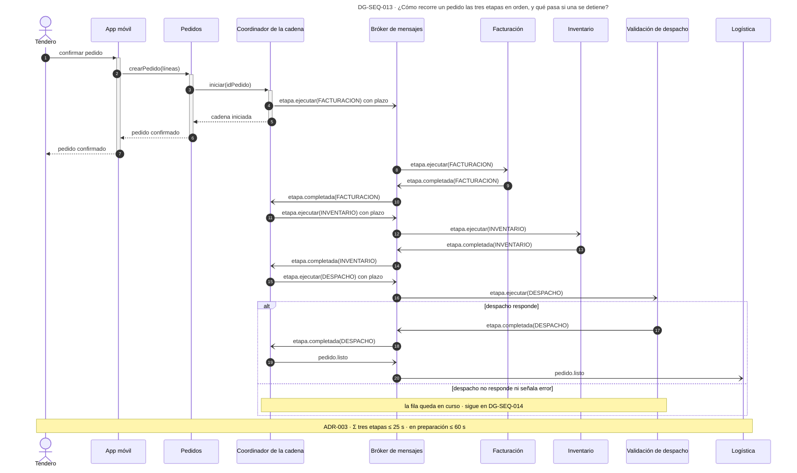
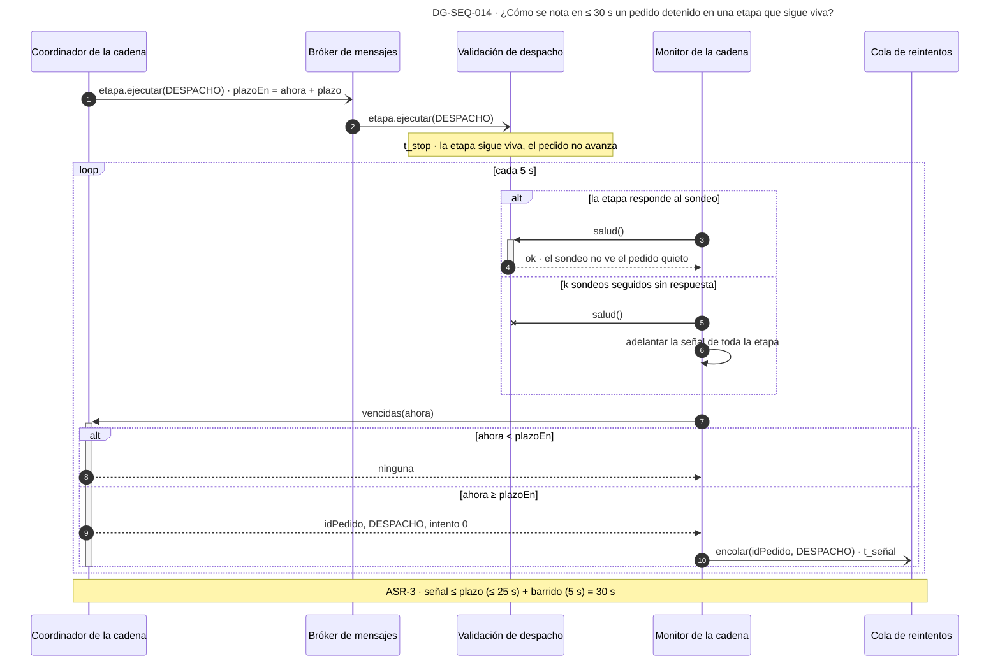
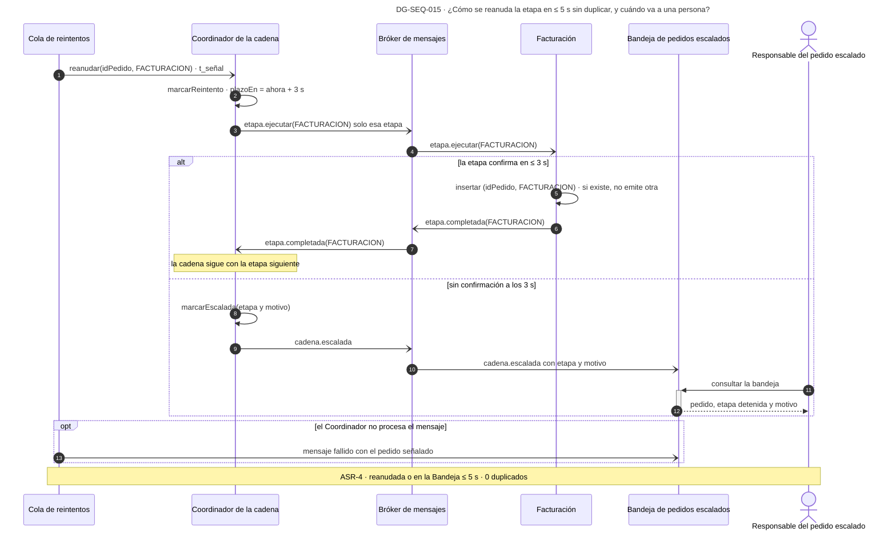
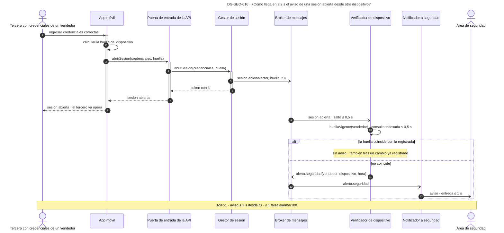
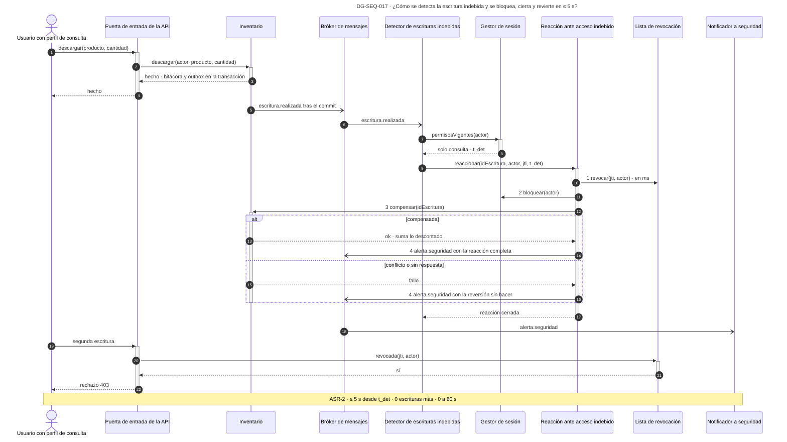

# Vista de concurrencia — Reto 2 CCP (v6)

Esta página dibuja qué corre al mismo tiempo, por qué colas pasa el trabajo y qué estado comparten los hilos. Abre con dos diagramas de objetos activos, uno por cada camino del reto. Siguen cinco secuencias de punta a punta, una por decisión que se demuestra en el tiempo: el orden de la cadena y los cuatro ASR, cada uno con su camino de fallo y su medida.

**Estado: propuesta.** Los diez ADR de [adrs-ccp-reto2.md](adrs-ccp-reto2.md) están en estado Propuesta. La portada de los diagramas, con la matriz de trazabilidad y los huecos, está en [diagramas-ccp-reto2.md](diagramas-ccp-reto2.md). Los componentes que aparecen aquí son los de la [vista de componentes](vista-componentes.md), con el mismo nombre.

## Cómo leer esta página

| Diagrama | Qué responde | ASR · ADR |
|---|---|---|
| DG-CON-001 | Qué hilos y colas llevan los caminos de seguridad, y qué estado comparten | ASR-1, ASR-2 · ADR-001, ADR-007 a ADR-010 |
| DG-CON-002 | Qué hilos y colas llevan la cadena del pedido, y qué se sincroniza en la fila de cada etapa | ASR-3, ASR-4 · ADR-001 a ADR-006 |
| DG-SEQ-013 | Cómo recorre un pedido las tres etapas en orden hasta logística | ASR-3, ASR-4 · ADR-003 |
| DG-SEQ-014 | Cómo se nota en ≤ 30 s un pedido detenido en una etapa que sigue viva | ASR-3 · ADR-004 |
| DG-SEQ-015 | Cómo se reanuda la etapa en ≤ 5 s sin duplicar, y cuándo va a una persona | ASR-4 · ADR-005, ADR-006 |
| DG-SEQ-016 | Cómo llega en ≤ 2 s el aviso de una sesión abierta desde otro dispositivo | ASR-1 · ADR-007 |
| DG-SEQ-017 | Cómo se detecta la escritura indebida y se revoca, bloquea y revierte en ≤ 5 s | ASR-2 · ADR-008, ADR-009, ADR-010 |

Los ID DG-SEQ-013 a 017 son los del plan de diagramas de los ADR (sección 6 de [adrs-ccp-reto2.md](adrs-ccp-reto2.md)).

## Leyenda

| Notación | Significado |
|---|---|
| ‖ «process» ‖ | Proceso: un programa en ejecución, con su multiplicidad (×1, ×2) |
| ‖ «thread» ‖ | Hilo o grupo de hilos dentro de un proceso, con su multiplicidad (1..N) |
| «queue» | Cola durable del bróker. Guarda cada mensaje hasta que su consumidor lo confirma |
| «entity» | Estado que comparten varios hilos; la arista dice cómo se sincroniza |
| Línea continua | Llamada o escritura síncrona |
| Línea punteada | Mensaje que no se pudo procesar y va a otro destino |
| `-)` en una secuencia | Mensaje asíncrono: quien lo envía no espera respuesta |
| Amarillo | Elemento que aloja una táctica de un ADR |
| Nota con banderín | ADR y precio de la decisión anclada |

**Qué significa «el bróker entrega al menos una vez».** El bróker de ADR-001 vuelve a entregar todo mensaje que su consumidor no confirmó. Eso protege contra la pérdida, pero un mismo evento puede llegar dos veces. Por eso cada consumidor de esta página tiene una clave que le impide actuar dos veces sobre lo mismo.

**Presupuestos de tiempo.** Las secuencias de ASR-1 y ASR-2 reparten la medida entre sus tramos. Esos repartos son una asignación de diseño, no una medición: sirven para saber qué tramo revisar primero cuando la prueba de carga de R-12 no cumpla.

---

## DG-CON-001 · Hilos y colas de los caminos de seguridad

| Tipo | ASR | ADR | Estado |
|---|---|---|---|
| Objetos activos (concurrencia) | ASR-1 · ASR-2 | ADR-001 · ADR-007 · ADR-008 · ADR-009 · ADR-010 | propuesta |

| Marca | ID | Táctica (curso) | Elemento | ADR | Precio → cobra a |
|---|---|---|---|---|---|
| T1 | SEG-13 | Revocar el acceso: la Reacción escribe la clave y todas las instancias de la Puerta la leen | Lista de revocación | ADR-009 | Una lectura por petición en el camino crítico → disponibilidad del borde (R-1) |
| — | MOD-04 | Intermediario con colas durables entre quien produce y quien consume | Las tres colas | ADR-001 | Un salto por cola → latencia de ASR-1 y ASR-2 (TO-001a) |

**Qué se sincroniza y cómo.**

| Estado compartido | Quién escribe · quién lee | Cómo se protege | De dónde sale |
|---|---|---|---|
| Lista de revocación | Escribe solo la Reacción · leen todos los hilos de las dos instancias de la Puerta | Cada clave se escribe de forma atómica con su vencimiento; la lectura no toma lock | ADR-009 |
| Registro de reacciones | Los consumidores del Detector pueden pedir dos veces la misma reacción si el evento se repite | Clave única `idEscritura`: la segunda petición encuentra la reacción ya abierta | ADR-010 (NR-010a) |
| Avisos entregados | Una alerta repetida por el bróker llega dos veces al Notificador | Clave única `idAlerta`, registrada después de entregar | **propuesta**: ningún ADR decide la deduplicación del aviso |
| Outbox de cada instancia | Cada instancia de Pedidos e Inventario tiene su propio relevo | El relevo solo lee las filas de su transacción ya confirmada; si publica dos veces, el Detector y la Reacción absorben el duplicado | ADR-008 |

**Qué muestra:** ningún control de seguridad corre en el hilo que atiende al usuario. La sesión y la escritura terminan, y su evento se procesa en otro hilo, en paralelo. El único estado que comparten el camino del usuario y el de la reacción es la Lista de revocación. · **Decisión que refleja:** ADR-001 (colas durables), ADR-007 y ADR-008 (consumidores por evento), ADR-009 (la Lista) y ADR-010 (una reacción por escritura). · **Qué no muestra:** el número de hilos de cada consumidor, que depende de la prueba de carga con el Ambiente A (11 transacciones por segundo).

---

## DG-CON-002 · Hilos y colas de la cadena del pedido

| Tipo | ASR | ADR | Estado |
|---|---|---|---|
| Objetos activos (concurrencia) | ASR-3 · ASR-4 | ADR-001 · ADR-002 · ADR-004 · ADR-006 | propuesta |

| Marca | ID | Táctica (curso) | Elemento | ADR | Precio → cobra a |
|---|---|---|---|---|---|
| T1 | INT-08 · DIS-15 | Orquestación con estado por etapa: el mismo hilo que recibe la confirmación publica la etapa siguiente | ConsumidorMensajes | ADR-002 | Un solo proceso: si cae, ninguna cadena avanza → ASR-4 (R-002a) |
| T2 | DIS-12 · DIS-14 | Un reintento con espera de 3 s, y escalamiento si no llega la confirmación | Reanudador | ADR-006 | La espera vive en memoria: si el proceso cae, la recoge el barrido siguiente, hasta 5 s tarde → ASR-4 (R-002a) |
| T3 | DIS-04 · DIS-03 · DIS-01 | Barrido de plazos y sondeo de salud, cada uno en su hilo programado | BarridoPlazos · SondeoSalud | ADR-004 | Un solo proceso Monitor → ASR-3 (R-004a) |
| — | MOD-04 | Colas durables: el comando espera aunque la etapa esté caída; lo que la Cola no puede entregar va a la Bandeja | Colas | ADR-001 · ADR-006 | Pieza común de los cuatro caminos (R-001a) |

**Qué se sincroniza y cómo.** Tres hilos tocan la misma fila `CadenaEtapa`: el que recibe la confirmación, el que reanuda y el que barre. El barrido solo lee. Los otros dos escriben con una **actualización condicional**: la fila cambia solo si sigue en el estado que el hilo espera, y si no, el hilo no hace nada. Así, si la etapa confirma justo cuando el Reanudador va a escalar, gana el primero que escribe y el otro encuentra la fila cambiada. Esta sincronización es **propuesta**: ADR-002 guarda el estado en la base, pero ningún ADR decide cómo se resuelve la carrera (ver Huecos en la portada).

**Aviso del lint justificado (AP-09, 13 elementos).** El conteo incluye los dos marcos de proceso, que agrupan a los hilos del Coordinador y del Monitor. Sin ellos, el diagrama no diría que cada par de hilos vive en un proceso único, que es el riesgo de R-002a y R-004a.

**Qué muestra:** que el Coordinador y el Monitor son procesos únicos, con dos hilos cada uno, y que todo el trabajo entre ellos y las etapas pasa por colas durables. · **Decisión que refleja:** ADR-001 (colas), ADR-002 (estado por etapa), ADR-004 (barrido y sondeo) y ADR-006 (reintento y Bandeja). · **Qué no muestra:** el número de consumidores de cada etapa, que depende de la prueba de carga con el Ambiente A.

---

## DG-SEQ-013 · El pedido recorre las tres etapas en orden hasta logística

| Tipo | ASR | ADR | Estado |
|---|---|---|---|
| Secuencia | ASR-3 · ASR-4 | ADR-003 | propuesta |

**Qué muestra:** que en cada momento hay a lo sumo una etapa en curso por pedido, que es el caso que ASR-4 describe. El tendero recibe la confirmación antes de que empiece la primera etapa. · **Decisión que refleja:** ADR-003, que descarta las etapas en paralelo del BPMN. · **Qué no muestra:** la reserva de cantidades al confirmar (R-5) ni el aviso de «en preparación» al tendero.

**La medida.** Los 60 s que el tendero espera antes de ver su pedido en preparación (S-7) menos los 35 s del presupuesto conjunto de ASR-3 y ASR-4 dejan 25 s para las tres etapas. En serie, la cadena tarda la suma de las tres, no la más lenta (R-003a). El experimento de ADR-003 mide esa suma con la carga del Ambiente A antes de aceptar el ADR.

---

## DG-SEQ-014 · ASR-3: el pedido detenido en una etapa que sigue viva

| Tipo | ASR | ADR | Estado |
|---|---|---|---|
| Secuencia | ASR-3 | ADR-004 | propuesta |

**Qué muestra:** por qué el sondeo de salud no basta. La etapa responde al sondeo mientras el pedido sigue quieto, y solo el plazo vencido lo delata. La señal llega, a más tardar, un barrido después de vencer el plazo. · **Decisión que refleja:** ADR-004, que descarta el latido solo del BPMN. · **Qué no muestra:** el valor del plazo de cada etapa, que depende de medir su p99 en operación normal; ni el número k de sondeos.

**La medida.** t_señal − t_stop ≤ plazo de la etapa + periodo del barrido. Con el plazo en 25 s y el barrido en 5 s (SUP-02, SUP-03), la señal cabe en los 30 s de ASR-3. La otra mitad de la medida, ≤ 1 falsa alarma por hora, depende de que el plazo quede por encima de la duración normal de la etapa (TO-004a).

---

## DG-SEQ-015 · ASR-4: la etapa detenida se reanuda o llega a una persona

| Tipo | ASR | ADR | Estado |
|---|---|---|---|
| Secuencia | ASR-4 | ADR-005 · ADR-006 | propuesta |

**Qué muestra:** los dos finales que admite ASR-4 y por qué ninguno duplica. Si la factura ya existía, la clave única de ADR-005 impide emitir otra y la etapa solo confirma. Si la etapa no confirma en 3 s, el pedido llega a la Bandeja con la etapa y el motivo, y la Cola manda allí lo que el Coordinador no alcanza a procesar. · **Decisión que refleja:** ADR-005 y ADR-006. · **Qué no muestra:** qué hace el responsable con el pedido, que es HU-14.

**La medida.** El intento dura 3 s (SUP-04); publicar el escalamiento toma milisegundos. Los dos caben en los 5 s de ASR-4, y sumados a los 30 s de ASR-3 dan los 35 s del presupuesto conjunto.

---

## DG-SEQ-016 · ASR-1: el aviso de la sesión abierta desde otro dispositivo

| Tipo | ASR | ADR | Estado |
|---|---|---|---|
| Secuencia | ASR-1 | ADR-007 | propuesta |

**Qué muestra:** que el tercero entra, porque sus credenciales son correctas, y que el aviso sale después sin frenarlo. El reparto de los 2 s asigna medio segundo al salto por el bróker, medio a la comparación y uno a la entrega. · **Decisión que refleja:** ADR-007 sobre el estilo por eventos de ADR-001. · **Qué no muestra:** lo que hace el área de seguridad con el aviso, que queda fuera del sistema, ni el tendero, que no tiene un dispositivo contra el cual comparar (R-007a).

**La medida.** El reloj corre desde t0, la apertura de la sesión, hasta el aviso. La segunda mitad de la medida, ≤ 1 falsa alarma por cada 100 cambios legítimos de dispositivo, depende de que cada cambio se registre antes de usarse (DG-CST-002).

---

## DG-SEQ-017 · ASR-2: la escritura indebida, detectada y revertida

| Tipo | ASR | ADR | Estado |
|---|---|---|---|
| Secuencia | ASR-2 | ADR-008 · ADR-009 · ADR-010 | propuesta |

**Qué muestra:** el camino completo del ataque. La escritura indebida ocurre y responde con éxito; el Detector la ve después, fija t_det y la Reacción corta la sesión antes de revertir. La segunda escritura del mismo actor ya no llega a Inventario. · **Decisión que refleja:** ADR-008 (detección por evento), ADR-009 (la Lista consultada en el borde) y ADR-010 (el orden de la reacción y la compensación). · **Qué no muestra:** la escritura sobre un pedido cuya cadena ya arrancó, que exige compensar también sus etapas y que ningún ADR resuelve (R-010a).

**La medida.** Revocar toma milisegundos y va primero: desde ese instante, cero escrituras posteriores. Bloquear y compensar consumen el resto de los 5 s. Si la compensación falla, el efecto residual puede pasar de 60 s, y el aviso sale con la reversión sin hacer para que una persona la termine.
