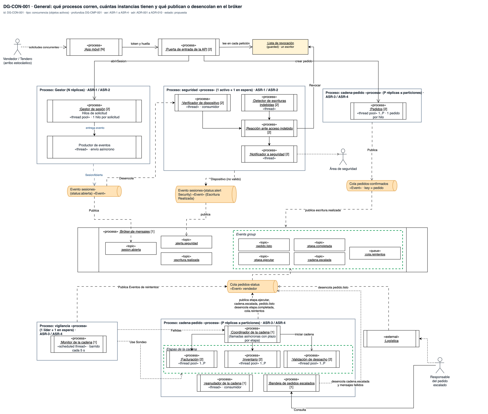
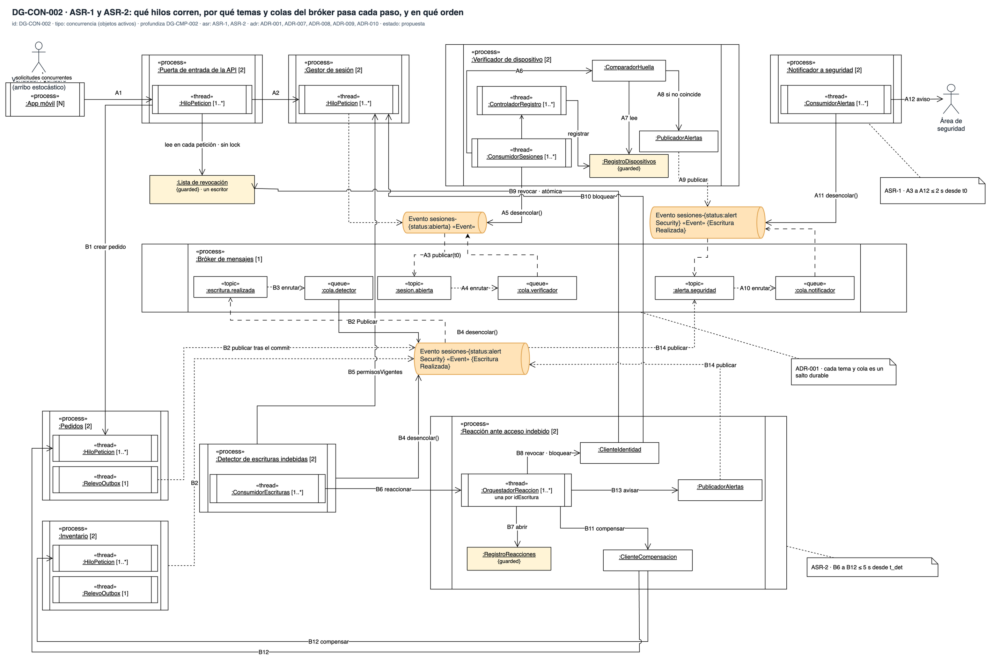
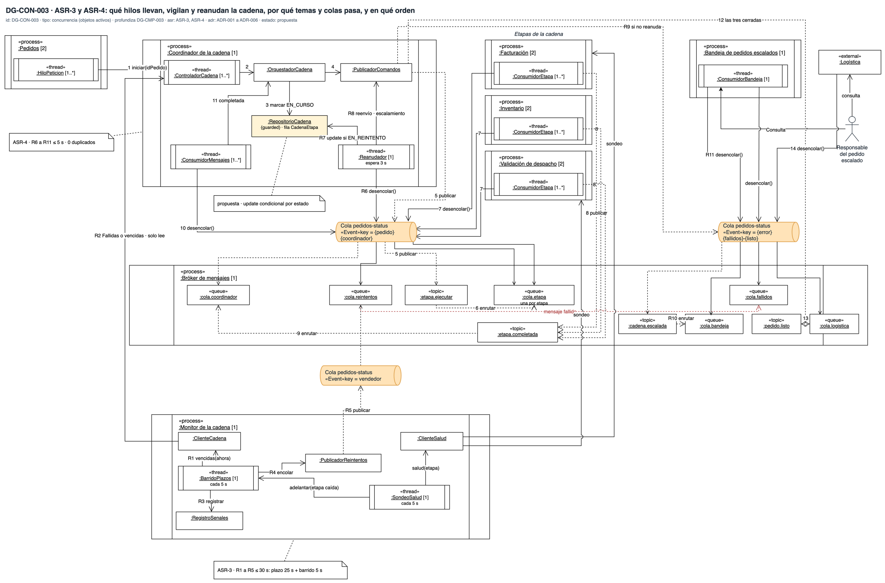

# Vista de concurrencia — Reto 2 CCP (v7)

Esta página profundiza la [vista de componentes](vista-componentes.md): mantiene sus componentes y agrega lo que esa vista no muestra. Dibuja qué proceso corre cada componente y con cuántas réplicas, y qué hilos corren dentro. También dibuja por qué canal, tema y cola pasa cada mensaje, qué estado comparten los hilos y en qué orden avanza cada flujo.

**Estado: propuesta.** Los diez ADR de [adrs-ccp-reto2.md](adrs-ccp-reto2.md) están en estado Propuesta, así que cada diagrama también lo está.

La portada de los diagramas, con la matriz de trazabilidad y los huecos, está en [diagramas-ccp-reto2.md](diagramas-ccp-reto2.md). Las instancias de cada servicio en producción salen de la [vista de despliegue](vista-despliegue.md).

**Fuente: draw.io.** Los diagramas viven en [vista-concurrencia.drawio](https://app.diagrams.net/#Uhttps%3A%2F%2Fraw.githubusercontent.com%2FMATI-MBIT%2Farqsoft-reto-2%2Fmain%2Fdocs%2Fmodelos%2Fdrawio%2Fvista-concurrencia.drawio), que se abre en draw.io web ([descargar](drawio/vista-concurrencia.drawio)), con una pestaña por diagrama. Cada imagen de esta página se exporta de ese archivo; un cambio se hace en el draw.io y después se vuelve a exportar.

## Cómo leer esta página

| Diagrama | Profundiza | Qué responde | ASR · ADR |
|---|---|---|---|
| DG-CON-001 | DG-CMP-001 | Qué grupos de procesos corren, con cuántas réplicas, qué hilos tiene cada servicio y por qué canal llega cada uno al bróker | ASR-1 a ASR-4 · ADR-001 a ADR-010 |
| DG-CON-002 | DG-CMP-002 | Qué hilos corren en la sesión y en la escritura, por qué canal, tema y cola pasa cada paso, y en qué orden | ASR-1, ASR-2 · ADR-001, ADR-007 a ADR-010 |
| DG-CON-003 | DG-CMP-003 | Qué hilos llevan, vigilan y reanudan la cadena, por qué canal, tema y cola pasa cada paso, y en qué orden | ASR-3, ASR-4 · ADR-001 a ADR-006 |

## De la vista de componentes a la de concurrencia

| En la vista de componentes | En esta vista |
|---|---|
| «component» Gestor de sesión | ‖ «process» ‖ `:Gestor de sesión [2]`: el proceso que lo corre, con sus instancias |
| Parte con hilo propio (ConsumidorSesiones, Reanudador, BarridoPlazos…) | ‖ «thread» ‖ `:ConsumidorSesiones [1..*]` dentro de su proceso, con el tamaño del pool |
| Parte sin hilo propio (ComparadorHuella, ClienteIdentidad…) | Objeto pasivo `:ComparadorHuella`: corre en el hilo de quien lo llama |
| Parte que guarda estado (RegistroDispositivos, RepositorioCadena…) | Objeto `{guarded}` en amarillo: estado que tocan varios hilos |
| Tema «event» `sesion.abierta` | Canal de eventos con su clave (cilindro naranja), «topic» `:sesion.abierta` y la «queue» de cada suscriptor, dentro de `:Bróker de mensajes [1]` |
| Interfaz y puerto (`ICompensacion`, `pReaccion`…) | Llamada directa al hilo que la atiende: la vista de concurrencia no dibuja puertos |
| Arista sin orden | Mensaje numerado en el orden del flujo |

## Leyenda

| Notación | Significado |
|---|---|
| Rectángulo con doble barra lateral, «process» | Objeto activo con su propio hilo de control: un programa en ejecución |
| Rectángulo con doble barra lateral, «thread» | Un hilo o un grupo de hilos dentro de un proceso. «thread pool» es un grupo de hilos de tamaño fijo; «scheduled thread», un hilo que despierta cada cierto tiempo |
| `:Nombre` subrayado | Instancia del componente o de la parte, con el mismo nombre que en la vista de componentes |
| `[1]`, `[2]`, `[N]`, `[1..*]`, `1..P` | Cuántas instancias corren a la vez: del proceso, en el despliegue; del hilo, en el pool |
| Marco gris «Proceso: …» (DG-CON-001) | Grupo de procesos que se escala junto, con su política de réplicas: N réplicas, P réplicas ≤ particiones, 1 activo + 1 en espera o 1 líder + 1 en espera |
| Cilindro naranja | Canal de eventos con su clave de partición (`key = vendedor`, `key = pedido`, `key = {error}`): por ahí publica y consume cada hilo antes de llegar al tema o la cola del bróker |
| «topic» | Tema del bróker: recibe lo que se publica y lo copia a una cola por suscriptor |
| «queue» | Cola durable del bróker. Guarda cada mensaje hasta que su consumidor lo confirma |
| Marco verde punteado | Agrupación: los temas de la cadena en el bróker («Events group») o las tres etapas |
| `{guarded}` · amarillo | Estado compartido entre hilos; la tabla de cada diagrama dice cómo se protege |
| Flecha continua | Llamada: el hilo de origen llama y espera. `desencolar()` va del consumidor a la cola, porque es el consumidor quien la llama |
| Flecha discontinua | Publicación o enrutamiento asíncrono: quien publica no espera |
| Flecha discontinua roja | Mensaje que no se pudo procesar y va a la cola de mensajes fallidos |
| A1, B1, 1, R1… | Orden del flujo. Una flecha sin número no es un paso: ocurre en cada petición o a su propio ritmo |
| Arco en un cruce | Dos flechas que se cruzan sin tocarse |
| Nota | ADR o medida del ASR que sostiene el elemento |

**Qué significa «el bróker entrega al menos una vez».** El bróker de ADR-001 vuelve a entregar todo mensaje que su consumidor no confirmó. Eso protege contra la pérdida, pero un mismo mensaje puede llegar dos veces. Por eso cada consumidor dibujado aquí tiene una clave que le impide actuar dos veces sobre lo mismo.

---

## DG-CON-001 · Vista general: grupos de procesos, réplicas y bróker

| Tipo | Profundiza | ASR | ADR | Estado |
|---|---|---|---|---|
| Concurrencia (objetos activos) | DG-CMP-001 | ASR-1 a ASR-4 | ADR-001 a ADR-010 | propuesta |

El diagrama arranca en los usuarios: vendedores y tenderos llegan en momentos aleatorios (arribo estocástico) y mandan solicitudes concurrentes a la App móvil, que corre en N teléfonos. La App pasa el token y la huella a la Puerta de entrada. La Puerta lee la Lista de revocación en cada petición, antes de abrir sesión o crear un pedido.

**Los grupos de procesos.**

| Grupo | Réplicas | Procesos y hilos que contiene | Qué publica o consume |
|---|---|---|---|
| Gestor · ASR-1 y ASR-2 | N réplicas | `:Gestor de sesión [2]`, con un «thread pool» de un hilo por solicitud, que entrega cada evento a un Productor de eventos «thread» de envío asíncrono | Publica `SesionAbierta` en el canal `sesiones-{status:abierta}`, que llega al tema `sesion.abierta` |
| seguridad · ASR-1 y ASR-2 | 1 activo + 1 en espera | `:Verificador de dispositivo [2]` con su «thread» consumidor · `:Detector de escrituras indebidas [2]` con su «thread» · `:Reacción ante acceso indebido [2]` · `:Notificador a seguridad [2]` con su «thread» | El Verificador desencola del canal de sesiones. El grupo publica «Dispositivo {no válido}» en el canal `sesiones-{status:alert Security}`, que llega al tema `alerta.seguridad`. La Reacción revoca en la Lista y el Notificador avisa al Área de seguridad |
| cadena-pedido, entrada · ASR-3 y ASR-4 | P réplicas ≤ particiones | `:Pedidos [2]`, con un «thread pool» 1..P de un pedido por hilo | Publica en el canal `pedidos-confirmados`, con clave `pedido`, que llega al tema `escritura.realizada` |
| cadena-pedido, etapas · ASR-3 y ASR-4 | P réplicas ≤ particiones | `:Coordinador de la cadena [1]`, que hace llamadas asíncronas con plazo por etapa · `:Facturación [2]`, `:Inventario [2]` y `:Validación de despacho [2]`, cada una con un «thread pool» 1..P · `:reanudador de la cadena [1]`, con su «thread» consumidor · `:Bandeja de pedidos escalados [1]` | Publica `etapa.ejecutar`, `cadena.escalada` y `pedido.listo`, y desencola `etapa.completada` y `cola.reintentos`, por el canal `pedidos-status` con clave `vendedor`. La Bandeja desencola de ese canal `cadena.escalada` y los mensajes fallidos |
| vigilancia · ASR-3 y ASR-4 | 1 líder + 1 en espera | `:Monitor de la cadena [1]`, con un «scheduled thread» que barre cada 5 s | Publica los eventos de reintento en el canal `pedidos-status`, avisa al Coordinador las etapas fallidas y sondea las etapas |

**El bróker.** `:Bróker de mensajes [1]` tiene los temas de seguridad sueltos (`sesion.abierta`, `alerta.seguridad`, `escritura.realizada`) y los de la cadena en un grupo de eventos: `etapa.ejecutar`, `etapa.completada`, `cadena.escalada`, `pedido.listo` y la cola `cola.reintentos`. Logística desencola `pedido.listo` del canal `pedidos-status`.

**Qué muestra:** cómo se escala cada camino. La seguridad corre con un activo y uno en espera, la vigilancia con un líder y uno en espera, el Gestor con N réplicas y la cadena con tantas réplicas como particiones tenga su canal. El Reanudador corre en el grupo de la cadena, junto al Coordinador. Todo lo asíncrono pasa por un canal con clave antes de llegar al bróker. · **Decisión que refleja:** ADR-001 (bróker durable), ADR-002 y ADR-004 (Coordinador y Monitor ×1) y las rutas de las demás decisiones. · **Qué no muestra:** los hilos internos de cada componente abierto, que están en DG-CON-002 y DG-CON-003.

---

## DG-CON-002 · Hilos, canales, temas y colas de los caminos de seguridad

| Tipo | Profundiza | ASR | ADR | Estado |
|---|---|---|---|---|
| Concurrencia (objetos activos) | DG-CMP-002 | ASR-1 · ASR-2 | ADR-001 · ADR-007 · ADR-008 · ADR-009 · ADR-010 | propuesta |

Cada mensaje cruza tres piezas: un canal de eventos con su clave (cilindro naranja), un tema del bróker y la cola del suscriptor. El hilo publica en el canal, el canal lleva el mensaje al tema y el bróker lo enruta a la cola. El hilo consumidor lo desencola desde el canal.

**El orden del flujo.**

| Paso | Hilo que lo ejecuta | Qué hace |
|---|---|---|
| A1 · A2 | HiloPeticion de la Puerta y del Gestor | El usuario abre sesión desde la App con la huella; la Puerta la pasa al Gestor |
| A3 | HiloPeticion del Gestor | Publica la sesión abierta con t0, el instante en que se abrió, en el canal `sesiones-{status:abierta}`, que llega al tema `sesion.abierta`, y responde al usuario sin esperar |
| A4 | Bróker | Enruta el tema a `cola.verificador` |
| A5 · A6 · A7 | ConsumidorSesiones del Verificador | Desencola del canal de sesiones, compara la huella y lee la vigente en RegistroDispositivos |
| A8 · A9 | ConsumidorSesiones, con PublicadorAlertas | Si no coincide, publica en el canal `sesiones-{status:alert Security}`, que llega al tema `alerta.seguridad` |
| A10 · A11 · A12 | Bróker · ConsumidorAlertas del Notificador | Enruta a `cola.notificador`; el Notificador desencola del canal de alertas y avisa al Área de seguridad |
| B1 | HiloPeticion de la Puerta y de Pedidos | El usuario con perfil de solo consulta, que no debería escribir, crea un pedido, y Pedidos lo escribe en su base |
| B2 | RelevoOutbox de Pedidos o de Inventario | Publica la escritura después del commit en el canal de alertas y escrituras, que llega al tema `escritura.realizada` |
| B3 · B4 | Bróker · ConsumidorEscrituras del Detector | Enruta a `cola.detector`; el Detector desencola del canal |
| B5 · B6 | ConsumidorEscrituras | Pide los permisos vigentes al Gestor y, si la escritura no cabía en esos permisos, pide la reacción (t_det, el instante de la detección) |
| B7 a B13 | OrquestadorReaccion, en un hilo de la Reacción | Abre la reacción, revoca en la Lista, bloquea en el Gestor, compensa en Pedidos o Inventario y avisa |
| B14 | OrquestadorReaccion, con PublicadorAlertas | Publica en el canal de alertas, que llega a `alerta.seguridad` y sigue el camino de A10 a A12 |
| Sin número | ConsumidorSesiones · ControladorRegistro | El consumidor de sesiones llama al ControladorRegistro, que registra el cambio legítimo de equipo en RegistroDispositivos |

**Qué se sincroniza y cómo.**

| Estado compartido | Quién escribe · quién lee | Cómo se protege | De dónde sale |
|---|---|---|---|
| :Lista de revocación | Escribe solo la Reacción · leen todos los hilos de petición de las dos instancias de la Puerta | Cada clave se escribe de forma atómica con su vencimiento; la lectura no toma lock. Un escritor y muchos lectores no necesitan exclusión mutua | ADR-009 |
| :RegistroDispositivos | Escribe ControladorRegistro · lee ConsumidorSesiones | Una sola huella vigente por vendedor; el cambio se registra antes de usarse | ADR-007 |
| :RegistroReacciones | Los consumidores del Detector pueden pedir dos veces la misma reacción si el bróker repite el evento | Clave única `idEscritura`: la segunda petición encuentra la reacción ya abierta | ADR-010 (NR-010a) |
| Avisos entregados, dentro del Notificador | Una alerta repetida llega dos veces | Clave única `idAlerta`, registrada después de entregar | **propuesta**: ningún ADR decide la deduplicación |

**Qué muestra:** que ningún control de seguridad corre en el hilo que atiende al usuario. La sesión y la escritura terminan, y su evento cruza un canal y el bróker hasta otro proceso, donde lo toma un hilo consumidor. El único estado que comparten el camino del usuario y el de la reacción es la Lista de revocación. · **Decisión que refleja:** ADR-001 (bróker), ADR-007 (huella), ADR-008 (outbox y detección), ADR-009 (la Lista) y ADR-010 (reacción ordenada). · **Qué no muestra:** el tamaño de cada pool de hilos, que depende de la prueba de carga con el Ambiente A.

**Las medidas.** La medida de ASR-1 va de A3 a A12: ≤ 2 s desde t0. La de ASR-2 va de B6 a B12: ≤ 5 s desde t_det. Revocar va primero y toma milisegundos, así que desde B9 ninguna escritura del actor pasa la Puerta.

---

## DG-CON-003 · Hilos, canales, temas y colas de la cadena del pedido

| Tipo | Profundiza | ASR | ADR | Estado |
|---|---|---|---|---|
| Concurrencia (objetos activos) | DG-CMP-003 | ASR-3 · ASR-4 | ADR-001 a ADR-006 | propuesta |

En este diagrama, la cadena usa un solo canal de eventos, `pedidos-status`, con tres claves. La entrada de pedidos, en DG-CON-001, publica por otro canal, `pedidos-confirmados`.

| Clave | Qué lleva |
|---|---|
| `key = {pedido}` | Los comandos a las etapas y sus confirmaciones |
| `key = vendedor` | Los reintentos que publica el Monitor |
| `key = {error}` | Lo escalado, lo fallido y `pedido.listo`, que va a Logística (rótulo «{fallidos}-{listo}») |

**El orden del flujo.**

| Paso | Hilo que lo ejecuta | Qué hace |
|---|---|---|
| 1 · 2 · 3 · 4 | HiloPeticion de Pedidos · ControladorCadena | Pedidos inicia la cadena; el Coordinador marca la primera etapa EN_CURSO con su plazo |
| 5 · 6 | ControladorCadena, con PublicadorComandos · Bróker | Publica en el canal `key = {pedido}`, que llega al tema `etapa.ejecutar`; el bróker lo enruta a la cola de esa etapa |
| 7 · 8 | ConsumidorEtapa de la etapa | Desencola del canal, ejecuta la etapa con su clave única y publica `etapa.completada` |
| 9 · 10 · 11 | Bróker · ConsumidorMensajes | Enruta a `cola.coordinador`; el consumidor desencola del canal y avisa al OrquestadorCadena, la parte del Coordinador que lleva el orden de las etapas. El orquestador marca la etapa COMPLETADA y vuelve al paso 5 con la siguiente |
| 12 · 13 · 14 | PublicadorComandos · Bróker · Logística | Con las tres etapas cerradas, publica `pedido.listo`, que se enruta a `cola.logistica`; Logística desencola del canal `key = {error}` |
| R1 · R2 · R3 | BarridoPlazos, cada 5 s | Pide al Coordinador las etapas fallidas o vencidas, solo lectura, y registra la señal: la marca de que esa etapa de ese pedido se detuvo y debe reintentarse |
| R4 · R5 | BarridoPlazos, con PublicadorReintentos | Publica el pedido señalado en el canal `key = vendedor`, que llega a `cola.reintentos` (t_señal) |
| R6 · R7 · R8 | Reanudador | Desencola del canal `key = {pedido}`, pasa la fila a EN_REINTENTO y reenvía solo esa etapa |
| R9 · R10 · R11 | Reanudador · Bróker · ConsumidorBandeja | Si a los 3 s no hay confirmación, publica en el canal `key = {error}`, que llega a `cadena.escalada` y se enruta a `cola.bandeja`; la Bandeja desencola |
| Sin número | SondeoSalud, cada 5 s | Pregunta la salud de Facturación y de Validación de despacho, y adelanta la señal si una no responde |
| Sin número | Bróker | Lo que la cola de reintentos no entrega va a `cola.fallidos`, que también desencola la Bandeja |
| Sin número | Responsable del pedido escalado | Consulta la Bandeja y Logística |

**Qué se sincroniza y cómo.**

| Estado compartido | Quién escribe · quién lee | Cómo se protege | De dónde sale |
|---|---|---|---|
| :RepositorioCadena, fila `CadenaEtapa` | Escriben ConsumidorMensajes (paso 11, por el OrquestadorCadena) y Reanudador (R7) · lee BarridoPlazos (R2) | **Actualización condicional**: la fila cambia solo si sigue en el estado que el hilo espera. Si la etapa confirma justo cuando el Reanudador va a escalar, gana el primero que escribe y el otro afecta 0 filas | **propuesta**: ADR-002 guarda el estado en la base, pero ningún ADR decide cómo se resuelve la carrera |
| `EtapaProcesada` de cada etapa | Los consumidores de una etapa, si el bróker entrega el comando dos veces | Clave única (idPedido, etapa) en la misma transacción del efecto: no se emite una segunda factura | ADR-005 |
| :RegistroSenales | BarridoPlazos | Clave única (idPedido, etapa, intento): un barrido repetido no encola dos veces | ADR-004 (NR-004a) |

**Qué muestra:** que la fila de cada etapa es el único punto donde dos hilos escriben lo mismo. Todo lo demás pasa por canales y colas: el Monitor no espera al Coordinador, y las etapas no esperan al consumidor de confirmaciones. El Coordinador, el Monitor y la Bandeja corren como proceso único. · **Decisión que refleja:** ADR-001 (bróker), ADR-002 (estado por etapa), ADR-003 (una etapa a la vez), ADR-004 (barrido y sondeo), ADR-005 (clave única) y ADR-006 (un reintento y la Bandeja). · **Qué no muestra:** la confirmación que llega después de escalar, que la actualización condicional hoy ignora (ver Huecos en la portada).

**Las medidas.** La medida de ASR-3 va de la detención de la etapa a R5: plazo ≤ 25 s más un barrido de 5 s, ≤ 30 s. La de ASR-4 va de R6 a R11: un intento de 3 s y el escalamiento, ≤ 5 s, sin duplicados. Sumados dan los 35 s del presupuesto conjunto.

---

## Diferencias por resolver

El texto de esta página describe los diagramas tal como están dibujados. Estas diferencias quedan abiertas hasta que el equipo decida en el draw.io o en el ADR que corresponda.

| Dónde | Qué dibuja el diagrama | Con qué choca |
|---|---|---|
| DG-CON-001 y DG-CON-003 | En DG-CON-001, el Reanudador es un proceso propio dentro del grupo de la cadena; en DG-CON-003 es un hilo dentro del Coordinador | ADR-006 y DG-CMP-003 lo ponen dentro del Coordinador |
| DG-CON-001, DG-CON-002 y DG-DEP-001 | Seguridad con 1 activo + 1 en espera y vigilancia con 1 líder + 1 en espera; el Gestor con N réplicas; la cadena con P réplicas ≤ particiones, y el Coordinador y la Bandeja [1] | DG-DEP-001 despliega ×2 los servicios de seguridad, el Coordinador y la Bandeja, 1..3 el Monitor y ×1 la Puerta, que DG-CON-002 dibuja en [2] |
| DG-CON-001 | Los canales tienen clave de partición y la cadena escala por particiones | El bróker de ADR-001 y de DG-DEP-001 es RabbitMQ con colas durables; ningún ADR decide particiones ni claves |
| DG-CON-002 | El mismo canal `sesiones-{status:alert Security} {Escritura Realizada}` lleva las alertas y las escrituras | Son dos temas distintos del bróker, `alerta.seguridad` y `escritura.realizada`, con suscriptores distintos |
| DG-CON-003 | El Monitor publica los reintentos en el canal con clave `vendedor` (R5), y el Reanudador desencola del canal con clave `{pedido}` (R6) | El reintento que se publica en un canal debería desencolarse del mismo |
| DG-CON-001 y DG-CON-003 | En DG-CON-001, la cadena publica y Logística desencola por `pedidos-status` con clave `vendedor`; en DG-CON-003, los comandos van con clave `{pedido}` y Logística desencola de la clave `{error}` | La clave de cada flujo de la cadena tiene que ser la misma en los dos diagramas |
| DG-CON-001 | `:Coordinador de la cadena [1]`, `:reanudador de la cadena [1]` y `:Bandeja de pedidos escalados [1]` están dentro del grupo de P réplicas ≤ particiones | Un proceso único no escala con las particiones de su grupo |
