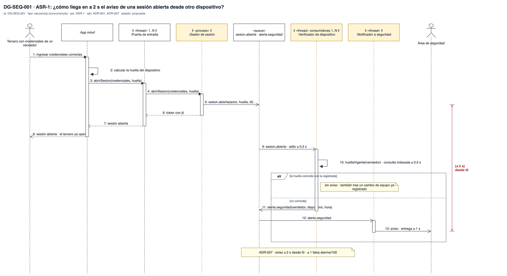
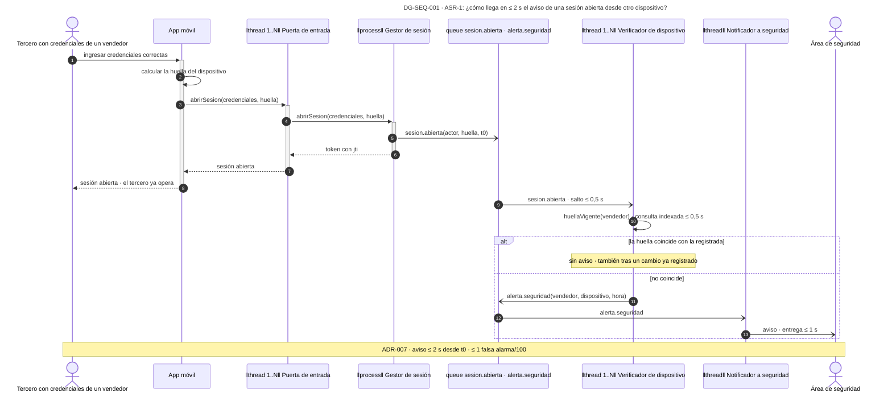
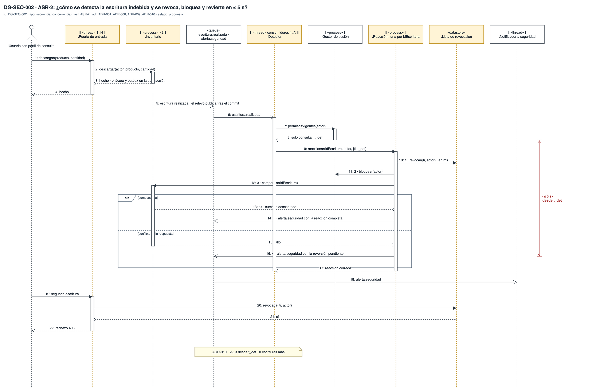
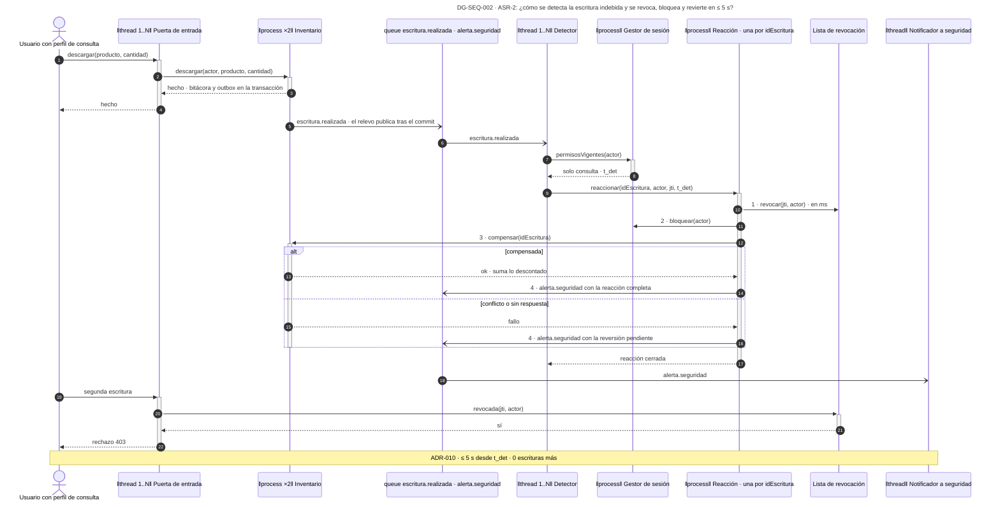
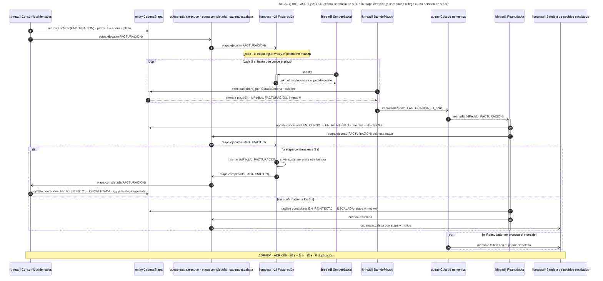

# Vista de concurrencia — Reto 2 CCP (v7)

Esta página dibuja qué corre al mismo tiempo, por qué colas pasa el trabajo y cómo se cumple cada medida en el tiempo. Son tres secuencias, una por cada escenario que se demuestra con un reloj: ASR-1, ASR-2, y ASR-3 junto con ASR-4, que comparten el presupuesto de 35 s. Las líneas de vida son los procesos y los hilos que ejecutan cada paso, así que la misma secuencia dice qué corre en paralelo y qué estado se comparte.

**Estado: propuesta.** Los diez ADR de [adrs-ccp-reto2.md](adrs-ccp-reto2.md) están en estado Propuesta. La portada de los diagramas, con la matriz de trazabilidad y los huecos, está en [diagramas-ccp-reto2.md](diagramas-ccp-reto2.md). Los componentes y las partes que aparecen aquí son los de la [vista de componentes](vista-componentes.md), con el mismo nombre.

**Fuente: draw.io.** El original es [drawio/vista-concurrencia.drawio](drawio/vista-concurrencia.drawio), con una pestaña por diagrama. La imagen de cada sección se exporta de ese archivo, y el bloque Mermaid que la sigue es una copia.

## Cómo leer esta página

| Diagrama | Qué responde | ASR · ADR |
|---|---|---|
| DG-SEQ-001 | Cómo llega en ≤ 2 s el aviso de una sesión abierta desde otro dispositivo | ASR-1 · ADR-001, ADR-007 |
| DG-SEQ-002 | Cómo se detecta la escritura indebida y se revoca, bloquea y revierte en ≤ 5 s | ASR-2 · ADR-001, ADR-008, ADR-009, ADR-010 |
| DG-SEQ-003 | Cómo se señala en ≤ 30 s la etapa detenida y se reanuda o llega a una persona en ≤ 5 s, sin duplicar | ASR-3, ASR-4 · ADR-001 a ADR-006 |

## Leyenda

| Notación | Significado |
|---|---|
| ‖ «process» ‖ | Línea de vida de un proceso, con su multiplicidad (×1, ×2) |
| ‖ «thread» ‖ | Línea de vida de un hilo o de un grupo de hilos dentro de un proceso (1..N) |
| «queue» | Cola durable del bróker. Guarda cada mensaje hasta que su consumidor lo confirma |
| «entity» · «datastore» | Estado que comparten varios hilos |
| Flecha con punta llena | Llamada síncrona: quien llama espera |
| Flecha con punta abierta | Mensaje asíncrono: quien lo envía no espera |
| Flecha discontinua | Respuesta |
| `alt` · `loop` · `opt` | Fragmentos combinados: alternativas, repetición y paso opcional, con su guarda entre corchetes |
| Cota roja `{≤ n s}` | Restricción de duración: el tiempo que el ASR permite entre los dos mensajes que marca |
| Amarillo | Línea de vida que aloja una táctica de un ADR |
| Nota | ADR y medida que la secuencia demuestra |

**Qué significa «el bróker entrega al menos una vez».** El bróker de ADR-001 vuelve a entregar todo mensaje que su consumidor no confirmó. Eso protege contra la pérdida, pero un mismo evento puede llegar dos veces. Por eso cada consumidor de esta página tiene una clave que le impide actuar dos veces sobre lo mismo.

**Presupuestos de tiempo.** Las secuencias reparten la medida entre sus tramos. Esos repartos son una asignación de diseño, no una medición: sirven para saber qué tramo revisar primero cuando la prueba de carga de R-12 no cumpla.

---

## DG-SEQ-001 · ASR-1: el aviso de la sesión abierta desde otro dispositivo

| Tipo | ASR | ADR | Estado |
|---|---|---|---|
| Secuencia (concurrencia) | ASR-1 | ADR-001 · ADR-007 | propuesta |

| Línea de vida | Qué corre | Por qué importa a la medida |
|---|---|---|
| Puerta de entrada · 1..N hilos | Atiende la petición del usuario | Responde antes de que empiece la verificación |
| Gestor de sesión · proceso | Abre la sesión y publica `sesion.abierta` | Fija t0, desde donde corren los 2 s |
| Verificador · consumidores 1..N | Comparan la huella en paralelo con la sesión ya abierta | Su número depende de la carga del Ambiente A |
| Notificador · hilo | Entrega el aviso; registra cada `idAlerta` para no avisar dos veces | La deduplicación es **propuesta**: ningún ADR la decide |

**Qué muestra:** que el tercero entra, porque sus credenciales son correctas, y que el aviso sale después sin frenarlo. El reparto de los 2 s asigna medio segundo al salto por el bróker, medio a la comparación y uno a la entrega. · **Decisión que refleja:** ADR-007 sobre el estilo por eventos de ADR-001. · **Qué no muestra:** lo que hace el área de seguridad con el aviso, que queda fuera del sistema, ni el tendero, que no tiene un dispositivo contra el cual comparar (R-007a).

**La medida.** El reloj corre desde t0, la apertura de la sesión, hasta el aviso. La segunda mitad de la medida, ≤ 1 falsa alarma por cada 100 cambios legítimos de dispositivo, depende de que cada cambio se registre antes de usarse, por el ControladorRegistro de DG-CMP-002.

### Copia en Mermaid

---

## DG-SEQ-002 · ASR-2: la escritura indebida, detectada y revertida

| Tipo | ASR | ADR | Estado |
|---|---|---|---|
| Secuencia (concurrencia) | ASR-2 | ADR-001 · ADR-008 · ADR-009 · ADR-010 | propuesta |

| Estado compartido | Quién escribe · quién lee | Cómo se protege | De dónde sale |
|---|---|---|---|
| Lista de revocación | Escribe solo la Reacción · leen todos los hilos de las dos instancias de la Puerta | Cada clave se escribe de forma atómica con su vencimiento; la lectura no toma lock | ADR-009 |
| Registro de reacciones | Los consumidores del Detector pueden pedir dos veces la misma reacción si el evento se repite | Clave única `idEscritura`: la segunda petición encuentra la reacción ya abierta | ADR-010 (NR-010a) |
| Outbox de cada instancia | Cada instancia de Pedidos e Inventario tiene su propio relevo | El relevo solo lee las filas de su transacción ya confirmada; si publica dos veces, el Detector y la Reacción absorben el duplicado | ADR-008 |

**Qué muestra:** el camino completo del ataque. La escritura indebida ocurre y responde con éxito. El Detector la ve después en otro hilo, fija t_det, y la Reacción corta la sesión antes de revertir. La segunda escritura del mismo actor ya no llega a Inventario. · **Decisión que refleja:** ADR-008 (detección por evento), ADR-009 (la Lista consultada en el borde) y ADR-010 (el orden de la reacción y la compensación). · **Qué no muestra:** la escritura sobre un pedido cuya cadena ya arrancó, que exige compensar también sus etapas y que ningún ADR resuelve (R-010a).

**La medida.** Revocar toma milisegundos y va primero: desde ese instante, cero escrituras posteriores. Bloquear y compensar consumen el resto de los 5 s. Si la compensación falla, el efecto residual puede pasar de 60 s, y el aviso sale con la reversión pendiente para que una persona la termine.

### Copia en Mermaid

---

## DG-SEQ-003 · ASR-3 y ASR-4: la etapa detenida, señalada y reanudada

| Tipo | ASR | ADR | Estado |
|---|---|---|---|
| Secuencia (concurrencia) | ASR-3 · ASR-4 | ADR-001 a ADR-006 | propuesta |

| Estado compartido | Quién escribe · quién lee | Cómo se protege | De dónde sale |
|---|---|---|---|
| Fila `CadenaEtapa` | Escriben ConsumidorMensajes y Reanudador · lee BarridoPlazos | **Actualización condicional**: la fila cambia solo si sigue en el estado que el hilo espera; si no, el hilo no hace nada | **propuesta**: ADR-002 guarda el estado en la base, pero ningún ADR decide cómo se resuelve la carrera |
| Señal por pedido, etapa e intento | BarridoPlazos | Clave única (idPedido, etapa, intento): un barrido repetido no encola dos veces | ADR-004 (NR-004a) |
| `EtapaProcesada` de Facturación | Los consumidores 1..N de la etapa, si el comando llega dos veces | Clave única (idPedido, etapa) en la misma transacción que la factura | ADR-005 |

**Qué muestra:** por qué el sondeo de salud no basta. La etapa responde al sondeo mientras el pedido sigue quieto, y solo el plazo vencido lo delata. Después, el Reanudador reenvía solo esa etapa y la clave única impide una segunda factura. Si la etapa confirma justo cuando el Reanudador va a escalar, gana el primero que escribe la fila y el otro la encuentra cambiada. · **Decisión que refleja:** ADR-002 (estado por etapa), ADR-003 (una etapa a la vez), ADR-004 (plazo y barrido), ADR-005 (idempotencia) y ADR-006 (un reintento y la Bandeja). · **Qué no muestra:** el camino del sondeo que adelanta la señal cuando k sondeos seguidos no responden, ni el número k, que sigue sin fijar.

**La medida.** t_señal − t_stop ≤ plazo de la etapa + periodo del barrido. Con el plazo en 25 s y el barrido en 5 s (SUP-02, SUP-03), la señal cabe en los 30 s de ASR-3. El intento dura 3 s (SUP-04) y publicar el escalamiento toma milisegundos, así que los dos finales caben en los 5 s de ASR-4. Sumados dan los 35 s del presupuesto conjunto.

### Copia en Mermaid

