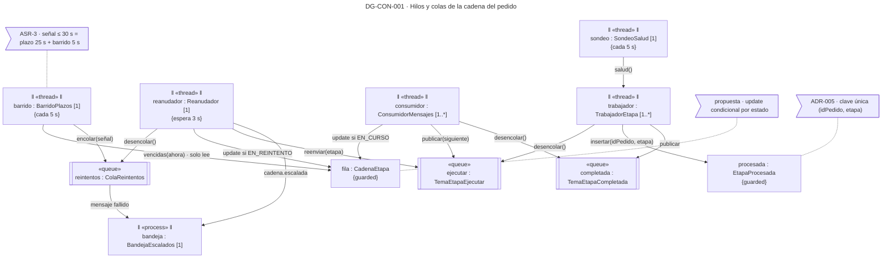
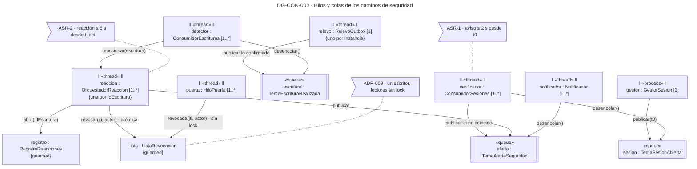
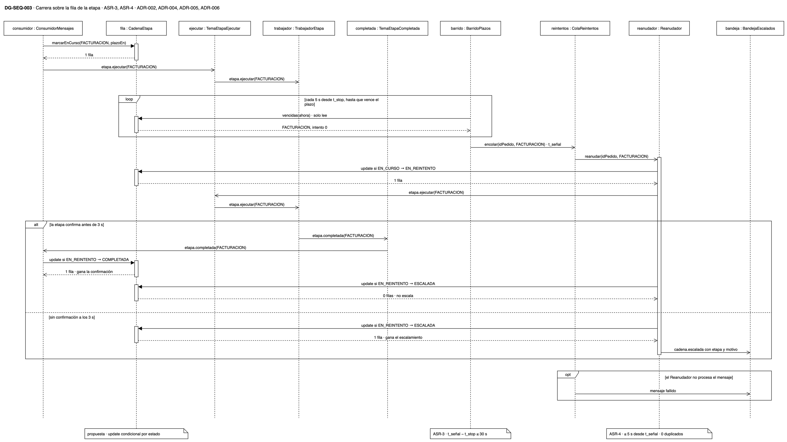
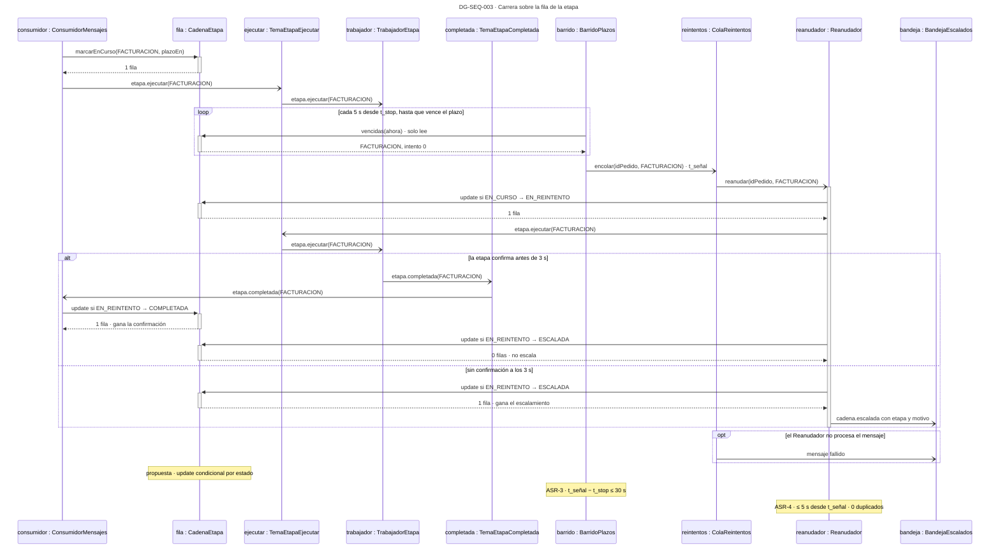

# Vista de concurrencia — Reto 2 CCP (v7)

Esta página dibuja qué corre al mismo tiempo, por qué colas pasa el trabajo y qué estado comparten los hilos. Los dos diagramas principales son modelos de concurrencia UML: objetos activos, colas y el estado compartido con su forma de sincronizarse. Uno cubre la cadena del pedido y el otro los caminos de seguridad. El tercero es una secuencia complementaria, que muestra en el tiempo la carrera más delicada del diseño: dos hilos que quieren escribir la misma fila.

**Estado: propuesta.** Los diez ADR de [adrs-ccp-reto2.md](adrs-ccp-reto2.md) están en estado Propuesta. La portada de los diagramas, con la matriz de trazabilidad y los huecos, está en [diagramas-ccp-reto2.md](diagramas-ccp-reto2.md). Los hilos de esta página son las partes de la [vista de componentes](vista-componentes.md), y el despliegue de cada proceso está en la [vista de despliegue](vista-despliegue.md).

**Fuente: draw.io.** El original es [vista-concurrencia.drawio](https://app.diagrams.net/#Uhttps%3A%2F%2Fraw.githubusercontent.com%2FMATI-MBIT%2Farqsoft-reto-2%2Fmain%2Fdocs%2Fmodelos%2Fdrawio%2Fvista-concurrencia.drawio), que se abre en draw.io web ([descargar](drawio/vista-concurrencia.drawio)), con una pestaña por diagrama. Lo escribe el emisor de la skill `diagramar-uml-arquitectura` 1.3.0 desde un modelo, y el bloque Mermaid de cada sección sale del mismo modelo, con los mismos nombres.

## Cómo leer esta página

| Diagrama | Papel | Qué responde | ASR · ADR |
|---|---|---|---|
| DG-CON-001 | Principal | Qué hilos y colas mueven la cadena del pedido, y cómo no se pisan sobre la fila de cada etapa | ASR-3, ASR-4 · ADR-001, ADR-002, ADR-004, ADR-005, ADR-006 |
| DG-CON-002 | Principal | Qué hilos y colas llevan la sesión y la escritura, y qué estado comparten con el camino del usuario | ASR-1, ASR-2 · ADR-001, ADR-007 a ADR-010 |
| DG-SEQ-003 | Complemento | Quién gana, en el tiempo, cuando la confirmación de la etapa y el escalamiento llegan juntos | ASR-3, ASR-4 · ADR-002, ADR-004, ADR-005, ADR-006 |

## Leyenda

| Notación | Significado |
|---|---|
| Rectángulo con doble barra lateral · `‖ «thread» ‖`, `‖ «process» ‖` en Mermaid | Objeto activo: tiene su propio hilo de control. «process» es un programa; «thread», un hilo dentro de él |
| `nombre : Tipo` subrayado | Instancia. Mermaid no subraya: el nombre va sin subrayar en la copia |
| `[1]`, `[2]`, `[1..*]` | Multiplicidad: cuántos hilos o procesos de ese tipo corren a la vez |
| «queue» | Cola o tema durable del bróker. Guarda cada mensaje hasta que su consumidor lo confirma |
| `{guarded}` | Estado compartido que varios hilos tocan; la nota o la tabla dicen cómo se protege |
| `{cada 5 s}`, `{espera 3 s}` | Restricción de tiempo del objeto activo |
| Flecha con rótulo | Mensaje. `desencolar()` va del consumidor a la cola: el consumidor la llama, aunque el dato viaje al revés |
| En la secuencia: punta llena, punta abierta, discontinua | Llamada síncrona, mensaje asíncrono, respuesta |
| `loop` · `alt` · `opt` | Repetición, alternativas y paso opcional, con su guarda entre corchetes |
| Nota | ADR o medida del ASR que el elemento sostiene |

**Qué significa «el bróker entrega al menos una vez».** El bróker de ADR-001 vuelve a entregar todo mensaje que su consumidor no confirmó. Eso protege contra la pérdida, pero un mismo mensaje puede llegar dos veces. Por eso cada consumidor de esta página tiene una clave que le impide actuar dos veces sobre lo mismo.

---

## DG-CON-001 · Hilos y colas de la cadena del pedido

| Tipo | ASR | ADR | Estado |
|---|---|---|---|
| Concurrencia (objetos activos) | ASR-3 · ASR-4 | ADR-001 · ADR-002 · ADR-004 · ADR-005 · ADR-006 | propuesta |

| Objeto activo | Proceso que lo aloja | Multiplicidad | Qué hace |
|---|---|---|---|
| barrido : BarridoPlazos | Monitor de la cadena ×1 | 1, cada 5 s | Lee las etapas vencidas y encola cada una en la Cola de reintentos |
| sondeo : SondeoSalud | Monitor de la cadena ×1 | 1, cada 5 s | Pregunta la salud de los trabajadores de etapa |
| reanudador : Reanudador | Coordinador de la cadena ×1 | 1, espera 3 s | Toma la señal de la Cola, reenvía la etapa una vez y escala si no confirma |
| consumidor : ConsumidorMensajes | Coordinador de la cadena ×1 | 1..* | Recibe `etapa.completada` y publica la etapa siguiente |
| trabajador : TrabajadorEtapa | Facturación, Inventario y Validación de despacho, ×2 cada uno | 1..* | Ejecuta la etapa, inserta su clave y publica la confirmación |
| bandeja : BandejaEscalados | Coordinador y Bandeja ×1 | 1 | Recibe el pedido escalado y el mensaje que la Cola no pudo entregar |

**Qué se sincroniza y cómo.**

| Estado compartido | Quién escribe · quién lee | Cómo se protege | De dónde sale |
|---|---|---|---|
| fila : CadenaEtapa | Escriben consumidor y reanudador · lee barrido | **Actualización condicional**: la fila cambia solo si sigue en el estado que el hilo espera (EN_CURSO o EN_REINTENTO). Si otro hilo ya la cambió, la escritura afecta 0 filas y el hilo no hace nada. El barrido solo lee | **propuesta**: ADR-002 guarda el estado en la base, pero ningún ADR decide cómo se resuelve la carrera |
| procesada : EtapaProcesada | Los trabajadores de una etapa, si el bróker entrega el comando dos veces | Clave única (idPedido, etapa) en la misma transacción del efecto: la segunda inserción falla y no se emite otra factura | ADR-005 |
| reintentos : ColaReintentos | Escribe barrido · lee reanudador | La cola entrega cada señal a un solo consumidor; lo que no se procesa va a la Bandeja como mensaje fallido | ADR-006 |

| ID | Táctica (curso) | Elemento | ADR | Precio → cobra a |
|---|---|---|---|---|
| INT-08 · DIS-15 | Orquestación con estado por etapa | consumidor · fila | ADR-002 | El Coordinador es un solo proceso: si cae, ninguna cadena avanza → ASR-4 (R-002a) |
| DIS-04 · DIS-03 | Plazo vencido encontrado por un monitor que barre | barrido | ADR-004 | Un solo proceso Monitor → ASR-3 (R-004a). El plazo por calibrar da falsas alarmas (TO-004a) |
| DIS-01 | Sondeo de salud, solo como apoyo | sondeo | ADR-004 | Tráfico cada 5 s, y no ve el pedido quieto en una etapa viva |
| DIS-12 · DIS-14 | Un reintento con espera de 3 s, y escalamiento a una persona | reanudador · bandeja | ADR-006 | La espera vive en memoria: si el proceso cae, la recoge el barrido siguiente, hasta 5 s tarde → ASR-4 |
| DIS-17 | Idempotencia por clave única | procesada | ADR-005 | Una fila más por pedido y etapa |
| MOD-04 | Colas durables entre productor y consumidor | ejecutar · completada · reintentos | ADR-001 | Pieza común de los cuatro caminos (R-001a) |

**Qué muestra:** que la fila `CadenaEtapa` es el único punto donde tres hilos se encuentran, y que dos de ellos escriben. Todo lo demás pasa por colas, así que ningún hilo espera a otro: el barrido no espera al reanudador, y el trabajador no espera al consumidor. · **Decisión que refleja:** ADR-001 (colas), ADR-002 (estado por etapa), ADR-004 (barrido y sondeo), ADR-005 (clave única) y ADR-006 (reintento y Bandeja). · **Qué no muestra:** el número de hilos de cada pool, que depende de la prueba de carga con el Ambiente A, ni Pedidos, que solo arranca la cadena.

**Validación.** El lint de la skill no encontró errores. Avisa que el diagrama tiene 14 elementos, por encima de los 12 recomendados y bajo el tope de 20: es la cadena completa, y partirla separaría a los dos hilos que escriben la misma fila. El emisor declaró dos **retornos irreducibles**: `consumidor → fila` y `consumidor → completada` suben contra el flujo de la página. Es su semántica: el consumidor escribe la fila y desencola la confirmación, que vienen de arriba y de abajo. La disposición elegida no tiene cruces de aristas.

### Copia en Mermaid

**Fuente:** manda la página DG-CON-001 de `vista-concurrencia.drawio` · este Mermaid es una aproximación textual.

---

## DG-CON-002 · Hilos y colas de los caminos de seguridad

| Tipo | ASR | ADR | Estado |
|---|---|---|---|
| Concurrencia (objetos activos) | ASR-1 · ASR-2 | ADR-001 · ADR-007 · ADR-008 · ADR-009 · ADR-010 | propuesta |

| Objeto activo | Proceso que lo aloja | Multiplicidad | Qué hace |
|---|---|---|---|
| puerta : HiloPuerta | Puerta de entrada ×2 | 1..* | Atiende cada petición del usuario y consulta la Lista de revocación |
| gestor : GestorSesion | Identidad y seguridad ×2 | 2 | Abre la sesión y publica `sesion.abierta` con t0 |
| verificador : ConsumidorSesiones | Identidad y seguridad ×2 | 1..* | Compara la huella y publica la alerta si no coincide |
| relevo : RelevoOutbox | Pedidos e Inventario ×2 | 1 por instancia | Publica las escrituras ya confirmadas en la base |
| detector : ConsumidorEscrituras | Identidad y seguridad ×2 | 1..* | Contrasta cada escritura con el permiso vigente y pide la reacción |
| reaccion : OrquestadorReaccion | Identidad y seguridad ×2 | 1..*, una por idEscritura | Revoca, bloquea, compensa y avisa, en ese orden |
| notificador : Notificador | Identidad y seguridad ×2 | 1..* | Entrega el aviso al área de seguridad |

**Qué se sincroniza y cómo.**

| Estado compartido | Quién escribe · quién lee | Cómo se protege | De dónde sale |
|---|---|---|---|
| lista : ListaRevocacion | Escribe solo la reacción · leen todos los hilos de las dos instancias de la Puerta | Cada clave se escribe de forma atómica con su vencimiento; la lectura no toma lock. Un solo escritor y muchos lectores no necesitan exclusión mutua | ADR-009 |
| registro : RegistroReacciones | Los detectores pueden pedir dos veces la misma reacción si el bróker repite el evento | Clave única `idEscritura`: la segunda petición encuentra la reacción ya abierta y no reacciona otra vez | ADR-010 (NR-010a) |
| Avisos entregados (dentro del Notificador) | Una alerta repetida llega dos veces al notificador | Clave única `idAlerta`, registrada después de entregar | **propuesta**: ningún ADR decide la deduplicación del aviso |
| Outbox de cada instancia | Cada instancia de Pedidos e Inventario tiene su propio relevo | El relevo solo lee filas de transacciones ya confirmadas; si publica dos veces, el detector y la reacción absorben el duplicado | ADR-008 |

| ID | Táctica (curso) | Elemento | ADR | Precio → cobra a |
|---|---|---|---|---|
| SEG-09 · SEG-15 | Detectar la intrusión fuera del hilo del usuario, e informar | verificador · notificador | ADR-007 | El tercero opera mientras llega el aviso → ASR-1 |
| SEG-09 · SEG-18 | Detectar la escritura contra el permiso vigente, desde el outbox | relevo · detector | ADR-008 | Dos filas más por escritura → desempeño |
| SEG-13 · SEG-14 · DIS-13 | Reacción ordenada, una por escritura | reaccion · registro | ADR-010 | Si la compensación falla, el efecto residual pasa de 60 s → ASR-2 |
| SEG-13 | Revocar en una lista que leen todas las instancias de la Puerta | lista · puerta | ADR-009 | Una lectura por petición en el camino crítico → disponibilidad del borde (R-1) |
| MOD-04 | Colas durables | sesion · escritura · alerta | ADR-001 | Un salto por cola → latencia de ASR-1 y ASR-2 (TO-001a) |

**Qué muestra:** que ningún control de seguridad corre en el hilo que atiende al usuario. La sesión y la escritura terminan, y su evento se procesa después en otro hilo. El único estado que comparten el camino del usuario y el de la reacción es la Lista de revocación, y por eso es la única pieza que la Puerta consulta en cada petición. · **Decisión que refleja:** ADR-001 (colas durables), ADR-007 y ADR-008 (consumidores por evento), ADR-009 (la Lista) y ADR-010 (una reacción por escritura). · **Qué no muestra:** el orden de la reacción en el tiempo, que está en DG-CMP-002, ni el número de hilos de cada pool.

**Las medidas de ASR-1 y ASR-2.** Las secuencias de esos dos escenarios salieron de la vista para dejar el cupo a los modelos de concurrencia. Sus medidas quedan anotadas sobre el hilo que las cumple: el verificador debe avisar en ≤ 2 s desde t0, y la reacción debe cerrar en ≤ 5 s desde t_det. El reparto de los 2 s es medio segundo para el salto por el bróker, medio para la comparación y uno para la entrega.

**Validación.** El lint de la skill no encontró errores; la disposición no tiene cruces ni retornos. Avisa que el diagrama tiene 15 elementos, por encima de los 12 recomendados y bajo el tope de 20: son los dos caminos de seguridad, que comparten la cola de alertas y la Lista de revocación.

### Copia en Mermaid

**Fuente:** manda la página DG-CON-002 de `vista-concurrencia.drawio` · este Mermaid es una aproximación textual.

---

## DG-SEQ-003 · La carrera sobre la fila de la etapa

| Tipo | ASR | ADR | Estado |
|---|---|---|---|
| Secuencia (complemento de DG-CON-001) | ASR-3 · ASR-4 | ADR-002 · ADR-004 · ADR-005 · ADR-006 | propuesta |

**Qué muestra:** cómo resuelve la actualización condicional la carrera de DG-CON-001. Después de la señal, el reanudador pasa la fila a EN_REINTENTO y reenvía solo la etapa detenida. Si la etapa confirma antes de 3 s, el consumidor escribe primero y la fila queda COMPLETADA; cuando el reanudador intenta escalar, su escritura afecta 0 filas y no escala. Si no confirma, el reanudador escribe primero y la fila queda ESCALADA. · **Decisión que refleja:** ADR-002 (estado por etapa), ADR-004 (plazo y barrido), ADR-005 (la clave única impide la segunda factura) y ADR-006 (un reintento y la Bandeja). · **Qué no muestra:** la confirmación que llega después de escalar. Con la actualización condicional, esa confirmación afecta 0 filas y se ignora, aunque la etapa sí terminó. Ningún ADR decide qué hacer con ella (ver Huecos en la portada).

**La medida.** t_señal − t_stop ≤ plazo de la etapa + periodo del barrido. Con el plazo en 25 s y el barrido en 5 s (SUP-02, SUP-03), la señal cabe en los 30 s de ASR-3. El intento dura 3 s (SUP-04) y publicar el escalamiento toma milisegundos, así que los dos finales caben en los 5 s de ASR-4. Sumados dan los 35 s del presupuesto conjunto.

**Validación.** El lint de la skill no encontró errores ni mensajes sobre guardas. Las líneas de vida llevan los mismos nombres que los objetos de DG-CON-001.

### Copia en Mermaid

**Fuente:** manda este Mermaid · la página DG-SEQ-003 de `vista-concurrencia.drawio` sale del mismo modelo.

