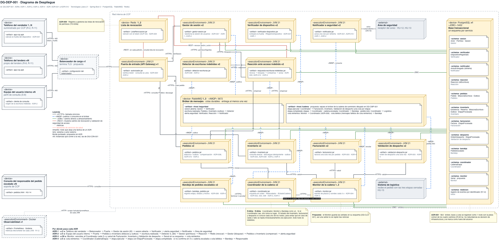

# Vista de despliegue — Reto 2 CCP (v7)

Esta página dibuja dónde corre cada componente, con qué tecnología, por qué protocolo se hablan los nodos y qué pieza queda como instancia única. Es un solo diagrama con los dos caminos del reto, porque los dos comparten el bróker y la base. Es la única vista que nombra productos.

**Estado: propuesta.** Los diez ADR de [adrs-ccp-reto2.md](adrs-ccp-reto2.md) están en estado Propuesta. La pila (Java 21 y Spring Boot 3, PostgreSQL, RabbitMQ y Redis) es el supuesto SUP-01 de ese documento: ningún producto viene del enunciado. La portada de los diagramas está en [diagramas-ccp-reto2.md](diagramas-ccp-reto2.md).

**Fuente: draw.io.** El diagrama vive en [vista-despliegue.drawio](https://app.diagrams.net/#Uhttps%3A%2F%2Fraw.githubusercontent.com%2FMATI-MBIT%2Farqsoft-reto-2%2Fmain%2Fdocs%2Fmodelos%2Fdrawio%2Fvista-despliegue.drawio), que se abre en draw.io web ([descargar](drawio/vista-despliegue.drawio)). La imagen de esta página se exporta de ese archivo; un cambio se hace en el draw.io y después se vuelve a exportar.

## Leyenda

| Notación | Significado |
|---|---|
| Cubo «device» | Nodo físico o virtual: un teléfono, un equipo, el balanceador o el nodo de un producto comprado (Redis, RabbitMQ, PostgreSQL) |
| Cubo «executionEnvironment» | Entorno de ejecución; aquí, la JVM 21 que corre cada servicio, o el Docker de la observabilidad |
| Cubo gris «external» | Actor o sistema fuera del alcance que recibe algo del sistema: el Área de seguridad y el Sistema de logística |
| «artifact» (hoja con esquina doblada) | Lo que se despliega en el nodo. Dentro de RabbitMQ son los vhosts con sus temas; dentro de PostgreSQL, los «schema» de cada servicio |
| ×N · 1..N | Número de instancias que corren a la vez. ×1 marca una pieza sin réplica y ×2 un servicio con dos instancias. Un rango como 1..2 o 1..3 indica entre cuántas instancias corre el nodo (Redis, RabbitMQ, Monitor). En los dispositivos, ×N o 1..N indica que hay muchos |
| Línea negra continua | «HTTPS»: llamada síncrona, con la operación que invoca |
| Línea azul discontinua | «AMQP»: el servicio publica o consume en el bróker |
| Línea verde continua | «JDBC»: el servicio escribe y lee en su esquema de la base |
| Línea roja continua | «REST»: lectura o escritura en Redis |
| Línea «HTTPS» salud | Sondeo de salud del Monitor hacia Facturación, Inventario y Validación de despacho. En la imagen se ve negra como las demás «HTTPS»; se distingue por el rótulo «salud» |
| Línea gris punteada | Recolección de métricas desde cada JVM |
| Arco en una línea | Cruce de dos rutas que no se tocan |
| Amarillo | Nodo que aloja una táctica de un ADR |
| Borde punteado | Propuesta sin ADR que la respalde |
| Marco «Red interna de CCP» | Lo que corre dentro de la red de CCP. Los dispositivos, el balanceador y los externos quedan fuera |
| Nota | ADR, riesgo o propuesta anclada al nodo |
| Franja «Por dónde pasa cada ASR» | El recorrido de cada ASR, nodo por nodo, con su medida |

---

## DG-DEP-001 · Dónde corre cada componente y qué queda único

| Tipo | ASR | ADR | Estado |
|---|---|---|---|
| Despliegue | ASR-1 a ASR-4 | ADR-001 a ADR-010 | propuesta |

| Nodo | Instancias | Componentes que corren ahí | De dónde sale |
|---|---|---|---|
| Teléfono del vendedor | 1..N | App móvil, que calcula la huella del dispositivo. Lo suministra CCP (R-2, R-11) | contexto · ADR-007 |
| Teléfono del tendero | ×N | App móvil. Es del tendero (R-8, R-11) | contexto |
| Equipo del usuario interno | ×N | Cliente de consulta del perfil de solo consulta (S-8). Es el origen de la escritura indebida | contexto · S-8 |
| Consola del responsable del pedido escalado | ×N | Navegador con el que el Responsable del pedido escalado atiende la Bandeja (HU-14). El diagrama la rotula «soporte de CCP»; ver la [PREGUNTA] de la vista de componentes | **propuesta** |
| Balanceador de carga | ×1 | Termina TLS y entrega las peticiones a la Puerta | **propuesta** |
| Puerta de entrada | ×1 | Puerta de entrada de la API | ADR-009 |
| Gestor de sesión | ×2 | Gestor de sesión | ADR-007 · ADR-009 |
| Verificador de dispositivo | ×2 | Verificador de dispositivo | ADR-007 |
| Notificador a seguridad | ×2 | Notificador a seguridad. La deduplicación por `idAlerta` es **propuesta** | ADR-007 · ADR-010 |
| Detector de escrituras indebidas | ×2 | Detector de escrituras indebidas | ADR-008 |
| Reacción ante acceso indebido | ×2 | Reacción ante acceso indebido | ADR-009 · ADR-010 |
| Pedidos | ×2 | Pedidos, con su relevo del outbox | ADR-008 · ADR-010 |
| Inventario | ×2 | Inventario, con su relevo del outbox. También es la etapa de descargue | ADR-005 · ADR-008 · ADR-010 |
| Facturación | ×2 | Facturación | ADR-005 |
| Validación de despacho | ×2 | Validación de despacho | ADR-005 |
| Coordinador de la cadena | ×2 | Coordinador de la cadena, con su Reanudador. Si una instancia cae, la otra toma su lugar; el servicio no guarda estado en memoria, porque cada nodo lee de la base el estado de facturación, inventario y despacho. La segunda instancia es **propuesta**: ADR-002 fija una sola (R-002a) | ADR-002 · ADR-003 · ADR-006 · **propuesta** |
| Bandeja de pedidos escalados | ×2 | Bandeja de pedidos escalados. La segunda instancia es **propuesta** | ADR-006 · **propuesta** |
| Monitor de la cadena | 1..3 | Monitor de la cadena. Su esquema propio para `Senal` es **propuesta**. Las instancias adicionales son **propuesta**: ADR-004 deja abierta la opción de dos Monitores con un candado en la base (R-004a) | ADR-004 · **propuesta** |
| Área de seguridad | — | Externo. Recibe los avisos; el canal está abierto (CN-12) | contexto |
| Sistema de logística | — | Externo. Desencola `pedido.listo` | contexto · S-2 |
| Redis | 1..2 | Lista de revocación: claves `jti` e `idActor` que vencen con el token, que vive 15 min (SUP-05). La segunda instancia es **propuesta** | ADR-009 · SUP-01 · SUP-05 · **propuesta** |
| RabbitMQ | 1..3 | Bróker con dos vhosts. `/seguridad`: `sesion.abierta`, `escritura.realizada`, `alerta.seguridad`. `/cadena`: `etapa.ejecutar`, `etapa.completada`, `cadena.escalada`, `pedido.listo`, `cola.reintentos` y `cola.fallidos`. La separación en vhosts y las instancias adicionales son **propuesta** | ADR-001 · ADR-006 · **propuesta** |
| PostgreSQL | ×1 | Base transaccional con un esquema por servicio: `CadenaEtapa` en el del Coordinador, `EtapaProcesada` y el efecto en el de cada etapa, la bitácora y el outbox en los de Pedidos e Inventario, `Reaccion`, `DispositivoRegistrado`, `Senal` y el registro de eventos para medir (R-12) | ADR-001 · ADR-002 · ADR-005 · ADR-008 · ADR-010 |
| Observabilidad | ×1 | Prometheus y Grafana, con las métricas de cada JVM | **propuesta** · R-12 |

| ID | Táctica (curso) | Nodo | ADR | Precio → cobra a |
|---|---|---|---|---|
| DIS-11 | Réplicas de servicios sin estado en memoria: cualquier instancia atiende | Once servicios ×2, entre ellos el Coordinador y la Bandeja · Puerta ×1 · Monitor 1..3 · Balanceador delante de la Puerta | **propuesta** | El estado sale a la base (×1), el bróker (1..3) y la Lista (1..2), y la base queda como pieza única → disponibilidad de todos los caminos. La Puerta y el Balanceador corren ×1 → disponibilidad del borde. Dos instancias pueden tomar el mismo trabajo → exige clave única en `Reaccion` (`idEscritura`) y en los avisos (`idAlerta`) |
| SEG-13 | La revocación vive fuera de la Puerta, así que sobrevive a su reinicio y la Reacción la escribe sin pasar por ella | Redis 1..2 | ADR-009 | En el camino de cada petición → disponibilidad del borde (R-1, TO-009a). La segunda instancia de Redis es **propuesta** |
| INT-08 · DIS-15 | Orquestación con estado persistido: el estado sobrevive a la caída del Coordinador porque vive en la base | Coordinador ×2 · PostgreSQL | ADR-002 · **propuesta** | Si una instancia cae, la otra toma su lugar; la segunda instancia es **propuesta**, porque ADR-002 fija una sola (R-002a). Ningún ADR fija cómo se evita que las dos coordinen el mismo pedido [PREGUNTA] → ASR-4 |
| DIS-04 · DIS-03 · DIS-01 | Monitor dedicado: barre los plazos vencidos por pedido y etapa, y sondea la salud de las tres etapas | Monitor 1..3 · rutas hacia Facturación, Inventario y Validación de despacho · esquema `monitor` (**propuesta**) | ADR-004 · **propuesta** | Las instancias adicionales son **propuesta**: ADR-004 solo deja abierta la opción de dos Monitores con un candado en la base (R-004a). Sin ese candado, dos instancias pueden emitir la misma señal → ASR-3. Pide las vencidas al Coordinador (CN-33), así que queda ciego si caen las dos instancias de este, y nadie vigila al Coordinador → ASR-3. Tráfico de sondeo cada 5 s por instancia → desempeño |
| DIS-17 · SEG-18 | Cada servicio escribe en su propio esquema; el efecto, la bitácora, el outbox y `EtapaProcesada` van en la misma transacción | PostgreSQL ×1 · doce esquemas | ADR-001 · ADR-005 · ADR-008 | Una o dos filas más por escritura → desempeño. La bitácora vive en la misma base que el actor escribió → SEG-18 se cumple solo en parte |
| MOD-04 · DIS-12 · DIS-14 | Colas durables; lo que la Cola de reintentos no entrega va a `cola.fallidos`, que consume la Bandeja | RabbitMQ 1..3 · vhost `/cadena` | ADR-001 · ADR-006 | Pieza común de los cuatro caminos (R-001a). Las instancias adicionales son **propuesta**; la nota ADR-001 · S-3 del diagrama todavía deja la redundancia del bróker fuera del alcance |

**Qué muestra:** los servicios sin estado en memoria corren con dos instancias, salvo la Puerta, que corre con una, y el Monitor, que corre con una a tres. El Coordinador y la Bandeja también corren con dos; según la nota del diagrama, si un Coordinador cae, el otro toma su lugar. El estado vive en la base, el bróker (1..3) y la Lista (1..2), y la base es la única de las tres que queda como instancia única. El Sistema de logística aparece como externo que desencola `pedido.listo` por «AMQP», y la ruta «JDBC» del Monitor a su esquema es **propuesta**: ningún conector de los ADR la fija. · **Decisión que refleja:** ADR-001 (bróker y base), ADR-002 (el Coordinador con su estado en la base), ADR-004 (el Monitor y el sondeo), ADR-005 (la clave única en la base de cada etapa), ADR-006 (la Cola de reintentos y la Bandeja), ADR-008 (el outbox) y ADR-009 (la Lista consultada desde el borde). · **Qué no muestra:** la nube, el orquestador de contenedores y la redundancia de la base, porque S-3 deja las fallas de infraestructura fuera del alcance. Tampoco muestra cómo se evita que dos Coordinadores o dos Monitores tomen el mismo pedido.

**La redundancia del Coordinador y del Monitor va más allá de los ADR.** El catálogo del curso pide, para disponibilidad, un despliegue con la redundancia visible, y este diagrama la dibuja también en las piezas centrales. Ningún ADR la respalda: ADR-002 fija un solo Coordinador (R-002a), y ADR-004 solo deja abierta la opción de dos Monitores con un candado en la base (R-004a). Mientras el equipo no actualice esos ADR, las réplicas del Coordinador, el Monitor y la Bandeja son **propuesta**, y su mecanismo de coordinación es [PREGUNTA].
