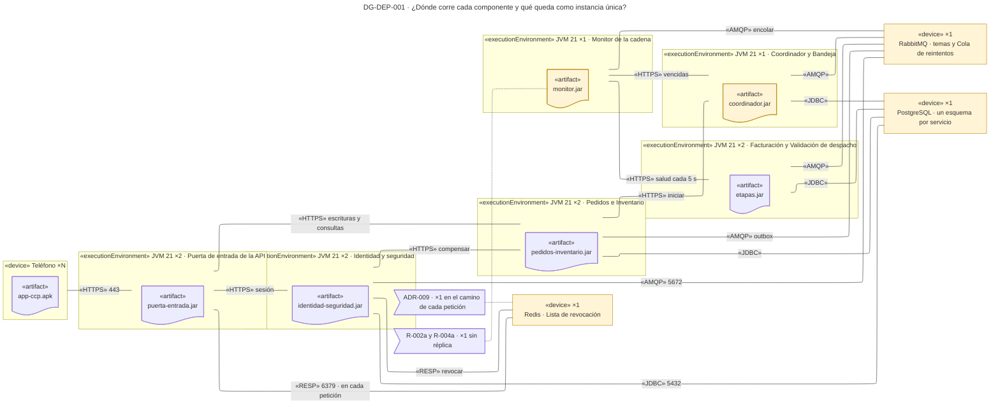

# Vista de despliegue — Reto 2 CCP (v7)

Esta página dibuja dónde corre cada componente, con qué tecnología, por qué protocolo se hablan los nodos y qué pieza queda como instancia única. Es un solo diagrama con los dos caminos del reto, porque los dos comparten el bróker y la base. Es la única vista que nombra productos.

**Estado: propuesta.** Los diez ADR de [adrs-ccp-reto2.md](adrs-ccp-reto2.md) están en estado Propuesta. La pila (Java 21 y Spring Boot 3, PostgreSQL, RabbitMQ y Redis) es el supuesto SUP-01 de ese documento: ningún producto viene del enunciado. La portada de los diagramas está en [diagramas-ccp-reto2.md](diagramas-ccp-reto2.md).

**Fuente: draw.io.** El original es [drawio/vista-despliegue.drawio](drawio/vista-despliegue.drawio). La imagen se exporta de ese archivo, y el bloque Mermaid que la sigue es una copia.

## Leyenda

| Notación | Significado |
|---|---|
| Cubo «device» | Nodo físico o virtual: un teléfono o el nodo de un producto comprado |
| Cubo «executionEnvironment» | Entorno de ejecución; aquí, la JVM que corre el servicio |
| «artifact» (hoja con esquina doblada) | Lo que se despliega en el nodo |
| ×N | Número de instancias. ×1 marca una pieza sin réplica |
| Línea sin punta | Ruta de comunicación, con su protocolo y su puerto. Un arco marca el cruce de dos rutas que no se tocan |
| Amarillo | Nodo que aloja una táctica de un ADR o un riesgo de instancia única |
| Nota | ADR o riesgo anclado al nodo |
| Aproximación en la copia Mermaid | Mermaid no dibuja el cubo 3D del nodo UML; el marco con «device» o «executionEnvironment» lo reemplaza |

---

## DG-DEP-001 · Dónde corre cada componente y qué queda único

| Tipo | ASR | ADR | Estado |
|---|---|---|---|
| Despliegue | ASR-1 a ASR-4 | ADR-001 a ADR-010 | propuesta |

| Nodo | Instancias | Componentes que corren ahí | De dónde sale |
|---|---|---|---|
| Teléfono | ×N | App móvil. El del vendedor lo suministra CCP (R-2); el del tendero es suyo (R-11) | contexto |
| Puerta de entrada | ×2 | Puerta de entrada de la API | ADR-009 |
| Identidad y seguridad | ×2 | Gestor de sesión, Verificador de dispositivo, Detector de escrituras indebidas, Reacción ante acceso indebido, Notificador a seguridad | **propuesta**: agrupa lo que observa la sesión y la escritura |
| Pedidos e Inventario | ×2 | Pedidos e Inventario, con su relevo del outbox | **propuesta**: son las dos funciones que escriben (ADR-008) |
| Facturación y Validación de despacho | ×2 | Las dos etapas que sondea el Monitor | **propuesta** |
| Coordinador y Bandeja | ×1 | Coordinador de la cadena, Bandeja de pedidos escalados | ADR-002; la Bandeja junto al Coordinador es **propuesta** |
| Monitor de la cadena | ×1 | Monitor de la cadena | ADR-004 |
| Redis | ×1 | Lista de revocación | ADR-009 |
| RabbitMQ | ×1 | Bróker: `sesion.abierta`, `escritura.realizada`, `alerta.seguridad`, `etapa.ejecutar`, `etapa.completada`, `cadena.escalada`, `pedido.listo` y la Cola de reintentos | ADR-001 · ADR-006 |
| PostgreSQL | ×1 | Base transaccional con un esquema por servicio: `CadenaEtapa` en el del Coordinador, `EtapaProcesada` y el efecto en el de cada etapa, la bitácora y el outbox en el de Pedidos e Inventario | ADR-001 · ADR-002 · ADR-005 · ADR-008 |

| ID | Táctica (curso) | Nodo | ADR | Precio → cobra a |
|---|---|---|---|---|
| DIS-11 | Réplicas de servicios sin estado en memoria: cualquier instancia atiende | Los cuatro nodos ×2 | **propuesta** | El estado sale a la base, el bróker y la Lista, que quedan ×1 → disponibilidad de esos tres |
| SEG-13 | La revocación vive fuera de las instancias de la Puerta, así que alcanza a las dos | Redis | ADR-009 | En el camino de cada petición → disponibilidad del borde (R-1, TO-009a) |
| INT-08 · DIS-15 | Orquestación con estado persistido: el estado sobrevive a la caída del Coordinador porque vive en la base | Coordinador ×1 · PostgreSQL | ADR-002 | Si el Coordinador cae, ninguna cadena avanza hasta que vuelva → ASR-4 (R-002a) |
| DIS-03 · DIS-01 | Monitor dedicado que sondea la salud de las etapas | Monitor ×1 · ruta hacia Facturación y Validación de despacho | ADR-004 | Si el Monitor cae, nadie detecta nada → ASR-3 (R-004a). Tráfico de sondeo cada 5 s → desempeño |
| MOD-04 · DIS-14 | Colas durables; lo que la Cola de reintentos no entrega va a la Bandeja | RabbitMQ | ADR-001 · ADR-006 | Pieza común de los cuatro caminos (R-001a) |

**Qué muestra:** los servicios sin estado en memoria corren con dos instancias, y todo su estado vive en tres piezas únicas: la base, el bróker y la Lista de revocación. El Coordinador y el Monitor corren como instancia única, y ese es el precio que ADR-002 y ADR-004 aceptaron. · **Decisión que refleja:** ADR-001 (bróker y base), ADR-002 (Coordinador ×1), ADR-004 (Monitor ×1 y el sondeo), ADR-005 (la clave única en la base de cada etapa), ADR-006 (la Cola de reintentos y la Bandeja), ADR-008 (el outbox) y ADR-009 (la Lista consultada desde el borde). · **Qué no muestra:** la nube, el orquestador de contenedores, la red y la redundancia de la base, el bróker y la Lista, porque S-3 deja las fallas de infraestructura fuera del alcance. Tampoco muestra Logística, cuyo protocolo de entrada no está definido, ni la ruta del Monitor a la base, que ningún conector de los ADR fija.

**Por qué no se dibuja redundancia en el Coordinador ni en el Monitor.** El catálogo del curso pide, para disponibilidad, un despliegue con la redundancia visible. Aquí la redundancia visible es la de los servicios ×2; la de las dos piezas centrales no existe todavía. ADR-004 deja abierta la opción de dos Monitores con un candado en la base (R-004a), y ningún ADR propone un segundo Coordinador. Cuando uno lo decida, este diagrama cambia.

### Copia en Mermaid

