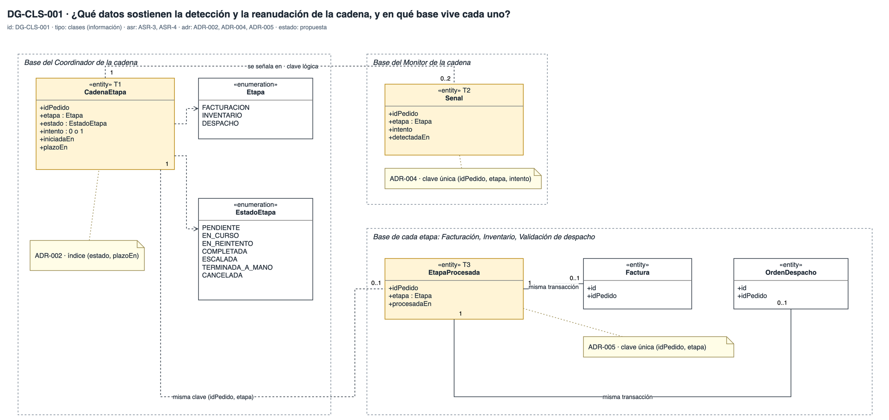
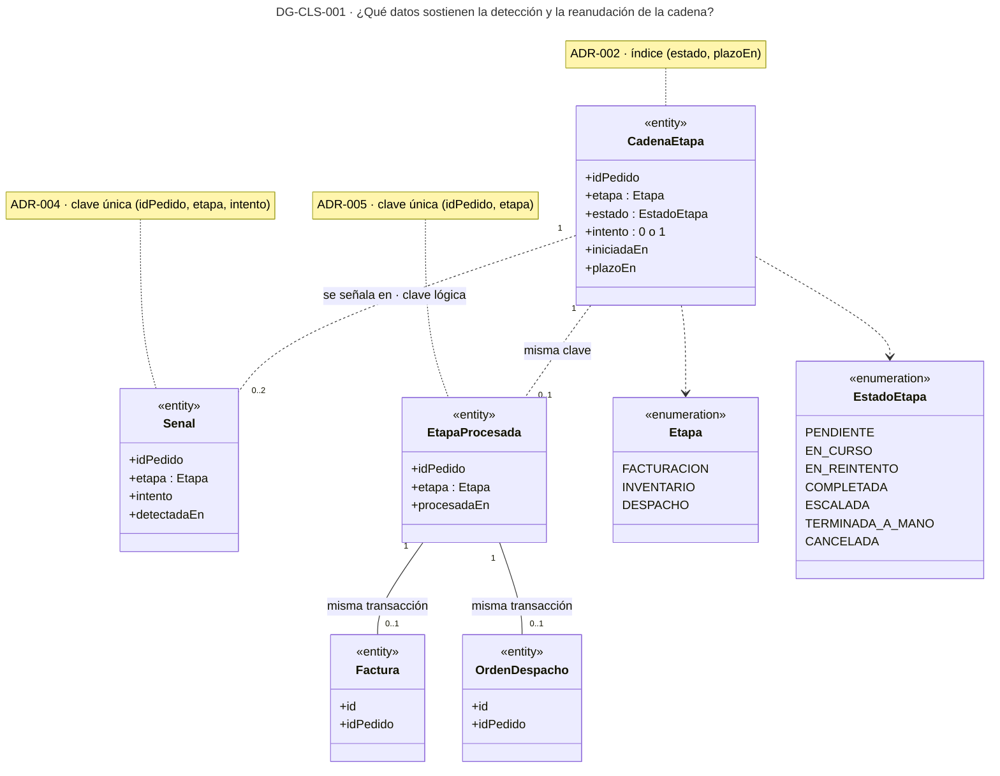
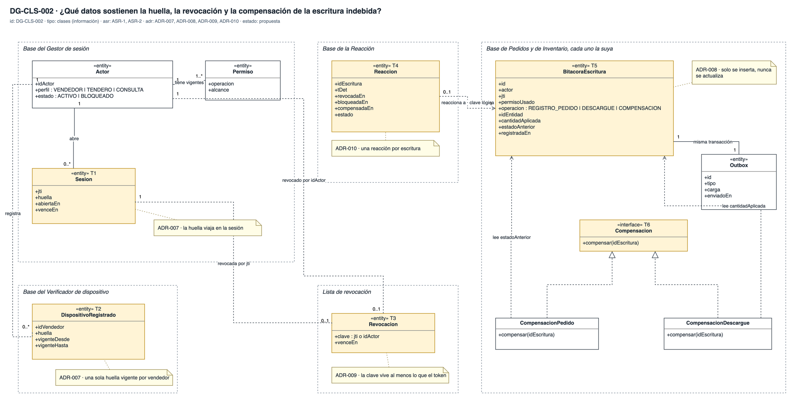
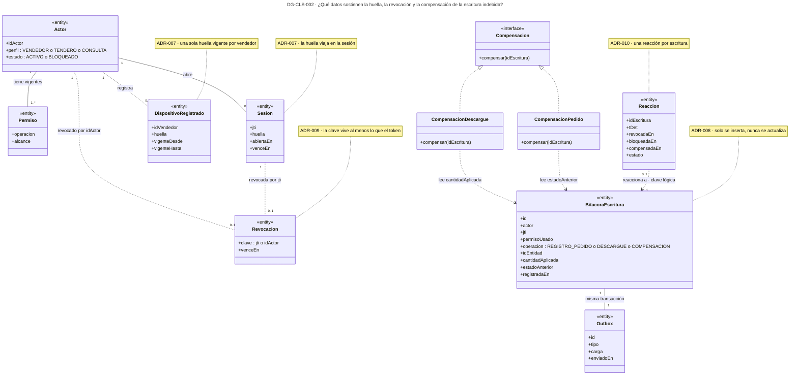
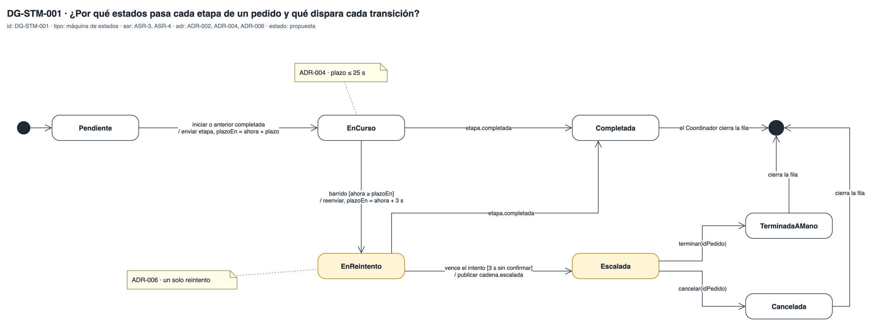
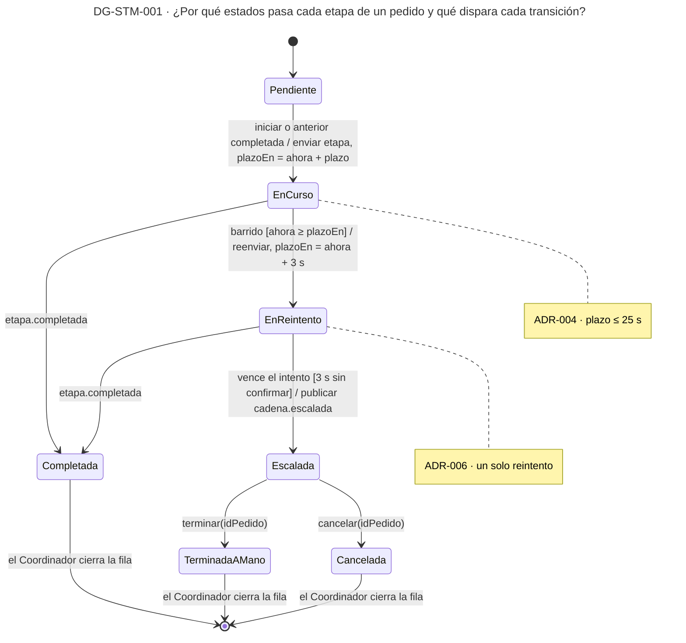

# Vista de información — Reto 2 CCP (v7)

Esta página dibuja los datos que sostienen las tácticas y el ciclo de vida de la etapa de un pedido. Dos diagramas de clases responden qué fila guarda cada decisión, quién es su dueño y en qué base vive: uno para la cadena y otro para la seguridad. Una máquina de estados responde por qué estados pasa cada etapa y qué evento dispara cada cambio.

**Estado: propuesta.** Los diez ADR de [adrs-ccp-reto2.md](adrs-ccp-reto2.md) están en estado Propuesta. La portada de los diagramas, con la matriz de trazabilidad y los huecos, está en [diagramas-ccp-reto2.md](diagramas-ccp-reto2.md). Las partes que son dueñas de cada dato están en la [vista de componentes](vista-componentes.md).

**Fuente: draw.io.** El original es [vista-informacion.drawio](https://app.diagrams.net/#Uhttps%3A%2F%2Fraw.githubusercontent.com%2FMATI-MBIT%2Farqsoft-reto-2%2Fmain%2Fdocs%2Fmodelos%2Fdrawio%2Fvista-informacion.drawio), que se abre en draw.io web ([descargar](drawio/vista-informacion.drawio)), con una pestaña por diagrama. La imagen de cada sección se exporta de ese archivo, y el bloque Mermaid que la sigue es una copia.

## Cómo leer esta página

| Diagrama | Qué responde | ASR · ADR |
|---|---|---|
| DG-CLS-001 | Qué datos sostienen la detección y la reanudación de la cadena, y en qué base vive cada uno | ASR-3, ASR-4 · ADR-002, ADR-004, ADR-005 |
| DG-CLS-002 | Qué datos sostienen la huella, la revocación y la compensación de la escritura indebida | ASR-1, ASR-2 · ADR-007 a ADR-010 |
| DG-STM-001 | Por qué estados pasa cada etapa de un pedido y qué dispara cada transición | ASR-3, ASR-4 · ADR-002, ADR-004, ADR-006 |

## Leyenda

| Notación | Significado |
|---|---|
| «entity» | Clase que se guarda: una tabla o un registro con dueño |
| «enumeration» | Conjunto cerrado de valores |
| «interface» | Contrato sin estado; la flecha discontinua con triángulo hueco dice quién lo realiza |
| Marco con línea discontinua | La base de un servicio. Cada servicio tiene la suya (ADR-001) |
| Línea continua con multiplicidades | Asociación dentro de la misma base: cuántos de cada lado |
| Línea discontinua con multiplicidades | Relación por clave lógica entre bases distintas, sin llave foránea |
| Flecha discontinua | Dependencia: una clase usa a la otra |
| `evento [guarda] / acción` | Transición de una máquina de estados: qué la dispara, qué debe cumplirse y qué hace |
| T1, T2… · amarillo | Clase o estado que sostiene una táctica; la tabla bajo el diagrama dice cuál |
| Nota | ADR y regla de la clave o del estado |

---

## DG-CLS-001 · Los datos de la cadena, las señales y las etapas procesadas

| Tipo | ASR | ADR | Estado |
|---|---|---|---|
| Clases (información) | ASR-3 · ASR-4 | ADR-002 · ADR-004 · ADR-005 | propuesta |

| Marca | Clase | Dueño | Táctica que sostiene | ID |
|---|---|---|---|---|
| T1 | CadenaEtapa | Coordinador de la cadena · RepositorioCadena | Estado por pedido y etapa, que el Monitor lee con el índice por estado y plazo | DIS-15 · DIS-04 |
| T2 | Senal | Monitor de la cadena · RegistroSenales | Una sola señal por pedido, etapa e intento | DIS-03 |
| T3 | EtapaProcesada | Cada etapa: Facturación, Inventario y Validación de despacho | Idempotencia: la fila y el efecto se escriben en la misma transacción | DIS-17 |
| — | Factura · OrdenDespacho | Facturación · Validación de despacho | El efecto que no puede duplicarse | DIS-17 |

**Qué muestra:** qué fila sostiene cada táctica y en qué base vive. `CadenaEtapa` vive en la base del Coordinador; `EtapaProcesada`, en la de cada etapa, junto a su efecto; `Senal`, en la del Monitor. La relación entre las tres es por clave lógica. · **Decisión que refleja:** ADR-002 (estado por etapa), ADR-004 (la señal única) y ADR-005 (la clave única). · **Qué no muestra:** las columnas de negocio del pedido, la factura y la orden, ni el descargue de Inventario, que usa la misma `EtapaProcesada` con la etapa INVENTARIO. Tampoco resuelve dónde guarda el Monitor sus señales: la base del Monitor está dibujada, pero ningún ADR la decide.

### Copia en Mermaid

---

## DG-CLS-002 · Los datos de identidad, de la bitácora y de la reacción

| Tipo | ASR | ADR | Estado |
|---|---|---|---|
| Clases (información) | ASR-1 · ASR-2 | ADR-007 · ADR-008 · ADR-009 · ADR-010 | propuesta |

| Marca | Clase | Dueño | Táctica que sostiene | ID |
|---|---|---|---|---|
| — | Actor · Permiso | Gestor de sesión · RepositorioIdentidad | El Detector lee los permisos vigentes; el bloqueo cambia el estado del actor | SEG-14 |
| T1 | Sesion | Gestor de sesión | La huella entra en la sesión | SEG-02 |
| T2 | DispositivoRegistrado | Verificador de dispositivo · RegistroDispositivos | La huella contra la cual se compara, con el registro previo del cambio legítimo | SEG-09 |
| T3 | Revocacion | Lista de revocación | La clave de la sesión (`jti`) o del actor (`idActor`) que la Puerta rechaza | SEG-13 |
| T4 | Reaccion | Reacción ante acceso indebido · RegistroReacciones | Una reacción por escritura, con las marcas de tiempo que prueban los 5 s | SEG-13 · SEG-14 |
| T5 | BitacoraEscritura · Outbox | Pedidos e Inventario, cada uno en su base | Registro de auditoría y evento en la misma transacción de la escritura | SEG-18 · DIS-17 |
| T6 | Compensacion y sus dos realizaciones | Pedidos (anula el pedido) e Inventario (suma lo descontado) | Rollback por compensación | DIS-13 |

**Qué muestra:** que la huella se guarda en dos lugares con dueños distintos: la sesión lleva la huella con la que se abrió y el registro lleva la huella vigente del vendedor. También muestra por qué la bitácora guarda la cantidad descontada y no solo la cifra final: sumarla conserva los descargues legítimos que llegaron después. · **Decisión que refleja:** ADR-007 (huella), ADR-008 (bitácora y outbox), ADR-009 (revocación) y ADR-010 (bloqueo, reacción y compensación). · **Qué no muestra:** los identificadores del equipo que forman la huella, que siguen sin definir, ni el pedido y la existencia, que estas decisiones no cambian.

**Los estados de la sesión y del actor.** La v6 los dibujaba en su propia máquina de estados. En la v7 viven como atributos: `Actor.estado` pasa de ACTIVO a BLOQUEADO cuando la Reacción lo bloquea, y una `Revocacion` con el `jti` corta la sesión viva hasta que la clave vence. El orden, revocar antes de bloquear, está en la caja blanca de la Reacción, en DG-CMP-002.

**La bitácora frente al catálogo.** El registro de auditoría del curso (SEG-18) pide una traza separada, que solo crece y que queda fuera del alcance del atacante. Esta bitácora solo crece, pero vive en la misma base del servicio que el actor escribió. Cumple lo que ASR-2 necesita, que es el estado anterior para compensar, y no cumple la separación, que queda en los huecos de la portada.

### Copia en Mermaid

---

## DG-STM-001 · Los estados de cada etapa de un pedido

| Tipo | ASR | ADR | Estado |
|---|---|---|---|
| Máquina de estados | ASR-3 · ASR-4 | ADR-002 · ADR-004 · ADR-006 | propuesta |

| Estado | Valor en `CadenaEtapa.estado` | Qué lo produce |
|---|---|---|
| Pendiente | PENDIENTE | La cadena existe, pero la etapa anterior no ha terminado |
| EnCurso | EN_CURSO | El Coordinador envió la etapa y anotó su plazo |
| EnReintento | EN_REINTENTO | El barrido encontró el plazo vencido y el Reanudador reenvió la etapa |
| Completada | COMPLETADA | La etapa confirmó, en su primer intento o en el reintento |
| Escalada | ESCALADA | El reintento no confirmó en 3 s; el pedido está en la Bandeja |
| TerminadaAMano · Cancelada | TERMINADA_A_MANO · CANCELADA | El responsable del pedido escalado lo termina o lo cancela desde la Bandeja, por `terminar` o `cancelar` de `IEstadoCadena` (HU-14) |

**Qué muestra:** el camino de fallo completo de ASR-3 y ASR-4 en una sola fila: en curso, plazo vencido, un reintento y escalamiento. Cada transición de fallo tiene su guarda numérica. · **Decisión que refleja:** ADR-002 (el estado se guarda), ADR-004 (la guarda del plazo) y ADR-006 (un reintento de 3 s). · **Qué no muestra:** qué pasa si la etapa confirma cuando la fila ya está Escalada. Ningún ADR lo decide, y la actualización condicional de DG-CON-003 hoy la ignora (ver Huecos).

### Copia en Mermaid

