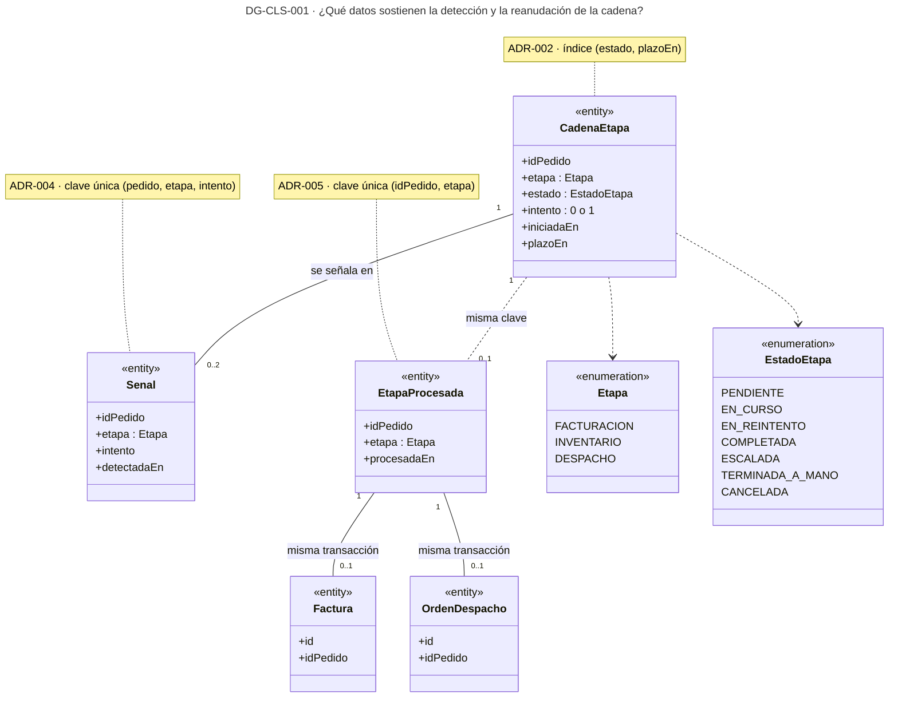
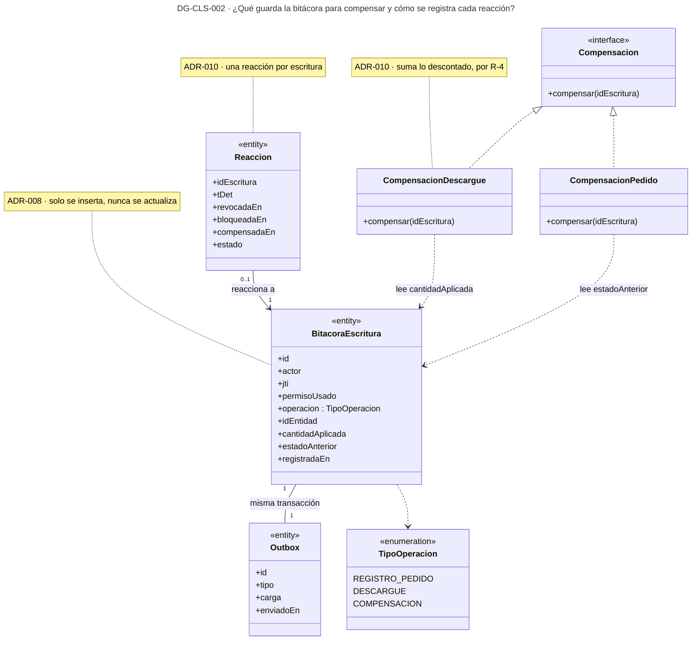
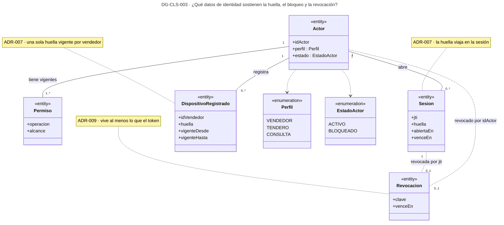
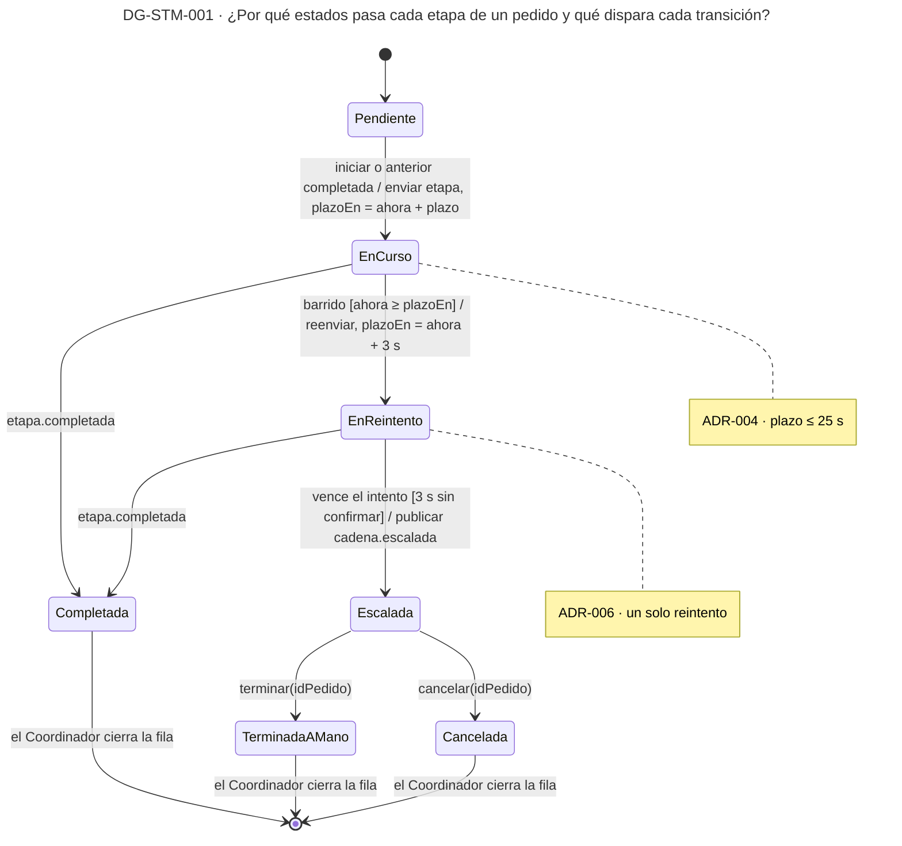
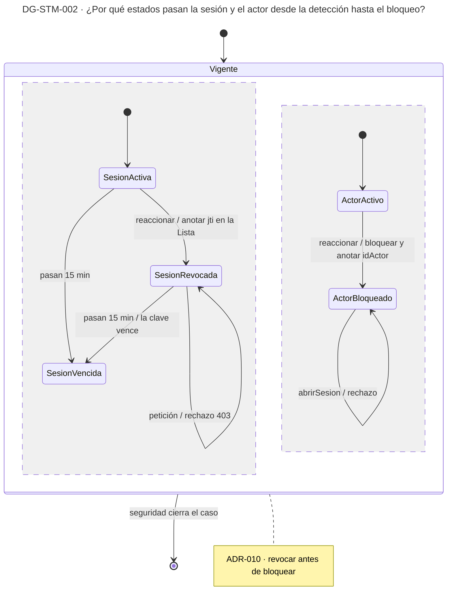

# Vista de información — Reto 2 CCP (v6)

Esta página dibuja los datos que sostienen las tácticas y el ciclo de vida de los que cambian de estado. Tres diagramas de clases responden qué fila guarda cada decisión y quién es su dueño. Dos máquinas de estados responden por qué estados pasan la etapa de un pedido, la sesión y el actor, y qué evento dispara cada cambio.

**Estado: propuesta.** Los diez ADR de [adrs-ccp-reto2.md](adrs-ccp-reto2.md) están en estado Propuesta. La portada de los diagramas, con la matriz de trazabilidad y los huecos, está en [diagramas-ccp-reto2.md](diagramas-ccp-reto2.md). Las partes que son dueñas de cada dato están en la [vista de componentes](vista-componentes.md).

## Cómo leer esta página

| Diagrama | Qué responde | ASR · ADR |
|---|---|---|
| DG-CLS-001 | Qué datos sostienen la detección y la reanudación de la cadena | ASR-3, ASR-4 · ADR-002, ADR-004, ADR-005 |
| DG-CLS-002 | Qué guarda la bitácora para poder compensar, y cómo se registra cada reacción | ASR-2 · ADR-008, ADR-010 |
| DG-CLS-003 | Qué datos de identidad sostienen la huella, el bloqueo y la revocación | ASR-1, ASR-2 · ADR-007, ADR-009, ADR-010 |
| DG-STM-001 | Por qué estados pasa cada etapa de un pedido y qué dispara cada transición | ASR-3, ASR-4 · ADR-002, ADR-004, ADR-006 |
| DG-STM-002 | Por qué estados pasan la sesión y el actor desde la detección hasta el bloqueo | ASR-2 · ADR-009, ADR-010 |

Los ID DG-CLS-001, DG-CLS-002, DG-STM-001 y DG-STM-002 son los del plan de diagramas de los ADR. DG-CLS-003 es nuevo en esta versión.

## Leyenda

| Notación | Significado |
|---|---|
| «entity» | Clase que se guarda: una tabla o un registro con dueño |
| «enumeration» | Conjunto cerrado de valores |
| «interface» | Contrato sin estado; la línea discontinua con triángulo hueco dice quién lo realiza |
| Línea continua con multiplicidades | Asociación: cuántos de cada lado |
| Línea discontinua sin punta | Relación por clave lógica entre bases distintas, sin llave foránea |
| Flecha discontinua | Dependencia: una clase usa a la otra |
| `evento [guarda] / acción` | Transición de una máquina de estados: qué la dispara, qué debe cumplirse y qué hace |
| Nota | ADR y regla de la clave o del estado |

Cada servicio tiene su propia base (ADR-001). Las relaciones entre clases que viven en servicios distintos van por clave lógica, no por llave foránea.

---

## DG-CLS-001 · Los datos de la cadena, las señales y las etapas procesadas

| Tipo | ASR | ADR | Estado |
|---|---|---|---|
| Clases (información) | ASR-3 · ASR-4 | ADR-002 · ADR-004 · ADR-005 | propuesta |

| Clase | Dueño | Táctica que sostiene | ID |
|---|---|---|---|
| CadenaEtapa | Coordinador de la cadena · RepositorioCadena | Estado por pedido y etapa, que el Monitor lee con el índice por estado y plazo | DIS-15 · DIS-04 |
| Senal | Monitor de la cadena · RegistroSenales | Una sola señal por pedido, etapa e intento | DIS-03 |
| EtapaProcesada | Cada etapa: Facturación, Inventario y Validación de despacho | Idempotencia: la fila y el efecto se escriben en la misma transacción | DIS-17 |
| Factura · OrdenDespacho | Facturación · Validación de despacho | El efecto que no puede duplicarse | DIS-17 |

**Qué muestra:** qué fila sostiene cada táctica y en qué base vive. `CadenaEtapa` vive en la base del Coordinador; `EtapaProcesada`, en la de cada etapa, junto a su efecto; `Senal`, en la del Monitor. La relación entre las tres es por clave lógica. · **Decisión que refleja:** ADR-002 (estado por etapa), ADR-004 (la señal única) y ADR-005 (la clave única). · **Qué no muestra:** las columnas de negocio del pedido, la factura y la orden, ni el descargue de Inventario, que usa la misma `EtapaProcesada` con la etapa INVENTARIO.

---

## DG-CLS-002 · Lo que la bitácora guarda para compensar

| Tipo | ASR | ADR | Estado |
|---|---|---|---|
| Clases (información y diseño) | ASR-2 | ADR-008 · ADR-010 | propuesta |

| Clase | Dueño | Táctica que sostiene | ID |
|---|---|---|---|
| BitacoraEscritura · Outbox | Pedidos e Inventario, cada uno en su base | Registro de auditoría y evento en la misma transacción de la escritura | SEG-18 · DIS-17 |
| Compensacion y sus dos realizaciones | Pedidos (anula el pedido) e Inventario (suma lo descontado) | Rollback por compensación | DIS-13 |
| Reaccion | Reacción ante acceso indebido · RegistroReacciones | Una reacción por escritura, con las marcas de tiempo que prueban los 5 s | SEG-13 · SEG-14 |

**Qué muestra:** por qué la bitácora guarda la cantidad descontada y no solo la cifra final: sumarla conserva los descargues legítimos que llegaron después. También muestra dónde queda la evidencia de los 5 s, en las marcas de tiempo de `Reaccion`. · **Decisión que refleja:** ADR-008 y ADR-010. · **Qué no muestra:** el pedido y la existencia, que estas decisiones no cambian.

**La bitácora frente al catálogo.** El registro de auditoría del curso (SEG-18) pide una traza separada, que solo crece y que queda fuera del alcance del atacante. Esta bitácora solo crece, pero vive en la misma base del servicio que el actor escribió. Cumple lo que ASR-2 necesita, que es el estado anterior para compensar. No cumple la separación, y eso queda en los huecos de la portada.

---

## DG-CLS-003 · Los datos de identidad: huella, bloqueo y revocación

| Tipo | ASR | ADR | Estado |
|---|---|---|---|
| Clases (información) | ASR-1 · ASR-2 | ADR-007 · ADR-009 · ADR-010 | propuesta |

| Clase | Dueño | Táctica que sostiene | ID |
|---|---|---|---|
| Actor · Permiso · Sesion | Gestor de sesión · RepositorioIdentidad | La huella entra en la sesión; el Detector lee los permisos vigentes; el bloqueo cambia el estado del actor | SEG-02 · SEG-14 |
| DispositivoRegistrado | Verificador de dispositivo · RegistroDispositivos | La huella contra la cual se compara, con el registro previo del cambio legítimo | SEG-09 |
| Revocacion | Lista de revocación | La clave de la sesión (`jti`) o del actor (`idActor`) que la Puerta rechaza | SEG-13 |

**Qué muestra:** que la huella se guarda en dos lugares con dueños distintos. La sesión lleva la huella con la que se abrió y el registro lleva la huella vigente del vendedor; el Verificador compara las dos. También muestra que una revocación vale por sesión o por actor, y que su clave tiene que vivir al menos los 15 min del token (S-009a). · **Decisión que refleja:** ADR-007 (huella), ADR-009 (revocación) y ADR-010 (bloqueo). · **Qué no muestra:** los identificadores del equipo que forman la huella, que siguen sin definir; ni el tendero, que tiene sesión pero ningún dispositivo registrado (R-11).

---

## DG-STM-001 · Los estados de cada etapa de un pedido

| Tipo | ASR | ADR | Estado |
|---|---|---|---|
| Máquina de estados | ASR-3 · ASR-4 | ADR-002 · ADR-004 · ADR-006 | propuesta |

| Estado | Valor en `CadenaEtapa.estado` | Qué lo produce |
|---|---|---|
| Pendiente | PENDIENTE | La cadena existe, pero la etapa anterior no ha terminado |
| EnCurso | EN_CURSO | El Coordinador envió la etapa y anotó su plazo |
| EnReintento | EN_REINTENTO | El barrido encontró el plazo vencido y el Reanudador reenvió la etapa |
| Completada | COMPLETADA | La etapa confirmó, en su primer intento o en el reintento |
| Escalada | ESCALADA | El reintento no confirmó en 3 s; el pedido está en la Bandeja |
| TerminadaAMano · Cancelada | TERMINADA_A_MANO · CANCELADA | El responsable del pedido escalado lo termina o lo cancela desde la Bandeja, por `terminar` o `cancelar` de `IEstadoCadena` (HU-14) |

**Qué muestra:** el camino de fallo completo de ASR-3 y ASR-4 en una sola fila: en curso, plazo vencido, un reintento y escalamiento. Cada transición de fallo tiene su guarda numérica. · **Decisión que refleja:** ADR-002 (el estado se guarda), ADR-004 (la guarda del plazo) y ADR-006 (un reintento de 3 s). · **Qué no muestra:** qué pasa si la etapa confirma cuando la fila ya está Escalada. Ningún ADR lo decide, y la actualización condicional de DG-CON-002 hoy la ignora (ver Huecos).

---

## DG-STM-002 · Los estados de la sesión y del actor

| Tipo | ASR | ADR | Estado |
|---|---|---|---|
| Máquina de estados | ASR-2 | ADR-009 · ADR-010 | propuesta |

**Qué muestra:** que la sesión y el actor son dos estados distintos que la Reacción cambia por separado. Revocar la sesión corta la petición siguiente aunque el token siga vigente; bloquear al actor impide que abra otra. Las dos marcas viven en la Lista de revocación mientras vive el token. · **Decisión que refleja:** ADR-009 (la revocación en la Lista) y ADR-010 (revocar primero, bloquear después). · **Qué no muestra:** qué hace la Puerta si la Lista no responde, que sigue sin decidir (TO-009a en los huecos de la portada), ni cómo se desbloquea a un actor, que es una decisión del área de seguridad.
