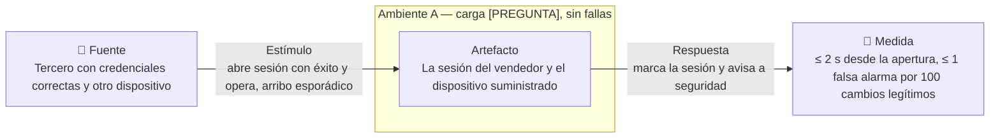
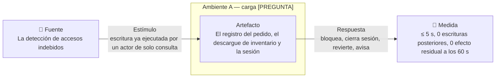
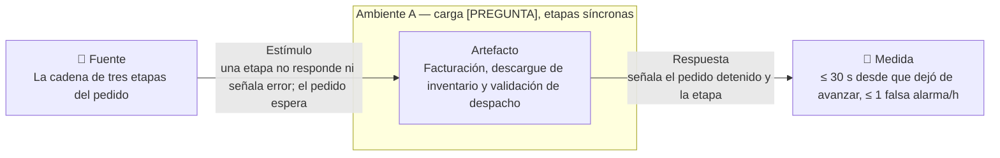
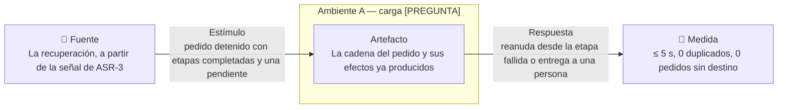

# ASRs de disponibilidad y seguridad

Alcance: los cuatro escenarios que el equipo acordó en la reunión del 18 de septiembre —dos de seguridad (suplantación y elevación de privilegios) y dos de disponibilidad (detección y reparación de la cadena que sigue a un pedido)— reescritos como escenarios de seis partes en el espacio del problema. Todo lo que en la reunión se dijo en términos de solución (gestor de sesión, huella del dispositivo, réplicas de lectura, registros de la base de datos, tabla de usuarios activos, cola de reintentos, equipo de soporte) sale de las seis partes y entra en la fila "cómo se cumpliría", como hipótesis que ADD confirmará o cambiará.

Vocabulario: el enunciado habla de **pedido**; en la reunión dijimos "compra" y "orden de compra". Aquí se usa pedido. La cadena que sigue al pedido tiene tres etapas, tal como las describimos: **facturación** (factura o documento de cobro diferido), **descargue de inventario** y **validación de despacho**; su cierre habilita a logística. El resto de los términos está en el [glosario](glossary.md).

## 1. Los ASRs

| ID | Atributo · rama | Enunciado corto | Amb. | Prioridad | Impacto | Origen |
|---|---|---|---|---|---|---|
| ASR-1 | Seguridad · detección | Detectar en ≤ 2 s que una sesión de vendedor abierta con credenciales correctas la opera un dispositivo que no es el suministrado, y avisar a seguridad | A | Alta | Medio | Reunión (ACR1) · STRIDE (S) |
| ASR-2 | Seguridad · reacción | Ante una escritura ya ejecutada por un actor cuyo permiso solo cubre consulta, bloquear al actor, cerrar su sesión y revertir la escritura en ≤ 5 s; escrituras posteriores del mismo actor = 0 | A | Alta | Medio | Reunión (ACR2) · STRIDE (E) |
| ASR-3 | Disponibilidad · detección | Detectar en ≤ 30 s que la cadena de un pedido confirmado quedó detenida en facturación, inventario o despacho sin señalar error, con ≤ 1 falsa alarma por hora | A | Alta | Alto | Reunión (ACR4) |
| ASR-4 | Disponibilidad · reparación | Reanudar la cadena detenida desde la etapa que falló, sin duplicar factura, descargue ni orden de despacho, en ≤ 5 s; lo que no se reanuda se entrega a una persona con el estado exacto | A | Alta | Alto | Reunión (ACR3) |

## 1b. De qué historia cuelga cada escenario

Un escenario de calidad no vive solo: se ata a la historia de usuario cuyo actor
lo sufre o lo recibe. Esa historia aporta la fuente, el estímulo y la respuesta;
la ficha de abajo aporta el ambiente y la medida.

| ASR | Historia | Actor | Por qué esa y no otra |
|---|---|---|---|
| ASR-1 | [HU-01](requirements.md) — Inicio de sesión desde el dispositivo suministrado | Vendedor | Es la historia donde la sesión se abre, que es el instante desde el que corren los 2 s |
| ASR-2 | [HU-13](requirements.md) — Reacción ante la escritura indebida | Área de seguridad | Es la única historia cuyo estímulo es una escritura ya ejecutada |
| ASR-3 | [HU-03](requirements.md) — Creación del pedido en la tienda | Vendedor | La cadena arranca al confirmarse el pedido, y desde ahí se mide que se detuvo |
| ASR-4 | [HU-14](requirements.md) — Recepción del pedido escalado | Responsable del pedido escalado | Es donde aterriza la segunda mitad de la respuesta: lo que no se reanuda va a una persona |

Las demás historias del árbol no cargan escenario propio. HU-09, HU-10 y HU-15
recorren la misma cadena que HU-03 y HU-14, y HU-12 recibe el aviso que HU-01
dispara: en los cuatro casos la medida ya está fijada por la historia a la que
se atan.

## 2. Ambientes

| Variable | A — normal | B — pico | C — degradado |
|---|---|---|---|
| Carga | `[PREGUNTA]` pedidos/min y consultas/min, 5 países | `[PREGUNTA]` factor sobre A | Igual a A |
| Patrón de arribo | Estocástico, con ráfagas por bodega | Ráfaga, duración `[PREGUNTA]` | Estocástico |
| Cadena del pedido | Las tres etapas responden; según la reunión, corren de forma síncrona tras la confirmación | Igual | Una etapa (facturación, inventario o despacho) no responde o no termina |
| Dispositivos | Cada vendedor opera desde el dispositivo que CCP le suministró; cambios de dispositivo `[PREGUNTA]` por mes | Igual | Igual |
| Alcance | Dentro | Dentro | Dentro solo para fallas de software |

Presupuesto compartido: ASR-3 + ASR-4 suman 35 s entre que la cadena se detiene y queda reanudada o en manos de una persona. Ese total debe ser menor que el tiempo que el tendero espera antes de ver su pedido "en preparación" (`[PREGUNTA]`).

## 2b. Matriz STRIDE

La reunión fijó dos celdas; las demás se listan con su razón, para que la omisión sea una decisión y no un olvido.

| STRIDE | Flujo de datos del dominio | Stakeholder (aux.) | Modo | Amb. | Resultado |
|---|---|---|---|---|---|
| **S** Suplantación | La sesión del vendedor desde un dispositivo no suministrado | Tercero con credenciales correctas vs. vendedor | Detección | A | **ASR-1** |
| **S** Suplantación | La sesión del vendedor | Tercero vs. vendedor | Reacción | A | Descartada por acuerdo de la reunión: la reacción la ejecuta el área de seguridad, fuera del sistema. Riesgo anotado en Abierto |
| **S** Suplantación | La sesión del tendero | Tercero vs. tendero | Detección | A | Descartada: `[PREGUNTA]` el tendero no tiene dispositivo suministrado; la señal de ASR-1 no aplica |
| **T** Manipulación | El pedido confirmado | Vendedor o tendero | Detección | A | Descartada en esta versión: fuera de los cuatro acordados; ver ASR-S4 (v2) |
| **R** Repudio | El pedido y la visita | Tendero o vendedor | Evidencia | A | Descartada en esta versión: ver ASR-S6 (v2) |
| **I** Divulgación | Las ventas de otro vendedor y los datos del tendero | Vendedor | Detección | A | Descartada en esta versión: ver ASR-S3 (v1); el enunciado lo nombra de forma literal, riesgo anotado en Abierto |
| **D** Denegación | La creación de pedidos | Tercero externo | Detección | B | Descartada: sin cifras de carga |
| **E** Elevación | El registro del pedido y el descargue de inventario (escritura) por un actor de solo consulta | Actor con permiso de consulta | Detección | A | Absorbida en el estímulo de ASR-2 (la escritura ya detectada); si el profesor pide la detección aparte, se separa |
| **E** Elevación | El registro del pedido y el descargue de inventario | Actor con permiso de consulta | Reacción | A | **ASR-2** |

## 3. Fichas

### ASR-1 — Detección de la sesión de vendedor operada desde un dispositivo no suministrado

| | |
|---|---|
| **Fuente** | Un tercero que tiene las credenciales correctas de un vendedor (robadas, prestadas o adivinadas) y un dispositivo distinto al que CCP suministró |
| **Estímulo** | Abre sesión con éxito y empieza a operar: consulta inventario, registra visitas o crea pedidos. Arribo esporádico |
| **Artefacto** | La sesión del vendedor y el dispositivo suministrado por CCP como parte de su identidad |
| **Ambiente** | A |
| **Respuesta** | El sistema marca la sesión como abierta desde un dispositivo no reconocido y avisa al área de seguridad con la identidad del vendedor, el dispositivo y la hora |
| **Medida** | Aviso emitido en ≤ 2 s desde que la sesión queda abierta, con ≤ 1 falsa alarma por cada 100 cambios legítimos de dispositivo (supuesto), medido desde la apertura de sesión hasta el aviso, en Ambiente A |
| **Por qué es ASR** | Convierte el dispositivo suministrado en parte de la identidad del vendedor, no solo la credencial: obliga a que cada sesión conozca desde qué dispositivo se abrió y a que exista un proceso para reconocer un cambio legítimo, porque sin él cada teléfono nuevo es una alarma. Con 20 s bastaría una revisión por lotes de las sesiones del día; con 200 ms la comparación tendría que ir en el camino crítico del inicio de sesión |
| **Cómo se cumpliría** | Identificar y autenticar al actor incluyendo el dispositivo (huella del dispositivo comparada contra la registrada), con detección de intrusiones por dispositivo no reconocido e informe al área de seguridad → vistas funcional e información |
| **Cómo se verifica** | Abrir sesión con la credencial de un vendedor desde un dispositivo de prueba no registrado y medir el tiempo hasta el aviso; simular 100 cambios legítimos de dispositivo y contar avisos indebidos |
| **Prioridad · Impacto · Origen** | Alta · Medio · Reunión (ACR1) · STRIDE (S) |

### ASR-2 — Reacción ante la escritura ejecutada por un actor de solo consulta

| | |
|---|---|
| **Fuente** | El mecanismo de detección de accesos indebidos, a partir de una escritura ya ejecutada |
| **Estímulo** | Un actor autenticado cuyo permiso cubre solo consultar (inventario, estado de pedidos) registró o modificó un pedido, o descargó inventario, con la sesión aún abierta. Quién es ese actor en el dominio queda por definir: `[PREGUNTA]` |
| **Artefacto** | El registro del pedido y el descargue de inventario (las funciones que escriben) y la sesión del actor |
| **Ambiente** | A |
| **Respuesta** | El sistema bloquea al actor, cierra su sesión, revierte la escritura indebida y avisa a seguridad |
| **Medida** | Bloqueo, cierre y reversión en ≤ 5 s desde la detección de la escritura; escrituras posteriores del mismo actor = 0; efecto de la escritura indebida que permanece 60 s después de la reacción = 0, en Ambiente A |
| **Por qué es ASR** | Mide el hecho cumplido: el actor ya escribió. Cinco segundos con reversión obligan a que toda escritura sea reversible después de ejecutada y a que el bloqueo alcance a la sesión viva, no solo al próximo inicio de sesión; con 5 min el actor podría descargar el inventario de una bodega entera, con 500 ms el bloqueo tendría que ir síncrono en cada escritura |
| **Cómo se cumpliría** | Revocar el acceso y bloquear al actor, con rollback de la escritura; la detección que lo dispara se apoya en el registro de escrituras contrastado con la autorización del actor → vistas funcional e información |
| **Cómo se verifica** | Ejecutar una escritura con una credencial de solo consulta en un ambiente de prueba, medir el tiempo hasta el bloqueo y verificar que la escritura quedó revertida y la sesión cerrada |
| **Prioridad · Impacto · Origen** | Alta · Medio · Reunión (ACR2) · STRIDE (E) |

### ASR-3 — Detección de la cadena del pedido detenida sin error

| | |
|---|---|
| **Fuente** | La propia cadena de tres etapas que sigue al pedido confirmado |
| **Estímulo** | Una de las etapas —facturación, descargue de inventario o validación de despacho— no responde ni señala error, y el pedido queda esperando de forma indefinida sin pasar a logística. Ocurre bajo carga de Ambiente A |
| **Artefacto** | La cadena del pedido: facturación, descargue de inventario y validación de despacho |
| **Ambiente** | A |
| **Respuesta** | El sistema identifica el pedido detenido, la etapa en que se detuvo y el tiempo transcurrido, y lo señala como fallo de la cadena |
| **Medida** | Señal en ≤ 30 s desde que la etapa dejó de avanzar (propuesto para la "X" de la reunión), con ≤ 1 falsa alarma por hora, medido desde la confirmación del pedido hasta la señal, en Ambiente A |
| **Por qué es ASR** | Es la falla de omisión que ningún error delata: el pedido no falló, se quedó esperando. Treinta segundos obligan a que la cadena lleve su propio estado por etapa con marca de tiempo, y a que alguien lo revise sin depender de que el tendero llame; con 5 min el vendedor ya cerró la visita creyendo el pedido en curso, con 3 s las etapas síncronas normales dispararían la alarma |
| **Cómo se cumpliría** | Excepción por plazo vencido (*timeout*) por etapa y monitor de la cadena que recorre los pedidos en curso → vistas de concurrencia e información |
| **Cómo se verifica** | Bloquear la validación de despacho en prueba, confirmar diez pedidos y medir el tiempo hasta la señal de cada uno; correr una hora sin bloqueo y contar señales falsas |
| **Prioridad · Impacto · Origen** | Alta · Alto · Reunión (ACR4) |

### ASR-4 — Reanudación de la cadena desde la etapa que falló

| | |
|---|---|
| **Fuente** | El mecanismo de recuperación, a partir de la señal de ASR-3 |
| **Estímulo** | Un pedido señalado como detenido, con una o dos etapas ya completadas y una pendiente |
| **Artefacto** | La cadena del pedido y sus efectos ya producidos: factura emitida, inventario descargado, orden de despacho |
| **Ambiente** | A |
| **Respuesta** | El sistema reanuda la cadena desde la etapa que falló, sin repetir las etapas completadas; si ese intento no la completa, entrega el pedido a una persona con el estado exacto (qué etapa falta y por qué) para que lo termine o lo cancele |
| **Medida** | Cadena reanudada o entregada a una persona en ≤ 5 s desde la señal; facturas, descargues y órdenes de despacho duplicados = 0; pedidos señalados que no llegan ni a logística ni a una persona = 0, en Ambiente A |
| **Por qué es ASR** | Obliga a que cada etapa sea repetible sin efecto doble y a que el estado de la cadena sobreviva a la falla: la segunda factura o el segundo descargue son fallas de contenido nuevas creadas por la reparación. Cinco segundos dejan espacio para un intento, no para una cola con espera creciente: lo que no reanude a la primera va a una persona. Con 5 min cabrían varios reintentos y el tendero esperaría sin saber si su pedido avanza; con 200 ms la reanudación no alcanzaría a tocar la etapa de negocio |
| **Cómo se cumpliría** | Idempotencia por identificador de pedido y etapa, estado de la cadena guardado etapa por etapa, y escalamiento inmediato a una persona cuando el intento de reanudación no completa → vistas de concurrencia e información |
| **Cómo se verifica** | Encadenar con el experimento de ASR-3: liberar el bloqueo y medir el tiempo hasta logística; mantener el bloqueo y medir el tiempo hasta la entrega a una persona; auditar facturas, descargues y órdenes duplicadas |
| **Prioridad · Impacto · Origen** | Alta · Alto · Reunión (ACR3) |

