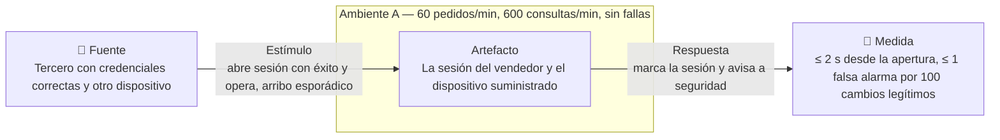
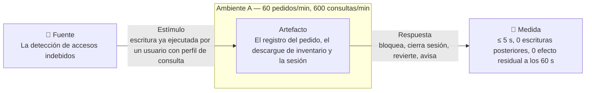
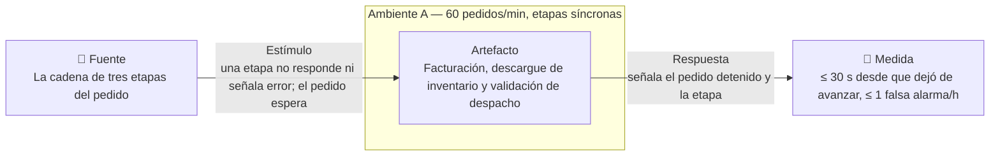
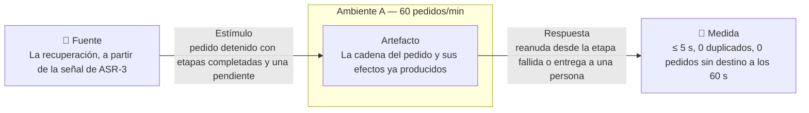

# ASRs de disponibilidad y seguridad

Alcance: cuatro escenarios —dos de seguridad (suplantación y elevación de privilegios) y dos de disponibilidad (detección y reparación de la cadena que sigue a un pedido)— reescritos como escenarios de seis partes en el espacio del problema. Las ideas de solución (gestor de sesión, huella del dispositivo, réplicas de lectura, registros de la base de datos, tabla de usuarios activos, cola de reintentos, equipo de soporte) quedan fuera de las seis partes: son hipótesis que las decisiones de arquitectura confirmarán o cambiarán.

Vocabulario: se dice **pedido**, como en el enunciado, y no compra ni orden de compra. La cadena que sigue al pedido tiene tres etapas: **facturación** (factura o documento de cobro diferido), **descargue de inventario** y **validación de despacho**; su cierre habilita a logística. El resto de los términos está en el [glosario](glossary.md).

## 1. Los ASRs

| ID | Atributo · rama | Enunciado corto | Amb. | Prioridad | Impacto | Origen |
|---|---|---|---|---|---|---|
| ASR-1 | Seguridad · detección | Detectar en ≤ 2 s que una sesión de vendedor abierta con credenciales correctas la opera un dispositivo que no es el suministrado, y avisar a seguridad | A | Alta | Medio | STRIDE (S) · R-9 |
| ASR-2 | Seguridad · reacción | Ante una escritura ya ejecutada por un actor cuyo permiso solo cubre consulta, bloquear al actor, cerrar su sesión y revertir la escritura en ≤ 5 s; escrituras posteriores del mismo actor = 0 | A | Alta | Medio | STRIDE (E) · R-7 |
| ASR-3 | Disponibilidad · detección | Detectar en ≤ 30 s que la cadena de un pedido confirmado quedó detenida en facturación, inventario o despacho sin señalar error, con ≤ 1 falsa alarma por hora | A | Alta | Alto | R-1 · S-2 |
| ASR-4 | Disponibilidad · reparación | Reanudar la cadena detenida desde la etapa que falló, sin duplicar factura, descargue ni orden de despacho, en ≤ 5 s; lo que no se reanuda se entrega a una persona con el estado exacto | A | Alta | Alto | R-1 · S-2 |

## 1b. De qué historia cuelga cada escenario

Un escenario de calidad no vive solo: se ata a la historia de usuario cuyo actor
lo sufre o lo recibe. Esa historia aporta la fuente, el estímulo y la respuesta;
la ficha de abajo aporta el ambiente y la medida.

| ASR | Historia | Actor | Por qué esa y no otra |
|---|---|---|---|
| ASR-1 | [HU-01](requirements.md) — Inicio de sesión desde el dispositivo suministrado | Vendedor | Es la historia donde la sesión se abre, que es el instante desde el que corren los 2 s |
| ASR-2 | [HU-13](requirements.md) — Reacción ante la escritura indebida | Área de seguridad | Es la única historia cuyo estímulo es una escritura ya ejecutada |
| ASR-3 | [HU-03](requirements.md) — Creación del pedido en la tienda | Vendedor | La cadena arranca al confirmarse el pedido, y desde ahí se mide que se detuvo |
| ASR-4 | [HU-14](requirements.md) — Recepción del pedido escalado | Responsable del pedido escalado | Es donde aterriza la segunda mitad de la respuesta: lo que no se reanuda va a una persona |

Las demás historias del árbol no cargan escenario propio. HU-09, HU-10 y HU-15
recorren la misma cadena que HU-03 y HU-14, y HU-12 recibe el aviso que HU-01
dispara: en los cuatro casos la medida ya está fijada por la historia a la que
se atan.

## 2. Ambientes

| Variable | A — normal | B — pico | C — degradado |
|---|---|---|---|
| Carga | 60 pedidos/min y 600 consultas/min, sumando los cinco países (S-4) | 3 veces la carga de A: 180 pedidos/min y 1 800 consultas/min (S-5) | Igual a A |
| Equivalente en TPS | 11 (1 pedido y 10 consultas por segundo) | 33 | 11 |
| Patrón de arribo | Estocástico, con ráfagas por bodega | Ráfaga de 2 h al arrancar la jornada comercial (S-5) | Estocástico |
| Cadena del pedido | Las tres etapas responden y corren de forma síncrona tras la confirmación (S-1) | Igual | Una etapa (facturación, inventario o despacho) no responde o no termina |
| Dispositivos | 2 000 vendedores, cada uno con el dispositivo que CCP le suministró; 80 cambios legítimos de dispositivo al mes (S-6) | Igual | Igual |
| Alcance | Dentro | Dentro | Dentro solo para fallas de software |

Presupuesto compartido: ASR-3 + ASR-4 suman 35 s entre que la cadena se detiene y queda reanudada o en manos de una persona. Ese total cabe en los 60 s que el tendero espera antes de ver su pedido "en preparación" (S-7), y deja 25 s para que la cadena recorra sus tres etapas.

### Supuestos que fijan las cifras

El enunciado no trae cifras de carga ni de tolerancia. Esta tabla las fija para que los cuatro escenarios se puedan medir y las pruebas repliquen una operación verosímil. Cada supuesto muestra de dónde sale, para que se pueda corregir si el negocio da otro número.

| # | Supuesto | Cómo se obtiene |
|---|---|---|
| S-4 | En operación normal entran 60 pedidos y 600 consultas por minuto, sumando los cinco países | 2 000 vendedores repartidos en las 30 bodegas (unos 67 por bodega) visitan 15 tiendas al día y toman un pedido por visita: 30 000 pedidos. Los tenderos que piden por su cuenta suman un 25 % más, unos 37 500 al día. En una jornada comercial de 10 h salen 62 por minuto, que se redondean a 60. Cada pedido arrastra unas diez consultas de inventario, estado y ruta |
| S-5 | En hora pico la carga se triplica durante 2 h | Las rutas de los vendedores arrancan a la misma hora en cada país, y la primera franja de la mañana concentra las visitas y los pedidos del día |
| S-6 | La fuerza de ventas hace 80 cambios legítimos de dispositivo al mes | Con 2 000 equipos renovados cada tres años salen unos 56 cambios al mes. Las pérdidas, los robos y los daños, estimados en un 1 % mensual, suman otros 20 |
| S-7 | El tendero espera como máximo 60 s entre confirmar su pedido y verlo "en preparación" | Es el tiempo que alguien mira la pantalla de una aplicación antes de llamar al vendedor para preguntar qué pasó con su pedido |
| S-8 | El actor cuyo permiso solo cubre consulta es un usuario interno de CCP con perfil de consulta, por ejemplo un supervisor comercial o un analista | Vendedores y tenderos crean pedidos, así que no son actores de solo consulta. El perfil de consulta ve inventario y estado de pedidos, pero no registra pedidos ni descarga inventario |
| S-9 | La suplantación del tendero queda fuera de los cuatro escenarios (R-13) | El tendero opera su propio equipo (R-11), así que el sistema no tiene un dispositivo conocido contra el cual comparar su sesión |

## 2b. Matriz STRIDE

Dos celdas producen un ASR; las demás se listan con su razón, para que la omisión sea una decisión y no un olvido.

| STRIDE | Flujo de datos del dominio | Stakeholder (aux.) | Modo | Amb. | Resultado |
|---|---|---|---|---|---|
| **S** Suplantación | La sesión del vendedor desde un dispositivo no suministrado | Tercero con credenciales correctas vs. vendedor | Detección | A | **ASR-1** |
| **S** Suplantación | La sesión del vendedor | Tercero vs. vendedor | Reacción | A | Descartada: la reacción la ejecuta el área de seguridad, fuera del sistema. Queda como riesgo del diseño |
| **S** Suplantación | La sesión del tendero | Tercero vs. tendero | Detección | A | Descartada (S-9): el tendero opera su propio equipo y no hay dispositivo conocido contra el cual comparar |
| **T** Manipulación | El pedido confirmado | Vendedor o tendero | Detección | A | Descartada: fuera del alcance (R-13) |
| **R** Repudio | El pedido y la visita | Tendero o vendedor | Evidencia | A | Descartada: fuera del alcance (R-13) |
| **I** Divulgación | Las ventas de otro vendedor y los datos del tendero | Vendedor | Detección | A | Descartada: fuera del alcance (R-13). El enunciado la exige de forma literal (R-6 y R-7), así que queda como riesgo del diseño |
| **D** Denegación | La creación de pedidos | Tercero externo | Detección | B | Descartada: fuera del alcance (R-13); el ambiente B ya tiene cifras (S-5) si se retoma |
| **E** Elevación | El registro del pedido y el descargue de inventario (escritura) por un actor de solo consulta | Usuario interno con perfil de consulta (S-8) | Detección | A | Absorbida en el estímulo de ASR-2 (la escritura ya detectada); si el profesor pide la detección aparte, se separa |
| **E** Elevación | El registro del pedido y el descargue de inventario | Usuario interno con perfil de consulta (S-8) | Reacción | A | **ASR-2** |

## 3. Fichas

### ASR-1 — Detección de la sesión de vendedor operada desde un dispositivo no suministrado

| | |
|---|---|
| **Fuente** | Un tercero que tiene las credenciales correctas de un vendedor (robadas, prestadas o adivinadas) y un dispositivo distinto al que CCP suministró |
| **Estímulo** | Abre sesión con éxito y empieza a operar: consulta inventario, registra visitas o crea pedidos. Arribo esporádico |
| **Artefacto** | La sesión del vendedor y el dispositivo suministrado por CCP como parte de su identidad |
| **Ambiente** | A: 60 pedidos/min y 600 consultas/min, 80 cambios legítimos de dispositivo al mes |
| **Respuesta** | El sistema marca la sesión como abierta desde un dispositivo no reconocido y avisa al área de seguridad con la identidad del vendedor, el dispositivo y la hora |
| **Medida** | Aviso emitido en ≤ 2 s desde que la sesión queda abierta, con ≤ 1 falsa alarma por cada 100 cambios legítimos de dispositivo (menos de una al mes con S-6), medido desde la apertura de sesión hasta el aviso, en Ambiente A |
| **Prioridad · Impacto · Origen** | Alta · Medio · STRIDE (S) · R-9 |

#### Matriz STRIDE del escenario

| STRIDE | Flujo de datos del dominio | Stakeholder (aux.) | Modo | Amb. | Resultado |
|---|---|---|---|---|---|
| **S** Suplantación | La sesión del vendedor desde un dispositivo no suministrado | Tercero con credenciales correctas vs. vendedor | Detección | A | **Este escenario** |
| **S** Suplantación | La sesión del vendedor | Tercero vs. vendedor | Reacción | A | Descartada: la reacción la ejecuta el área de seguridad, fuera del sistema |

```mermaid
flowchart LR
    F["🔹 Fuente<br/>Tercero con credenciales correctas y otro dispositivo"]
    F -- "Estímulo<br/>abre sesión con éxito y opera, arribo esporádico" --> A
    subgraph AMB["Ambiente A — 60 pedidos/min, 600 consultas/min, sin fallas"]
        A["Artefacto<br/>La sesión del vendedor y el dispositivo suministrado"]
    end
    A -- "Respuesta<br/>marca la sesión y avisa a seguridad" --> M["📏 Medida<br/>≤ 2 s desde la apertura, ≤ 1 falsa alarma por 100 cambios legítimos"]
```

### ASR-2 — Reacción ante la escritura ejecutada por un actor de solo consulta

| | |
|---|---|
| **Fuente** | El mecanismo de detección de accesos indebidos, a partir de una escritura ya ejecutada |
| **Estímulo** | Un usuario interno de CCP con perfil de consulta (S-8), autenticado y con la sesión aún abierta, registró o modificó un pedido, o descargó inventario. Arribo esporádico |
| **Artefacto** | El registro del pedido y el descargue de inventario (las funciones que escriben) y la sesión del actor |
| **Ambiente** | A: 60 pedidos/min y 600 consultas/min |
| **Respuesta** | El sistema bloquea al actor, cierra su sesión, revierte la escritura indebida y avisa a seguridad |
| **Medida** | Bloqueo, cierre y reversión en ≤ 5 s desde la detección de la escritura; escrituras posteriores del mismo actor = 0; efecto de la escritura indebida que permanece 60 s después de la reacción = 0, en Ambiente A |
| **Prioridad · Impacto · Origen** | Alta · Medio · STRIDE (E) · R-7 |

#### Matriz STRIDE del escenario

| STRIDE | Flujo de datos del dominio | Stakeholder (aux.) | Modo | Amb. | Resultado |
|---|---|---|---|---|---|
| **E** Elevación | El registro del pedido y el descargue de inventario | Usuario interno con perfil de consulta | Detección | A | Absorbida en el estímulo: el escenario parte de la escritura ya detectada |
| **E** Elevación | El registro del pedido y el descargue de inventario | Usuario interno con perfil de consulta | Reacción | A | **Este escenario** |

```mermaid
flowchart LR
    F["🔹 Fuente<br/>La detección de accesos indebidos"]
    F -- "Estímulo<br/>escritura ya ejecutada por un usuario con perfil de consulta" --> A
    subgraph AMB["Ambiente A — 60 pedidos/min, 600 consultas/min"]
        A["Artefacto<br/>El registro del pedido, el descargue de inventario y la sesión"]
    end
    A -- "Respuesta<br/>bloquea, cierra sesión, revierte, avisa" --> M["📏 Medida<br/>≤ 5 s, 0 escrituras posteriores, 0 efecto residual a los 60 s"]
```

### ASR-3 — Detección del pedido cuya cadena de suministro se detuvo

| | |
|---|---|
| **Fuente** | La propia cadena de tres etapas que sigue al pedido confirmado |
| **Estímulo** | Una de las etapas —facturación, descargue de inventario o validación de despacho— no responde ni señala error, y el pedido queda esperando de forma indefinida sin pasar a logística. Ocurre bajo carga de Ambiente A |
| **Artefacto** | La cadena del pedido: facturación, descargue de inventario y validación de despacho |
| **Ambiente** | A: 60 pedidos/min, con las tres etapas corriendo de forma síncrona |
| **Respuesta** | El sistema identifica el pedido detenido, la etapa en que se detuvo y el tiempo transcurrido, y lo señala como fallo de la cadena |
| **Medida** | Señal en ≤ 30 s desde que la etapa dejó de avanzar, con ≤ 1 falsa alarma por hora, medido desde la confirmación del pedido hasta la señal, en Ambiente A |
| **Prioridad · Impacto · Origen** | Alta · Alto · R-1 · S-2 |

```mermaid
flowchart LR
    F["🔹 Fuente<br/>La cadena de tres etapas del pedido"]
    F -- "Estímulo<br/>una etapa no responde ni señala error; el pedido espera" --> A
    subgraph AMB["Ambiente A — 60 pedidos/min, etapas síncronas"]
        A["Artefacto<br/>Facturación, descargue de inventario y validación de despacho"]
    end
    A -- "Respuesta<br/>señala el pedido detenido y la etapa" --> M["📏 Medida<br/>≤ 30 s desde que dejó de avanzar, ≤ 1 falsa alarma/h"]
```

### ASR-4 — Reanudación de la cadena de suministro desde la etapa que falló

| | |
|---|---|
| **Fuente** | El mecanismo de recuperación, a partir de la señal de ASR-3 |
| **Estímulo** | Un pedido señalado como detenido, con una o dos etapas ya completadas y una pendiente |
| **Artefacto** | La cadena del pedido y sus efectos ya producidos: factura emitida, inventario descargado, orden de despacho |
| **Ambiente** | A: 60 pedidos/min |
| **Respuesta** | El sistema reanuda la cadena desde la etapa que falló, sin repetir las etapas completadas; si ese intento no la completa, entrega el pedido a una persona con el estado exacto (qué etapa falta y por qué) para que lo termine o lo cancele |
| **Medida** | Reanudación desde la etapa que falló, o entrega a una persona, en ≤ 5 s desde la señal de detención; facturas, descargues de inventario y órdenes de despacho duplicados = 0; pedidos señalados que no han llegado a logística ni a una persona 60 s después de la señal = 0, en Ambiente A |
| **Prioridad · Impacto · Origen** | Alta · Alto · R-1 · S-2 |

```mermaid
flowchart LR
    F["🔹 Fuente<br/>La recuperación, a partir de la señal de ASR-3"]
    F -- "Estímulo<br/>pedido detenido con etapas completadas y una pendiente" --> A
    subgraph AMB["Ambiente A — 60 pedidos/min"]
        A["Artefacto<br/>La cadena del pedido y sus efectos ya producidos"]
    end
    A -- "Respuesta<br/>reanuda desde la etapa fallida o entrega a una persona" --> M["📏 Medida<br/>≤ 5 s, 0 duplicados, 0 pedidos sin destino a los 60 s"]
```
