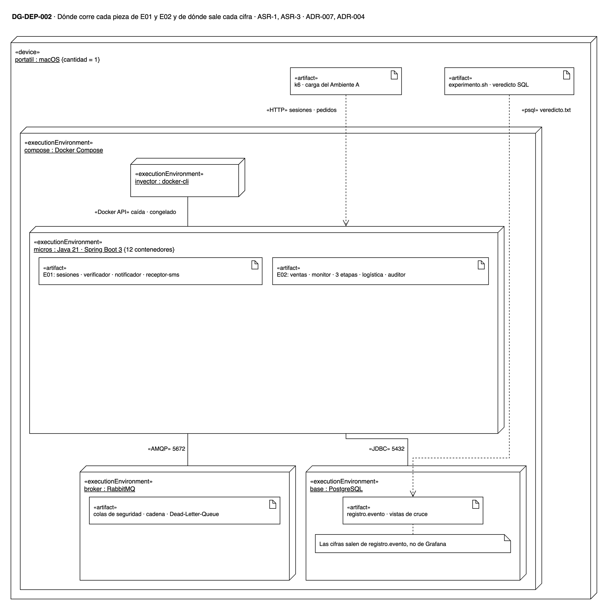
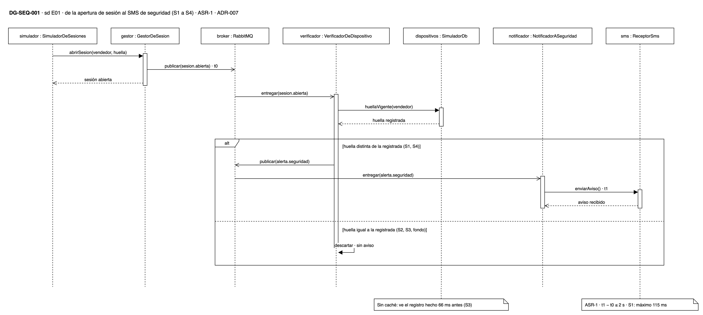
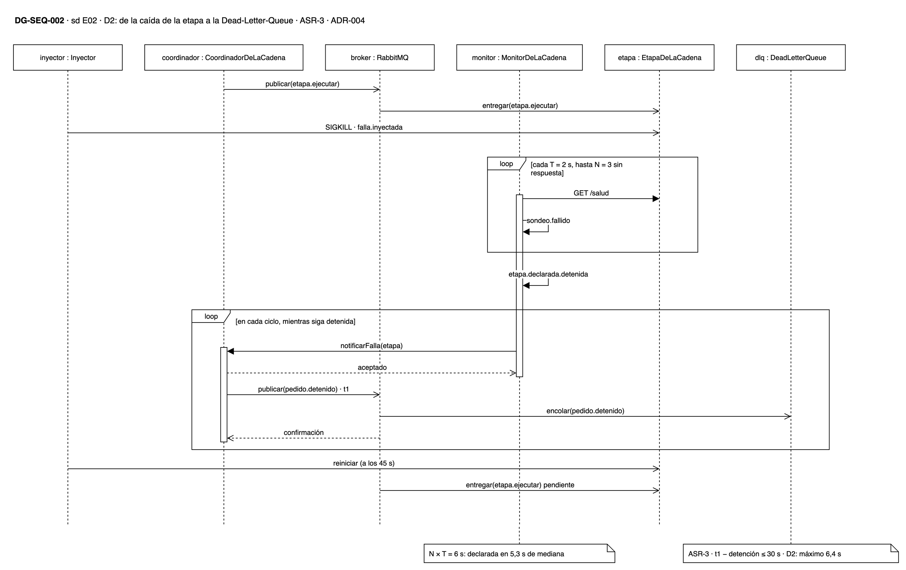
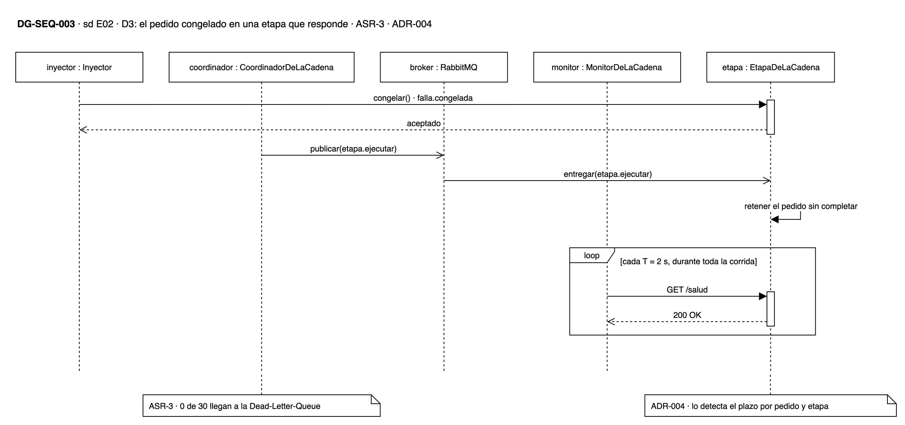

# Resultados de los experimentos E01 y E02

Este reporte presenta lo que salió del ciclo de corridas del 7 de octubre de
2026, entre las 18:17 y las 22:32, sobre el prototipo que siguen DG-CMP-004 y
DG-CMP-005. El diseño de cada experimento, sus fases y su tabla de decisiones
están en [Experimentos E01 y E02](experiments.md).

**En resumen, H1 se sostiene y H2 cae.** El Verificador de dispositivo avisó a
seguridad en las 50 aperturas de sesión desde un dispositivo no registrado. El
aviso más lento tardó 115 ms, frente a un límite de 2 s. En 17 893 sesiones
desde el dispositivo registrado no dio ninguna falsa alarma.

El Monitor de la cadena detectó en ≤ 6,4 s cada una de las 30 caídas de etapa.
Ventas envió a tiempo a la Dead-Letter-Queue los 655 pedidos que quedaron
detenidos. Pero el Monitor no vio ninguno de los 30 pedidos congelados dentro
de una etapa que seguía viva.

| Experimento | Hipótesis | Escenario | Veredicto | Decisión |
|---|---|---|---|---|
| E01 — Seguridad | H1: el Verificador de dispositivo compara la huella apenas el micro de sesiones publica la apertura | ASR-1 | Se sostiene en S1, S2 y S3 | Aceptar ADR-007 tal como está |
| E02 — Disponibilidad | H2: el Monitor sondea las etapas y avisa al micro de ventas, que envía el pedido detenido a la Dead-Letter-Queue | ASR-3 | Pasa D1 y D2; cae en D3 | Confirmar ADR-004 |

## Cómo se midió

Corrimos los experimentos sobre el prototipo de este repositorio: doce micros
en Java 21 y Spring Boot 3, con PostgreSQL y RabbitMQ en Docker Compose, todo
en una sola máquina. Los eventos de E01 y de la cadena de E02 pasan por el
bróker, como en los dos diagramas. Durante cada corrida, k6 generó la carga del
Ambiente A: 1 pedido y 10 consultas por segundo, con llegadas aleatorias.

**Los números salen de una tabla de eventos, no del tablero.** Cada componente
anotó en esa tabla el identificador de la sesión o del pedido y la hora de cada
hecho. Una consulta SQL cruza esas filas una a una: cada falla inyectada contra
la salida que provocó. Prometheus y Grafana sirvieron para ver la corrida en
vivo, pero ninguna cifra de este reporte sale de ellos, porque agregan los datos
y pierden el identificador.

**Figura 1. Dónde corrió cada pieza de las pruebas (DG-DEP-002).** k6 generó
la carga desde el portátil, fuera de Docker. El inyector de fallas, los doce
micros, RabbitMQ y PostgreSQL corrieron como contenedores de Docker Compose. El
guion `load/experimento.sh` sacó el veredicto de la tabla `registro.evento` con
una consulta SQL. Prometheus y Grafana no aparecen porque ninguna cifra sale de
ellos.

Un guion, `load/experimento.sh`, lanzó las siete corridas una tras otra; se
invoca con `make experimentos`. Cada corrida empezó con 5 minutos de
calentamiento que no cuentan para ningún criterio. Entre una corrida y la
siguiente se reiniciaron la base y las colas del bróker, para que un pedido
detenido en una no apareciera como pendiente en la otra.

**Las siete corridas son válidas.** Al cerrar cada una, el guion comprobó tres
cosas: que la carga de fondo no tuviera un hueco de más de 30 s, que el equipo
no se hubiera suspendido y que k6 no pasara de 1 % de solicitudes fallidas. Si
una corrida no cumple, el ciclo entero se descarta y vuelve a empezar. En este
ciclo, el hueco más largo fue de 10,8 s y k6 no tuvo ninguna solicitud fallida.

El enunciado no da algunas cifras que los experimentos necesitan. Las fijamos
como supuestos, y cada una se cambia con una variable, sin tocar el código:

| Supuesto | Valor | De dónde sale |
|---|---|---|
| S-10 · aperturas desde el dispositivo registrado | 2 por segundo | 2 000 vendedores que reabren sesión cada 15 min, al vencer el token (SUP-05): 2,2 por segundo, redondeado a 2 |
| S-11 · duración de cada etapa | Lognormal, mediana de 2 s, p99,9 cercano a 9 s, tope de 25 s | Variación normal por debajo de los 25 s de SUP-03 |
| T y N del Monitor | Sondeo cada 2 s; etapa detenida tras 3 sondeos sin respuesta | N × T = 6 s, dentro de los 30 s de ASR-3 |
| Caída de una etapa (D2) | El proceso muere con SIGKILL durante 45 s y luego se reinicia | El trabajo que la etapa tenía sin terminar vuelve a su cola del bróker y se retoma al reiniciar |

---

## E01 — Detección del dispositivo no registrado

### Resultados

E01 prueba si el sistema avisa a tiempo cuando alguien abre la sesión de un
vendedor desde un dispositivo no registrado, sin avisar cuando el cambio de
dispositivo es legítimo. Las fases S1 a S3 deciden la hipótesis; S4 es
exploratoria y busca a qué tasa empieza a atrasarse el aviso.

**Tabla 1. Criterios de H1.** Cada fila es un criterio de
[experiments.md](experiments.md), y los casos son las sesiones que se midieron
contra él.

| Fase | Casos | Cumplen | Fallan | Veredicto |
|---|---|---|---|---|
| S1 · aviso en ≤ 2 s, con vendedor, dispositivo y hora | 50 | 50 | 0 | **Pasa** |
| S2 · ≤ 1 aviso por cada 100 cambios legítimos | 100 | 100 | 0 | **Pasa**: 0 avisos |
| S3 · 0 avisos en aperturas a menos de 1 s del registro | 20 | 20 | 0 | **Pasa** |
| Las cuatro fases · 0 avisos por el dispositivo registrado | 17 893 | 17 893 | 0 | **Pasa** |
| S4 · tasa a la que el aviso se atrasa | 30 | 30 | 0 | Exploratoria: no se atrasa hasta 10 aperturas por segundo |

**Tabla 2. Cuánto tardó el aviso.** Es el tiempo desde que el micro de sesiones
registró la apertura del intruso hasta que el aviso llegó al receptor del SMS.
El límite de ASR-1 es 2 s, es decir, 2 000 ms. El p95 es el tiempo dentro del
cual llegó el 95 % de los avisos.

| Demora del aviso | Desde dispositivo no registrado | Mediana | p95 | Máximo |
|---|---|---|---|---|
| S1, a la tasa normal | 50 | 15 ms | 26 ms | 115 ms |
| S4 a 1× (2 aperturas/s) | 10 | 16 ms | 28 ms | 31 ms |
| S4 a 3× (6 aperturas/s) | 10 | 17 ms | 23 ms | 23 ms |
| S4 a 5× (10 aperturas/s) | 10 | 17 ms | 34 ms | 38 ms |

**Figura 2. Recorrido de una apertura de sesión en E01 (DG-SEQ-001).** El
reloj arranca en t0, cuando el micro de sesiones (Gestor de sesión en el
diagrama) publica `sesion.abierta`, y se detiene en t1, cuando el aviso llega al
receptor del SMS. Si la huella coincide con la registrada, el Verificador
descarta el evento sin avisar: así se juzgan S2, S3 y las sesiones de fondo.

**Tabla 3. Por dónde pasó el aviso en S1.** El aviso recorre cuatro tramos, dos
de ellos por el bróker. Cada fila mide un tramo en las 50 sesiones de intruso.

| Tramo | Mediana | Máximo |
|---|---|---|
| Apertura de la sesión → comparación en el Verificador, por el bróker | 1,9 ms | 3,4 ms |
| Comparación → publicación de `alerta.seguridad` | 1,8 ms | 17 ms |
| Publicación → Notificador a seguridad, por el bróker | 3,3 ms | 36 ms |
| Notificador → receptor del SMS | 7,0 ms | 59 ms |

### Análisis de resultados

**El aviso llega muy por debajo del límite.** De las 80 sesiones de intruso que
probamos, sumando S1 y S4, el aviso más lento tardó 115 ms. Es menos de la
décima parte de los 2 s que permite ASR-1, aunque cada aviso cruza el bróker
dos veces. Ningún tramo pasó de 59 ms. El micro de sesiones publica el evento y
responde sin esperar la comparación, así que el vendedor no nota nada.

**No hubo una sola falsa alarma.** En S2, 100 vendedores registraron un
dispositivo nuevo y abrieron sesión desde él entre 6 y 60 s después. En S3,
otros 20 lo hicieron entre 66 y 903 ms después del registro. Ninguno disparó
aviso, y tampoco las 17 893 sesiones normales que corrieron de fondo. El
Verificador lee el dispositivo registrado directo de la base, sin caché, y ve
el cambio aunque el evento le llegue un instante después del registro.

**Con más carga el aviso no se atrasó, así que S4 no encontró su límite.** A 10
aperturas por segundo, cinco veces la tasa normal, el aviso más lento tardó
38 ms, frente a 31 ms a la tasa normal de esa misma corrida. El punto en que el diseño empieza a
atrasarse está por encima de lo que probamos, y la decisión no depende de él.

### Evidencias

Cada fase de E01 corrió por separado y dejó dos piezas de evidencia. Las cifras
de este reporte salen solo de la primera; la segunda sirve para ver la corrida,
no para juzgarla.

- **`veredicto.txt`** es la salida de la consulta SQL que cruza la tabla de
  eventos, sesión por sesión. Trae la validez de la corrida, los criterios de H1
  con sus casos y su veredicto, la demora de cada aviso y la lista de intrusos
  sin aviso y de falsas alarmas. Cada archivo cubre solo su fase, así que los
  criterios de las otras fases aparecen como «NO APLICA».
- **La captura** es el tablero de Grafana en la ventana de la corrida. Muestra
  los mismos conteos y las métricas de los micros y del bróker desde
  Prometheus.

| Fase | Qué probó | Resultado | Veredicto | Tablero |
|---|---|---|---|---|
| S1 | 50 aperturas desde un dispositivo no registrado, a la tasa normal | 50 avisos a tiempo; el más lento tardó 115 ms | [veredicto.txt](https://github.com/MATI-MBIT/arqsoft-reto-2/blob/main/analisis/resultados/e01-s1-20261007-181235/veredicto.txt) | [captura](assets/resultados/e01-s1-tablero.png) |
| S2 | 100 cambios legítimos de dispositivo, con la sesión abierta entre 6 y 60 s después del registro | 0 avisos | [veredicto.txt](https://github.com/MATI-MBIT/arqsoft-reto-2/blob/main/analisis/resultados/e01-s2-20261007-181235/veredicto.txt) | [captura](assets/resultados/e01-s2-tablero.png) |
| S3 | 20 aperturas a menos de 1 s del registro del dispositivo nuevo | 0 avisos | [veredicto.txt](https://github.com/MATI-MBIT/arqsoft-reto-2/blob/main/analisis/resultados/e01-s3-20261007-181235/veredicto.txt) | [captura](assets/resultados/e01-s3-tablero.png) |
| S4 | 30 aperturas desde un dispositivo no registrado, a 1, 3 y 5 veces la tasa normal | La demora no creció; el más lento tardó 38 ms | [veredicto.txt](https://github.com/MATI-MBIT/arqsoft-reto-2/blob/main/analisis/resultados/e01-s4-20261007-181235/veredicto.txt) | [captura](assets/resultados/e01-s4-tablero.png) |

La captura de S1 se muestra abajo porque es la fase que prueba el umbral de
ASR-1. La fila superior da los conteos de la corrida: 50 sesiones de intruso,
50 avisos dentro de los 2 s, 0 intrusos sin aviso («Escapes»), 0 falsas
alarmas, y la demora del aviso en p95 y en el máximo. El panel «Demora de cada
aviso» pone un punto por aviso, y todos quedan muy por debajo de la línea de
2 s. El panel «Mensajes esperando en las colas de E01» muestra que los eventos
no se acumularon en el bróker.

### La decisión

**Recomendamos aceptar ADR-007 tal como está.** H1 se sostiene en S1, S2 y S3,
y esa es la fila de la tabla de decisiones de E01 que lleva a aceptarlo. El
Verificador de dispositivo compara la huella al recibir `sesion.abierta`, como
lo describe el ADR. Ninguna otra fila aplica: no hubo avisos tarde ni falsos, y
en S4 la demora no creció a 3 ni a 5 veces la tasa normal.

---

## E02 — Detección del pedido detenido y envío a la Dead-Letter-Queue

### Resultados

E02 prueba si el Monitor de la cadena, sondeando la salud de las etapas,
detecta un pedido detenido. Si lo detecta, ventas tiene que enviarlo a la
Dead-Letter-Queue en ≤ 30 s. Probamos tres situaciones: una hora sin fallas,
para contar falsas alarmas (D1); 30 caídas de una etapa entera (D2), y 30
pedidos congelados dentro de una etapa que sigue viva (D3). La fase
exploratoria D4 no corrió.

**Tabla 4. Criterios de H2.** D2 aparece en tres filas: dos cuentan los pedidos
detenidos de dos formas, explicadas debajo de la tabla, y la tercera cuenta los
duplicados en la Dead-Letter-Queue.

| Fase | Casos | Cumplen | Fallan | Veredicto |
|---|---|---|---|---|
| D1 · ≤ 1 falsa alarma por hora, en 1 h sin fallas | 0 declaraciones | — | 0 | **Pasa** |
| D2 · los pedidos en curso al caer la etapa, en la Dead-Letter-Queue en ≤ 30 s | 64 | 64 | 0 | **Pasa**: demora máxima de 6,4 s |
| D2 · todos los pedidos detenidos, en la Dead-Letter-Queue en ≤ 30 s | 655 | 655 | 0 | **Pasa**: demora máxima de 6,4 s |
| D2 · cada pedido que llegó a la Dead-Letter-Queue entró una sola vez | 655 | 655 | 0 | **Pasa**: 0 duplicados |
| D3 · el pedido congelado en una etapa viva, en la Dead-Letter-Queue en ≤ 30 s | 30 | 0 | 30 | **Falla** |

**Qué es un pedido detenido.** Es el que no cerró su etapa dentro de los 30 s
de ASR-3. Con el bróker, el trabajo de una etapa caída espera en la cola de esa
etapa y se retoma cuando vuelve. Casi todos los pedidos terminan cerrando, así
que lo que importa es si estuvieron quietos más de 30 s.

**Por qué D2 tiene dos conteos.** [experiments.md](experiments.md) cuenta en
D2 «los 30 pedidos» de las 30 caídas, y el inyector mata la etapa cuando tiene
pedidos en curso. Esos pedidos en curso son los 64 de la segunda fila. Pero
cada caída duró 45 s, y como ventas siguió enviando un pedido por segundo,
otros pedidos llegaron a la etapa ya caída y también quedaron detenidos. La
tercera fila cuenta los 655 detenidos en total. Esperaron en la cola de su
etapa una mediana de 40 s, y como máximo 55 s, hasta que la etapa volvió.

**Tabla 5. Cuánto tardó cada pedido detenido en llegar a la Dead-Letter-Queue,
en D2.** El límite es 30 s.

| Demora hasta la Dead-Letter-Queue en D2 | Detenidos | Mediana | p95 | Máximo |
|---|---|---|---|---|
| Validación de despacho | 232 | 1,5 s | 5,6 s | 6,0 s |
| Facturación | 215 | 1,3 s | 6,0 s | 6,4 s |
| Descargue de inventario | 208 | 1,5 s | 5,5 s | 6,0 s |

### Análisis de resultados

**Figura 3. Una caída de etapa en D2 (DG-SEQ-002).** El inyector mata la etapa,
y el Monitor la declara detenida al tercer sondeo sin respuesta. Desde ahí avisa
en cada ciclo al Coordinador, que es el micro de ventas como en DG-CMP-005, y
este publica cada pedido pendiente de esa etapa como `pedido.detenido`. El
bróker lo deja en la Dead-Letter-Queue. El reloj arranca en la caída, o en el
envío de ventas si el pedido llegó con la etapa ya caída, y se detiene en t1,
la publicación confirmada. Al reiniciarse la etapa, el bróker le
entrega el trabajo que esperaba en su cola.

**El sondeo detecta bien una etapa caída.** En cada una de las 30 caídas de
D2, el Monitor declaró detenida la etapa con una mediana de 5,3 s y un máximo
de 6,4 s. Es lo que predice el diseño: 3 sondeos sin respuesta, uno cada 2 s,
suman 6 s. Ventas envió cada pedido detenido a la Dead-Letter-Queue en el aviso
siguiente del Monitor, una sola vez.

**El bróker cerró el punto ciego de la etapa que vuelve.** Cuando una etapa se
reinicia, durante unos segundos ya responde al sondeo pero todavía no acepta
trabajo. Los pedidos que ventas envía en ese lapso no se pierden: esperan en la
cola de la etapa y se procesan apenas está lista. Ningún pedido de D2 se quedó
sin señal.

**A cambio, la Dead-Letter-Queue recibió 908 mensajes de pedidos que se
recuperaron solos.** Esos pedidos llegaron a la etapa ya caída, pero la etapa
volvió y los cerró antes de 30 s, con una mediana de 15 s de espera. Por eso no
cuentan entre los 655 detenidos. No son falsas alarmas, porque los 908 mensajes
caen dentro de una caída real de su etapa. Pero quien consuma la
Dead-Letter-Queue, lo que pide ASR-4, intentará reanudar pedidos que la etapa
ya está procesando. La idempotencia por pedido y etapa de ADR-005 deja de ser
opcional.

**Figura 4. Un pedido congelado en D3 (DG-SEQ-003).** El inyector le pide a la
etapa que retenga el próximo pedido sin completarlo. La etapa sigue respondiendo
`200 OK` a cada sondeo, así que el Monitor no ve ningún sondeo sin respuesta, no
avisa al Coordinador y el pedido nunca llega a la Dead-Letter-Queue.

**D3 refuta H2: el Monitor no vio ninguno de los 30 pedidos congelados.** La
etapa siguió viva y respondió todos los sondeos, así que el Monitor nunca la
declaró detenida. Los 30 pedidos no llegaron a la Dead-Letter-Queue, y al terminar la
corrida seguían sin cerrar su etapa, sin ninguna señal. Es exactamente la falla
que describe ASR-3: la etapa responde, pero el pedido no avanza. ADR-004 ya lo
había previsto, y eligió un plazo por pedido y etapa para detectarla.

**Sin fallas, el Monitor no dio falsas alarmas.** En D1, una hora entera de
carga normal, ningún sondeo quedó sin respuesta y el Monitor no declaró
detenida ninguna etapa. Los 3 595 pedidos de esa hora llegaron a logística.

**D1 dejó el dato que ADR-004 necesita para calibrar su plazo.** Es el
trade-off TO-004a: un plazo corto da falsas alarmas y uno largo incumple los
30 s. Sobre 3 595 pedidos, el 99,9 % terminó cada etapa en 8,6 s o menos en
validación de despacho, 10,0 s en facturación y 8,9 s en descargue de
inventario. El más lento tardó 13,7 s. Estas duraciones salen del supuesto S-11, no de etapas reales, y así
deben leerse.

### Evidencias

Cada fase de E02 dejó las mismas dos piezas que E01: el `veredicto.txt`, de
donde salen las cifras, y la captura del tablero de Grafana en la ventana de la
corrida.

| Fase | Qué probó | Resultado | Veredicto | Tablero |
|---|---|---|---|---|
| D1 | 1 h de carga normal sin fallas inyectadas | 0 etapas declaradas detenidas; 0 falsas alarmas | [veredicto.txt](https://github.com/MATI-MBIT/arqsoft-reto-2/blob/main/analisis/resultados/e02-d1-20261007-181235/veredicto.txt) | [captura](assets/resultados/e02-d1-tablero.png) |
| D2 | 30 caídas de 45 s, 10 por etapa, con pedidos en curso | 64 de 64 pedidos en curso y 655 de 655 detenidos a tiempo | [veredicto.txt](https://github.com/MATI-MBIT/arqsoft-reto-2/blob/main/analisis/resultados/e02-d2-20261007-181235/veredicto.txt) | [captura](assets/resultados/e02-d2-tablero.png) |
| D3 | 30 pedidos congelados, 10 por etapa, dentro de una etapa que sigue viva | 0 de 30 llegaron a la Dead-Letter-Queue | [veredicto.txt](https://github.com/MATI-MBIT/arqsoft-reto-2/blob/main/analisis/resultados/e02-d3-20261007-181235/veredicto.txt) | [captura](assets/resultados/e02-d3-tablero.png) |

La captura de D2 se muestra abajo porque es la fase en que se ve la detección
de las caídas. La fila superior da los conteos: 30 fallas inyectadas, 655
pedidos detenidos, 655 en la Dead-Letter-Queue a tiempo, 0 detenidos sin
mensaje a tiempo («Escapes»), 0 duplicados, 0 falsas alarmas y los 908 mensajes
de pedidos que se recuperaron solos. El `veredicto.txt` de D2 lista esos 908
bajo el encabezado de falsas alarmas, porque la consulta los separa de los
detenidos; el análisis explica por qué no lo son. El panel «Lo que
declara el Monitor de cada etapa» marca en rojo cada caída detectada, diez por
etapa. El panel «Mensajes en las colas del bróker de la cadena» muestra la cola
de cada etapa caída llenándose y vaciándose al volver, y la Dead-Letter-Queue
creciendo.

### La decisión

**Recomendamos confirmar ADR-004.** D1 y D2 pasan y D3 falla. Esa es la fila
«H2 pasa D1 y D2 pero falla D3» de la tabla de decisiones de E02, que lleva a
confirmar ADR-004. El plazo vencido por pedido y etapa es el mecanismo que
detecta el pedido detenido de ASR-3. El sondeo del Monitor queda como apoyo,
para adelantar la señal cuando cae una etapa entera.

---

## Dónde la medición se apartó de experiments.md

Cinco reglas de medición de [experiments.md](experiments.md) no estaban
escritas o no se podían aplicar al pie de la letra. Las resolvimos como dice el
[plan de implementación](https://github.com/MATI-MBIT/arqsoft-reto-2/blob/main/notas/plan-implementacion-experimentos.md),
y ninguna cambia una decisión.

| Tema | `experiments.md` | Lo que se midió | Efecto |
|---|---|---|---|
| Pedido detenido | No lo define | El que no cierra su etapa dentro de los 30 s de ASR-3 | Con el bróker casi todos los pedidos terminan cerrando: «nunca cerró» no serviría |
| Pedidos de D2 | «Los 30 pedidos» de las 30 caídas | Los 64 en curso al caer la etapa, y aparte los 655 detenidos | Los dos conteos pasan |
| Reloj de D2 | Arranca cuando el inyector detiene la etapa | Para el pedido que llega con la etapa ya caída, arranca cuando ventas se lo envía | Medido desde la caída, un pedido que llega tarde a una caída de 45 s contaría una espera que no fue suya |
| Falsa alarma | Cada mensaje sobre un pedido que llegó a logística | El criterio de D1 cuenta las veces que el Monitor declara detenida una etapa sin caída inyectada | Con el bróker, los detenidos también llegan a logística cuando la etapa vuelve: la regla literal haría falsos casi todos los mensajes |
| Tasa de aperturas de S4 | 1, 3 y 5 veces la del Ambiente A, que no la fija | S-10: 2 aperturas por segundo | El límite de H1 queda por encima de 10 aperturas por segundo |

---

## Lo que estos resultados no cubren

- **Una sola máquina.** Los experimentos validan las ideas de diseño, no el
  tamaño de la infraestructura. Con red y base reales, las demoras de E01
  serían mayores, y estas corridas no dicen cuánto.
- **Duraciones supuestas.** Las etapas duran lo que fija S-11. Antes de aceptar
  ADR-004, su plazo se tiene que calibrar con etapas reales. [PREGUNTA] ¿Quién
  consigue esas duraciones y para cuándo?
- **D4 no corrió.** Falta el número que E02 debía entregar: el menor N sin
  falsas alarmas, y su N × T. No cambia la decisión, porque la falla de H2 no
  depende de T ni de N. [PREGUNTA] ¿Se corre D4 y, si se corre, cuándo?
- **El plazo por pedido no se probó.** E02 confirma que el sondeo solo no
  basta, pero no mide el mecanismo de ADR-004. [PREGUNTA] ¿Quién arma ese
  experimento y para qué fecha?
- **Nadie consume la Dead-Letter-Queue.** Reanudar el pedido o entregarlo a una
  persona es lo que pide ASR-4, y quien lo haga tendrá que tolerar los pedidos
  que se recuperan solos.
