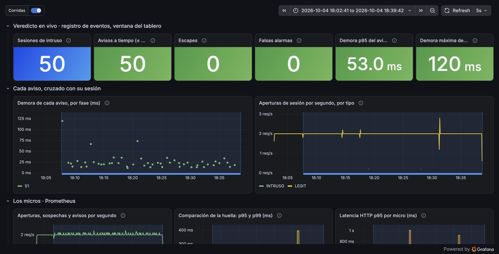
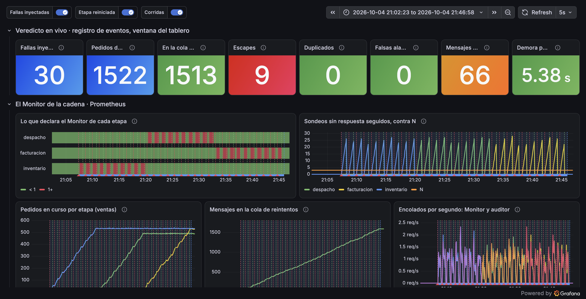

# Resultados de los experimentos E01 y E02

Este reporte presenta lo que salió de las corridas del 4 de octubre de 2026. El
diseño de cada experimento, sus fases y su tabla de decisiones están en
[Experimentos E01 y E02](experiments.md).

**En resumen, H1 se sostiene y H2 cae.** El sistema avisó a seguridad en las 50
aperturas de sesión desde un dispositivo no registrado, con 120 ms en el peor
caso frente a un límite de 2 s. En 17 832 sesiones desde el dispositivo
registrado no dio ninguna falsa alarma.

El Monitor de la cadena detectó en unos 6 s cada etapa que se cayó. Pero no vio
ninguno de los 30 pedidos congelados dentro de una etapa que seguía viva, ni 25
pedidos que ventas envió mientras la etapa caída volvía a arrancar.

| Experimento | Hipótesis | Escenario | Veredicto | Decisión |
|---|---|---|---|---|
| E01 — Seguridad | H1: el micro de sesiones compara la huella del dispositivo al abrir la sesión | ASR-1 | Se sostiene en S1, S2 y S3 | Aceptar ADR-007 |
| E02 — Disponibilidad | H2: el Monitor de la cadena sondea las etapas y encola el pedido detenido | ASR-3 | Cae en D3. D2 pasa con el criterio literal y falla al contar todos los pedidos detenidos | Confirmar ADR-004 |

## Cómo se midió

Corrimos los experimentos sobre el prototipo de este repositorio: once micros
en Java 21 y Spring Boot 3, con PostgreSQL y RabbitMQ en Docker Compose, todo
en una sola máquina. Durante cada corrida, k6 generó la carga del Ambiente A:
1 pedido y 10 consultas por segundo, con llegadas aleatorias.

**Los números salen de una tabla de eventos, no del tablero.** Cada componente
anotó en esa tabla el identificador de la sesión o del pedido y la hora de cada
hecho. Una consulta SQL cruza esas filas una a una: cada falla inyectada contra
la salida que provocó. Prometheus y Grafana sirvieron para ver la corrida en
vivo, pero ninguna cifra de este reporte sale de ellos, porque agregan los datos
y pierden el identificador.

Un guion, `load/experimento.sh`, lanzó las corridas una tras otra; se invoca
con `make experimentos`. Cada corrida empezó con 5 minutos de calentamiento que
no cuentan para ningún criterio. Entre una corrida y la siguiente se
reiniciaron la base y las colas, para que un pedido detenido en una no
apareciera como pendiente en la otra.

El enunciado no da algunas cifras que los experimentos necesitan. Las fijamos
como supuestos, y cada una se cambia con una variable, sin tocar el código:

| Supuesto | Valor | De dónde sale |
|---|---|---|
| S-10 · aperturas desde el dispositivo registrado | 2 por segundo | 2 000 vendedores que reabren sesión cada 15 min, al vencer el token (SUP-05) |
| S-11 · duración de cada etapa | Lognormal, mediana de 2 s, p99 cercano a 9 s, tope de 25 s | Variación normal por debajo de los 25 s de SUP-03 |
| T y N del Monitor | Sondeo cada 2 s; etapa detenida tras 3 sondeos sin respuesta | N × T = 6 s, dentro de los 30 s de ASR-3 |
| Caída de una etapa (D2) | El proceso muere con SIGKILL durante 45 s y luego se reinicia | Si solo se pausara, la etapa terminaría al reanudarse los pedidos que tenía, y contarían como falsas alarmas |

---

## E01 — Detección del dispositivo no registrado

### Resultados

E01 prueba si el sistema avisa a tiempo cuando alguien abre la sesión de un
vendedor desde un dispositivo no registrado, sin avisar cuando el cambio de
dispositivo es legítimo. Las fases S1 a S3 deciden la hipótesis; S4 es
exploratoria y busca a qué tasa empieza a atrasarse el aviso.

**Tabla 1. Criterios de H1.** Cada fila es un criterio de
[experiments.md](experiments.md), y los casos son las sesiones que se midieron
contra él.

| Fase | Casos | Cumplen | Fallan | Veredicto |
|---|---|---|---|---|
| S1 · aviso en ≤ 2 s, con vendedor, dispositivo y hora | 50 | 50 | 0 | **Pasa** |
| S2 · ≤ 1 aviso por cada 100 cambios legítimos | 100 | 100 | 0 | **Pasa**: 0 avisos |
| S3 · 0 avisos en aperturas a menos de 1 s del registro | 20 | 20 | 0 | **Pasa** |
| Las cuatro fases · 0 avisos por el dispositivo registrado | 17 832 | 17 832 | 0 | **Pasa** |
| S4 · tasa a la que el aviso se atrasa | 30 | 30 | 0 | Exploratoria: no se atrasa hasta 10 aperturas por segundo |

**Tabla 2. Cuánto tardó el aviso.** Es el tiempo desde que se abrió la sesión
del intruso hasta que salió el aviso. El límite de ASR-1 es 2 s, es decir,
2 000 ms. El p95 es el tiempo dentro del cual llegó el 95 % de los avisos.

| Demora del aviso | Desde dispositivo no registrado | Mediana | p95 | Máximo |
|---|---|---|---|---|
| S1, a la tasa normal | 50 | 22 ms | 53 ms | 120 ms |
| S4 a 1× (2 aperturas/s) | 10 | 30 ms | 56 ms | 74 ms |
| S4 a 3× (6 aperturas/s) | 10 | 27 ms | 38 ms | 41 ms |
| S4 a 5× (10 aperturas/s) | 10 | 30 ms | 34 ms | 35 ms |

### Análisis de resultados

**El aviso llega muy por debajo del límite.** De las 80 sesiones de intruso que
probamos, sumando S1 y S4, el aviso más lento tardó 120 ms, menos de la décima
parte de los 2 s que permite ASR-1. Llega así de rápido porque la comparación
de la huella es una sola lectura en la base y ocurre después de abrir la
sesión, sin hacer esperar al vendedor.

**No hubo una sola falsa alarma.** En S2, 100 vendedores registraron un
dispositivo nuevo y abrieron sesión desde él entre 5 y 60 s después. En S3,
otros 20 lo hicieron entre 52 y 717 ms después del registro. Ninguno disparó
aviso, y tampoco las 17 832 sesiones normales que corrieron de fondo, porque
el micro lee el dispositivo registrado directo de la base y ve el cambio en
cuanto se confirma.

**Con más carga el aviso no se atrasó, así que S4 no encontró su límite.** A 10
aperturas por segundo, cinco veces la tasa normal, el aviso más lento tardó
35 ms, lo mismo que a la tasa normal. El punto en que el diseño empieza a
atrasarse está por encima de lo que probamos, y la decisión no depende de él.

**Un defecto del guion de carga, sin efecto en el veredicto.** En la corrida de
S2, k6 repitió 60 identificadores de sesión del dispositivo registrado, y el
micro rechazó esas aperturas por clave duplicada. El error fue del guion, no
del diseño: los 100 cambios legítimos de S2 se midieron todos, y el guion se
corrigió antes de que S3 empezara a medir.

### Evidencias

Cada fase de E01 corrió por separado y dejó dos piezas de evidencia. Las cifras
de este reporte salen solo de la primera; la segunda sirve para ver la corrida,
no para juzgarla.

- **`veredicto.txt`** es la salida de la consulta SQL que cruza la tabla de
  eventos, sesión por sesión. Trae los criterios de H1 con sus casos y su
  veredicto, la demora de cada aviso y la lista de intrusos sin aviso y de
  falsas alarmas. Cada archivo cubre solo su fase, así que los criterios de las
  otras fases aparecen como «NO APLICA».
- **La captura** es el tablero de Grafana al cerrar la corrida. Muestra los
  mismos conteos en vivo y las métricas de los micros desde Prometheus.

| Fase | Qué probó | Resultado | Veredicto | Tablero |
|---|---|---|---|---|
| S1 | 50 aperturas desde un dispositivo no registrado, a la tasa normal | 50 avisos a tiempo; el más lento tardó 120 ms | [veredicto.txt](https://github.com/MATI-MBIT/arqsoft-reto-2/blob/main/analisis/resultados/e01-s1-20261004-180236/veredicto.txt) | [captura](assets/resultados/e01-s1-tablero.png) |
| S2 | 100 cambios legítimos de dispositivo, con la sesión abierta entre 5 y 60 s después del registro | 0 avisos | [veredicto.txt](https://github.com/MATI-MBIT/arqsoft-reto-2/blob/main/analisis/resultados/e01-s2-20261004-180236/veredicto.txt) | [captura](assets/resultados/e01-s2-tablero.png) |
| S3 | 20 aperturas a menos de 1 s del registro del dispositivo nuevo | 0 avisos | [veredicto.txt](https://github.com/MATI-MBIT/arqsoft-reto-2/blob/main/analisis/resultados/e01-s3-20261004-180236/veredicto.txt) | [captura](assets/resultados/e01-s3-tablero.png) |
| S4 | 30 aperturas desde un dispositivo no registrado, a 1, 3 y 5 veces la tasa normal | La demora no creció; el más lento tardó 74 ms | [veredicto.txt](https://github.com/MATI-MBIT/arqsoft-reto-2/blob/main/analisis/resultados/e01-s4-20261004-180236/veredicto.txt) | [captura](assets/resultados/e01-s4-tablero.png) |

La captura de S1 se muestra abajo porque es la fase que prueba el umbral de
ASR-1. La fila superior da los conteos de la corrida: 50 sesiones de intruso,
50 avisos dentro de los 2 s, 0 intrusos sin aviso («Escapes»), 0 falsas
alarmas, 53 ms de p95 y 120 ms de máximo. El panel «Demora de cada aviso» pone
un punto por aviso, y todos quedan por debajo de 125 ms. El panel «Aperturas de
sesión por segundo» muestra las 2 aperturas por segundo desde el dispositivo
registrado (S-10), que corrieron de fondo toda la fase.

### La decisión

**Recomendamos aceptar ADR-007.** H1 se sostiene en S1, S2 y S3, y esa es la
fila de la tabla de decisiones de E01 que lleva a aceptarlo. Ninguna otra fila
aplica: no hubo avisos tarde ni falsos, y en S4 la demora no creció a 3 ni a 5
veces la tasa normal.

**Aceptarlo pide ajustar su texto.** ADR-007 describe un Verificador de
dispositivo aparte, que recibe cada apertura de sesión como evento del bróker.
El experimento probó otra forma, la del
[diagrama de alcance del equipo](experiments.md#el-prototipo): la comparación
ocurre dentro del micro de sesiones, y es esa forma la que queda validada.
[PREGUNTA] ¿Quién ajusta ADR-007 y para cuándo?

---

## E02 — Detección y encolado del pedido detenido

### Resultados

E02 prueba si el Monitor de la cadena, sondeando la salud de las etapas,
detecta un pedido detenido y lo envía a la cola de reintentos en ≤ 30 s.
Probamos tres situaciones: una hora sin fallas, para contar falsas alarmas
(D1); 30 caídas de una etapa entera (D2), y 30 pedidos congelados dentro de una
etapa que sigue viva (D3). La fase exploratoria D4 no corrió.

**Tabla 3. Criterios de H2.** D2 aparece en tres filas: dos cuentan los pedidos
detenidos de dos formas, explicadas debajo de la tabla, y la tercera cuenta los
duplicados en la cola.

| Fase | Casos | Cumplen | Fallan | Veredicto |
|---|---|---|---|---|
| D1 · ≤ 1 falsa alarma por hora, en 1 h sin fallas | 0 declaraciones | — | 0 | **Pasa** |
| D2 · los pedidos en curso al caer la etapa, en la cola en ≤ 30 s | 91 | 91 | 0 | **Pasa**: demora máxima de 6,4 s |
| D2 · todos los pedidos detenidos, en la cola en ≤ 30 s | 1 537 | 1 512 | 25 | **Falla**: 23 tarde y 2 nunca |
| D3 · el pedido congelado en una etapa viva, en la cola en ≤ 30 s | 30 | 0 | 30 | **Falla** |
| D2 · cada pedido que llegó a la cola entró una sola vez | 1 535 | 1 535 | 0 | **Pasa**: 0 duplicados |

**Por qué D2 tiene dos conteos.** [experiments.md](experiments.md) cuenta en
D2 «los 30 pedidos» de las 30 caídas, y el inyector mata la etapa cuando tiene
pedidos en curso. Esos pedidos en curso son los 91 de la segunda fila. Pero
cada caída duró 45 s, y como ventas siguió enviando un pedido por segundo,
otros 1 446 llegaron a la etapa ya caída y también quedaron detenidos. La
tercera fila cuenta los 1 537 detenidos en total.

**Tabla 4. Cuánto tardó cada pedido detenido en llegar a la cola, en D2.** El
límite es 30 s. Los máximos por encima de ese límite son los 23 pedidos tardíos
que explica el análisis.

| Demora hasta la cola en D2 | Detenidos | Mediana | p95 | Máximo |
|---|---|---|---|---|
| Despacho | 487 | 1,1 s | 4,8 s | 35,4 s |
| Facturación | 520 | 1,1 s | 5,8 s | 37,9 s |
| Inventario | 530 | 1,1 s | 5,5 s | 38,1 s |

### Análisis de resultados

**El sondeo detecta bien una etapa caída.** En cada una de las 30 caídas de
D2, el Monitor declaró detenida la etapa con una mediana de 5,5 s y un máximo
de 6,3 s. Es lo que predice el diseño: 3 sondeos sin respuesta, uno cada 2 s,
suman 6 s. En D1, una hora entera sin fallas, ningún sondeo quedó sin
respuesta y no hubo falsas alarmas.

**D3 refuta H2: el Monitor no vio ninguno de los 30 pedidos congelados.** La
etapa siguió viva y respondió todos los sondeos, así que el Monitor nunca la
declaró detenida. Los 30 pedidos no llegaron a la cola, y al terminar la
corrida seguían en curso, sin ninguna señal. Es exactamente la falla que
describe ASR-3: la etapa responde, pero el pedido no avanza. ADR-004 ya lo
había previsto, y por eso eligió un plazo por pedido y etapa.

**D2 también tiene un punto ciego, justo cuando la etapa vuelve.** Los 25
pedidos que fallaron salieron de ventas en un lapso de hasta 8 s alrededor del
reinicio de su etapa. En ese lapso el proceso ya respondía al sondeo, pero
todavía rechazaba trabajo. El envío del pedido falló, y el Monitor dio la etapa
por recuperada apenas el sondeo respondió.

Como el Monitor solo encola los pendientes de una etapa mientras la tiene
declarada detenida, esos 25 pedidos quedaron detenidos sin señal. De ellos, 23
llegaron a la cola entre 32 y 38 s después, y solo por coincidencia: la
siguiente caída inyectada en la misma etapa hizo encolar todos sus pendientes.
Los otros 2 nunca llegaron.

**Ese mismo lapso dejó 53 mensajes de más en la cola.** Durante esos segundos,
el Monitor encoló 53 pedidos que la etapa sí procesó y que llegaron a
logística. [experiments.md](experiments.md) cuenta cada uno de esos mensajes
como falsa alarma. El criterio de D1 cuenta otra cosa, las veces que el Monitor
declara detenida una etapa, y en D2 ese conteo da 0. Con un consumidor real de
la cola, el de ASR-4, esos 53 mensajes serían 53 reanudaciones de pedidos que
no estaban detenidos.

**Las dos fallas tienen la misma causa.** El sondeo revisa si la etapa
responde, no si cada pedido avanzó. Un plazo por pedido habría vencido en los
dos casos, sin importar lo que le pasara a la etapa.

**D1 dejó el dato que ADR-004 necesita para calibrar su plazo (TO-004a).**
Sobre 3 513 pedidos, el 99,9 % terminó cada etapa en 8,79 s o menos en
despacho, 8,62 s en facturación y 8,69 s en inventario, y el más lento tardó
11,2 s. Estas duraciones salen del supuesto S-11, no de etapas reales, y así
deben leerse.

### Evidencias

Cada fase de E02 dejó las mismas dos piezas que E01: el `veredicto.txt`, de
donde salen las cifras, y la captura del tablero de Grafana al cerrar la
corrida.

| Fase | Qué probó | Resultado | Veredicto | Tablero |
|---|---|---|---|---|
| D1 | 1 h de carga normal sin fallas inyectadas | 0 etapas declaradas detenidas; 0 falsas alarmas | [veredicto.txt](https://github.com/MATI-MBIT/arqsoft-reto-2/blob/main/analisis/resultados/e02-d1-20261004-180236/veredicto.txt) | [captura](assets/resultados/e02-d1-tablero.png) |
| D2 | 30 caídas de 45 s, 10 por etapa, con pedidos en curso | 91 de 91 pedidos en curso a tiempo; 1 512 de 1 537 detenidos a tiempo | [veredicto.txt](https://github.com/MATI-MBIT/arqsoft-reto-2/blob/main/analisis/resultados/e02-d2-20261004-180236/veredicto.txt) | [captura](assets/resultados/e02-d2-tablero.png) |
| D3 | 30 pedidos congelados, 10 por etapa, dentro de una etapa que sigue viva | 0 de 30 llegaron a la cola | [veredicto.txt](https://github.com/MATI-MBIT/arqsoft-reto-2/blob/main/analisis/resultados/e02-d3-20261004-180236/veredicto.txt) | [captura](assets/resultados/e02-d3-tablero.png) |

La captura de D2 se muestra abajo porque es la fase en que se ve el punto
ciego. La fila superior da los conteos: 30 fallas inyectadas, 1 537 pedidos
detenidos, 1 512 en la cola a tiempo, 25 sin señal a tiempo («Escapes»), 0
duplicados, 0 falsas alarmas por declaración y 53 mensajes de más. El panel «Lo
que declara el Monitor de cada etapa» marca en rojo cada caída que el Monitor
detectó, diez por etapa. El panel «Sondeos sin respuesta seguidos, contra N»
muestra cada caída cruzando la línea de N = 3.

### La decisión

**Recomendamos confirmar ADR-004.** Con el criterio de
[experiments.md](experiments.md), D1 y D2 pasan y D3 falla. Esa es la fila «H2
pasa D1 y D2 pero falla D3» de la tabla de decisiones, que lleva a confirmar
ADR-004. El plazo vencido por pedido y etapa es el mecanismo que detecta para
ASR-3, y el sondeo del Monitor queda como apoyo para adelantar la señal cuando
cae una etapa entera.

**El conteo completo de D2 refuerza la decisión.** La tabla de decisiones prevé
correr D4, con otra combinación de T y N, si el Monitor no detecta a tiempo la
etapa caída. Aquí la detectó en 6,3 s en el peor caso. Lo que falló fue el
lapso en que la etapa vuelve, y ningún valor de T ni de N lo cierra; lo cierra
el plazo por pedido.

---

## Dónde la medición se apartó de experiments.md

Cuatro reglas de medición de [experiments.md](experiments.md) no estaban
escritas o no se podían aplicar al pie de la letra. Las resolvimos como dice el
[plan de implementación](https://github.com/MATI-MBIT/arqsoft-reto-2/blob/main/notas/plan-implementacion-experimentos.md),
y ninguna cambia una decisión.

| Tema | `experiments.md` | Lo que se midió | Efecto |
|---|---|---|---|
| Pedidos de D2 | «Los 30 pedidos» de las 30 caídas | Los 91 en curso al caer la etapa, y aparte los 1 537 detenidos | El conteo literal pasa; el conteo completo falla |
| Reloj de D2 | Arranca cuando el inyector detiene la etapa | Para el pedido que llega con la etapa ya caída, arranca cuando ventas se lo envía | Medido desde la caída, 527 pedidos pasarían de 30 s solo por llegar tarde a una caída de 45 s |
| Falsa alarma | Cada mensaje sobre un pedido que llegó a logística | El criterio de D1 cuenta las veces que el Monitor declara detenida una etapa; los mensajes se informan aparte | D1 da 0 por las dos vías; D2 da 0 declaraciones y 53 mensajes |
| Tasa de aperturas de S4 | 1, 3 y 5 veces la del Ambiente A, que no la fija | S-10: 2 aperturas por segundo | El límite de H1 queda por encima de 10 aperturas por segundo |

---

## Lo que estos resultados no cubren

- **Una sola máquina.** Los experimentos validan las ideas de diseño, no el
  tamaño de la infraestructura. Con red y base reales, las demoras de E01
  serían mayores, y estas corridas no dicen cuánto.
- **Duraciones supuestas.** Las etapas duran lo que fija S-11. Antes de aceptar
  ADR-004, su plazo se tiene que calibrar con etapas reales. [PREGUNTA] ¿Quién
  consigue esas duraciones y para cuándo?
- **D4 no corrió.** Falta el número que E02 debía entregar: el menor N sin
  falsas alarmas, y su N × T. No cambia la decisión, porque la falla de H2 no
  depende de T ni de N. [PREGUNTA] ¿Se corre D4 y, si se corre, cuándo?
- **El plazo por pedido no se probó.** E02 confirma que el sondeo solo no
  basta, pero no mide el mecanismo de ADR-004. [PREGUNTA] ¿Quién arma ese
  experimento y para qué fecha?
- **El panel de k6 en Grafana tiene huecos.** Los dos procesos de k6 de cada
  corrida escribían la misma serie en Prometheus, que rechazó algunos lotes. No
  afecta ningún veredicto y ya está corregido en el orquestador.
